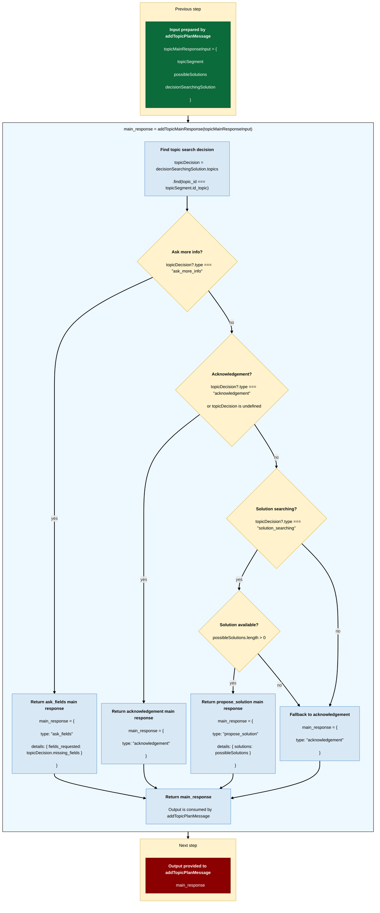

```mermaid
%%{init: {"flowchart": {"nodeSpacing": 14, "rankSpacing": 22, "subGraphTitleMargin": {"top": 10, "bottom": 25}}, "themeVariables": {"fontSize": "13px", "lineColor": "#000000"}}}%%
flowchart TB
  subgraph PREVIOUS_STEP["Previous step"]
    direction TB
    PREVIOUS_INPUTS["<b>Input prepared by runSupportProcessingPipeline</b><br/>
    responsePlanInput = {<br/>
    securityGateSummary = { gateChecked: {}, gateFailed: [] }<br/>
    accountTrustStatus<br/>
    accountProfile<br/>
    accountInteractionTraits<br/>
    supportTopicKnowledge<br/>
    turnUnderstandingDelta<br/>
    possibleSolutions<br/>
    decisionSearchingSolution<br/>
    }"]
  end

  subgraph PIPELINE["9. responsePlan = runResponsePlan(responsePlanInput)"]
    direction TB

    T_INIT["<b>Initialize responsePlan</b><br/>
    responsePlan = {<br/>
    responseLanguage: resolveResponseLanguage(turnUnderstandingDelta.user_language)<br/>
    messagesPlan: {<br/>
    securityGatePlanMessage: undefined<br/>
    suspiciousPlanMessage: undefined<br/>
    lackComprehensionPlanMessage: undefined<br/>
    scopeBoundaryPlanMessages: []<br/>
    topicPlanMessages: []<br/>
    signalPlanMessages: []<br/>
    handoverPlanMessages: []<br/>
    }<br/>
    }"]

    T_SECURITY_ROUTE{"<b>Security gate failed?</b><br/>
    securityGateSummary.gateFailed.length > 0"}

    T_ADD_SECURITY["<b>Add security gate plan message</b><br/>
    Copy securityGateSummary.gateFailed into:<br/>
    responsePlan.messagesPlan.securityGatePlanMessage"]

    T_SUSPICIOUS_ROUTE{"<b>Suspicious segments?</b><br/>
    turnUnderstandingDelta.segments_suspicious.length > 0"}

    T_ADD_SUSPICIOUS["<b>Add suspicious plan message</b><br/>
    Copy turnUnderstandingDelta.segments_suspicious into:<br/>
    responsePlan.messagesPlan.suspiciousPlanMessage"]

    T_ADD_LACK["<b>Add lack-comprehension plan message if needed</b><br/>
    If turnUnderstandingDelta.segments_lack_comprehension.length > 0,<br/>
    copy the segments into:<br/>
    responsePlan.messagesPlan.lackComprehensionPlanMessage"]

    T_ADD_SCOPE["<b>Add scope-boundary plan messages</b><br/>
    Copy turnUnderstandingDelta.segments_scope_boundary into:<br/>
    responsePlan.messagesPlan.scopeBoundaryPlanMessages"]

    T_TOPIC_INPUT["<b>Prepare topicPlanInput</b><br/>
    topicPlanInput = {<br/>
    supportTopicKnowledge<br/>
    turnUnderstandingDelta<br/>
    possibleSolutions<br/>
    decisionSearchingSolution<br/>
    }"]

    subgraph TOPIC_PLAN_DATA["topicPlanMessages = addTopicPlanMessage(topicPlanInput)"]
      direction LR
      TOPIC_PLAN_INPUTS["<b>topicPlanInput</b><br/>
      supportTopicKnowledge<br/>
      turnUnderstandingDelta<br/>
      possibleSolutions<br/>
      decisionSearchingSolution"]
      TOPIC_PLAN_OUTPUTS["<b>Output</b><br/>
      topicPlanMessages"]
      TOPIC_PLAN_INPUTS --> TOPIC_PLAN_OUTPUTS
    end

    T_ADD_TOPIC["<b>Add topic plan messages</b><br/>
    Copy topicPlanMessages into:<br/>
    responsePlan.messagesPlan.topicPlanMessages"]

    T_ADD_SIGNAL["<b>Add signal plan messages</b><br/>
    Copy turnUnderstandingDelta.segments_signal into:<br/>
    responsePlan.messagesPlan.signalPlanMessages"]

    T_HANDOVER_INPUT["<b>Prepare handoverPlanInput</b><br/>
    handoverPlanInput = {<br/>
    turnUnderstandingDelta<br/>
    responsePlan<br/>
    securityGateSummary<br/>
    accountTrustStatus<br/>
    accountProfile<br/>
    accountInteractionTraits<br/>
    }"]

    subgraph HANDOVER_PLAN_DATA["handoverPlanMessages = addHandoverPlanMessage(handoverPlanInput)"]
      direction LR
      HANDOVER_PLAN_INPUTS["<b>handoverPlanInput</b><br/>
      turnUnderstandingDelta<br/>
      responsePlan<br/>
      securityGateSummary<br/>
      accountTrustStatus<br/>
      accountProfile<br/>
      accountInteractionTraits"]
      HANDOVER_PLAN_OUTPUTS["<b>Output</b><br/>
      handoverPlanMessages"]
      HANDOVER_PLAN_INPUTS --> HANDOVER_PLAN_OUTPUTS
    end

    T_ADD_HANDOVER["<b>Add handover plan messages</b><br/>
    Copy handoverPlanMessages into:<br/>
    responsePlan.messagesPlan.handoverPlanMessages"]

    T_RETURN_FINAL["<b>Return responsePlan</b><br/>
    Response plan is complete"]

    T_INIT --> T_SECURITY_ROUTE

    T_SECURITY_ROUTE -->|yes| T_ADD_SECURITY
    T_ADD_SECURITY --> T_HANDOVER_INPUT

    T_SECURITY_ROUTE -->|no| T_SUSPICIOUS_ROUTE

    T_SUSPICIOUS_ROUTE -->|yes| T_ADD_SUSPICIOUS
    T_ADD_SUSPICIOUS --> T_HANDOVER_INPUT

    T_SUSPICIOUS_ROUTE -->|no| T_ADD_LACK
    T_ADD_LACK --> T_ADD_SCOPE
    T_ADD_SCOPE --> T_TOPIC_INPUT
    T_TOPIC_INPUT --> TOPIC_PLAN_DATA
    TOPIC_PLAN_DATA --> T_ADD_TOPIC
    T_ADD_TOPIC --> T_ADD_SIGNAL
    T_ADD_SIGNAL --> T_HANDOVER_INPUT
    T_HANDOVER_INPUT --> HANDOVER_PLAN_DATA
    HANDOVER_PLAN_DATA --> T_ADD_HANDOVER
    T_ADD_HANDOVER --> T_RETURN_FINAL
  end

  subgraph NEXT_STEP["Next step"]
    direction TB
    NEXT_OUTPUTS["<b>Input provided to runResponseProduction</b><br/>
    responseProductionInput = {<br/>
    responsePlan<br/>
    }"]
  end

  PREVIOUS_STEP --> PIPELINE
  PIPELINE --> NEXT_STEP

  classDef previousBlock fill:#0b6b3a,stroke:#064a28,color:#ffffff,stroke-width:1px;
  classDef inputBlock fill:#d5e8d4,stroke:#82b366,color:#000000,stroke-width:1px;
  classDef routeBlock fill:#fff2cc,stroke:#d6b656,color:#000000,stroke-width:1px;
  classDef processingBlock fill:#d9e8f5,stroke:#4f93d2,color:#000000,stroke-width:1px;
  classDef outputBlock fill:#f8cecc,stroke:#b85450,color:#000000,stroke-width:1px;
  classDef nextOutputBlock fill:#8b0000,stroke:#5c0000,color:#ffffff,stroke-width:1px;

  class PREVIOUS_INPUTS previousBlock;

  class T_SECURITY_ROUTE,T_SUSPICIOUS_ROUTE routeBlock;

  class TOPIC_PLAN_INPUTS,HANDOVER_PLAN_INPUTS inputBlock;
  class TOPIC_PLAN_OUTPUTS,HANDOVER_PLAN_OUTPUTS outputBlock;

  class T_INIT,T_ADD_SECURITY,T_ADD_SUSPICIOUS,T_ADD_LACK,T_ADD_SCOPE,T_TOPIC_INPUT,T_ADD_TOPIC,T_ADD_SIGNAL,T_HANDOVER_INPUT,T_ADD_HANDOVER,T_RETURN_FINAL processingBlock;

  class NEXT_OUTPUTS nextOutputBlock;

  style PIPELINE fill:#eef8ff,stroke:#000000,stroke-width:1px,color:#000000;
  style PREVIOUS_STEP fill:#fff2cc,stroke:#d6b656,stroke-width:1px,color:#000000;
  style NEXT_STEP fill:#fff2cc,stroke:#d6b656,stroke-width:1px,color:#000000;

  style TOPIC_PLAN_DATA fill:#333333,stroke:#333333,stroke-width:1px,color:#ffffff;
  style HANDOVER_PLAN_DATA fill:#333333,stroke:#333333,stroke-width:1px,color:#ffffff;

  linkStyle default stroke:#000000,stroke-width:2px;
```

---

## addTopicMainResponsePipeline

```mermaid
%%{init: {"flowchart": {"nodeSpacing": 14, "rankSpacing": 22, "subGraphTitleMargin": {"top": 10, "bottom": 25}}, "themeVariables": {"fontSize": "13px", "lineColor": "#000000"}}}%%
flowchart TB
  subgraph PREVIOUS_STEP["Previous step"]
    direction TB
    PREVIOUS_INPUTS["<b>Input prepared by addTopicPlanMessage</b><br/>
    topicMainResponseInput = {<br/>
    topicSegment<br/>
    possibleSolutions<br/>
    decisionSearchingSolution<br/>
    }"]
  end

  subgraph PIPELINE["main_response = addTopicMainResponse(topicMainResponseInput)"]
    direction TB

    T_READ_DECISION["<b>Find topic search decision</b><br/>
    topicDecision = decisionSearchingSolution.topics<br/>
    .find(topic_id === topicSegment.id_topic)"]

    T_ASK_MORE_INFO_ROUTE{"<b>Ask more info?</b><br/>
    topicDecision?.type === &quot;ask_more_info&quot;"}

    T_RETURN_ASK_FIELDS["<b>Return ask_fields main response</b><br/>
    main_response = {<br/>
    type: &quot;ask_fields&quot;<br/>
    details: { fields_requested: topicDecision.missing_fields }<br/>
    }"]

    T_ACK_ROUTE{"<b>Acknowledgement?</b><br/>
    topicDecision?.type === &quot;acknowledgement&quot;<br/>
    or topicDecision is undefined"}

    T_RETURN_ACK["<b>Return acknowledgement main response</b><br/>
    main_response = {<br/>
    type: &quot;acknowledgement&quot;<br/>
    }"]

    T_SEARCH_ROUTE{"<b>Solution searching?</b><br/>
    topicDecision?.type === &quot;solution_searching&quot;"}

    T_SOLUTION_ROUTE{"<b>Solution available?</b><br/>
    possibleSolutions.length > 0"}

    T_RETURN_SOLUTION["<b>Return propose_solution main response</b><br/>
    main_response = {<br/>
    type: &quot;propose_solution&quot;<br/>
    details: { solutions: possibleSolutions }<br/>
    }"]

    T_FALLBACK_ACK["<b>Fallback to acknowledgement</b><br/>
    main_response = {<br/>
    type: &quot;acknowledgement&quot;<br/>
    }"]

    T_RETURN_MAIN_RESPONSE["<b>Return main_response</b><br/>
    Output is consumed by addTopicPlanMessage"]

    T_READ_DECISION --> T_ASK_MORE_INFO_ROUTE
    T_ASK_MORE_INFO_ROUTE -->|yes| T_RETURN_ASK_FIELDS
    T_ASK_MORE_INFO_ROUTE -->|no| T_ACK_ROUTE

    T_ACK_ROUTE -->|yes| T_RETURN_ACK
    T_ACK_ROUTE -->|no| T_SEARCH_ROUTE

    T_SEARCH_ROUTE -->|yes| T_SOLUTION_ROUTE
    T_SEARCH_ROUTE -->|no| T_FALLBACK_ACK

    T_SOLUTION_ROUTE -->|yes| T_RETURN_SOLUTION
    T_SOLUTION_ROUTE -->|no| T_FALLBACK_ACK

    T_RETURN_ASK_FIELDS --> T_RETURN_MAIN_RESPONSE
    T_RETURN_ACK --> T_RETURN_MAIN_RESPONSE
    T_RETURN_SOLUTION --> T_RETURN_MAIN_RESPONSE
    T_FALLBACK_ACK --> T_RETURN_MAIN_RESPONSE
  end

  subgraph NEXT_STEP["Next step"]
    direction TB
    NEXT_OUTPUTS["<b>Output provided to addTopicPlanMessage</b><br/>
    main_response"]
  end

  PREVIOUS_STEP --> PIPELINE
  PIPELINE --> NEXT_STEP

  classDef previousBlock fill:#0b6b3a,stroke:#064a28,color:#ffffff,stroke-width:1px;
  classDef routeBlock fill:#fff2cc,stroke:#d6b656,color:#000000,stroke-width:1px;
  classDef processingBlock fill:#d9e8f5,stroke:#4f93d2,color:#000000,stroke-width:1px;
  classDef nextOutputBlock fill:#8b0000,stroke:#5c0000,color:#ffffff,stroke-width:1px;

  class PREVIOUS_INPUTS previousBlock;

  class T_ASK_MORE_INFO_ROUTE,T_ACK_ROUTE,T_SEARCH_ROUTE,T_SOLUTION_ROUTE routeBlock;

  class T_READ_DECISION,T_RETURN_ASK_FIELDS,T_RETURN_ACK,T_RETURN_SOLUTION,T_FALLBACK_ACK,T_RETURN_MAIN_RESPONSE processingBlock;

  class NEXT_OUTPUTS nextOutputBlock;

  style PIPELINE fill:#eef8ff,stroke:#000000,stroke-width:1px,color:#000000;
  style PREVIOUS_STEP fill:#fff2cc,stroke:#d6b656,stroke-width:1px,color:#000000;
  style NEXT_STEP fill:#fff2cc,stroke:#d6b656,stroke-width:1px,color:#000000;

  linkStyle default stroke:#000000,stroke-width:2px;
```

---

## addTopicPlanMessagePipeline

```mermaid
%%{init: {"flowchart": {"nodeSpacing": 14, "rankSpacing": 22, "subGraphTitleMargin": {"top": 10, "bottom": 25}}, "themeVariables": {"fontSize": "13px", "lineColor": "#000000"}}}%%
flowchart TB
  subgraph PREVIOUS_STEP["Previous step"]
    direction TB
    PREVIOUS_INPUTS["<b>Input prepared by runResponsePlan</b><br/>
    topicPlanInput = {<br/>
    supportTopicKnowledge<br/>
    turnUnderstandingDelta<br/>
    possibleSolutions<br/>
    decisionSearchingSolution<br/>
    }"]
  end

  subgraph PIPELINE["topicPlanMessages = addTopicPlanMessage(topicPlanInput)"]
    direction TB

    T_TOPIC_ROUTE{"<b>Topic segments?</b><br/>
    turnUnderstandingDelta.segments_topic.length === 0"}

    T_RETURN_EMPTY["<b>Return empty topic plan</b><br/>
    return []"]

    T_INIT_GLOBAL["<b>Initialize global TopicPlanMessage</b><br/>
    topicPlanMessage = {<br/>
    politeness_opening<br/>
    topic_relation_acknowledgement<br/>
    attachments?<br/>
    topics_responses: []<br/>
    politeness_closure: undefined<br/>
    }"]

    T_RELATION_ACK["<b>Fill topic relation acknowledgement</b><br/>
    topic_relation_acknowledgement = {<br/>
    no_matched_historical_topic_count<br/>
    matched_historical_topic_count<br/>
    }"]

    T_ATTACHMENTS_ACK["<b>Attach global turn attachments if present</b><br/>
    topicPlanMessage.attachments =<br/>
    turnUnderstandingDelta.attachments"]

    subgraph TOPIC_LOOP["For each turnUnderstandingDelta.segments_topic item"]
      direction TB

      T_TOPIC_TITLE["<b>Create topic_response.title</b><br/>
      title = {<br/>
      topic_id<br/>
      topic_category<br/>
      tool_or_product<br/>
      topic_action<br/>
      topic_object<br/>
      matched_historical_topic<br/>
      }"]

      T_UPDATED_FIELDS["<b>Add updated fields acknowledgement</b><br/>
      updated_fields_acknowledgement = {<br/>
      topic_details<br/>
      tested_solutions<br/>
      }"]

      T_MAIN_RESPONSE_INPUT["<b>Prepare topicMainResponseInput</b><br/>
      topicMainResponseInput = {<br/>
      topicSegment<br/>
      possibleSolutions<br/>
      decisionSearchingSolution<br/>
      }"]

      subgraph MAIN_RESPONSE_DATA["mainResponse = addTopicMainResponse(topicMainResponseInput)"]
        direction LR
        MAIN_RESPONSE_INPUTS["<b>topicMainResponseInput</b><br/>
        topicSegment<br/>
        possibleSolutions<br/>
        decisionSearchingSolution"]
        MAIN_RESPONSE_OUTPUTS["<b>Output</b><br/>
        main_response"]
        MAIN_RESPONSE_INPUTS --> MAIN_RESPONSE_OUTPUTS
      end

      T_NEXT_STEP["<b>Add next step</b><br/>
      next_step is coherent with main_response"]

      T_ADD_TOPIC_RESPONSE["<b>Add topic response</b><br/>
      Add into topicPlanMessage.topics_responses:<br/>
      title<br/>
      updated_fields_acknowledgement<br/>
      main_response<br/>
      next_step"]

      T_TOPIC_TITLE --> T_UPDATED_FIELDS
      T_UPDATED_FIELDS --> T_MAIN_RESPONSE_INPUT
      T_MAIN_RESPONSE_INPUT --> MAIN_RESPONSE_DATA
      MAIN_RESPONSE_DATA --> T_NEXT_STEP
      T_NEXT_STEP --> T_ADD_TOPIC_RESPONSE
    end

    T_ADD_CLOSURE["<b>Add global politeness closure</b><br/>
    topicPlanMessage.politeness_closure"]

    T_RETURN_TOPIC_MESSAGES["<b>Return topicPlanMessages</b><br/>
    topicPlanMessages: TopicPlanMessage[]"]

    T_TOPIC_ROUTE -->|yes| T_RETURN_EMPTY
    T_TOPIC_ROUTE -->|no| T_INIT_GLOBAL
    T_INIT_GLOBAL --> T_RELATION_ACK
    T_RELATION_ACK --> T_ATTACHMENTS_ACK
    T_ATTACHMENTS_ACK --> TOPIC_LOOP
    TOPIC_LOOP --> T_ADD_CLOSURE
    T_ADD_CLOSURE --> T_RETURN_TOPIC_MESSAGES
  end

  subgraph NEXT_STEP["Next step"]
    direction TB
    NEXT_OUTPUTS["<b>Output provided to runResponsePlan</b><br/>
    responsePlan.messagesPlan.topicPlanMessages"]
  end

  PREVIOUS_STEP --> PIPELINE
  PIPELINE --> NEXT_STEP

  classDef previousBlock fill:#0b6b3a,stroke:#064a28,color:#ffffff,stroke-width:1px;
  classDef inputBlock fill:#d5e8d4,stroke:#82b366,color:#000000,stroke-width:1px;
  classDef routeBlock fill:#fff2cc,stroke:#d6b656,color:#000000,stroke-width:1px;
  classDef processingBlock fill:#d9e8f5,stroke:#4f93d2,color:#000000,stroke-width:1px;
  classDef outputBlock fill:#f8cecc,stroke:#b85450,color:#000000,stroke-width:1px;
  classDef nextOutputBlock fill:#8b0000,stroke:#5c0000,color:#ffffff,stroke-width:1px;

  class PREVIOUS_INPUTS previousBlock;

  class T_TOPIC_ROUTE routeBlock;

  class MAIN_RESPONSE_INPUTS inputBlock;
  class MAIN_RESPONSE_OUTPUTS outputBlock;

  class T_RETURN_EMPTY,T_INIT_GLOBAL,T_RELATION_ACK,T_ATTACHMENTS_ACK,T_TOPIC_TITLE,T_UPDATED_FIELDS,T_MAIN_RESPONSE_INPUT,T_NEXT_STEP,T_ADD_TOPIC_RESPONSE,T_ADD_CLOSURE,T_RETURN_TOPIC_MESSAGES processingBlock;

  class NEXT_OUTPUTS nextOutputBlock;

  style PIPELINE fill:#eef8ff,stroke:#000000,stroke-width:1px,color:#000000;
  style PREVIOUS_STEP fill:#fff2cc,stroke:#d6b656,stroke-width:1px,color:#000000;
  style NEXT_STEP fill:#fff2cc,stroke:#d6b656,stroke-width:1px,color:#000000;

  style MAIN_RESPONSE_DATA fill:#333333,stroke:#333333,stroke-width:1px,color:#ffffff;
  style TOPIC_LOOP fill:#eef8ff,stroke:#000000,stroke-width:1px,color:#000000;

  linkStyle default stroke:#000000,stroke-width:2px;
```
