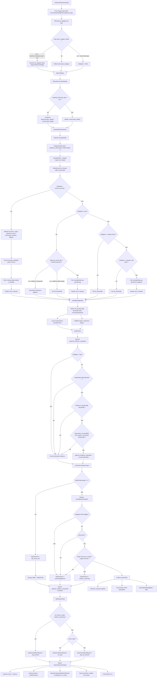

```mermaid
flowchart TD
    A["runSearchDecision(input)"] --> B["Pour chaque topic dans turnUnderstandingDelta.segments_topic"]

    B --> C["Résoudre la catégorie du topic"]
    C --> C1{"topic.topic_category valide ?"}
    C1 -- "oui" --> C2["Utiliser topic.topic_category"]
    C1 -- "non + matched_historical_topic = yes" --> C3["Chercher la catégorie dans supportTopicKnowledge"]
    C1 -- "non + pas d'historique" --> C4["Catégorie = other"]
    C3 --> C5["topicCategory"]
    C2 --> C5
    C4 --> C5

    C5 --> D["Résoudre les topicDetails"]
    D --> D1{"matched_historical_topic = yes ?"}
    D1 -- "oui" --> D2["Fusionner historical.topic_details + current.topic_details"]
    D1 -- "non" --> D3["Utiliser current.topic_details"]
    D2 --> D4["topicDetailsForDecision"]
    D3 --> D4

    D4 --> E["Calculer missingFields"]
    E --> E1["Required fields selon SEARCH_DECISION_STRICTNESS = 2"]
    E1 --> E2["missingFields = champs requis non remplis"]

    E2 --> F["Sélectionner les champs utiles à demander"]

    F --> G{"Catégorie = access_security ?"}
    G -- "oui" --> G1["Détecter la forme : login / password_reset / permission_denied / fallback"]
    G1 --> G2["Choisir champs candidats selon la forme"]
    G2 --> G3["Filtrer champs déjà remplis ou déduits"]
    G3 --> G4["Garder max 2 champs"]
    G4 --> M["usefulMissingFields"]

    G -- "non" --> H{"Catégorie = bug ?"}
    H -- "oui" --> H1{"observed_result utile + contexte bug utile ?"}
    H1 -- "oui + platform manquante" --> H2["Demander seulement platform"]
    H1 -- "oui + platform déjà remplie" --> H3["Ne rien demander"]
    H1 -- "non" --> H4["Trier missingFields par priorité bug"]
    H4 --> H5["Garder max 2 champs"]
    H2 --> M
    H3 --> M
    H5 --> M

    H -- "non" --> I{"Catégorie = request claire ?"}
    I -- "oui" --> I1["Ne rien demander"]
    I1 --> M

    I -- "non" --> J{"Catégorie = question_faq claire ?"}
    J -- "oui" --> J1["Ne rien demander"]
    J1 --> M

    J -- "non" --> K["Trier missingFields par priorité de catégorie"]
    K --> K1["Garder max 2 champs"]
    K1 --> M

    M --> N["Retirer les champs déjà demandés dans conversationHistory"]
    N --> N1["Lecture topicActions nouvelle forme"]
    N --> N2["Fallback topics_responses legacy"]
    N1 --> N3["fieldsToAsk"]
    N2 --> N3

    N3 --> O["Calculer optional_evidence_requested"]
    O --> O1{"Catégorie = bug ?"}
    O1 -- "non" --> O2["Pas de demande evidence"]
    O1 -- "oui" --> O3{"Image/vidéo déjà attachée ?"}
    O3 -- "oui" --> O2
    O3 -- "non" --> O4{"Evidence visuelle déjà demandée ?"}
    O4 -- "oui" --> O2
    O4 -- "non" --> O5{"Bug résolu / accessibilité non visuelle / connecteur indisponible ?"}
    O5 -- "oui" --> O2
    O5 -- "non" --> O6["optional_evidence_requested = screenshot/video"]

    O2 --> P["Construire décision topic"]
    O6 --> P

    P --> Q{"fieldsToAsk.length > 0 ?"}
    Q -- "oui" --> R["TopicDecision = ask_more_info"]
    R --> R1["missing_fields = fieldsToAsk"]
    R1 --> Z["Ajouter optional_evidence_requested si présent"]

    Q -- "non" --> S["Évaluer shouldSearchSolution"]

    S --> S1{"Catégorie RAG eligible ?"}
    S1 -- "non" --> T["TopicDecision = acknowledgement"]
    S1 -- "oui" --> S2{"Bug résolu ?"}
    S2 -- "oui" --> T
    S2 -- "non" --> S3{"Éviter RAG pour contexte support humain ?"}

    S3 -- "oui" --> T
    S3 -- "non" --> U["TopicDecision = solution_searching"]

    S3 --> S4["Critères avoid RAG"]
    S4 --> S41["handover_request explicite"]
    S4 --> S42["trop d'échecs RAG précédents"]
    S4 --> S43["likelyToBeHelpedByBot = false"]

    T --> Z
    U --> Z

    Z --> AA["topicDecisions[]"]

    AA --> AB{"Au moins un topic solution_searching ?"}
    AB -- "oui" --> AC["solutionLikelihoodResult = rag_relevant"]
    AB -- "non" --> AD{"Aucun topic ?"}
    AD -- "oui" --> AE["solutionLikelihoodResult = no_topic"]
    AD -- "non" --> AF["solutionLikelihoodResult = rag_not_relevant"]

    AC --> AG["Retour SearchDecisionOutput"]
    AE --> AG
    AF --> AG

    AG --> AH["decision.route = continue"]
    AG --> AI["decision.topics = topicDecisions"]
    AG --> AJ["detected.topicsQualificationResult = evaluated ou no_topic"]
    AG --> AK["history.checked = étapes de contrôle"]
    AG --> AL["history.failed = []"]
```
