# Support Processing Pipeline

This document shows a concrete example of the support processing pipeline.

The source of truth for data contracts is the TypeScript types file. This document only provides readable examples of how the pipeline objects can look during a realistic support conversation.

---

## Pipeline overview

```mermaid
%%{init: {"flowchart": {"nodeSpacing": 14, "rankSpacing": 22, "subGraphTitleMargin": {"top": 10, "bottom": 25}}, "themeVariables": {"fontSize": "13px", "lineColor": "#000000"}}}%%
flowchart TB
  %% =====================================================
  %% PREVIOUS STEP DATA
  %% =====================================================

  subgraph PREVIOUS_STEP["Previous step"]
    direction TB

    PREVIOUS_INPUTS["<b>Inputs provided to runSupportProcessingPipeline</b><br/>
    1. latestUserMessage, 2. latestUserAttachments, 3.1 accountTrustStatus,<br/>
    3.2 accountProfile, 3.3 accountInteractionTraits,<br/>
    4. supportTopicKnowledge, 5. conversationHistory"]
  end

  %% =====================================================
  %% SUPPORT PROCESSING PIPELINE
  %% =====================================================

  subgraph PIPELINE["{ userResponse, patches } = runSupportProcessingPipeline(inputSupportProcessingPipeline)"]
    direction TB

    T0["<b>Prepare messageAnalysisInput</b><br/>
    Destructure pipeline input<br/>
    messageAnalysisInput = { latestUserMessage, latestUserAttachments,<br/>
    accountTrustStatus, supportTopicKnowledge, conversationHistory }"]

    subgraph MA_DATA["turnUnderstandingDelta = runMessageAnalysis(messageAnalysisInput)"]
      direction LR

      MA_INPUTS["<b>messageAnalysisInput</b><br/>
      latestUserMessage, latestUserAttachments,<br/>
      accountTrustStatus, supportTopicKnowledge, conversationHistory"]

      MA_OUTPUTS["<b>Output</b><br/>
      6. turnUnderstandingDelta"]

      MA_INPUTS --> MA_OUTPUTS
    end

    T1{"<b>if</b><br/>
    turnUnderstandingDelta.segments_topic.length !== 0"}

    T_SD_INPUT["<b>Prepare searchDecisionInput</b><br/>
    searchDecisionInput = { supportTopicKnowledge, turnUnderstandingDelta }"]

    subgraph SD_DATA["decisionSearchingSolution = runSearchDecision(searchDecisionInput)"]
      direction LR

      SD_INPUTS["<b>searchDecisionInput</b><br/>
      supportTopicKnowledge, turnUnderstandingDelta"]

      SD_OUTPUTS["<b>Output</b><br/>
      7. decisionSearchingSolution"]

      SD_INPUTS --> SD_OUTPUTS
    end

    T2{"<b>if</b><br/>
    decisionSearchingSolution.decision.topics<br/>
    contains type = solution_searching"}

    T_SR_INPUT["<b>Prepare solutionRetrievalInput</b><br/>
    solutionRetrievalInput = { supportTopicKnowledge, turnUnderstandingDelta }"]

    subgraph SR_DATA["possibleSolutions = runSolutionRetrieval(solutionRetrievalInput)"]
      direction LR

      SR_INPUTS["<b>solutionRetrievalInput</b><br/>
      supportTopicKnowledge, turnUnderstandingDelta"]

      SR_OUTPUTS["<b>Output</b><br/>
      8. possibleSolutions"]

      SR_INPUTS --> SR_OUTPUTS
    end

    T3["<b>Prepare responsePlanInput</b><br/>
    responsePlanInput = {<br/>
    securityGateSummary = { gateChecked: {}, gateFailed: [] }<br/>
    accountTrustStatus<br/>
    accountProfile<br/>
    accountInteractionTraits<br/>
    supportTopicKnowledge<br/>
    turnUnderstandingDelta<br/>
    possibleSolutions<br/>
    decisionSearchingSolution<br/>
    }"]

    subgraph RP_PLAN_DATA["responsePlan = runResponsePlan(responsePlanInput)"]
      direction LR

      RP_PLAN_INPUTS["<b>responsePlanInput</b><br/>
      securityGateSummary = { gateChecked: {}, gateFailed: [] },<br/>
      accountTrustStatus, accountProfile, accountInteractionTraits,<br/>
      supportTopicKnowledge, turnUnderstandingDelta,<br/>
      possibleSolutions, decisionSearchingSolution"]

      RP_PLAN_OUTPUTS["<b>Output</b><br/>
      9. responsePlan"]

      RP_PLAN_INPUTS --> RP_PLAN_OUTPUTS
    end

    T4["<b>Prepare responseProductionInput</b><br/>
    responseProductionInput = { responsePlan }"]

    subgraph RP_DATA["userResponse = runResponseProduction(responseProductionInput)"]
      direction LR

      RP_INPUTS["<b>responseProductionInput</b><br/>
      responsePlan"]

      RP_OUTPUTS["<b>Output</b><br/>
      10. userResponse"]

      RP_INPUTS --> RP_OUTPUTS
    end

    T5["<b>Prepare patchesProductionInput</b><br/>
    patchesProductionInput = { turnUnderstandingDelta, responsePlan }"]

    subgraph DP_DATA["patches = runPatchesProduction(patchesProductionInput)"]
      direction LR

      DP_INPUTS["<b>patchesProductionInput</b><br/>
      turnUnderstandingDelta, responsePlan"]

      DP_OUTPUTS["<b>Output</b><br/>
      patches = {<br/>
      analysisPatch<br/>
      securityPatch<br/>
      responsePatch<br/>
      metadataPatch<br/>
      }"]

      DP_INPUTS --> DP_OUTPUTS
    end

    T6["<b>Return final pipeline output</b><br/>
    return { userResponse, patches }"]

    T0 --> MA_DATA
    MA_DATA --> T1

    T1 -->|true| T_SD_INPUT
    T1 -.->|false<br/>signal / scope only| T3

    T_SD_INPUT --> SD_DATA
    SD_DATA --> T2

    T2 -->|true| T_SR_INPUT
    T2 -.->|false<br/>no retrieval| T3

    T_SR_INPUT --> SR_DATA
    SR_DATA --> T3
    T3 --> RP_PLAN_DATA
    RP_PLAN_DATA --> T4
    T4 --> RP_DATA
    RP_DATA --> T5
    T5 --> DP_DATA
    DP_DATA --> T6
  end

  %% =====================================================
  %% NEXT STEP
  %% =====================================================

  subgraph NEXT_STEP["Next step"]
    direction TB

    NEXT_OUTPUTS["<b>Outputs produced by runSupportProcessingPipeline</b><br/>
    userResponse<br/>
    patches"]
  end

  PREVIOUS_STEP --> PIPELINE
  PIPELINE --> NEXT_STEP

  %% =====================================================
  %% STYLES
  %% =====================================================

  classDef previousBlock fill:#0b6b3a,stroke:#064a28,color:#ffffff,stroke-width:1px;
  classDef inputBlock fill:#d5e8d4,stroke:#82b366,color:#000000,stroke-width:1px;
  classDef outputBlock fill:#f8cecc,stroke:#b85450,color:#000000,stroke-width:1px;
  classDef processingBlock fill:#d9e8f5,stroke:#4f93d2,color:#000000,stroke-width:1px;
  classDef nextOutputBlock fill:#8b0000,stroke:#5c0000,color:#ffffff,stroke-width:1px;

  class PREVIOUS_INPUTS previousBlock;

  class MA_INPUTS,SD_INPUTS,SR_INPUTS,RP_PLAN_INPUTS,RP_INPUTS,DP_INPUTS inputBlock;
  class MA_OUTPUTS,SD_OUTPUTS,SR_OUTPUTS,RP_PLAN_OUTPUTS,RP_OUTPUTS,DP_OUTPUTS outputBlock;

  class T0,T1,T_SD_INPUT,T2,T_SR_INPUT,T3,T4,T5,T6 processingBlock;
  class NEXT_OUTPUTS nextOutputBlock;

  style PIPELINE fill:#eef8ff,stroke:#000000,stroke-width:1px,color:#000000;
  style PREVIOUS_STEP fill:#fff2cc,stroke:#d6b656,stroke-width:1px,color:#000000;
  style NEXT_STEP fill:#fff2cc,stroke:#d6b656,stroke-width:1px,color:#000000;

  linkStyle default stroke:#000000,stroke-width:2px;
```



---

## End-to-end example

The following example follows one coherent support conversation.

Conversation summary:

1. The user reports that folder creation does not work in Cozy Drive.
2. The bot asks for missing technical information.
3. The user provides more details and says that trying from Chrome also failed.
4. The system searches for a solution but does not find a reliable immediate answer.
5. The bot acknowledges the issue and prepares a handover.

---

## First pipeline run: user reports a new issue

### Incoming user message

```ts
const latestUserMessage = {
  id: "msg_user_001",
  content:
    "Hello, I cannot create a folder in Cozy Drive anymore. I am on samo.mycozy.cloud with Firefox. When I click Créer un dossier, nothing happens.",
  channel: "twake_chat",
  sentAt: "2026-05-12T08:30:00.000Z"
};
```

### Incoming attachments

```ts
const latestUserAttachments = [
  {
    id: "att_001",
    filename: "folder-creation-bug.png",
    sizeInBytes: 348000,
    accessUrl: "https://storage.example.com/signed-url/folder-creation-bug",
    channel: "twake_chat",
    sentAt: "2026-05-12T08:30:00.000Z"
  }
];
```

### Account context

```ts
const accountTrustStatus = {
  status: "trusted",
  reasons: [
    "longHistory",
    "noSuspiciousActivity",
    "payingCustomer",
    "legitimateSupportInteractions"
  ]
};

const accountProfile = {
  accountType: "individual",
  actualPlan: "paid",
  paymentStatus: "up_to_date",
  planHistory: [
    {
      plan: "free",
      startedAt: "2021-06-22T00:00:00.000Z",
      endedAt: "2021-08-12T00:00:00.000Z"
    },
    {
      plan: "paid",
      startedAt: "2021-08-12T00:00:00.000Z",
      endedAt: null
    }
  ],
  createdAt: "2021-06-22T00:00:00.000Z",
  daysSinceCreation: 1786
};

const accountInteractionTraits = {
  labels: ["autonomous", "satisfied"],
  lastUpdatedAt: "2026-05-12T08:00:00.000Z"
};
```

### Initial support knowledge and conversation history

```ts
const supportTopicKnowledge = {
  segments_topic: []
};

const conversationHistory = [];
```

### Pipeline input

```ts
const inputSupportProcessingPipeline = {
  latestUserMessage,
  latestUserAttachments,
  accountTrustStatus,
  accountProfile,
  accountInteractionTraits,
  supportTopicKnowledge,
  conversationHistory
};
```

---

## 6. `turnUnderstandingDelta`

Produced by `runMessageAnalysis(messageAnalysisInput)`.

```ts
const turnUnderstandingDelta = {
  user_language: "english",
  securityGateSummary: {
    gateChecked: {
      latestUserMessageSecurityDecision: {
        decision: { route: "continue" },
        history: { checked: [], failed: [] }
      },
      attachmentAnalysisSecurityDecision: {
        decision: { route: "continue" },
        history: { checked: [], failed: [] }
      }
    },
    gateFailed: []
  },
  segments_topic: [
    {
      matched_historical_topic: "no",
      id_topic: 1,
      topic_category: "bug",
      tool_or_product: "Cozy Drive",
      topic_action: "create",
      topic_object: "folder",
      topic_details: {
        feature_or_page: "folder creation",
        provided_url: "samo.mycozy.cloud",
        observed_result: "nothing happens",
        expected_result: "folder should be created",
        platform: "web",
        browser: "Firefox",
        trigger_action: "click Créer un dossier"
      },
      user_goal:
        "Cozy Drive : create : folder — user cannot create a folder on samo.mycozy.cloud with Firefox.",
      blocking_issue: "yes"
    }
  ],
  segments_lack_comprehension: [],
  segments_signal: [],
  segments_scope_boundary: [],
  segments_suspicious: [],
  attachments: {
    images: [
      {
        id: "att_001",
        kind: "image",
        filename: "folder-creation-bug.png",
        sizeInBytes: 348000,
        status: "analyzed",
        analysis: {
          llmDescription: "Screenshot of Cozy Drive where folder creation does not react."
        }
      }
    ],
    videos: [],
    other: []
  }
};
```

---

## 7. `decisionSearchingSolution`

Produced by `runSearchDecision(searchDecisionInput)`.

At this point, the topic exists but is not qualified enough to search for a reliable solution.

```ts
const decisionSearchingSolution = {
  decision: {
    route: "continue",
    topics: [
      {
        topic_id: 1,
        type: "ask_more_info",
        missing_fields: ["os", "device"]
      }
    ]
  },
  detected: {
    topicsQualificationResult: "evaluated",
    solutionLikelihoodResult: "rag_not_relevant"
  },
  history: {
    checked: [],
    failed: []
  }
};
```

---

## 8. `possibleSolutions`

Since no topic decision has `type: "solution_searching"`, retrieval is skipped.

```ts
const possibleSolutions = [];
```

---

## 9. `responsePlan`

Produced by `runResponsePlan(responsePlanInput)`.

The bot asks for missing technical information.
```ts
const responsePlan = {
  responseLanguage: "english",
  messagesPlan: {
    securityGatePlanMessage: undefined,
    suspiciousPlanMessage: undefined,
    lackComprehensionPlanMessage: undefined,
    scopeBoundaryPlanMessages: [],
    topicPlanMessages: [
      {
        politeness_opening: "salutation_and_understanding_1",
        topic_relation_acknowledgement: {
          no_matched_historical_topic_count: 1,
          matched_historical_topic_count: 0
        },
        attachments: turnUnderstandingDelta.attachments,
        topics_responses: [
          {
            topic_response: {
              title: {
                topic_id: 1,
                topic_category: "bug",
                tool_or_product: "Cozy Drive",
                topic_action: "create",
                topic_object: "folder",
                matched_historical_topic: false
              },
              updated_fields_acknowledgement: {
                topic_details: {
                  observed_result: "nothing happens",
                  expected_result: "folder should be created",
                  browser: "Firefox"
                }
              },
              main_response: {
                type: "ask_fields",
                details: {
                  fields_requested: ["os", "device"]
                }
              },
              next_step: "wait_more_info"
            }
          }
        ],
        politeness_closure: "thanks_for_cooperation1"
      }
    ],
    signalPlanMessages: [],
    handoverPlanMessages: []
  }
};
```

---

## 10. `userResponse`

Produced by `runResponseProduction(responseProductionInput)`.

```ts
const userResponse = {
  messages: [
    {
      type: "topic_response",
      content: `Hello, thank you for your message.

I identified a new topic. I also received and analyzed a screenshot.

Topic 1 - Cozy Drive : create : folder

I understand that when you click "Créer un dossier" on samo.mycozy.cloud with Firefox, nothing happens, even though a folder should be created.

To better help you, could you please provide:
- your operating system
- your device
- your browser and browser version

We are waiting for your reply.

Thank you for your cooperation.`
    }
  ]
};
```

---

## 11. `patches`

Produced by `runPatchesProduction(patchesProductionInput)`.

```ts
const patches = {
  analysisPatch: {
    turnUnderstandingDelta
  },
  securityPatch: {
    securityGateSummary: turnUnderstandingDelta.securityGateSummary
  },
  responsePatch: {
    responsePlan
  },
  metadataPatch: {
    generatedAt: "2026-05-12T08:31:00.000Z",
    source: "support-processing-pipeline"
  }
};
```

---

## First pipeline output

```ts
const firstPipelineOutput = {
  userResponse,
  patches
};
```

---

## State before the second pipeline run

Before the second run, the external support state now contains the known topic.

```ts
const supportTopicKnowledgeBeforeSecondRun = {
  segments_topic: [
    {
      id_topic: 1,
      topic_category: "bug",
      tool_or_product: "Cozy Drive",
      topic_action: "create",
      topic_object: "folder",
      topic_details: {
        feature_or_page: "folder creation",
        provided_url: "samo.mycozy.cloud",
        observed_result: "nothing happens",
        expected_result: "folder should be created",
        platform: "web",
        browser: "Firefox",
        trigger_action: "click Créer un dossier"
      },
      user_goal:
        "Cozy Drive : create : folder — user cannot create a folder on samo.mycozy.cloud with Firefox.",
      blocking_issue: "yes"
    }
  ]
};

const conversationHistoryBeforeSecondRun = [];
```

---

# Second pipeline run: user provides more information

### Incoming user message

```ts
const latestUserMessageSecondRun = {
  id: "msg_user_002",
  content:
    "I am on Windows 11 with a Dell XPS 13. It happens every time. I also tried from Chrome 124 and it does not work either. This is really annoying.",
  channel: "twake_chat",
  sentAt: "2026-05-12T08:40:00.000Z"
};
```

### Incoming attachments

```ts
const latestUserAttachmentsSecondRun = [];
```

---

## 6. `turnUnderstandingDelta`

Produced by `runMessageAnalysis(messageAnalysisInput)`.

```ts
const turnUnderstandingDeltaSecondRun = {
  user_language: "english",
  securityGateSummary: {
    gateChecked: {
      latestUserMessageSecurityDecision: {
        decision: { route: "continue" },
        history: { checked: [], failed: [] }
      }
    },
    gateFailed: []
  },
  segments_topic: [
    {
      matched_historical_topic: "yes",
      id_topic: 1,
      topic_details: {
        os: "Windows 11",
        device: "Dell XPS 13",
        browser: "Chrome 124",
        frequency: "every time",
        affected_scope: "Firefox and Chrome"
      },
      tested_actions: [
        {
          tested_action: "try from Chrome 124",
          outcome_tested_action: "failed"
        }
      ],
      user_goal:
        "Cozy Drive : create : folder — user cannot create a folder on samo.mycozy.cloud with Firefox or Chrome; trying from Chrome 124 failed.",
      blocking_issue: "yes"
    }
  ],
  segments_lack_comprehension: [],
  segments_signal: [
    {
      signal_verbatim: "This is really annoying",
      signal_types: ["negative_feedback", "disappointment"]
    }
  ],
  segments_scope_boundary: [],
  segments_suspicious: []
};
```

---

## 7. `decisionSearchingSolution`

Produced by `runSearchDecision(searchDecisionInput)`.

The topic is now qualified enough to search for a solution.

```ts
const decisionSearchingSolutionSecondRun = {
  decision: {
    route: "continue",
    topics: [
      {
        topic_id: 1,
        type: "solution_searching",
        missing_fields: []
      }
    ]
  },
  detected: {
    topicsQualificationResult: "evaluated",
    solutionLikelihoodResult: "rag_relevant"
  },
  history: {
    checked: [],
    failed: []
  }
};
```

---
## 9. `responsePlan`

Produced by `runResponsePlan(responsePlanInput)`.

The bot acknowledges the updated information and prepares a handover because no reliable immediate solution was found.

```ts
const responsePlanSecondRun = {
  responseLanguage: "english",
  messagesPlan: {
    securityGatePlanMessage: undefined,
    suspiciousPlanMessage: undefined,
    lackComprehensionPlanMessage: undefined,
    scopeBoundaryPlanMessages: [],
    topicPlanMessages: [
      {
        politeness_opening: "understanding_1",
        topic_relation_acknowledgement: {
          no_matched_historical_topic_count: 0,
          matched_historical_topic_count: 1
        },
        topics_responses: [
          {
            topic_response: {
              title: {
                topic_id: 1,
                topic_category: "bug",
                tool_or_product: "Cozy Drive",
                topic_action: "create",
                topic_object: "folder",
                matched_historical_topic: true
              },
              updated_fields_acknowledgement: {
                topic_details: {
                  os: "Windows 11",
                  device: "Dell XPS 13",
                  browser: "Chrome 124",
                  frequency: "every time",
                  affected_scope: "Firefox and Chrome"
                },
                tested_solutions: [
                  {
                    tested_action: "try from Chrome 124",
                    outcome_tested_action: "failed"
                  }
                ]
              },
              main_response: {
                type: "acknowledgement"
              },
              next_step: "wait_for_support"
            }
          }
        ],
        politeness_closure: "thanks_for_cooperation1"
      }
    ],
    signalPlanMessages: [
      {
        signal_verbatim: "This is really annoying",
        signal_types: ["negative_feedback", "disappointment"]
      }
    ],
    handoverPlanMessages: [
      {
        topic_id: 1,
        reason:
          "No reliable immediate solution was found for this blocking folder creation issue."
      }
    ]
  }
};
```

---

## 10. `userResponse`

Produced by `runResponseProduction(responseProductionInput)`.

```ts
const userResponseSecondRun = {
  messages: [
    {
      type: "topic_response",
      content: `Okay.

I understand that you are referring to the previously mentioned topic.

Topic 1 - Cozy Drive : create : folder

You have now clarified that:
- OS: Windows 11
- device: Dell XPS 13
- browser: Chrome 124
- frequency: every time
- affected scope: Firefox and Chrome

I do not have a reliable immediate solution to suggest at this stage.

The issue will be handed over to the support team.

I remain available if needed.`
    },
    {
      type: "signal_response",
      content:
        "I understand that this is frustrating. The support team will do its best to help you."
    },
    {
      type: "handover",
      content:
        "Topic 1 - Cozy Drive : create : folder will be handed over to the support team."
    }
  ]
};
```
---

## 11. `patches`

Produced by `runPatchesProduction(patchesProductionInput)`.

```ts
const patchesSecondRun = {
  analysisPatch: {
    turnUnderstandingDelta: turnUnderstandingDeltaSecondRun
  },
  securityPatch: {
    securityGateSummary: turnUnderstandingDeltaSecondRun.securityGateSummary
  },
  responsePatch: {
    responsePlan: responsePlanSecondRun
  },
  metadataPatch: {
    generatedAt: "2026-05-12T08:41:00.000Z",
    source: "support-processing-pipeline"
  }
};
```

---

## Final pipeline output for the second run

```ts
const secondPipelineOutput = {
  userResponse: userResponseSecondRun,
  patches: patchesSecondRun
};
```
