# Global support automation pipeline

This document describes the target backend pipeline for support automation.

The goal of this repository is to progressively implement this pipeline.  
The first implemented module will be the decision engine that processes the structured SLM/LLM analysis and produces a response plan and a ticket patch.

## Detailed pipeline

```mermaid
flowchart LR
    U["messages<br/>users"]

    subgraph MSG["Messagerie support"]
        direction TB
        RX["Actuelle zone de<br/>réception messages"]
        LSN["Listener messagerie<br/>(alerte main : new message)"]
    end

    subgraph WEB["Application web"]
        direction TB
        APP["Interface graphique<br/>lecture / modification<br/>de la base de données"]
    end

    subgraph DB["Base de données"]
        direction TB
        D1["Base de données tickets"]
        D2["Base de données users"]
        D3["RAG / Notion / Git"]
    end

    subgraph PIPE["Pipeline"]
        direction TB

        subgraph MAIN["Main - Gestionnaire bot et hub<br/>id_user, id_message, typing_started, typing_stopped"]
            direction TB
            MHUB["Hub d'événements et identifiants"]
            SCAN["Récupération / relecture de la messagerie pour extraire<br/>id_message et id_user utiles"]
            ROUTE["Attribution au bot de id_user<br/>ou création d'un bot si absent"]
            MHUB --> SCAN --> ROUTE
        end

        subgraph FLEET["Bots utilisateurs"]
            direction TB

            subgraph OTHERS["Autres bots actifs"]
                direction LR
                O1["Bot n+1 - en cours avec user3432"]
                O2["Bot n+2 - en cours avec user8467"]
            end

            subgraph BOT["Bot n - en cours avec userXXXX"]
                direction LR

                subgraph BUF["Worker buffer"]
                    direction TB
                    BIN["Entrée : id_user, id_message,<br/>typing_started, typing_stopped"]
                    BSTORE["Stocker temporairement<br/>les messages et événements de frappe"]
                    BWAIT["Tant que l'utilisateur tape / timeout non atteint<br/>et worker exécutif non disponible : accumuler / attendre"]
                    BREADY["Quand le buffer est prêt : lancer<br/>le worker exécutif avec le buffer actuel"]
                    BEMPTY["Buffer rouvert pour un prochain cycle"]
                    BIN --> BSTORE --> BWAIT --> BREADY
                    BREADY --> BEMPTY
                    BEMPTY -->|"si nouveaux messages"| BIN
                end

                subgraph WEX["Worker exécutif"]
                    direction TB
                    W0["Worker exécutif<br/>(sur le buffer courant)"]
                    W1["Création du prompt et mise en contexte depuis :<br/>tickets + réception + historique convo + RAG / Notion / Git"]
                    W2["LLM manager<br/>(sortie = variables analysées LLM)"]
                    W3["Post-traitement système<br/>et mise à jour du ticket"]
                    W4["Envoi de la réponse à l'utilisateur<br/>et fermeture du cycle de traitement"]
                    W0 --> W1 --> W2 --> W3 --> W4
                end
            end
        end
    end

    U -->|"1"| RX
    RX --> LSN
    LSN -->|"2"| MHUB
    MHUB -->|"3 : relit la messagerie"| RX
    RX -->|"3 bis : id_user + id_message"| SCAN
    ROUTE -->|"4"| O1
    ROUTE -->|"4"| O2
    ROUTE -->|"4 : transmet seulement les identifiants utiles"| BIN
    D1 -->|"6 : dernier ticket / historique"| W1
    D2 -->|"6 : infos user"| W1
    D3 -->|"6 : liens RAG / docs"| W1
    BREADY -->|"7"| W0
    W3 -->|"MAJ ticket"| D1
    W4 -->|"réponse"| U

    APP -->|"écriture"| D1
    APP -->|"écriture"| D2
    D1 -->|"lecture"| APP
    D2 -->|"lecture"| APP

    classDef ext fill:#f7f7f7,stroke:#888,stroke-width:1px,color:#111;
    classDef accent fill:#eef5ff,stroke:#2b5d9a,stroke-width:2px,color:#111;
    classDef data fill:#f3f3f3,stroke:#666,stroke-width:1.5px,color:#111;
    classDef process fill:#ffffff,stroke:#2b5d9a,stroke-width:1.5px,color:#111;

    class U,O1,O2 ext;
    class RX,LSN,MHUB,SCAN,ROUTE accent;
    class D1,D2,D3 data;
    class BIN,BSTORE,BWAIT,BREADY,BEMPTY,W0,W1,W2,W3,W4,APP process;
```

