# LLM Manager pipeline

This document describes the detailed pipeline of the LLM Manager module.

The LLM Manager is responsible for transforming raw user support inputs into a structured support decision flow. It receives the latest user message, optional attachments, previous analysis state, conversation logs, and attempt history. It then decides whether the message should be handled directly by backend rules, routed through a lightweight router, enriched with image or video analysis, or sent to the full Support Analysis Engine.

The goal of this module is not to let the SLM/LLM directly update tickets or generate final actions on its own. Instead, the backend keeps control of the decision process by validating model outputs, routing segments, merging them with the ticket state, checking topic completeness, and deciding the next action.

This pipeline covers:

- pre-routing and safety checks;
- optional image/video attachment analysis;
- lightweight routing with LLM0;
- full structured support analysis with LLM1;
- backend validation and normalization;
- topic merge and completeness checks;
- OpenRAG preparation and evidence processing;
- final response planning and ticket update preparation.

In the first implementation version, the priority is to build the backend decision layer with pure, testable functions. Real OpenRAG calls, real LLM2/final answer generation, database persistence, and Twake integration can be added progressively later.

```mermaid
flowchart TD

    A[Entrées système<br/>latest_user_message<br/>attachments optionnels<br/>previous_analysis_output optionnel<br/>conversation_logs optionnel<br/>attempt_history optionnel] --> A0

    A0[Backend pré-routing 1<br/>Sécurité, spam évident,<br/>détection pièce jointe<br/>image, vidéo, fichier, logs] --> A0S{Spam / injection<br/>évident ?}

    A0S -->|Oui| A0X[Route sécurité / spam<br/>Pas de LLM1<br/>Pas de RAG]
    A0X --> ZS[Sortie finale user éventuelle<br/>+ stockage événement sécurité]

    A0S -->|Non| A0M{Image ou vidéo<br/>attachée ?}

    A0M -->|Oui| IMG[LLM Image / Video Analysis<br/>Analyse spécialisée screenshot/video<br/>Sortie JSON structurée<br/>visible_text, error_message,<br/>page, état UI, indices de repro]
    IMG --> A1[Backend enrichissement input<br/>Ajoute attachment_analysis<br/>au contexte de LLM1<br/>Conserve le fichier original]

    A0M -->|Non| A1

    A1 --> A2[Backend pré-routing 2<br/>Détection critères LLM1 direct<br/>message support évident,<br/>donnée exploitable,<br/>dernier assistant attend info/test,<br/>message long, état topic sensible]

    A2 --> A3{LLM1 obligatoire ?}

    A3 -->|Oui| A4[Préparation backend LLM1<br/>latest_user_message<br/>attachment_analysis si présent<br/>previous_analysis_output<br/>conversation_logs<br/>attempt_history]
    
    A3 -->|Non / incertain| L0[LLM 0 - Lightweight Router<br/>Décide seulement :<br/>run_full_analysis<br/>simple_signal<br/>scope_boundary<br/>spam_or_abuse]

    L0 --> L0R{Route LLM0 ?}

    L0R -->|run_full_analysis| A4

    L0R -->|simple_signal| L0S[Backend construit<br/>support_analysis_output léger<br/>segments signal uniquement<br/>Même contrat que sortie LLM1]
    L0S --> Q

    L0R -->|scope_boundary| L0B[Backend construit<br/>support_analysis_output léger<br/>segments scope_boundary uniquement<br/>Même contrat que sortie LLM1]
    L0B --> Q

    L0R -->|spam_or_abuse| A0X

    A4 --> B[LLM 1 - Support Analysis Engine<br/>Analyse déterministe complète<br/>Sortie JSON uniquement]

    B --> C[Pré-analyse<br/>Détecte user_language<br/>Découpe en meaning units<br/>Utilise aussi attachment_analysis<br/>si fourni]

    C --> D{Pour chaque meaning unit<br/>segment_type ?}

    D -->|signal| E[Segment signal<br/>Conserve signal_verbatim exact<br/>Attribue signal_types contrôlés]

    D -->|scope_boundary| F[Segment scope_boundary<br/>Conserve signal_verbatim exact<br/>Attribue scope_boundary_type contrôlé]

    D -->|topic| G[Segment topic<br/>Crée, met à jour, corrige<br/>ou résout un sujet support]

    G --> H{Correspond à un topic<br/>dans previous_analysis_output ?}

    H -->|Oui| I[matched_historical_topic = yes<br/>Réutilise id_topic<br/>Réutilise catégorie et label<br/>sauf correction explicite]

    H -->|Non| J{Nouveau sujet distinct<br/>clairement introduit ?}

    J -->|Oui| K[matched_historical_topic = no<br/>Crée un nouvel id_topic<br/>Détermine catégorie, produit,<br/>action, objet et topic_label]

    J -->|Non ou ambigu| L[Pas de topic retourné<br/>warning_comprehension = yes<br/>si compréhension insuffisante]

    I --> M[Extraction incrémentale<br/>Repart de l'état précédent<br/>Ajoute uniquement les infos explicites<br/>texte user + attachment_analysis]

    K --> M

    M --> N[Construit topic_details<br/>Champs communs + champs spécifiques<br/>Omet tous les champs vides<br/>ou non explicitement fournis]

    N --> O[Ajoute la synthèse segment<br/>tested_action hors trigger_action<br/>outcome_tested_action si pertinent<br/>user_goal<br/>blocking_issue]

    E --> P[Assemble les segments]
    F --> P
    L --> P
    O --> P

    P --> P1[Sortie LLM 1<br/>support_analysis_output<br/>JSON strict valide]

    P1 --> Q[Backend<br/>Parse et validation schéma<br/>Contrôle JSON, enums,<br/>champs interdits<br/>Normalise aussi les sorties LLM0]

    Q --> Q1{Au moins un topic<br/>exploitable ?}

    Q1 -->|Non : signal ou scope seulement| Q2[Mapping template relationnel<br/>Signal, feedback, clôture<br/>ou hors scope<br/>Sans OpenRAG]
    Q2 --> Z[Sortie finale user<br/>+ stockage analyse]

    Q1 -->|Oui| R[Merge backend<br/>avec l'état ticket<br/>et topic_history]

    R --> S[Calcul de la complétude<br/>par topic et par catégorie]

    S --> T{Topic suffisamment qualifié ?}

    T -->|Non| U[Génère ask_info<br/>à partir des champs manquants<br/>Applique template wait_for_user]
    U --> Y[Assemble la réponse finale<br/>structured_support]

    T -->|Oui| V0[Préparation prompt OpenRAG<br/>Construit une question depuis le topic complet]
    V0 --> V[Appel OpenRAG<br/>Recherche dans documentation,<br/>tickets vectorisés, FAQ,<br/>incidents connus, sources indexées]

    V --> Vbis[Traitement réponse OpenRAG<br/>Parse la réponse<br/>sépare tickets / documentation / incidents<br/>évalue confiance, fraîcheur,<br/>sources et contradictions<br/>construit openrag_evidence_package]

    Vbis --> X{Solution fiable trouvée ?}

  
    X -->|Oui| X1[solution_found = solution<br/>Génère direct_answer<br/>Applique template adapté<br/>wait_for_user / resolved_pending_confirmation]

    X -->|Non| X2[solution_found = no<br/>Génère acknowledgement<br/>Applique template handover]

    X1 --> Y
    X2 --> Y

    Y --> Z2[Sortie finale user<br/>+ mise à jour ticket<br/>+ collecte d'informations]

classDef backend fill:#EAF2FF,stroke:#5B7DB1,stroke-width:1.5px,color:#1F2D3D;
classDef llm0 fill:#E9DDFF,stroke:#7B61FF,stroke-width:1.5px,color:#2E1A63;
classDef llmImage fill:#D7F9F1,stroke:#1BA784,stroke-width:1.5px,color:#073B32;
classDef llm1 fill:#FFF4B8,stroke:#C9A400,stroke-width:1.5px,color:#3A3200;
classDef openrag fill:#FFD9B3,stroke:#D9822B,stroke-width:1.5px,color:#4A2A00;
classDef final fill:#FCE4EC,stroke:#C2185B,stroke-width:1.5px,color:#4A1025;

class A,A0,A0S,A0M,A1,A2,A3,A4,L0S,L0B,Q,Q1,Q2,R,S,T,U,V0,Vbis,X,X1,X2,Y backend;
class L0,L0R llm0;
class IMG llmImage;
class B,C,D,E,F,G,H,I,J,K,L,M,N,O,P,P1 llm1;
class V openrag;
class A0X,ZS,Z,Z2 final;

```

```mermaid
flowchart TD

    A["Entrée globale<br/><br/>
    latest_user_message<br/>
    attachments optionnels<br/>
    previous_analysis_output optionnel<br/>
    conversation_logs optionnel<br/>
    attempt_history optionnel"]

    A --> B

    subgraph B["1. Support Analysis Pipeline"]
        direction TB
        B_IN["Entrée<br/><br/>
        Message utilisateur brut<br/>
        Pièces jointes éventuelles<br/>
        Historique conversationnel<br/>
        Analyse précédente éventuelle"]

        B_FN["Fonction<br/><br/>
        Analyser le message support<br/>
        Faire le pré-routing<br/>
        Gérer LLM0 si besoin<br/>
        Gérer LLM1 si besoin<br/>
        Gérer analyse image / vidéo si besoin<br/>
        Valider et normaliser la sortie"]

        B_OUT["Sortie<br/><br/>
        supportAnalysisOutput<br/>
        JSON structuré propre<br/>
        segments: topic / signal / scope_boundary"]

        B_IN --> B_FN --> B_OUT
    end

    B --> C

    subgraph C["2. Support Decision Engine"]
        direction TB
        C_IN["Entrée<br/><br/>
        supportAnalysisOutput<br/>
        previousTicketState optionnel<br/>
        conversationContext optionnel<br/>
        userContext optionnel"]

        C_FN["Fonction<br/><br/>
        Séparer les segments<br/>
        Identifier les topics exploitables<br/>
        Gérer signaux et hors-scope<br/>
        Merger avec l'état ticket<br/>
        Calculer la complétude<br/>
        Choisir la prochaine action"]

        C_OUT["Sortie<br/><br/>
        decisionResult<br/>
        nextAction<br/>
        responsePlanDraft<br/>
        ticketPatchDraft"]

        C_IN --> C_FN --> C_OUT
    end

    C --> D{nextAction ?}

    D -->|"ask_info"| E
    D -->|"ready_for_rag"| F
    D -->|"relational / scope_boundary"| E
    D -->|"handover"| E

    subgraph F["3. Solution Retrieval Engine"]
        direction TB
        F_IN["Entrée<br/><br/>
        topic complet<br/>
        userContext<br/>
        conversationContext<br/>
        ticket context"]

        F_FN["Fonction<br/><br/>
        Préparer la requête RAG<br/>
        Interroger OpenRAG<br/>
        Rechercher dans docs / FAQ / tickets / incidents<br/>
        Évaluer confiance, fraîcheur et sources"]

        F_OUT["Sortie<br/><br/>
        evidencePackage<br/>
        solutionFound: true / false<br/>
        confidence<br/>
        sources<br/>
        suggestedSteps éventuels"]

        F_IN --> F_FN --> F_OUT
    end

    F --> E

    subgraph E["4. Response Planning Engine"]
        direction TB
        E_IN["Entrée<br/><br/>
        decisionResult<br/>
        responsePlanDraft<br/>
        ticketPatchDraft<br/>
        evidencePackage optionnel"]

        E_FN["Fonction<br/><br/>
        Choisir le type de réponse<br/>
        Préparer une clarification si topic incomplet<br/>
        Préparer une réponse directe si solution fiable<br/>
        Préparer un handover si nécessaire<br/>
        Appliquer un template ou préparer LLM2 plus tard"]

        E_OUT["Sortie<br/><br/>
        userResponseDraft<br/>
        responsePlan finalisé<br/>
        ticketPatch enrichi"]

        E_IN --> E_FN --> E_OUT
    end

    E --> G

    subgraph G["5. Support Output Assembler"]
        direction TB
        G_IN["Entrée<br/><br/>
        userResponseDraft<br/>
        responsePlan<br/>
        ticketPatch<br/>
        supportAnalysisOutput<br/>
        decisionResult<br/>
        evidencePackage optionnel"]

        G_FN["Fonction<br/><br/>
        Assembler la sortie finale<br/>
        Préparer le texte utilisateur<br/>
        Préparer le JSON ticket mis à jour<br/>
        Préparer les logs<br/>
        Préparer le debug éventuel"]

        G_OUT["Sortie finale<br/><br/>
        userResponse<br/>
        updatedTicketJson / ticketPatch<br/>
        logs<br/>
        debug"]

        G_IN --> G_FN --> G_OUT
    end

    G --> H["Sortie globale<br/><br/>
    Réponse utilisateur prête à envoyer<br/>
    Mise à jour ticket prête à appliquer<br/>
    Logs et debug prêts à stocker"]

    classDef input fill:#F7F7F7,stroke:#777,stroke-width:1px,color:#111;
    classDef analysis fill:#FFF4B8,stroke:#C9A400,stroke-width:1.5px,color:#3A3200;
    classDef decision fill:#EAF2FF,stroke:#5B7DB1,stroke-width:1.5px,color:#1F2D3D;
    classDef retrieval fill:#FFD9B3,stroke:#D9822B,stroke-width:1.5px,color:#4A2A00;
    classDef response fill:#E9DDFF,stroke:#7B61FF,stroke-width:1.5px,color:#2E1A63;
    classDef output fill:#FCE4EC,stroke:#C2185B,stroke-width:1.5px,color:#4A1025;
    classDef router fill:#FFFFFF,stroke:#444,stroke-width:1.5px,color:#111;

    class A,H input;
    class B,B_IN,B_FN,B_OUT analysis;
    class C,C_IN,C_FN,C_OUT decision;
    class D router;
    class F,F_IN,F_FN,F_OUT retrieval;
    class E,E_IN,E_FN,E_OUT response;
    class G,G_IN,G_FN,G_OUT output;
```

