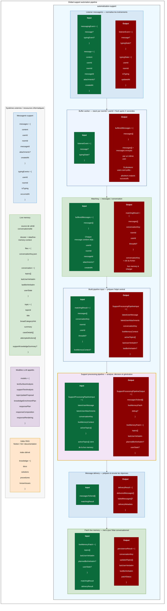

```mermaid
flowchart LR
    subgraph GLOBAL["Global support automation pipeline"]
        direction LR

        subgraph EXT["Systèmes externes / ressources informatiques"]
            direction TB

            MSG["Messagerie support<br/><br/>
            messages = {<br/>
            content<br/>
            userId<br/>
            roomId<br/>
            messageId<br/>
            attachments?<br/>
            createdAt<br/>
            }<br/><br/>
            typingEvents = {<br/>
            userId<br/>
            roomId<br/>
            isTyping<br/>
            occurredAt<br/>
            }"]

            LIVE_MEMORY["Live memory<br/><br/>
            source de vérité conversationnelle<br/><br/>
            dossier = data/live-memory-context<br/><br/>
            files = {<br/>
            conversationKey.json<br/>
            }<br/><br/>
            conversation = {<br/>
            topics[]<br/>
            lastUserVerbatim<br/>
            lastBotVerbatim<br/>
            userState<br/>
            }<br/><br/>
            topic = {<br/>
            topicId<br/>
            title<br/>
            broadCategoryHint<br/>
            summary<br/>
            caseDetails[]<br/>
            attemptedActions[]<br/>
            supportKnowledgeSummary?<br/>
            }"]

            LLM["Modèles LLM appelés<br/><br/>
            models = {<br/>
            textSurfaceAnalysis<br/>
            supportTextAnalysis<br/>
            topicUpdateProposal<br/>
            knowledgeEnrichmentPlan<br/>
            responsePlan<br/>
            responseComposition<br/>
            responseRendering<br/>
            }"]

            RAG["Index RAG<br/>Notion / Git / documentation<br/><br/>
            index dérivé<br/><br/>
            knowledge = {<br/>
            docs<br/>
            solutions<br/>
            procedures<br/>
            knownIssues<br/>
            }"]

            MSG ~~~ LIVE_MEMORY
            LIVE_MEMORY ~~~ LLM
            LLM ~~~ RAG
        end

        subgraph CODE["automatisation-support"]
            direction TB

            subgraph LISTENER_STEP["Listener messagerie — normalise les événements"]
                direction LR

                LISTENER_INPUT["<b>Input</b><br/><br/>
                messagingEvent = {<br/>
                message?<br/>
                typingEvent?<br/>
                }<br/><br/>
                message = {<br/>
                content<br/>
                userId<br/>
                roomId<br/>
                messageId<br/>
                attachments?<br/>
                createdAt<br/>
                }"]

                LISTENER_OUTPUT["<b>Output</b><br/><br/>
                listenerEvent = {<br/>
                message?<br/>
                typingState?<br/>
                }<br/><br/>
                typingState = {<br/>
                userId<br/>
                roomId<br/>
                isTyping<br/>
                updatedAt<br/>
                }"]

                LISTENER_INPUT ~~~ LISTENER_OUTPUT
            end

            subgraph BUFFER_STEP["Buffer worker — stack par roomId / userId + flush après X secondes"]
                direction LR

                BUFFER_INPUT["<b>Input</b><br/><br/>
                listenerEvent = {<br/>
                message?<br/>
                typingState?<br/>
                }"]

                BUFFER_OUTPUT["<b>Output</b><br/><br/>
                bufferedMessages = {<br/>
                messages[]<br/>
                }<br/><br/>
                messages[] = messages envoyés<br/>
                par un même user<br/><br/>
                Si plusieurs users sont prêts :<br/>
                plusieurs outputs successifs"]

                BUFFER_INPUT ~~~ BUFFER_OUTPUT
            end

            subgraph MATCH_STEP["Matching — messages / conversation"]
                direction LR

                MATCH_INPUT["<b>Input</b><br/><br/>
                bufferedMessages = {<br/>
                messages[]<br/>
                }<br/><br/>
                Chaque message contient déjà :<br/>
                userId<br/>
                roomId<br/>
                messageId<br/>
                attachments?<br/>
                createdAt"]

                MATCH_OUTPUT["<b>Output</b><br/><br/>
                matchingResult = {<br/>
                messages[]<br/>
                conversationKey<br/>
                roomId<br/>
                userId<br/>
                threadId?<br/>
                }<br/><br/>
                conversationKey = clé du fichier<br/>
                live memory à charger"]

                MATCH_INPUT ~~~ MATCH_OUTPUT
            end

            subgraph BUILD_INPUT_STEP["Build pipeline input — prépare l'objet central"]
                direction LR

                BUILD_INPUT_INPUT["<b>Input</b><br/><br/>
                matchingResult = {<br/>
                messages[]<br/>
                conversationKey<br/>
                roomId<br/>
                userId<br/>
                threadId?<br/>
                }<br/><br/>
                liveMemoryContext?"]

                BUILD_INPUT_OUTPUT["<b>Output</b><br/><br/>
                SupportProcessingPipelineInput = {<br/>
                latestUserMessage<br/>
                latestUserAttachments<br/>
                conversationKey<br/>
                liveMemoryContext<br/>
                activeTopics[]<br/>
                lastUserVerbatim?<br/>
                lastBotVerbatim?<br/>
                }"]

                BUILD_INPUT_INPUT ~~~ BUILD_INPUT_OUTPUT
            end

            subgraph SUPPORT_PIPELINE_STEP["Support processing pipeline — analyse, décision et génération"]
                direction LR

                SUPPORT_PIPELINE_INPUT["<b>Input</b><br/><br/>
                SupportProcessingPipelineInput = {<br/>
                latestUserMessage<br/>
                latestUserAttachments<br/>
                conversationKey<br/>
                liveMemoryContext<br/>
                activeTopics[]<br/>
                }<br/><br/>
                activeTopics[] vient<br/>
                de la live memory"]

                SUPPORT_PIPELINE_OUTPUT["<b>Output</b><br/><br/>
                SupportProcessingPipelineOutput = {<br/>
                messagesToSend[]<br/>
                liveMemoryPatch<br/>
                debug?<br/>
                }<br/><br/>
                liveMemoryPatch = {<br/>
                topics[]<br/>
                lastUserVerbatim<br/>
                plannedBotVerbatim?<br/>
                userState?<br/>
                }"]

                SUPPORT_PIPELINE_INPUT ~~~ SUPPORT_PIPELINE_OUTPUT
            end

            subgraph MESSAGE_DELIVERY_STEP["Message delivery — prépare et envoie les réponses"]
                direction LR

                MESSAGE_DELIVERY_INPUT["<b>Input</b><br/><br/>
                messagesToSend[]<br/>
                matchingResult"]

                MESSAGE_DELIVERY_OUTPUT["<b>Output</b><br/><br/>
                deliveryResult = {<br/>
                deliveredMessages[]<br/>
                failedMessages[]?<br/>
                deliveryMetadata<br/>
                }"]

                MESSAGE_DELIVERY_INPUT ~~~ MESSAGE_DELIVERY_OUTPUT
            end

            subgraph PATCH_APPLICATION_STEP["Patch live memory — met à jour l'état conversationnel"]
                direction LR

                PATCH_APPLICATION_INPUT["<b>Input</b><br/><br/>
                liveMemoryPatch = {<br/>
                topics[]<br/>
                lastUserVerbatim<br/>
                plannedBotVerbatim?<br/>
                userState?<br/>
                }<br/><br/>
                matchingResult<br/>
                deliveryResult"]

                PATCH_APPLICATION_OUTPUT["<b>Output</b><br/><br/>
                persistenceResult = {<br/>
                conversationKey<br/>
                updatedTopics[]<br/>
                lastUserVerbatim<br/>
                lastBotVerbatim<br/>
                patchStatus<br/>
                }"]

                PATCH_APPLICATION_INPUT ~~~ PATCH_APPLICATION_OUTPUT
            end

            LISTENER_STEP --> BUFFER_STEP
            BUFFER_STEP --> MATCH_STEP
            MATCH_STEP --> BUILD_INPUT_STEP
            BUILD_INPUT_STEP --> SUPPORT_PIPELINE_STEP
            SUPPORT_PIPELINE_STEP --> MESSAGE_DELIVERY_STEP
            MESSAGE_DELIVERY_STEP --> PATCH_APPLICATION_STEP
        end

        EXT ~~~ CODE
    end

    classDef messaging fill:#d9e8f5,stroke:#4f93d2,stroke-width:1.5px,color:#111;
    classDef knowledge fill:#d5e8d4,stroke:#82b366,stroke-width:1.5px,color:#111;
    classDef llm fill:#e1d5e7,stroke:#9673a6,stroke-width:1.5px,color:#111;
    classDef rag fill:#ffe6cc,stroke:#d79b00,stroke-width:1.5px,color:#111;
    classDef backend fill:#eef5ff,stroke:#2b5d9a,stroke-width:1.5px,color:#111;

    classDef inputBlock fill:#0b6b3a,stroke:#064a28,color:#ffffff,stroke-width:1px;
    classDef outputBlock fill:#8b0000,stroke:#5c0000,color:#ffffff,stroke-width:1px;

    class MSG messaging;
    class LIVE_MEMORY knowledge;
    class LLM llm;
    class RAG rag;

    class LISTENER_INPUT,BUFFER_INPUT,MATCH_INPUT,BUILD_INPUT_INPUT,SUPPORT_PIPELINE_INPUT,MESSAGE_DELIVERY_INPUT,PATCH_APPLICATION_INPUT inputBlock;
    class LISTENER_OUTPUT,BUFFER_OUTPUT,MATCH_OUTPUT,BUILD_INPUT_OUTPUT,SUPPORT_PIPELINE_OUTPUT,MESSAGE_DELIVERY_OUTPUT,PATCH_APPLICATION_OUTPUT outputBlock;

    style GLOBAL fill:#ffffff,stroke:#000000,stroke-width:1px,color:#000000;
    style EXT fill:#f7f7f7,stroke:#888,stroke-width:1px,color:#000000;
    style CODE fill:#eef8ff,stroke:#000000,stroke-width:1px,color:#000000;

    style LISTENER_STEP fill:#d9e8f5,stroke:#4f93d2,stroke-width:1.5px,color:#111;
    style BUFFER_STEP fill:#eef5ff,stroke:#2b5d9a,stroke-width:1.5px,color:#111;
    style MATCH_STEP fill:#d5e8d4,stroke:#82b366,stroke-width:1.5px,color:#111;
    style BUILD_INPUT_STEP fill:#eef5ff,stroke:#2b5d9a,stroke-width:1.5px,color:#111;

    %% LLM + RAG hybrid visual identity:
    %% violet fill = LLM dependency, orange stroke = RAG dependency
    style SUPPORT_PIPELINE_STEP fill:#f3e5f5,stroke:#d79b00,stroke-width:2.5px,color:#111;

    style MESSAGE_DELIVERY_STEP fill:#d9e8f5,stroke:#4f93d2,stroke-width:1.5px,color:#111;

    %% Live memory persistence:
    %% green fill = conversation state storage
    style PATCH_APPLICATION_STEP fill:#d5e8d4,stroke:#82b366,stroke-width:2.5px,color:#111;
```
