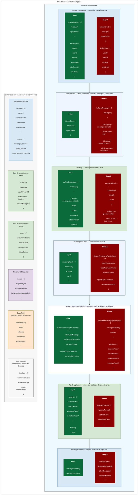

```mermaid
flowchart LR
    subgraph GLOBAL["Global support automation pipeline"]
        direction LR

        subgraph EXT["Systèmes externes / ressources informatiques"]
            direction TB

            MSG["Messagerie support<br/><br/>
            messages = {<br/>
            content<br/>
            userId / roomId<br/>
            messageId<br/>
            attachments?<br/>
            }<br/><br/>
            events = {<br/>
            message_received<br/>
            typing_started<br/>
            typing_stopped / inactivity<br/>
            }"]

            TICKET_DB["Base de connaissance tickets<br/><br/>
            tickets = {<br/>
            knowledge<br/>
            userId / roomId<br/>
            status: active / inactive<br/>
            linkedMessages?<br/>
            }"]

            USER_DB["Base de connaissance users<br/><br/>
            users = {<br/>
            accountTrustStatus<br/>
            accountTraits<br/>
            accountProfile<br/>
            linkedTickets<br/>
            }"]

            LLM["Modèles LLM appelés<br/><br/>
            models = {<br/>
            imageAnalysis<br/>
            llmTrusterReview<br/>
            fullWeightMessageAnalysis<br/>
            }"]

            RAG["Base RAG<br/>Notion / Git / documentation<br/><br/>
            knowledge = {<br/>
            docs<br/>
            solutions<br/>
            procedures<br/>
            knownIssues<br/>
            }"]

            FRONT["Outil frontend<br/>présentation / édition des données<br/><br/>
            interface = {<br/>
            read tickets / users<br/>
            edit knowledge<br/>
            review conversations<br/>
            }"]

            MSG ~~~ TICKET_DB
            TICKET_DB ~~~ USER_DB
            USER_DB ~~~ LLM
            LLM ~~~ RAG
            RAG ~~~ FRONT
        end

        subgraph CODE["automatisation-support"]
            direction TB

            subgraph LISTENER_STEP["Listener messagerie — normalise les événements"]
                direction LR

                LISTENER_INPUT["<b>Input</b><br/><br/>
                messagingEvent = {<br/>
                message?<br/>
                typingEvent?<br/>
                }<br/><br/>
                message = {<br/>
                content<br/>
                userId<br/>
                roomId<br/>
                messageId<br/>
                attachments?<br/>
                createdAt<br/>
                }"]

                LISTENER_OUTPUT["<b>Output</b><br/><br/>
                listenerEvent = {<br/>
                message?<br/>
                typingState?<br/>
                }<br/><br/>
                typingState = {<br/>
                userId<br/>
                roomId<br/>
                isTyping<br/>
                updatedAt<br/>
                }"]

                LISTENER_INPUT ~~~ LISTENER_OUTPUT
            end

            subgraph BUFFER_STEP["Buffer worker — stack par roomId / userId + flush après X secondes"]
                direction LR

                BUFFER_INPUT["<b>Input</b><br/><br/>
                listenerEvent = {<br/>
                message?<br/>
                typingState?<br/>
                }"]

                BUFFER_OUTPUT["<b>Output</b><br/><br/>
                bufferedMessages = {<br/>
                messages[]<br/>
                }<br/><br/>
                messages[] = messages envoyés<br/>
                par un même user<br/><br/>
                Si plusieurs users sont prêts :<br/>
                plusieurs outputs successifs"]

                BUFFER_INPUT ~~~ BUFFER_OUTPUT
            end

            subgraph MATCH_STEP["Matching — messages / ticket(s) / user"]
                direction LR

                MATCH_INPUT["<b>Input</b><br/><br/>
                bufferedMessages = {<br/>
                messages[]<br/>
                }<br/><br/>
                Chaque message contient déjà :<br/>
                userId<br/>
                roomId<br/>
                messageId<br/>
                attachments?<br/>
                createdAt"]

                MATCH_OUTPUT["<b>Output</b><br/><br/>
                matchingResult = {<br/>
                messages[]<br/>
                tickets[]<br/>
                user?<br/>
                }<br/><br/>
                tickets[] = en général 1 ticket<br/>
                user? = 0 ou 1 user connu"]

                MATCH_INPUT ~~~ MATCH_OUTPUT
            end

            subgraph BUILD_INPUT_STEP["Build pipeline input — prépare l'objet central"]
                direction LR

                BUILD_INPUT_INPUT["<b>Input</b><br/><br/>
                matchingResult = {<br/>
                messages[]<br/>
                tickets[]<br/>
                user?<br/>
                }"]

                BUILD_INPUT_OUTPUT["<b>Output</b><br/><br/>
                SupportProcessingPipelineInput = {<br/>
                latestUserMessage<br/>
                latestUserAttachments<br/>
                accountContext<br/>
                supportTopicKnowledge<br/>
                conversationHistory<br/>
                }"]

                BUILD_INPUT_INPUT ~~~ BUILD_INPUT_OUTPUT
            end

            subgraph SUPPORT_PIPELINE_STEP["Support processing pipeline — analyse, RAG, décision et génération"]
                direction LR

                SUPPORT_PIPELINE_INPUT["<b>Input</b><br/><br/>
                SupportProcessingPipelineInput = {<br/>
                latestUserMessage<br/>
                latestUserAttachments<br/>
                accountContext<br/>
                supportTopicKnowledge<br/>
                conversationHistory<br/>
                }"]

                SUPPORT_PIPELINE_OUTPUT["<b>Output</b><br/><br/>
                SupportProcessingPipelineOutput = {<br/>
                messagesToSend[]<br/>
                patches<br/>
                }<br/><br/>
                patches = {<br/>
                analysisPatch?<br/>
                securityPatch?<br/>
                responsePatch?<br/>
                metadataPatch?<br/>
                }"]

                SUPPORT_PIPELINE_INPUT ~~~ SUPPORT_PIPELINE_OUTPUT
            end

            subgraph PATCH_APPLICATION_STEP["Patch application — met à jour les bases de connaissance"]
                direction LR

                PATCH_APPLICATION_INPUT["<b>Input</b><br/><br/>
                patches = {<br/>
                analysisPatch?<br/>
                securityPatch?<br/>
                responsePatch?<br/>
                metadataPatch?<br/>
                }<br/><br/>
                tickets[]<br/>
                user?"]

                PATCH_APPLICATION_OUTPUT["<b>Output</b><br/><br/>
                persistenceResult = {<br/>
                updatedTickets[]<br/>
                updatedUser?<br/>
                storedMetadata?<br/>
                }"]

                PATCH_APPLICATION_INPUT ~~~ PATCH_APPLICATION_OUTPUT
            end

            subgraph MESSAGE_DELIVERY_STEP["Message delivery — prépare et envoie les réponses"]
                direction LR

                MESSAGE_DELIVERY_INPUT["<b>Input</b><br/><br/>
                messagesToSend[]<br/>
                persistenceResult?"]

                MESSAGE_DELIVERY_OUTPUT["<b>Output</b><br/><br/>
                sentMessages = {<br/>
                deliveredMessages[]<br/>
                failedMessages[]?<br/>
                deliveryMetadata<br/>
                }"]

                MESSAGE_DELIVERY_INPUT ~~~ MESSAGE_DELIVERY_OUTPUT
            end

            LISTENER_STEP --> BUFFER_STEP
            BUFFER_STEP --> MATCH_STEP
            MATCH_STEP --> BUILD_INPUT_STEP
            BUILD_INPUT_STEP --> SUPPORT_PIPELINE_STEP
            SUPPORT_PIPELINE_STEP --> PATCH_APPLICATION_STEP
            PATCH_APPLICATION_STEP --> MESSAGE_DELIVERY_STEP
        end

        EXT ~~~ CODE
    end

    classDef messaging fill:#d9e8f5,stroke:#4f93d2,stroke-width:1.5px,color:#111;
    classDef knowledge fill:#d5e8d4,stroke:#82b366,stroke-width:1.5px,color:#111;
    classDef llm fill:#e1d5e7,stroke:#9673a6,stroke-width:1.5px,color:#111;
    classDef rag fill:#ffe6cc,stroke:#d79b00,stroke-width:1.5px,color:#111;
    classDef frontend fill:#f7f7f7,stroke:#888,stroke-width:1.5px,color:#111;
    classDef backend fill:#eef5ff,stroke:#2b5d9a,stroke-width:1.5px,color:#111;
    classDef pipeline fill:#ffffff,stroke:#2b5d9a,stroke-width:2px,color:#111;
    classDef output fill:#f8cecc,stroke:#b85450,stroke-width:1.5px,color:#111;

    classDef inputBlock fill:#0b6b3a,stroke:#064a28,color:#ffffff,stroke-width:1px;
    classDef outputBlock fill:#8b0000,stroke:#5c0000,color:#ffffff,stroke-width:1px;

    class MSG messaging;
    class TICKET_DB,USER_DB knowledge;
    class LLM llm;
    class RAG rag;
    class FRONT frontend;

    class LISTENER_INPUT,BUFFER_INPUT,MATCH_INPUT,BUILD_INPUT_INPUT,SUPPORT_PIPELINE_INPUT,PATCH_APPLICATION_INPUT,MESSAGE_DELIVERY_INPUT inputBlock;
    class LISTENER_OUTPUT,BUFFER_OUTPUT,MATCH_OUTPUT,BUILD_INPUT_OUTPUT,SUPPORT_PIPELINE_OUTPUT,PATCH_APPLICATION_OUTPUT,MESSAGE_DELIVERY_OUTPUT outputBlock;

    style GLOBAL fill:#ffffff,stroke:#000000,stroke-width:1px,color:#000000;
    style EXT fill:#f7f7f7,stroke:#888,stroke-width:1px,color:#000000;
    style CODE fill:#eef8ff,stroke:#000000,stroke-width:1px,color:#000000;

    style LISTENER_STEP fill:#d9e8f5,stroke:#4f93d2,stroke-width:1.5px,color:#111;
    style BUFFER_STEP fill:#eef5ff,stroke:#2b5d9a,stroke-width:1.5px,color:#111;
    style MATCH_STEP fill:#d5e8d4,stroke:#82b366,stroke-width:1.5px,color:#111;
    style BUILD_INPUT_STEP fill:#eef5ff,stroke:#2b5d9a,stroke-width:1.5px,color:#111;
    style SUPPORT_PIPELINE_STEP fill:#ffffff,stroke:#2b5d9a,stroke-width:2px,color:#111;
    style PATCH_APPLICATION_STEP fill:#d5e8d4,stroke:#82b366,stroke-width:1.5px,color:#111;
    style MESSAGE_DELIVERY_STEP fill:#d9e8f5,stroke:#4f93d2,stroke-width:1.5px,color:#111;
```
