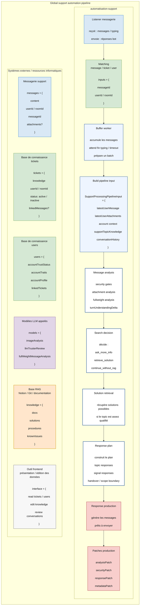

```mermaid
flowchart LR
    subgraph GLOBAL["Global support automation pipeline"]
        direction LR

        subgraph EXT["Systèmes externes / ressources informatiques"]
            direction TB

            MSG["Messagerie support<br/><br/>
            messages = {<br/>
            content<br/>
            userId / roomId<br/>
            messageId<br/>
            attachments?<br/>
            }"]

            TICKET_DB["Base de connaissance tickets<br/><br/>
            tickets = {<br/>
            knowledge<br/>
            userId / roomId<br/>
            status: active / inactive<br/>
            linkedMessages?<br/>
            }"]

            USER_DB["Base de connaissance users<br/><br/>
            users = {<br/>
            accountTrustStatus<br/>
            accountTraits<br/>
            accountProfile<br/>
            linkedTickets<br/>
            }"]

            LLM["Modèles LLM appelés<br/><br/>
            models = {<br/>
            imageAnalysis<br/>
            llmTrusterReview<br/>
            fullWeightMessageAnalysis<br/>
            }"]

            RAG["Base RAG<br/>Notion / Git / documentation<br/><br/>
            knowledge = {<br/>
            docs<br/>
            solutions<br/>
            procedures<br/>
            knownIssues<br/>
            }"]

            FRONT["Outil frontend<br/>présentation / édition des données<br/><br/>
            interface = {<br/>
            read tickets / users<br/>
            edit knowledge<br/>
            review conversations<br/>
            }"]

            MSG ~~~ TICKET_DB
            TICKET_DB ~~~ USER_DB
            USER_DB ~~~ LLM
            LLM ~~~ RAG
            RAG ~~~ FRONT
        end

        subgraph CODE["automatisation-support"]
            direction TB

            LISTENER["Listener messagerie<br/><br/>
            reçoit : messages / typing<br/>
            envoie : réponses bot"]

            MATCH["Matching<br/>message / ticket / user<br/><br/>
            inputs = {<br/>
            messageId<br/>
            userId / roomId<br/>
            }"]

            BUFFER["Buffer worker<br/><br/>
            accumule les messages<br/>
            attend fin typing / timeout<br/>
            prépare un batch"]

            BUILD_INPUT["Build pipeline input<br/><br/>
            SupportProcessingPipelineInput = {<br/>
            latestUserMessage<br/>
            latestUserAttachments<br/>
            account context<br/>
            supportTopicKnowledge<br/>
            conversationHistory<br/>
            }"]

            MESSAGE_ANALYSIS["Message analysis<br/><br/>
            security gates<br/>
            attachment analysis<br/>
            fullweight analysis<br/>
            turnUnderstandingDelta"]

            SEARCH_DECISION["Search decision<br/><br/>
            décide :<br/>
            ask_more_info<br/>
            retrieve_solution<br/>
            continue_without_rag"]

            SOLUTION_RETRIEVAL["Solution retrieval<br/><br/>
            récupère solutions possibles<br/>
            si le topic est assez qualifié"]

            RESPONSE_PLAN["Response plan<br/><br/>
            construit le plan<br/>
            topic responses<br/>
            signal responses<br/>
            handover / scope boundary"]

            RESPONSE_PRODUCTION["Response production<br/><br/>
            génère les messages<br/>
            prêts à envoyer"]

            PATCHES_PRODUCTION["Patches production<br/><br/>
            analysisPatch<br/>
            securityPatch<br/>
            responsePatch<br/>
            metadataPatch"]

            LISTENER --> MATCH
            MATCH --> BUFFER
            BUFFER --> BUILD_INPUT
            BUILD_INPUT --> MESSAGE_ANALYSIS
            MESSAGE_ANALYSIS --> SEARCH_DECISION
            SEARCH_DECISION --> SOLUTION_RETRIEVAL
            SOLUTION_RETRIEVAL --> RESPONSE_PLAN
            RESPONSE_PLAN --> RESPONSE_PRODUCTION
            RESPONSE_PRODUCTION --> PATCHES_PRODUCTION
        end

        EXT ~~~ CODE
    end

    classDef messaging fill:#d9e8f5,stroke:#4f93d2,stroke-width:1.5px,color:#111;
    classDef knowledge fill:#d5e8d4,stroke:#82b366,stroke-width:1.5px,color:#111;
    classDef llm fill:#e1d5e7,stroke:#9673a6,stroke-width:1.5px,color:#111;
    classDef rag fill:#ffe6cc,stroke:#d79b00,stroke-width:1.5px,color:#111;
    classDef frontend fill:#f7f7f7,stroke:#888,stroke-width:1.5px,color:#111;
    classDef backend fill:#eef5ff,stroke:#2b5d9a,stroke-width:1.5px,color:#111;
    classDef pipeline fill:#ffffff,stroke:#2b5d9a,stroke-width:2px,color:#111;
    classDef output fill:#f8cecc,stroke:#b85450,stroke-width:1.5px,color:#111;

    class MSG,LISTENER messaging;
    class TICKET_DB,USER_DB,MATCH knowledge;
    class LLM llm;
    class RAG rag;
    class FRONT frontend;
    class BUFFER,BUILD_INPUT backend;
    class MESSAGE_ANALYSIS,SEARCH_DECISION,SOLUTION_RETRIEVAL,RESPONSE_PLAN pipeline;
    class RESPONSE_PRODUCTION,PATCHES_PRODUCTION output;
```
