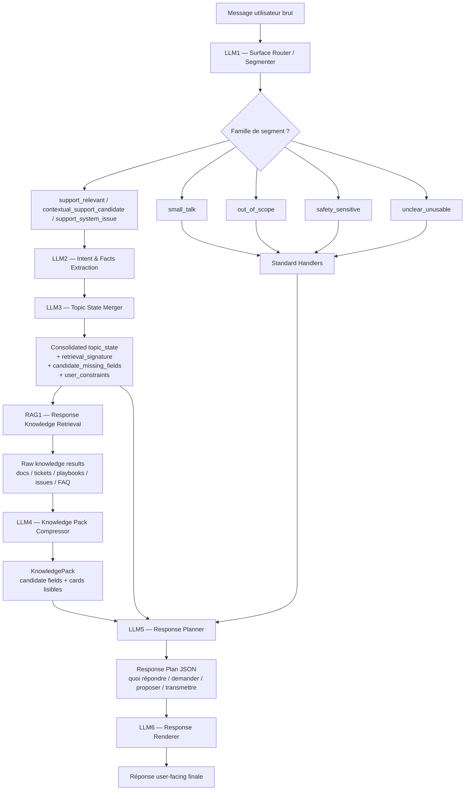
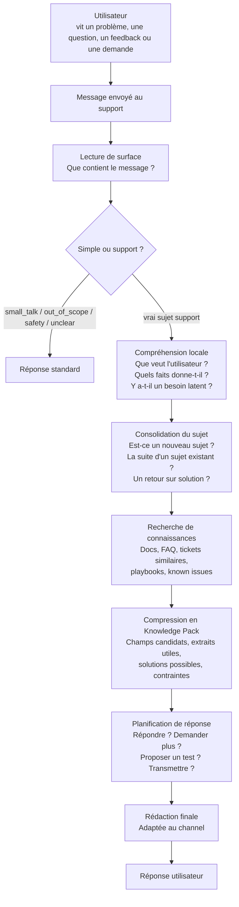

# Architecture d’analyse support — version mise à jour

## 1. Principes de conception

Un module ne doit répondre qu’à une seule question principale.

Un module ne doit pas refaire le travail d’un module précédent.

Un module peut être LLM, RAG, backend déterministe ou handler standard, mais son rôle doit rester clair.

Le système ne doit pas laisser un gros LLM libre lire tout l’historique et répondre directement.
Il doit construire progressivement :

```txt
compréhension → topic_state → knowledge_pack → response_plan → réponse finale
```

Le système doit rester adaptable à plusieurs clients, domaines métier et channels textuels : Twake Chat, Twake Mail, email classique, support SaaS, support matériel, support administratif, etc.

Le cœur générique doit comprendre et structurer une demande support sans coder trop tôt des concepts propres à Twake.

---

## 2. Vision globale stabilisée

La pipeline est maintenant organisée ainsi :

```txt
LLM1 — Surface Router / Segmenter
→ segmente le message brut et route chaque segment.

Standard Handlers
→ traitent les routes simples : small_talk, out_of_scope, safety_sensitive, unclear_unusable.

LLM2 — Intent & Facts Extraction
→ analyse localement les segments support : intention visible, besoin latent, faits explicites.

LLM3 — Topic State Merger
→ rattache les informations au bon topic, crée ou met à jour un topic_state consolidé.

RAG1 — Response Knowledge Retrieval
→ cherche les documents, tickets, playbooks ou issues utiles à partir du topic_state.

LLM4 — Knowledge Pack Compressor
→ transforme les résultats RAG en knowledge_pack court, lisible, sourcé et exploitable.

LLM5 — Response Planner
→ décide quoi répondre, demander, proposer ou transmettre, sans rédiger la réponse finale.

LLM6 — Response Renderer
→ rédige la réponse finale user-facing en suivant strictement le plan.
```

Idée centrale :

```txt
LLM1 route.
LLM2 comprend.
LLM3 consolide.
RAG1 récupère.
LLM4 compacte.
LLM5 planifie.
LLM6 rédige.
```

---

## 3. SupportProfile configurable

Le `SupportProfile` permet d’adapter l’architecture au client, au domaine, au produit et au channel.

```ts
type SupportProfile = {
  client_name: string;

  scope_definition: string;
  out_of_scope_examples: string[];
  borderline_related_but_unsupported_examples?: string[];

  field_catalog: Record<string, FieldDefinition>;

  broad_categories: BroadCategory[];

  retrieval_config?: {
    enabled_sources: RetrievalSourceType[];
    docs_index_names?: string[];
    tickets_index_names?: string[];
    playbooks_index_names?: string[];
    max_cards_for_llm5?: number;
  };

  response_policies: {
    max_questions_to_user: number;
    do_not_repeat_previously_requested_fields: boolean;
    do_not_ask_unavailable_information: boolean;
    do_not_propose_unsourced_solution: boolean;
    answer_visible_intention_first_when_possible: boolean;
    do_not_overdiagnose_simple_feedback: boolean;
  };

  handover_rules?: Rule[];
  escalation_rules?: Rule[];

  channel_styles: {
    chat?: ChannelStyle;
    email?: ChannelStyle;
    ticket?: ChannelStyle;
  };
};

type BroadCategory =
  | "bug"
  | "access_security"
  | "billing"
  | "question_faq"
  | "feature_request"
  | "support_action"
  | "product_feedback"
  | "support_experience_issue"
  | "other";

type RetrievalSourceType =
  | "doc_faq"
  | "product_doc"
  | "known_issue"
  | "playbook"
  | "similar_ticket"
  | "possible_solution"
  | "generic_safe_step";
```

Choix important : les anciennes catégories trop spécifiques ou trop liées à un moment de réflexion sont supprimées ou déplacées dans des tags / champs métier.
Par exemple :

* `how_to_question` devient généralement `question_faq` ;
* `request` est séparé entre `feature_request` et `support_action` ;
* `support_meta` n’est plus une catégorie support profonde, il va plutôt dans `small_talk` si c’est simple ;
* `politeness_only` fusionne avec `support_meta_simple` dans `small_talk`.

---

## 4. LLM1 — Surface Router / Segmenter

### Objectif

LLM1 est un routeur léger.

Il lit le message brut et produit des segments avec une famille de surface.

Il ne fait pas :

* de matching avec les topics existants ;
* d’extraction métier détaillée ;
* de recherche RAG ;
* de plan de réponse ;
* de rédaction finale.

### Sortie LLM1

```ts
type SurfaceSegment = {
  segment_id: string;
  text: string;

  family:
    | "support_relevant"
    | "contextual_support_candidate"
    | "support_system_issue"
    | "small_talk"
    | "out_of_scope"
    | "safety_sensitive"
    | "unclear_unusable";

  surface_kind?: string;
  reason_short?: string;
};
```

### Familles LLM1

#### `support_relevant`

Segment utile au support, compréhensible localement.

Exemples :

```txt
Je ne peux plus me connecter.
L’application crash sur iOS.
Je veux arrêter mon abonnement.
Pourriez-vous ajouter cette fonctionnalité ?
Merci, ça marche maintenant.
```

#### `contextual_support_candidate`

Segment court ou elliptique, potentiellement utile si le contexte le rattache.

Exemples :

```txt
Firefox.
Oui.
Non.
Ça ne marche toujours pas.
Aussi sur mobile.
Même problème.
```

#### `support_system_issue`

Segment concernant le fonctionnement du support, du bot, de l’assistance ou de la qualité de prise en charge.

Exemples :

```txt
Le chatbot répond n’importe quoi.
Vous me reposez toujours la même question.
Je veux parler à un humain car le bot ne m’aide pas.
Votre support ne comprend pas ma demande.
```

Cette famille est distincte de `small_talk`, car elle peut nécessiter une vraie prise en compte support.

#### `small_talk`

Fusion de l’ancien `politeness_only` et de l’ancien `support_meta_simple`.

Couvre les interactions simples, sans vrai sujet produit à analyser.

Exemples :

```txt
Bonjour.
Merci.
Bonne journée.
Qui es-tu ?
Comment ça marche ?
Je veux parler à un humain.
```

Règle importante :

```txt
small_talk = uniquement si le message ne contient pas de vrai sujet support à analyser.
```

Contre-exemples :

```txt
Bonjour, je n’arrive pas à me connecter.
→ support_relevant

Merci, ça marche maintenant.
→ support_relevant

Je veux parler à un humain, je n’arrive plus à accéder à mon compte.
→ support_relevant + intention handover
```

#### `out_of_scope`

Hors périmètre du support selon le `SupportProfile`.

#### `safety_sensitive`

Demande sensible, hostile, confidentielle, abusive ou dangereuse.

#### `unclear_unusable`

Message trop vague, incompréhensible ou inexploitable.

### Règle stricte

Si le message utilisateur est non vide, LLM1 doit retourner au moins un segment.

Si rien n’est exploitable, retourner :

```ts
{
  segment_id: "seg_1",
  text: "<message complet>",
  family: "unclear_unusable",
  surface_kind: "too_vague" | "garbled_text" | "missing_reference",
  reason_short: "Message not understandable enough to process."
}
```

Si LLM1 retourne zéro segment sur un message non vide, le backend crée un segment synthétique `router_failure`, mais ne lance pas LLM2.

---

## 5. Standard Handlers

Les routes simples ne déclenchent pas la chaîne complète LLM2 → LLM6.

```txt
small_talk → SmallTalkHandler
out_of_scope → ScopeHandler
safety_sensitive → SafetyHandler
unclear_unusable → ClarificationHandler
```

Ces handlers peuvent produire directement une réponse standard courte.

Règle importante :

```txt
Une réponse small_talk ne ferme pas automatiquement un sujet support.
```

Exemple :

```txt
OK merci
```

peut être loggé comme :

```txt
user_acknowledged = true
```

mais ne doit pas devenir automatiquement :

```txt
resolution_status = resolved
```

---

## 6. Déclenchement LLM2

LLM2 est appelé uniquement si au moins un segment a :

```txt
family = support_relevant
```

ou :

```txt
family = contextual_support_candidate
```

ou :

```txt
family = support_system_issue
```

S’il n’y a aucun segment support ou candidat support, on ne lance pas LLM2.

---

## 7. LLM2 — Intent & Facts Extraction

### Objectif

LLM2 fait l’analyse locale des segments support.

Il doit comprendre :

* ce que l’utilisateur veut visiblement ;
* si une intention latente existe ;
* quels faits sont explicitement donnés ;
* quels champs pourraient être utiles ;
* si le segment dépend du contexte.

LLM2 ne décide pas encore où écrire l’information.

### Entrée LLM2

```ts
type LLM2Input = {
  raw_user_message: string;
  support_segments: SurfaceSegment[];
  immediate_context?: {
    previous_user_message_summary?: string;
    previous_bot_response_summary?: string;
    pending_bot_question?: string;
    pending_requested_field?: string;
    pending_solution?: string;
  };
  support_profile: SupportProfile;
};
```

### Sortie LLM2

```ts
type LocalSupportUnderstanding = {
  segment_id: string;

  local_summary: string;

  primary_user_expectation:
    | "wants_answer"
    | "wants_solution"
    | "wants_support_action"
    | "wants_human_handover"
    | "wants_acknowledgement"
    | "provides_information"
    | "reports_result"
    | "expresses_feedback"
    | "unclear";

  latent_support_need:
    | "none"
    | "possible_bug"
    | "possible_product_limitation"
    | "possible_feature_gap"
    | "possible_account_or_billing_action"
    | "possible_support_experience_issue"
    | "unclear";

  candidate_facts: {
    kind: string;
    value?: unknown;
    evidence: string;
    certainty: "explicit" | "strongly_implied" | "ambiguous";
  }[];

  broad_category_hint?:
    | "bug"
    | "access_security"
    | "billing"
    | "question_faq"
    | "feature_request"
    | "support_action"
    | "product_feedback"
    | "support_experience_issue"
    | "other";

  context_dependency:
    | "standalone_complete"
    | "standalone_but_may_match_existing"
    | "needs_context_to_interpret"
    | "needs_context_to_place";

  candidate_missing_fields_to_ask?: {
    field: string;
    question_hint: string;
    priority: "high" | "medium" | "low";
    why_it_may_help:
      | "answer_visible_question"
      | "diagnose_issue"
      | "choose_solution"
      | "prepare_handover"
      | "clarify_context";
  }[];

  user_constraints?: {
    cannot_provide_fields?: string[];
    cannot_perform_actions?: string[];
    declared_non_autonomous?: boolean;
    prefers_human_support?: boolean;
  };

  tested_actions?: {
    label: string;
    outcome: "worked" | "failed" | "partially_worked" | "unclear";
  }[];

  tone_overlays?: (
    | "frustration"
    | "urgency"
    | "disappointment"
    | "thanks"
    | "appreciation"
    | "complaint_tone"
    | "sarcasm_possible"
    | "impolite_or_profanity"
  )[];
};
```

Choix important : on ne garde plus une grosse liste de `local_categories` trop fine.
On garde plutôt :

* `primary_user_expectation` ;
* `latent_support_need` ;
* `broad_category_hint` ;
* `candidate_facts`.

---

## 8. LLM3 — Topic State Merger

### Objectif

LLM3 ne refait pas l’analyse locale.

Il prend :

* les sorties LLM2 ;
* le contexte conversationnel ;
* les topics actifs ;
* les questions déjà posées ;
* les solutions déjà proposées ;
* les éventuels fragments non résolus.

Puis il décide :

* créer un nouveau topic ;
* mettre à jour un topic existant ;
* reporter si le contexte est ambigu.

LLM3 doit aussi préparer la suite de la chaîne, notamment la recherche RAG.

### Entrée LLM3

```ts
type LLM3Input = {
  local_understandings: LocalSupportUnderstanding[];
  raw_user_message: string;

  context: {
    active_topics: CompactSupportTopic[];
    pending_bot_questions: PendingBotQuestion[];
    pending_requested_fields: PendingRequestedField[];
    pending_solutions: PendingSolution[];
    unresolved_fragments: UnresolvedFragment[];
    compact_interaction_logs: string[];
  };

  support_profile: SupportProfile;
};
```

### Sortie LLM3

```ts
type LLM3Output = {
  topic_updates: TopicWriteResolution[];
  topic_states: ConsolidatedTopicState[];
};

type TopicWriteResolution = {
  segment_id: string;

  write_decision:
    | "create_new_topic"
    | "update_existing_topic"
    | "defer_unresolved";

  topic_id?: string;

  merge_operation:
    | "create_primary_subject"
    | "fill_expected_field"
    | "append_detail"
    | "update_status"
    | "record_solution_feedback"
    | "apply_correction"
    | "record_feedback"
    | "do_not_write";

  field_writes?: {
    field_name: string;
    value: unknown;
    source_fact_kind: string;
    evidence: string;
  }[];

  resolution_reason:
    | "answers_pending_bot_question"
    | "fills_expected_field"
    | "matches_existing_topic_identity"
    | "continues_recent_topic"
    | "reacts_to_pending_solution"
    | "explicit_reference"
    | "no_existing_match"
    | "ambiguous_context"
    | "no_relevant_context";
};

type ConsolidatedTopicState = {
  topic_id: string;

  topic_status:
    | "new_topic"
    | "existing_topic_updated"
    | "contextual_continuation"
    | "unresolved_context";

  topic_summary: string;

  primary_user_expectation:
    | "wants_answer"
    | "wants_solution"
    | "wants_support_action"
    | "wants_human_handover"
    | "wants_acknowledgement"
    | "provides_information"
    | "reports_result"
    | "expresses_feedback"
    | "unclear";

  latent_support_need:
    | "none"
    | "possible_bug"
    | "possible_product_limitation"
    | "possible_feature_gap"
    | "possible_account_or_billing_action"
    | "possible_support_experience_issue"
    | "unclear";

  broad_category:
    | "bug"
    | "access_security"
    | "billing"
    | "question_faq"
    | "feature_request"
    | "support_action"
    | "product_feedback"
    | "support_experience_issue"
    | "other";

  known_fields: Record<string, unknown>;

  candidate_missing_fields_to_ask: {
    field: string;
    question_hint: string;
    priority: "high" | "medium" | "low";
    why_it_may_help:
      | "answer_visible_question"
      | "diagnose_issue"
      | "choose_solution"
      | "prepare_handover"
      | "clarify_context";
  }[];

  retrieval_signature: RetrievalSignature;

  user_constraints?: {
    cannot_provide_fields?: string[];
    cannot_perform_actions?: string[];
    declared_non_autonomous?: boolean;
    prefers_human_support?: boolean;
  };

  tested_actions?: {
    label: string;
    outcome: "worked" | "failed" | "partially_worked" | "unclear";
  }[];
};

type RetrievalSignature = {
  tool_or_product?: string;
  feature_or_page?: string;
  topic_action?: string;
  topic_object?: string;
  symptom_summary?: string;
  error_message?: string;
  platform?: string;
  tags?: string[];
  query_texts: string[];
};
```

Choix important : LLM3 ne décide pas la réponse.
Il produit un topic state consolidé, assez riche pour déclencher la récupération de connaissances.

---

## 9. RAG1 — Response Knowledge Retrieval

### Objectif

RAG1 cherche les sources utiles à partir du `retrieval_signature`.

Il ne répond pas à l’utilisateur.

Il ne planifie pas la réponse.

Il récupère des résultats bruts depuis :

* docs produit ;
* PDF indexés ;
* FAQ ;
* known issues ;
* playbooks ;
* tickets similaires ;
* solutions connues ;
* generic safe steps.

### Entrée RAG1

```ts
type RAG1Input = {
  topic_states: ConsolidatedTopicState[];

  retrieval_config: {
    enabled_sources: RetrievalSourceType[];
    max_raw_results_per_topic: number;
    max_raw_results_total: number;
  };
};
```

### Sortie RAG1

```ts
type RAG1Output = {
  raw_results: RawKnowledgeResult[];
};

type RawKnowledgeResult = {
  result_id: string;
  topic_id?: string;

  source_type:
    | "doc_faq"
    | "product_doc"
    | "known_issue"
    | "playbook"
    | "similar_ticket"
    | "possible_solution"
    | "generic_safe_step";

  title: string;
  raw_content: string;

  metadata?: {
    source_id?: string;
    url?: string;
    location?: string;
    score?: number;
    tags?: string[];
  };
};
```

Règle : pas de PDF entier dans le prompt.
Les PDF sont chunkés et indexés en amont.

---

## 10. LLM4 — Knowledge Pack Compressor

### Objectif

LLM4 prend les résultats RAG bruts et les transforme en `KnowledgePack` court, lisible et exploitable par LLM5.

LLM4 ne décide pas la réponse finale.

LLM4 ne rédige pas la réponse utilisateur.

Il produit des cards de connaissance.

### Format général

Le `KnowledgePack` est hybride :

* sections structurées ;
* cards lisibles par LLM ;
* IDs de source ;
* résumé naturel dans `content_for_llm`.

```ts
type KnowledgePackForLLM5 = {
  pack_summary: string;

  candidate_fields_to_ask: CandidateField[];

  doc_cards: KnowledgeCard[];

  ticket_cards: KnowledgeCard[];

  playbook_cards: KnowledgeCard[];

  known_issue_cards: KnowledgeCard[];

  solution_cards: KnowledgeCard[];

  constraints: KnowledgeConstraint[];
};

type CandidateField = {
  field: string;
  question_hint: string;
  priority: "high" | "medium" | "low";
  reason:
    | "missing_required_for_category"
    | "needed_to_disambiguate"
    | "needed_to_choose_solution"
    | "needed_for_handover"
    | "suggested_by_knowledge";
  source: "deterministic_rules" | "llm3_affordance" | "knowledge_card";
};

type KnowledgeCard = {
  card_id: string;

  source_type:
    | "doc_excerpt"
    | "similar_ticket"
    | "known_issue"
    | "playbook"
    | "possible_solution"
    | "generic_safe_step";

  title: string;

  relevance: "high" | "medium" | "low";

  allowed_uses: (
    | "answer_question"
    | "ask_missing_info"
    | "propose_test"
    | "prepare_handover"
    | "avoid_wrong_answer"
  )[];

  content_for_llm: string;

  source_ref?: {
    source_id: string;
    location?: string;
    url?: string;
  };
};

type KnowledgeConstraint = {
  constraint: string;
  reason?: string;
};
```

### Exemple de KnowledgeCard

```json
{
  "card_id": "ticket_482_summary",
  "source_type": "similar_ticket",
  "title": "Ticket similaire — synchronisation mobile",
  "relevance": "medium",
  "allowed_uses": ["propose_test", "prepare_handover"],
  "content_for_llm": "Ancien ticket proche : l'utilisateur signalait que les messages ne se synchronisaient plus sur mobile Android. Le support avait d'abord demandé si le problème concernait tous les messages ou seulement certains espaces, puis avait proposé de vider le cache de l'application. Le ticket a été résolu après reconnexion du compte.",
  "source_ref": {
    "source_id": "ticket_482"
  }
}
```

Choix important : LLM5 peut utiliser le texte naturel de la card, mais il doit respecter `allowed_uses`.

---

## 11. LLM5 — Response Planner

### Objectif

LLM5 est le cœur de la décision de réponse.

Il reçoit :

* le topic_state consolidé ;
* les contraintes conversationnelles ;
* le KnowledgePack ;
* les règles de planification ;
* les contraintes renderer.

Il produit un plan de réponse.

Il ne rédige pas le message final.

### Entrée LLM5

```ts
type LLM5Input = {
  response_context: {
    response_language: "fr" | "en";
    channel: "chat" | "email" | "ticket";

    planning_rules: {
      max_questions_to_user: number;
      do_not_repeat_previously_requested_fields: true;
      do_not_ask_unavailable_information: true;
      do_not_propose_unsourced_solution: true;
      answer_visible_intention_first_when_possible: true;
      do_not_overdiagnose_simple_feedback: true;
    };
  };

  latest_turn: {
    raw_user_message: string;
    support_segments: {
      segment_id: string;
      verbatim: string;
      surface_family:
        | "support_relevant"
        | "contextual_support_candidate"
        | "support_system_issue";
    }[];
    attachments: {
      has_image: boolean;
      has_video: boolean;
      has_file: boolean;
      summaries?: string[];
    };
  };

  topics: ConsolidatedTopicState[];

  conversation_constraints: {
    previous_questions: {
      topic_id: string;
      field?: string;
      question: string;
      answered: boolean;
    }[];

    unavailable_requests: {
      topic_id: string;
      type: "field" | "action" | "evidence";
      value: string;
      reason:
        | "user_said_cannot_provide"
        | "user_not_autonomous"
        | "not_applicable"
        | "already_failed"
        | "already_requested";
    }[];

    previous_tests_or_solutions: {
      topic_id: string;
      label: string;
      outcome: "worked" | "failed" | "partially_worked" | "unclear";
    }[];

    handover: {
      explicit_request: boolean;
      should_avoid_bot_resolution: boolean;
      reason?: string;
    };
  };

  knowledge_pack: KnowledgePackForLLM5;

  renderer_constraints: string[];
};
```

### Sortie LLM5

```ts
type LLM5ResponsePlanOutput = {
  response_language: "fr" | "en";

  plan_type:
    | "single_topic"
    | "multi_topic"
    | "handover_only"
    | "cannot_plan";

  topic_plans: TopicPlanForRenderer[];

  global_renderer_instructions: string[];

  debug?: {
    confidence: "low" | "medium" | "high";
    warning?: string;
  };
};

type TopicPlanForRenderer = {
  topic_id: string;

  response_goal:
    | "answer_user_question"
    | "ask_missing_information"
    | "answer_and_ask_missing_information"
    | "propose_test_or_workaround"
    | "answer_and_propose_test"
    | "acknowledge_and_record"
    | "handover_to_support"
    | "search_needed_before_answer"
    | "clarify_unclear_topic";

  topic_reference: string;

  answer_points?: string[];

  questions_to_ask?: {
    field: string;
    question: string;
    priority: "required" | "useful";
    why_needed:
      | "answer_user_question"
      | "diagnose_issue"
      | "choose_solution"
      | "prepare_handover"
      | "clarify_context";
  }[];

  optional_evidence_request?: {
    evidence_type: "screenshot" | "video" | "file";
    question: string;
  };

  tests_or_solutions_to_propose?: {
    title: string;
    instruction: string;
    source_card_id: string;
    present_as:
      | "test_to_try"
      | "possible_workaround"
      | "known_solution";
  }[];

  internal_actions?: {
    action:
      | "record_feedback"
      | "mark_as_possible_bug"
      | "mark_for_pattern_review"
      | "handover_to_human"
      | "search_knowledge_base";
    reason: string;
  }[];

  do_not_do: string[];

  renderer_instructions: string[];
};
```

### Règles critiques LLM5

LLM5 doit :

* répondre à l’intention visible quand c’est possible ;
* ne pas surdiagnostiquer un simple feedback ;
* demander maximum `max_questions_to_user` questions ;
* choisir uniquement les questions utiles à la prochaine étape ;
* ne pas redemander un champ déjà demandé ;
* ne pas demander une info que l’utilisateur a dit ne pas pouvoir fournir ;
* ne pas proposer de solution sans `source_card_id` ;
* ne pas répéter une solution qui a déjà échoué ;
* tenir compte des demandes explicites de handover ;
* produire uniquement un plan JSON, jamais la réponse finale.

---

## 12. LLM6 — Response Renderer

### Objectif

LLM6 rédige la réponse finale.

Il reçoit :

* le plan LLM5 ;
* le channel ;
* les contraintes de style ;
* éventuellement les informations standard handlers si une réponse mixte est nécessaire.

LLM6 ne décide pas le fond.

Il ne doit pas :

* ajouter de nouvelle question ;
* ajouter de nouvelle solution ;
* inventer une information ;
* exposer les champs internes ;
* mentionner les topics, LLM, pipeline, cards ou playbooks ;
* transformer une hypothèse en certitude.

Il doit :

* respecter les `answer_points` ;
* poser uniquement les `questions_to_ask` ;
* proposer uniquement les `tests_or_solutions_to_propose` ;
* adapter la réponse au channel ;
* rester clair, naturel et utile.

---

## 13. Remplacement des anciens blocs

Les anciens blocs ne disparaissent pas totalement, mais leur rôle change.

### Ancien `Qualification backend`

Remplacé par :

* enrichissement de `candidate_missing_fields_to_ask` ;
* contraintes conversationnelles ;
* règles du `SupportProfile` ;
* préparation de l’input LLM5.

### Ancienne `SearchDecision`

N’est plus le cœur de la décision.

Ses bonnes règles sont conservées :

* limiter le nombre de questions ;
* ne pas redemander des champs ;
* ne pas demander d’image/vidéo si déjà fournie ;
* éviter la recherche si demande de handover ou trop d’échecs ;
* ne pas proposer une solution déjà échouée.

Mais la décision finale de réponse est maintenant confiée à LLM5.

### Ancien `ResponsePlan`

Remplacé par LLM5.

L’ancien modèle `ask_fields`, `acknowledgement`, `propose_solution` était trop pauvre.

### Ancien `ResponseProduction`

Remplacé par LLM6.

---

## 14. Mermaid architecture technique



---

## 15. Mermaid modèle humain simplifié



---

## 16. Ordre d’implémentation recommandé

### Étape 1 — Renommer et stabiliser les types

Créer les nouveaux modules :

```txt
llm1-surface-router
llm2-intent-facts-extraction
llm3-topic-state-merger
rag1-response-knowledge-retrieval
llm4-knowledge-pack-compressor
llm5-response-planner
llm6-response-renderer
```

### Étape 2 — Adapter LLM1

Remplacer :

* `politeness_only`
* `support_meta_simple`

par :

```txt
small_talk
```

Ajouter :

```txt
support_system_issue
```

### Étape 3 — Adapter LLM2

Sortir :

* `primary_user_expectation`
* `latent_support_need`
* `candidate_facts`
* `broad_category_hint`
* `candidate_missing_fields_to_ask`
* `user_constraints`
* `tested_actions`

Supprimer la dépendance à une grosse liste de `local_categories`.

### Étape 4 — Adapter LLM3

Produire :

* `ConsolidatedTopicState`
* `retrieval_signature`
* `candidate_missing_fields_to_ask`
* `user_constraints`
* `tested_actions`

### Étape 5 — Créer un KnowledgePack mocké

Avant le vrai RAG, tester LLM5 avec :

* quelques `doc_cards` ;
* quelques `ticket_cards` ;
* quelques `solution_cards` ;
* quelques `candidate_fields_to_ask`.

### Étape 6 — Implémenter LLM5

C’est le bloc critique.

Tester les scénarios :

1. FAQ simple ;
2. bug vague ;
3. bug clair + solution connue ;
4. “est-ce normal ?” + bug latent ;
5. feedback simple ;
6. solution déjà échouée ;
7. handover explicite.

### Étape 7 — Implémenter LLM6

Renderer strict du plan.

### Étape 8 — Ajouter RAG1 réel

Brancher progressivement :

* docs ;
* PDF indexés ;
* tickets ;
* playbooks ;
* known issues.

### Étape 9 — Ajouter LLM4 réel

Compresser les résultats RAG en KnowledgePack.

---

## 17. Résumé final

La nouvelle version stabilisée est :

```txt
LLM1 — Surface Router / Segmenter
→ route les segments.

Standard Handlers
→ traitent les routes simples.

LLM2 — Intent & Facts Extraction
→ comprend intention, besoin latent, faits.

LLM3 — Topic State Merger
→ consolide le topic state et prépare la recherche.

RAG1 — Response Knowledge Retrieval
→ récupère les sources utiles.

LLM4 — Knowledge Pack Compressor
→ transforme les sources en cards lisibles et sourcées.

LLM5 — Response Planner
→ décide la stratégie de réponse.

LLM6 — Response Renderer
→ rédige la réponse finale.
```

Règle centrale :

```txt
Le RAG ne répond pas.
LLM4 ne répond pas.
LLM5 ne rédige pas.
LLM6 ne décide pas.
```

La réponse finale est naturelle, mais le fond est contrôlé par un plan structuré.
