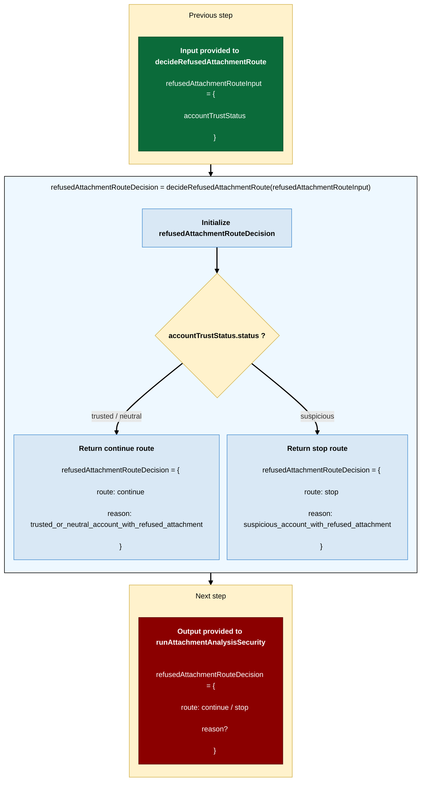

```mermaid
%%{init: {"flowchart": {"nodeSpacing": 14, "rankSpacing": 22, "subGraphTitleMargin": {"top": 10, "bottom": 25}}, "themeVariables": {"fontSize": "13px", "lineColor": "#000000"}}}%%
flowchart TB
  subgraph PREVIOUS_STEP["Previous step"]
    direction TB
    PREVIOUS_INPUTS["<b>Inputs provided to runAttachmentAnalysisSecurity</b><br/>
    attachmentAnalysisSecurityInput = {<br/>
    attachmentAnalysis<br/>
    accountTrustStatus<br/>
    latestUserMessageContent<br/>
    }<br/><br/>
    attachmentAnalysis was produced by runAttachmentAnalysis"]
  end

  subgraph PIPELINE["6.3 attachmentAnalysisSecurityDecision = runAttachmentAnalysisSecurity(attachmentAnalysisSecurityInput)"]
    direction TB

    T_INIT["<b>Initialize attachmentAnalysisSecurityDecision</b><br/>
    attachmentAnalysisSecurityDecision = {<br/>
    decision: { route: undefined }<br/>
    history: {<br/>
    checked: []<br/>
    failed: []<br/>
    llmReview: undefined<br/>
    }<br/>
    }"]

    T_FAILED_ROUTE{"<b>failed ?</b><br/>
    if attachmentAnalysis.status === failed"}

    T_FAILED_DECISION["<b>Add continue decision</b><br/>
    attachmentAnalysisSecurityDecision.decision.route = continue"]

    T_REFUSED_ROUTE{"<b>refused ?</b><br/>
    if attachmentAnalysis.status === refused"}

    T_REFUSED_INPUT["<b>Prepare refusedAttachmentRouteInput</b><br/>
    refusedAttachmentRouteInput = {<br/>
    attachmentAnalysis<br/>
    accountTrustStatus<br/>
    }"]

    subgraph REFUSED_ROUTE_DATA["refusedAttachmentRouteDecision = decideRefusedAttachmentRoute(refusedAttachmentRouteInput)"]
      direction LR
      REFUSED_ROUTE_INPUTS["<b>refusedAttachmentRouteInput</b><br/>
      attachmentAnalysis<br/>
      accountTrustStatus"]
      REFUSED_ROUTE_OUTPUTS["<b>Output</b><br/>
      refusedAttachmentRouteDecision = {<br/>
      route: continue / stop<br/>
      reason?<br/>
      checked<br/>
      failed<br/>
      }"]
      REFUSED_ROUTE_INPUTS --> REFUSED_ROUTE_OUTPUTS
    end

    T_REFUSED_ADD_RESULTS["<b>Add refused security results</b><br/>
    attachmentAnalysisSecurityDecision.history.checked +=<br/>
    refusedAttachmentRouteDecision.checked<br/><br/>
    attachmentAnalysisSecurityDecision.history.failed +=<br/>
    refusedAttachmentRouteDecision.failed"]

    T_REFUSED_ROUTE_DECISION{"<b>refusedAttachmentRouteDecision.route ?</b>"}

    T_REFUSED_CONTINUE["<b>Add continue decision</b><br/>
    attachmentAnalysisSecurityDecision.decision.route = continue"]

    T_REFUSED_STOP["<b>Add stop decision</b><br/>
    attachmentAnalysisSecurityDecision.decision.route = stop"]

    T_SUSPICIOUS_ROUTE{"<b>suspicious ?</b><br/>
    if attachmentAnalysis.status === suspicious"}

    T_SUSPICIOUS_REVIEW_INPUT["<b>Prepare suspiciousAttachmentReviewInput</b><br/>
    llmTrusterReviewInput = {<br/>
    reviewKind: attachment_analysis_suspicious<br/>
    attachmentAnalysisDescription<br/>
    attachmentAnalysisSuspicion: {<br/>
    status: suspicious<br/>
    reason?<br/>
    }<br/>
    accountTrustStatus<br/>
    latestUserMessageContent<br/>
    }"]

    T_TEXT_CHECKS_INPUT["<b>Prepare textSecurityChecksInput</b><br/>
    textSecurityChecksInput = {<br/>
    text: attachmentAnalysis[].analysis?.llmDescription<br/>
    }<br/><br/>
    Only attachments with analysis are used"]

    subgraph TEXT_CHECKS_DATA["textSecurityChecks = runTextSecurityChecks(textSecurityChecksInput)"]
      direction LR
      TEXT_CHECKS_INPUTS["<b>textSecurityChecksInput</b><br/>
      text"]
      TEXT_CHECKS_OUTPUTS["<b>Output</b><br/>
      textSecurityChecks = {<br/>
      checked<br/>
      failed<br/>
      }"]
      TEXT_CHECKS_INPUTS --> TEXT_CHECKS_OUTPUTS
    end

    T_ADD_TEXT_RESULTS["<b>Add text security results</b><br/>
    attachmentAnalysisSecurityDecision.history.checked +=<br/>
    textSecurityChecks.checked<br/><br/>
    attachmentAnalysisSecurityDecision.history.failed +=<br/>
    textSecurityChecks.failed"]

    T_TRUST_DECISION_INPUT["<b>Prepare trustDecisionInput</b><br/>
    trustDecisionInput = {<br/>
    textSecurityChecks<br/>
    accountTrustStatus<br/>
    }"]

    subgraph TRUST_DECISION_DATA["trustDecision = decideTextSecurityWithAccountTrust(trustDecisionInput)"]
      direction LR
      TRUST_DECISION_INPUTS["<b>trustDecisionInput</b><br/>
      textSecurityChecks<br/>
      accountTrustStatus"]
      TRUST_DECISION_OUTPUTS["<b>Output</b><br/>
      trustDecision = {<br/>
      route: continue / stop / review_with_llm_truster<br/>
      reason?<br/>
      }"]
      TRUST_DECISION_INPUTS --> TRUST_DECISION_OUTPUTS
    end

    T_TRUST_ROUTE_DECISION{"<b>trustDecision.route ?</b>"}

    T_TEXT_CONTINUE["<b>Add continue decision</b><br/>
    attachmentAnalysisSecurityDecision.decision.route = continue"]

    T_TEXT_STOP["<b>Add stop decision</b><br/>
    attachmentAnalysisSecurityDecision.decision.route = stop"]

    T_TEXT_REVIEW_INPUT["<b>Prepare textSecurityReviewInput</b><br/>
    llmTrusterReviewInput = {<br/>
    reviewKind: attachment_text_security_checks<br/>
    attachmentAnalysisDescription<br/>
    textSecurityChecks<br/>
    trustDecision: {<br/>
    route: review_with_llm_truster<br/>
    reason?<br/>
    }<br/>
    accountTrustStatus<br/>
    latestUserMessageContent<br/>
    }"]

    subgraph REVIEW_DATA["llmReview = runLlmTrusterReview(llmTrusterReviewInput)"]
      direction LR
      REVIEW_INPUTS["<b>llmTrusterReviewInput</b><br/>
      reviewKind<br/>
      attachmentAnalysisDescription<br/>
      accountTrustStatus<br/>
      latestUserMessageContent<br/>
      suspicion or textSecurityChecks"]
      REVIEW_OUTPUTS["<b>Output</b><br/>
      llmReview = {<br/>
      route: continue / stop / failed<br/>
      reason?: short LLM justification<br/>
      }"]
      REVIEW_INPUTS --> REVIEW_OUTPUTS
    end

    T_REVIEW_ROUTE{"<b>llmReview.route ?</b>"}

    T_REVIEW_CONTINUE["<b>Add review continue decision</b><br/>
    attachmentAnalysisSecurityDecision.decision.route = continue<br/>
    attachmentAnalysisSecurityDecision.history.llmReview = llmReview"]

    T_REVIEW_STOP["<b>Add review stop decision</b><br/>
    attachmentAnalysisSecurityDecision.decision.route = stop<br/>
    attachmentAnalysisSecurityDecision.history.llmReview = llmReview"]

    T_RETURN["<b>Return attachmentAnalysisSecurityDecision</b><br/>
    attachmentAnalysisSecurityDecision = {<br/>
    decision: { route: continue / stop }<br/>
    history: {<br/>
    checked: AttachmentAnalysisSecurityCheckName[]<br/>
    failed: AttachmentAnalysisSecurityCheckName[]<br/>
    llmReview?: {<br/>
    route: continue / stop / failed<br/>
    reason?<br/>
    }<br/>
    }<br/>
    }"]

    T_INIT --> T_FAILED_ROUTE

    T_FAILED_ROUTE -->|yes| T_FAILED_DECISION
    T_FAILED_DECISION --> T_RETURN

    T_FAILED_ROUTE -->|no| T_REFUSED_ROUTE

    T_REFUSED_ROUTE -->|yes| T_REFUSED_INPUT
    T_REFUSED_INPUT --> REFUSED_ROUTE_DATA
    REFUSED_ROUTE_DATA --> T_REFUSED_ADD_RESULTS
    T_REFUSED_ADD_RESULTS --> T_REFUSED_ROUTE_DECISION
    T_REFUSED_ROUTE_DECISION -->|continue| T_REFUSED_CONTINUE
    T_REFUSED_ROUTE_DECISION -->|stop| T_REFUSED_STOP
    T_REFUSED_CONTINUE --> T_RETURN
    T_REFUSED_STOP --> T_RETURN

    T_REFUSED_ROUTE -->|no| T_SUSPICIOUS_ROUTE
    T_SUSPICIOUS_ROUTE -->|yes| T_SUSPICIOUS_REVIEW_INPUT
    T_SUSPICIOUS_REVIEW_INPUT --> REVIEW_DATA

    T_SUSPICIOUS_ROUTE -->|no| T_TEXT_CHECKS_INPUT
    T_TEXT_CHECKS_INPUT --> TEXT_CHECKS_DATA
    TEXT_CHECKS_DATA --> T_ADD_TEXT_RESULTS
    T_ADD_TEXT_RESULTS --> T_TRUST_DECISION_INPUT
    T_TRUST_DECISION_INPUT --> TRUST_DECISION_DATA
    TRUST_DECISION_DATA --> T_TRUST_ROUTE_DECISION
    T_TRUST_ROUTE_DECISION -->|continue| T_TEXT_CONTINUE
    T_TRUST_ROUTE_DECISION -->|stop| T_TEXT_STOP
    T_TRUST_ROUTE_DECISION -->|review_with_llm_truster| T_TEXT_REVIEW_INPUT
    T_TEXT_CONTINUE --> T_RETURN
    T_TEXT_STOP --> T_RETURN
    T_TEXT_REVIEW_INPUT --> REVIEW_DATA

    REVIEW_DATA --> T_REVIEW_ROUTE
    T_REVIEW_ROUTE -->|continue| T_REVIEW_CONTINUE
    T_REVIEW_ROUTE -->|stop / failed| T_REVIEW_STOP
    T_REVIEW_CONTINUE --> T_RETURN
    T_REVIEW_STOP --> T_RETURN
  end

  subgraph NEXT_STEP["Next step"]
    direction TB
    NEXT_OUTPUTS["<b>Output provided to runMessageAnalysis</b><br/>
    attachmentAnalysisSecurityDecision"]
  end

  PREVIOUS_STEP --> PIPELINE
  PIPELINE --> NEXT_STEP

  classDef previousBlock fill:#0b6b3a,stroke:#064a28,color:#ffffff,stroke-width:1px;
  classDef inputBlock fill:#d5e8d4,stroke:#82b366,color:#000000,stroke-width:1px;
  classDef outputBlock fill:#f8cecc,stroke:#b85450,color:#000000,stroke-width:1px;
  classDef processingBlock fill:#d9e8f5,stroke:#4f93d2,color:#000000,stroke-width:1px;
  classDef nextOutputBlock fill:#8b0000,stroke:#5c0000,color:#ffffff,stroke-width:1px;

  class PREVIOUS_INPUTS previousBlock;

  class REFUSED_ROUTE_INPUTS,TEXT_CHECKS_INPUTS,TRUST_DECISION_INPUTS,REVIEW_INPUTS inputBlock;
  class REFUSED_ROUTE_OUTPUTS,TEXT_CHECKS_OUTPUTS,TRUST_DECISION_OUTPUTS,REVIEW_OUTPUTS outputBlock;

  class T_INIT,T_FAILED_ROUTE,T_FAILED_DECISION,T_REFUSED_ROUTE,T_REFUSED_INPUT,T_REFUSED_ADD_RESULTS,T_REFUSED_ROUTE_DECISION,T_REFUSED_CONTINUE,T_REFUSED_STOP,T_SUSPICIOUS_ROUTE,T_SUSPICIOUS_REVIEW_INPUT,T_TEXT_CHECKS_INPUT,T_ADD_TEXT_RESULTS,T_TRUST_DECISION_INPUT,T_TRUST_ROUTE_DECISION,T_TEXT_CONTINUE,T_TEXT_STOP,T_TEXT_REVIEW_INPUT,T_REVIEW_ROUTE,T_REVIEW_CONTINUE,T_REVIEW_STOP,T_RETURN processingBlock;

  class NEXT_OUTPUTS nextOutputBlock;

  style PIPELINE fill:#eef8ff,stroke:#000000,stroke-width:1px,color:#000000;
  style PREVIOUS_STEP fill:#fff2cc,stroke:#d6b656,stroke-width:1px,color:#000000;
  style NEXT_STEP fill:#fff2cc,stroke:#d6b656,stroke-width:1px,color:#000000;

  %% Helper functions
  style REFUSED_ROUTE_DATA fill:#333333,stroke:#333333,stroke-width:1px,color:#ffffff;
  style TEXT_CHECKS_DATA fill:#333333,stroke:#333333,stroke-width:1px,color:#ffffff;
  style TRUST_DECISION_DATA fill:#333333,stroke:#333333,stroke-width:1px,color:#ffffff;
  style REVIEW_DATA fill:#333333,stroke:#333333,stroke-width:1px,color:#ffffff;

  linkStyle default stroke:#000000,stroke-width:2px;
```

## decideRefusedAttachmentRoute

```mermaid
%%{init: {"flowchart": {"nodeSpacing": 14, "rankSpacing": 22, "subGraphTitleMargin": {"top": 10, "bottom": 25}}, "themeVariables": {"fontSize": "13px", "lineColor": "#000000"}}}%%
flowchart TB
  subgraph PREVIOUS_STEP_REFUSED["Previous step"]
    direction TB
    PREVIOUS_REFUSED_INPUTS["<b>Input provided to decideRefusedAttachmentRoute</b><br/>
    refusedAttachmentRouteInput = {<br/>
    accountTrustStatus<br/>
    }"]
  end

  subgraph PIPELINE_REFUSED["refusedAttachmentRouteDecision = decideRefusedAttachmentRoute(refusedAttachmentRouteInput)"]
    direction TB

    R_INIT["<b>Initialize refusedAttachmentRouteDecision</b>"]

    R_ACCOUNT_STATUS_ROUTE{"<b>accountTrustStatus.status ?</b>"}

    R_CONTINUE["<b>Return continue route</b><br/>
    refusedAttachmentRouteDecision = {<br/>
    route: continue<br/>
    reason: trusted_or_neutral_account_with_refused_attachment<br/>
    }"]

    R_STOP["<b>Return stop route</b><br/>
    refusedAttachmentRouteDecision = {<br/>
    route: stop<br/>
    reason: suspicious_account_with_refused_attachment<br/>
    }"]

    R_INIT --> R_ACCOUNT_STATUS_ROUTE
    R_ACCOUNT_STATUS_ROUTE -->|trusted / neutral| R_CONTINUE
    R_ACCOUNT_STATUS_ROUTE -->|suspicious| R_STOP
  end

  subgraph NEXT_STEP_REFUSED["Next step"]
    direction TB
    NEXT_REFUSED_OUTPUTS["<b>Output provided to runAttachmentAnalysisSecurity</b><br/>
    refusedAttachmentRouteDecision = {<br/>
    route: continue / stop<br/>
    reason?<br/>
    }"]
  end

  PREVIOUS_STEP_REFUSED --> PIPELINE_REFUSED
  PIPELINE_REFUSED --> NEXT_STEP_REFUSED

  classDef previousBlock fill:#0b6b3a,stroke:#064a28,color:#ffffff,stroke-width:1px;
  classDef inputBlock fill:#d5e8d4,stroke:#82b366,color:#000000,stroke-width:1px;
  classDef outputBlock fill:#f8cecc,stroke:#b85450,color:#000000,stroke-width:1px;
  classDef processingBlock fill:#d9e8f5,stroke:#4f93d2,color:#000000,stroke-width:1px;
  classDef nextOutputBlock fill:#8b0000,stroke:#5c0000,color:#ffffff,stroke-width:1px;

  class PREVIOUS_REFUSED_INPUTS previousBlock;
  class R_INIT,R_CONTINUE,R_STOP processingBlock;
  class NEXT_REFUSED_OUTPUTS nextOutputBlock;

  style PIPELINE_REFUSED fill:#eef8ff,stroke:#000000,stroke-width:1px,color:#000000;
  style PREVIOUS_STEP_REFUSED fill:#fff2cc,stroke:#d6b656,stroke-width:1px,color:#000000;
  style NEXT_STEP_REFUSED fill:#fff2cc,stroke:#d6b656,stroke-width:1px,color:#000000;
  style R_ACCOUNT_STATUS_ROUTE fill:#fff2cc,stroke:#d6b656,stroke-width:1px,color:#000000;

  linkStyle default stroke:#000000,stroke-width:2px;
```
