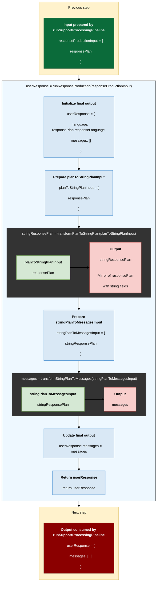
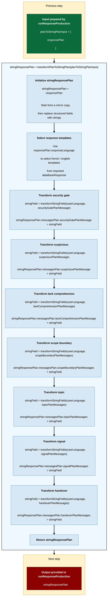
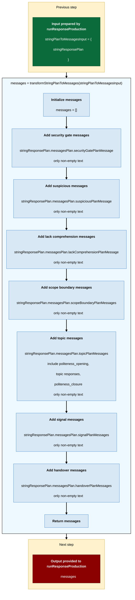

# Response Production Pipeline

## runResponseProductionPipeline

```mermaid
%%{init: {"flowchart": {"nodeSpacing": 14, "rankSpacing": 22, "subGraphTitleMargin": {"top": 10, "bottom": 25}}, "themeVariables": {"fontSize": "13px", "lineColor": "#000000"}}}%%
flowchart TB
  subgraph PREVIOUS_STEP["Previous step"]
    direction TB

    PREVIOUS_INPUTS["<b>Input prepared by runSupportProcessingPipeline</b><br/>
    responseProductionInput = {<br/>
    responsePlan<br/>
    }"]
  end

  subgraph PIPELINE["userResponse = runResponseProduction(responseProductionInput)"]
    direction TB

    T_INIT_OUTPUT["<b>Initialize final output</b><br/>
    userResponse = {<br/>
    language: responsePlan.responseLanguage,<br/>
    messages: []<br/>
    }"]

    T_PLAN_TO_STRING_INPUT["<b>Prepare planToStringPlanInput</b><br/>
    planToStringPlanInput = {<br/>
    responsePlan<br/>
    }"]

    subgraph PLAN_TO_STRING_DATA["stringResponsePlan = transformPlanToStringPlan(planToStringPlanInput)"]
      direction LR

      PLAN_TO_STRING_INPUTS["<b>planToStringPlanInput</b><br/>
      responsePlan"]

      PLAN_TO_STRING_OUTPUTS["<b>Output</b><br/>
      stringResponsePlan<br/><br/>
      Mirror of responsePlan<br/>
      with string fields"]

      PLAN_TO_STRING_INPUTS --> PLAN_TO_STRING_OUTPUTS
    end

    T_STRING_TO_MESSAGES_INPUT["<b>Prepare stringPlanToMessagesInput</b><br/>
    stringPlanToMessagesInput = {<br/>
    stringResponsePlan<br/>
    }"]

    subgraph STRING_TO_MESSAGES_DATA["messages = transformStringPlanToMessages(stringPlanToMessagesInput)"]
      direction LR

      STRING_TO_MESSAGES_INPUTS["<b>stringPlanToMessagesInput</b><br/>
      stringResponsePlan"]

      STRING_TO_MESSAGES_OUTPUTS["<b>Output</b><br/>
      messages"]

      STRING_TO_MESSAGES_INPUTS --> STRING_TO_MESSAGES_OUTPUTS
    end

    T_SET_MESSAGES["<b>Update final output</b><br/>
    userResponse.messages = messages"]

    T_RETURN["<b>Return userResponse</b><br/>
    return userResponse"]

    T_INIT_OUTPUT --> T_PLAN_TO_STRING_INPUT
    T_PLAN_TO_STRING_INPUT --> PLAN_TO_STRING_DATA
    PLAN_TO_STRING_DATA --> T_STRING_TO_MESSAGES_INPUT
    T_STRING_TO_MESSAGES_INPUT --> STRING_TO_MESSAGES_DATA
    STRING_TO_MESSAGES_DATA --> T_SET_MESSAGES
    T_SET_MESSAGES --> T_RETURN
  end

  subgraph NEXT_STEP["Next step"]
    direction TB

    NEXT_OUTPUTS["<b>Output consumed by runSupportProcessingPipeline</b><br/>
    userResponse = {<br/>
    messages: [...]<br/>
    }"]
  end

  PREVIOUS_STEP --> PIPELINE
  PIPELINE --> NEXT_STEP

  classDef previousBlock fill:#0b6b3a,stroke:#064a28,color:#ffffff,stroke-width:1px;
  classDef inputBlock fill:#d5e8d4,stroke:#82b366,color:#000000,stroke-width:1px;
  classDef outputBlock fill:#f8cecc,stroke:#b85450,color:#000000,stroke-width:1px;
  classDef processingBlock fill:#d9e8f5,stroke:#4f93d2,color:#000000,stroke-width:1px;
  classDef nextOutputBlock fill:#8b0000,stroke:#5c0000,color:#ffffff,stroke-width:1px;

  class PREVIOUS_INPUTS previousBlock;

  class PLAN_TO_STRING_INPUTS,STRING_TO_MESSAGES_INPUTS inputBlock;

  class PLAN_TO_STRING_OUTPUTS,STRING_TO_MESSAGES_OUTPUTS outputBlock;

  class T_INIT_OUTPUT,T_PLAN_TO_STRING_INPUT,T_STRING_TO_MESSAGES_INPUT,T_SET_MESSAGES,T_RETURN processingBlock;

  class NEXT_OUTPUTS nextOutputBlock;

  style PIPELINE fill:#eef8ff,stroke:#000000,stroke-width:1px,color:#000000;
  style PREVIOUS_STEP fill:#fff2cc,stroke:#d6b656,stroke-width:1px,color:#000000;
  style NEXT_STEP fill:#fff2cc,stroke:#d6b656,stroke-width:1px,color:#000000;
  style PLAN_TO_STRING_DATA fill:#333333,stroke:#333333,stroke-width:1px,color:#ffffff;
  style STRING_TO_MESSAGES_DATA fill:#333333,stroke:#333333,stroke-width:1px,color:#ffffff;

  linkStyle default stroke:#000000,stroke-width:2px;
```

## transformPlanToStringPlanPipeline

```mermaid
%%{init: {"flowchart": {"nodeSpacing": 14, "rankSpacing": 22, "subGraphTitleMargin": {"top": 10, "bottom": 25}}, "themeVariables": {"fontSize": "13px", "lineColor": "#000000"}}}%%
flowchart TB
  subgraph PREVIOUS_STEP["Previous step"]
    direction TB

    PREVIOUS_INPUTS["<b>Input prepared by runResponseProduction</b><br/>
    planToStringPlanInput = {<br/>
    responsePlan<br/>
    }"]
  end

  subgraph PIPELINE["stringResponsePlan = transformPlanToStringPlan(planToStringPlanInput)"]
    direction TB

    T_INIT["<b>Initialize stringResponsePlan</b><br/>
    stringResponsePlan = responsePlan<br/><br/>
    Start from a mirror copy,<br/>
    then replace structured fields with strings"]

    T_SELECT_LANGUAGE["<b>Select response templates</b><br/>
    Use responsePlan.responseLanguage<br/>
    to select french / english templates<br/>
    from imported dataBaseResponse"]

    T_SECURITY["<b>Transform security gate</b><br/>
    stringField = transformStringFields(userLanguage, securityGatePlanMessage)<br/>
    stringResponsePlan.messagesPlan.securityGatePlanMessage = stringField"]

    T_SUSPICIOUS["<b>Transform suspicious</b><br/>
    stringField = transformStringFields(userLanguage, suspiciousPlanMessage)<br/>
    stringResponsePlan.messagesPlan.suspiciousPlanMessage = stringField"]

    T_LACK["<b>Transform lack comprehension</b><br/>
    stringField = transformStringFields(userLanguage, lackComprehensionPlanMessage)<br/>
    stringResponsePlan.messagesPlan.lackComprehensionPlanMessage = stringField"]

    T_SCOPE["<b>Transform scope boundary</b><br/>
    stringField = transformStringFields(userLanguage, scopeBoundaryPlanMessages)<br/>
    stringResponsePlan.messagesPlan.scopeBoundaryPlanMessages = stringField"]

    T_TOPIC["<b>Transform topic</b><br/>
    stringField = transformStringFields(userLanguage, topicPlanMessages)<br/>
    stringResponsePlan.messagesPlan.topicPlanMessages = stringField"]

    T_SIGNAL["<b>Transform signal</b><br/>
    stringField = transformStringFields(userLanguage, signalPlanMessages)<br/>
    stringResponsePlan.messagesPlan.signalPlanMessages = stringField"]

    T_HANDOVER["<b>Transform handover</b><br/>
    stringField = transformStringFields(userLanguage, handoverPlanMessages)<br/>
    stringResponsePlan.messagesPlan.handoverPlanMessages = stringField"]

    T_RETURN["<b>Return stringResponsePlan</b>"]

    T_INIT --> T_SELECT_LANGUAGE
    T_SELECT_LANGUAGE --> T_SECURITY
    T_SECURITY --> T_SUSPICIOUS
    T_SUSPICIOUS --> T_LACK
    T_LACK --> T_SCOPE
    T_SCOPE --> T_TOPIC
    T_TOPIC --> T_SIGNAL
    T_SIGNAL --> T_HANDOVER
    T_HANDOVER --> T_RETURN
  end

  subgraph NEXT_STEP["Next step"]
    direction TB

    NEXT_OUTPUTS["<b>Output provided to runResponseProduction</b><br/>
    stringResponsePlan"]
  end

  PREVIOUS_STEP --> PIPELINE
  PIPELINE --> NEXT_STEP

  classDef previousBlock fill:#0b6b3a,stroke:#064a28,color:#ffffff,stroke-width:1px;
  classDef processingBlock fill:#d9e8f5,stroke:#4f93d2,color:#000000,stroke-width:1px;
  classDef nextOutputBlock fill:#8b0000,stroke:#5c0000,color:#ffffff,stroke-width:1px;

  class PREVIOUS_INPUTS previousBlock;

  class T_INIT,T_SELECT_LANGUAGE,T_SECURITY,T_SUSPICIOUS,T_LACK,T_SCOPE,T_TOPIC,T_SIGNAL,T_HANDOVER,T_RETURN processingBlock;

  class NEXT_OUTPUTS nextOutputBlock;

  style PIPELINE fill:#eef8ff,stroke:#000000,stroke-width:1px,color:#000000;
  style PREVIOUS_STEP fill:#fff2cc,stroke:#d6b656,stroke-width:1px,color:#000000;
  style NEXT_STEP fill:#fff2cc,stroke:#d6b656,stroke-width:1px,color:#000000;

  linkStyle default stroke:#000000,stroke-width:2px;
```

## transformStringPlanToMessagesPipeline

```mermaid
%%{init: {"flowchart": {"nodeSpacing": 14, "rankSpacing": 22, "subGraphTitleMargin": {"top": 10, "bottom": 25}}, "themeVariables": {"fontSize": "13px", "lineColor": "#000000"}}}%%
flowchart TB
  subgraph PREVIOUS_STEP["Previous step"]
    direction TB

    PREVIOUS_INPUTS["<b>Input prepared by runResponseProduction</b><br/>
    stringPlanToMessagesInput = {<br/>
    stringResponsePlan<br/>
    }"]
  end

  subgraph PIPELINE["messages = transformStringPlanToMessages(stringPlanToMessagesInput)"]
    direction TB

    T_INIT["<b>Initialize messages</b><br/>
    messages = []"]

    T_SECURITY["<b>Add security gate messages</b><br/>
    stringResponsePlan.messagesPlan.securityGatePlanMessage<br/>
    only non-empty text"]

    T_SUSPICIOUS["<b>Add suspicious messages</b><br/>
    stringResponsePlan.messagesPlan.suspiciousPlanMessage<br/>
    only non-empty text"]

    T_LACK["<b>Add lack comprehension messages</b><br/>
    stringResponsePlan.messagesPlan.lackComprehensionPlanMessage<br/>
    only non-empty text"]

    T_SCOPE["<b>Add scope boundary messages</b><br/>
    stringResponsePlan.messagesPlan.scopeBoundaryPlanMessages<br/>
    only non-empty text"]

    T_TOPIC["<b>Add topic messages</b><br/>
    stringResponsePlan.messagesPlan.topicPlanMessages<br/>
    include politeness_opening,<br/>
    topic responses,<br/>
    politeness_closure<br/>
    only non-empty text"]

    T_SIGNAL["<b>Add signal messages</b><br/>
    stringResponsePlan.messagesPlan.signalPlanMessages<br/>
    only non-empty text"]

    T_HANDOVER["<b>Add handover messages</b><br/>
    stringResponsePlan.messagesPlan.handoverPlanMessages<br/>
    only non-empty text"]

    T_RETURN["<b>Return messages</b>"]

    T_INIT --> T_SECURITY
    T_SECURITY --> T_SUSPICIOUS
    T_SUSPICIOUS --> T_LACK
    T_LACK --> T_SCOPE
    T_SCOPE --> T_TOPIC
    T_TOPIC --> T_SIGNAL
    T_SIGNAL --> T_HANDOVER
    T_HANDOVER --> T_RETURN
  end

  subgraph NEXT_STEP["Next step"]
    direction TB

    NEXT_OUTPUTS["<b>Output provided to runResponseProduction</b><br/>
    messages"]
  end

  PREVIOUS_STEP --> PIPELINE
  PIPELINE --> NEXT_STEP

  classDef previousBlock fill:#0b6b3a,stroke:#064a28,color:#ffffff,stroke-width:1px;
  classDef processingBlock fill:#d9e8f5,stroke:#4f93d2,color:#000000,stroke-width:1px;
  classDef nextOutputBlock fill:#8b0000,stroke:#5c0000,color:#ffffff,stroke-width:1px;

  class PREVIOUS_INPUTS previousBlock;

  class T_INIT,T_SECURITY,T_SUSPICIOUS,T_LACK,T_SCOPE,T_TOPIC,T_SIGNAL,T_HANDOVER,T_RETURN processingBlock;

  class NEXT_OUTPUTS nextOutputBlock;

  style PIPELINE fill:#eef8ff,stroke:#000000,stroke-width:1px,color:#000000;
  style PREVIOUS_STEP fill:#fff2cc,stroke:#d6b656,stroke-width:1px,color:#000000;
  style NEXT_STEP fill:#fff2cc,stroke:#d6b656,stroke-width:1px,color:#000000;

  linkStyle default stroke:#000000,stroke-width:2px;
```
