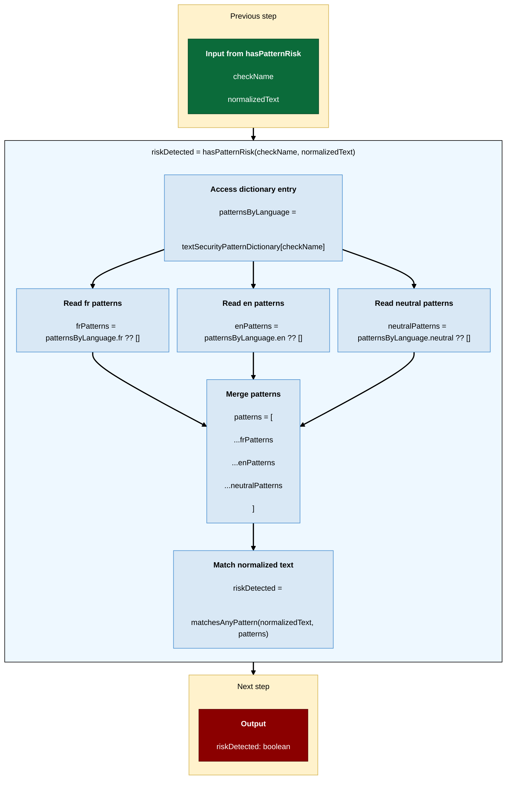
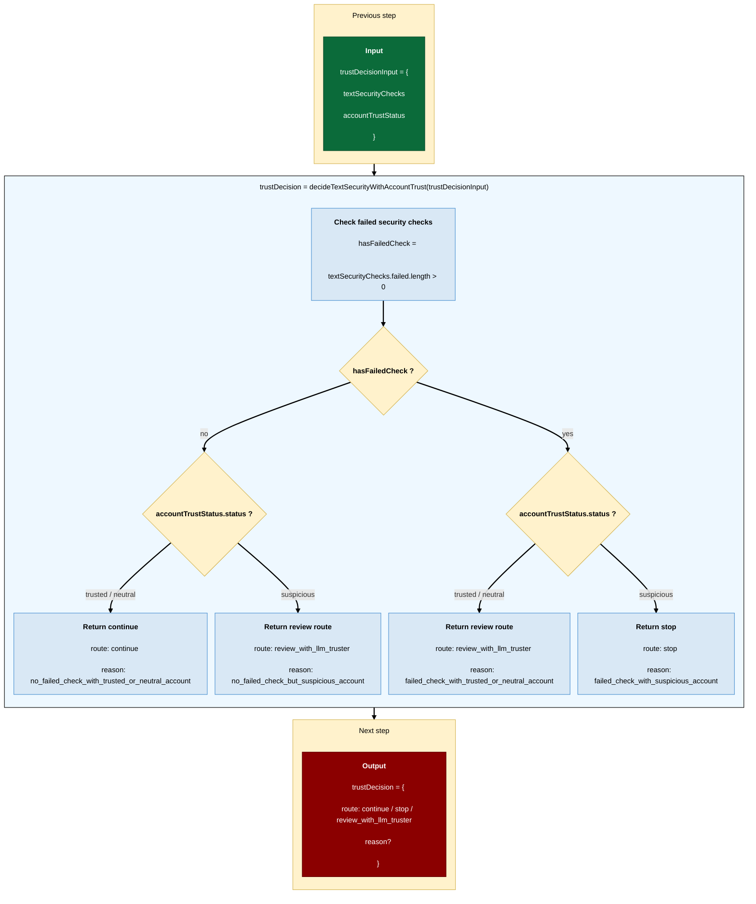
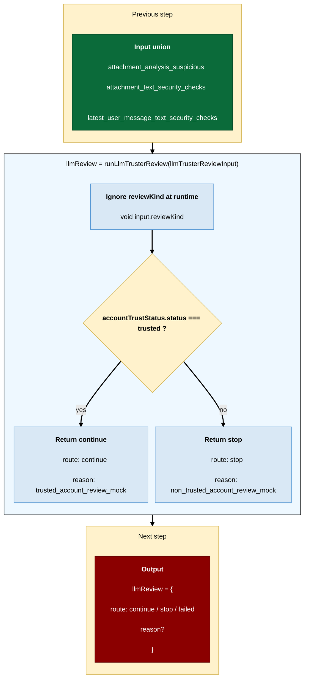

# Security shared functions

## runTextSecurityChecks

```mermaid
%%{init: {"flowchart": {"nodeSpacing": 14, "rankSpacing": 22, "subGraphTitleMargin": {"top": 10, "bottom": 25}}, "themeVariables": {"fontSize": "13px", "lineColor": "#000000"}}}%%
flowchart TB
  subgraph PREVIOUS_STEP["Previous step"]
    direction TB
    PREVIOUS_INPUTS["<b>Input</b><br/>
    textSecurityCheckInput = {<br/>
    text<br/>
    }"]
  end

  subgraph PIPELINE["textSecurityChecks = runTextSecurityChecks(textSecurityCheckInput)"]
    direction TB

    T_INIT["<b>Initialize output</b><br/>
    textSecurityChecks = {<br/>
    checked = []<br/>
    failed = []<br/>
    }"]

    T_NORMALIZE["<b>Normalize text</b><br/>
    normalizedText = normalizeSecurityText(text)<br/>
    trim, lowercase, remove accents"]

    T_TEST_DEFINITIONS["<b>Initialize tests list</b><br/>
    TEXT_SECURITY_TESTS = [<br/>
    { checkName, detectRisk(normalizedText) }<br/>
    ]"]

    subgraph TEXT_SECURITY_LOOP["For textSecurityTest in TEXT_SECURITY_TESTS"]
      direction TB

      T_DETECT_RISK["<b>Detect risk</b><br/>
      riskDetected =<br/>
      textSecurityTest.detectRisk(normalizedText)"]

      T_RISK_ROUTE{"<b>riskDetected ?</b>"}

      T_ADD_FAILED["<b>Add failed</b><br/>
      failed += textSecurityTest.checkName"]

      T_ADD_CHECKED["<b>Add checked</b><br/>
      checked += textSecurityTest.checkName"]

      T_NEXT_TEST["<b>Continue loop</b><br/>
      next textSecurityTest"]

      T_DETECT_RISK --> T_RISK_ROUTE
      T_RISK_ROUTE -->|yes| T_ADD_FAILED
      T_RISK_ROUTE -->|no| T_ADD_CHECKED
      T_ADD_FAILED --> T_NEXT_TEST
      T_ADD_CHECKED --> T_NEXT_TEST
    end

    T_RETURN["<b>Return textSecurityChecks</b><br/>
    checked<br/>
    failed"]

    T_INIT --> T_NORMALIZE
    T_NORMALIZE --> T_TEST_DEFINITIONS
    T_TEST_DEFINITIONS --> TEXT_SECURITY_LOOP
    TEXT_SECURITY_LOOP --> T_RETURN
  end

  subgraph NEXT_STEP["Next step"]
    direction TB
    NEXT_OUTPUTS["<b>Output</b><br/>
    textSecurityChecks = {<br/>
    checked<br/>
    failed<br/>
    }"]
  end

  PREVIOUS_STEP --> PIPELINE
  PIPELINE --> NEXT_STEP

  classDef previousBlock fill:#0b6b3a,stroke:#064a28,color:#ffffff,stroke-width:1px;
  classDef inputBlock fill:#d5e8d4,stroke:#82b366,color:#000000,stroke-width:1px;
  classDef outputBlock fill:#f8cecc,stroke:#b85450,color:#000000,stroke-width:1px;
  classDef processingBlock fill:#d9e8f5,stroke:#4f93d2,color:#000000,stroke-width:1px;
  classDef nextOutputBlock fill:#8b0000,stroke:#5c0000,color:#ffffff,stroke-width:1px;

  class PREVIOUS_INPUTS previousBlock;
  class T_INIT,T_NORMALIZE,T_TEST_DEFINITIONS,T_DETECT_RISK,T_ADD_FAILED,T_ADD_CHECKED,T_NEXT_TEST,T_RETURN processingBlock;
  class NEXT_OUTPUTS nextOutputBlock;

  style PIPELINE fill:#eef8ff,stroke:#000000,stroke-width:1px,color:#000000;
  style PREVIOUS_STEP fill:#fff2cc,stroke:#d6b656,stroke-width:1px,color:#000000;
  style NEXT_STEP fill:#fff2cc,stroke:#d6b656,stroke-width:1px,color:#000000;
  style TEXT_SECURITY_LOOP fill:#333333,stroke:#333333,stroke-width:1px,color:#ffffff;
  style T_RISK_ROUTE fill:#fff2cc,stroke:#d6b656,stroke-width:1px,color:#000000;

  linkStyle default stroke:#000000,stroke-width:2px;
```



Notes:
- `detectRisk` returns true when the current check detects a security risk.
- If risk is detected, the check goes to `failed`; otherwise it goes to `checked`.
- Pattern checks use `hasPatternRisk`, which calls `getPatternsForCheck` and `matchesAnyPattern`.
- `getPatternsForCheck(checkName)` loads regex patterns from `textSecurityPatternDictionary[checkName]`.
- URL/link detection is not pattern-category based: any detected URL/link fails `suspicious_link_or_url`.
- `spam_like_text` is only based on spam patterns, not on URL count.
- `checked` means the check passed; `failed` means the check detected an issue.
- `empty_text` et `too_short_or_noise_only` ne sont pas présents dans le code actuel.
- `excessive_repetition` ne vient pas de `textSecurityPatternDictionary` : il est calculé par `hasExcessiveRepetition`.

## textSecurityPatternDictionary



Structure:

```ts
type TextSecurityPatternDictionary = Partial<
  Record<
    TextSecurityCheckName,
    {
      fr?: RegExp[];
      en?: RegExp[];
      neutral?: RegExp[];
    }
  >
>;
```

| checkName | in dictionary? | fr | en | neutral | used by |
| --------- | ------------ | -- | -- | ------- | ------- |
| `prompt_injection_attempt` | yes | RegExp[] | RegExp[] | RegExp[] | `hasPatternRisk` |
| `internal_information_request` | yes | RegExp[] | RegExp[] | RegExp[] | `hasPatternRisk` |
| `sensitive_data_request` | yes | RegExp[] | RegExp[] | RegExp[] | `hasPatternRisk` |
| `credential_or_secret_leak` | yes | RegExp[] | RegExp[] | RegExp[] | `hasPatternRisk` |
| `spam_like_text` | yes | RegExp[] | RegExp[] | RegExp[] | `hasPatternRisk` |
| `unsafe_or_suspicious_content` | yes | RegExp[] | RegExp[] | RegExp[] | `hasPatternRisk` |
| `suspicious_link_or_url` | no | - | - | - | `hasUrlOrLink` |
| `excessive_repetition` | no | - | - | - | `hasExcessiveRepetition` |

Notes:
- `textSecurityPatternDictionary` only stores pattern-based checks.
- `suspicious_link_or_url` is not in the pattern dictionary because it is detected by `hasUrlOrLink`.
- `excessive_repetition` is not in the pattern dictionary because it is detected by `hasExcessiveRepetition`.
- `getPatternsForCheck(checkName)` flattens `fr`, `en`, and `neutral` arrays into one `RegExp[]` before matching.
- No language detection is performed.
- All available patterns are tested because user messages can mix French and English.
- Patterns should be compatible with normalized text: lowercase and accentless.

## decideTextSecurityWithAccountTrust



## runLlmTrusterReview



Note : the output type allows `failed`, but the current mock does not produce `failed`.
