# Support Processing Pipeline

This document describes the support processing pipeline, its main execution steps, and the data exchanged between each module.

The Mermaid diagram gives a high-level view of the pipeline execution flow. The following sections define the expected data format for each input, intermediate output, and final output used by the pipeline.

---

## Pipeline overview

```mermaid
%%{init: {"flowchart": {"nodeSpacing": 14, "rankSpacing": 22, "subGraphTitleMargin": {"top": 10, "bottom": 25}}, "themeVariables": {"fontSize": "13px", "lineColor": "#000000"}}}%%
flowchart TB
  %% =====================================================
  %% PREVIOUS STEP DATA
  %% =====================================================

  subgraph PREVIOUS_STEP["Previous step"]
    direction TB

    PREVIOUS_INPUTS["<b>Inputs provided to runSupportProcessingPipeline</b><br/>
    1. latestUserMessage, 2. latestUserAttachments, 3.1 accountTrustStatus,<br/>
    3.2 accountProfile, 3.3 accountInteractionTraits,<br/>
    4. supportTopicKnowledge, 5. conversationHistory"]
  end

  %% =====================================================
  %% SUPPORT PROCESSING PIPELINE
  %% =====================================================

  subgraph PIPELINE["{ userResponse, patches } = runSupportProcessingPipeline(inputSupportProcessingPipeline)"]
    direction TB

    T0["<b>Prepare messageAnalysisInput</b><br/>
    Destructure pipeline input<br/>
    messageAnalysisInput = { latestUserMessage, latestUserAttachments,<br/>
    accountTrustStatus, supportTopicKnowledge, conversationHistory }"]

    subgraph MA_DATA["turnUnderstandingDelta = runMessageAnalysis(messageAnalysisInput)"]
      direction LR

      MA_INPUTS["<b>messageAnalysisInput</b><br/>
      latestUserMessage, latestUserAttachments,<br/>
      accountTrustStatus, supportTopicKnowledge, conversationHistory"]

      MA_OUTPUTS["<b>Output</b><br/>
      6. turnUnderstandingDelta"]

      MA_INPUTS --> MA_OUTPUTS
    end

    T1{"<b>if</b><br/>
    turnUnderstandingDelta.segments_topic.length !== 0"}

    T_SD_INPUT["<b>Prepare searchDecisionInput</b><br/>
    searchDecisionInput = { supportTopicKnowledge, turnUnderstandingDelta }"]

    subgraph SD_DATA["decisionSearchingSolution = runSearchDecision(searchDecisionInput)"]
      direction LR

      SD_INPUTS["<b>searchDecisionInput</b><br/>
      supportTopicKnowledge, turnUnderstandingDelta"]

      SD_OUTPUTS["<b>Output</b><br/>
      7. decisionSearchingSolution"]

      SD_INPUTS --> SD_OUTPUTS
    end

    T2{"<b>if</b><br/>
    decisionSearchingSolution.shouldSearchSolution === true"}

    T_SR_INPUT["<b>Prepare solutionRetrievalInput</b><br/>
    solutionRetrievalInput = { supportTopicKnowledge, turnUnderstandingDelta }"]

    subgraph SR_DATA["possibleSolutions = runSolutionRetrieval(solutionRetrievalInput)"]
      direction LR

      SR_INPUTS["<b>solutionRetrievalInput</b><br/>
      supportTopicKnowledge, turnUnderstandingDelta"]

      SR_OUTPUTS["<b>Output</b><br/>
      8. possibleSolutions"]

      SR_INPUTS --> SR_OUTPUTS
    end

    T3["<b>Prepare responseDecisionInput</b><br/>
    responseDecisionInput = { accountTrustStatus, accountProfile,<br/>
    accountInteractionTraits, supportTopicKnowledge,<br/>
    turnUnderstandingDelta, possibleSolutions }"]

    subgraph RD_DATA["responsePlan = runResponseDecision(responseDecisionInput)"]
      direction LR

      RD_INPUTS["<b>responseDecisionInput</b><br/>
      accountTrustStatus, accountProfile, accountInteractionTraits,<br/>
      supportTopicKnowledge, turnUnderstandingDelta, possibleSolutions"]

      RD_OUTPUTS["<b>Output</b><br/>
      9. responsePlan"]

      RD_INPUTS --> RD_OUTPUTS
    end

    T4["<b>Prepare responseProductionInput</b><br/>
    responseProductionInput = { responsePlan }"]

    subgraph RP_DATA["userResponse = runResponseProduction(responseProductionInput)"]
      direction LR

      RP_INPUTS["<b>responseProductionInput</b><br/>
      responsePlan"]

      RP_OUTPUTS["<b>Output</b><br/>
      10. userResponse"]

      RP_INPUTS --> RP_OUTPUTS
    end

    T5["<b>Prepare dataProductionInput</b><br/>
    dataProductionInput = { turnUnderstandingDelta, responsePlan }"]

    subgraph DP_DATA["dataProductionOutput = runDataProduction(dataProductionInput)"]
      direction LR

      DP_INPUTS["<b>dataProductionInput</b><br/>
      turnUnderstandingDelta, responsePlan"]

      DP_OUTPUTS["<b>Output</b><br/>
      11.1 supportTopicKnowledgePatch, 11.2 conversationHistoryPatch,<br/>
      3.1 accountTrustStatusPatch, 3.3 accountInteractionTraitsPatch"]

      DP_INPUTS --> DP_OUTPUTS
    end

    T6["<b>Return final pipeline output</b><br/>
    return { userResponse, patches: {<br/>
    supportTopicKnowledgePatch, conversationHistoryPatch,<br/>
    accountTrustStatusPatch, accountInteractionTraitsPatch<br/>
    } }"]

    T0 --> MA_DATA
    MA_DATA --> T1

    T1 -->|true| T_SD_INPUT
    T1 -.->|false<br/>signal / scope only| T3

    T_SD_INPUT --> SD_DATA
    SD_DATA --> T2

    T2 -->|true| T_SR_INPUT
    T2 -.->|false<br/>no retrieval| T3

    T_SR_INPUT --> SR_DATA
    SR_DATA --> T3
    T3 --> RD_DATA
    RD_DATA --> T4
    T4 --> RP_DATA
    RP_DATA --> T5
    T5 --> DP_DATA
    DP_DATA --> T6
  end

  %% =====================================================
  %% NEXT STEP
  %% =====================================================

  subgraph NEXT_STEP["Next step"]
    direction TB

    NEXT_OUTPUTS["<b>Outputs produced by runSupportProcessingPipeline</b><br/>
    10. userResponse, 11.1 supportTopicKnowledgePatch,<br/>
    11.2 conversationHistoryPatch, 3.1 accountTrustStatusPatch,<br/>
    3.3 accountInteractionTraitsPatch"]
  end

  PREVIOUS_STEP --> PIPELINE
  PIPELINE --> NEXT_STEP

  %% =====================================================
  %% STYLES
  %% =====================================================

  classDef previousBlock fill:#0b6b3a,stroke:#064a28,color:#ffffff,stroke-width:1px;
  classDef inputBlock fill:#d5e8d4,stroke:#82b366,color:#000000,stroke-width:1px;
  classDef outputBlock fill:#f8cecc,stroke:#b85450,color:#000000,stroke-width:1px;
  classDef processingBlock fill:#d9e8f5,stroke:#4f93d2,color:#000000,stroke-width:1px;
  classDef nextOutputBlock fill:#8b0000,stroke:#5c0000,color:#ffffff,stroke-width:1px;

  class PREVIOUS_INPUTS previousBlock;

  class MA_INPUTS,SD_INPUTS,SR_INPUTS,RD_INPUTS,RP_INPUTS,DP_INPUTS inputBlock;
  class MA_OUTPUTS,SD_OUTPUTS,SR_OUTPUTS,RD_OUTPUTS,RP_OUTPUTS,DP_OUTPUTS outputBlock;

  class T0,T1,T_SD_INPUT,T2,T_SR_INPUT,T3,T4,T5,T6 processingBlock;
  class NEXT_OUTPUTS nextOutputBlock;

  style PIPELINE fill:#eef8ff,stroke:#000000,stroke-width:1px,color:#000000;
  style PREVIOUS_STEP fill:#fff2cc,stroke:#d6b656,stroke-width:1px,color:#000000;
  style NEXT_STEP fill:#fff2cc,stroke:#d6b656,stroke-width:1px,color:#000000;

  linkStyle default stroke:#000000,stroke-width:2px;
```



## Data contracts and examples

This section describes each variable used in the pipeline.

The examples are intentionally concrete and should be updated when the real production data model becomes clearer.

---

### 1. `latestUserMessage`

```ts
const latestUserMessage = {
  id: "msg_001",
  content: "I cannot access my account anymore. It says my subscription is inactive.",
  channel: "twake_chat",
  sentAt: "2026-05-12T08:30:00.000Z"
};
```

Possible values for `channel`:

```ts
type SupportChannel = "email" | "twake_chat" | "other";
```

---

### 2. `latestUserAttachments`

```ts
const latestUserAttachments = [
  {
    id: "att_001",
    filename: "error-screenshot.png",
    sizeInBytes: 348000,
    accessUrl: "https://storage.example.com/signed-url/example",
    source: "twake_chat",
    uploadedAt: "2026-05-12T08:30:00.000Z"
  }
];
```

Possible values for `source`:

```ts
type AttachmentSource = "email" | "twake_chat" | "manual_upload" | "other";
```

---

### 3.1 `accountTrustStatus`

Calculated from interaction and metadata.

```ts
const accountTrustStatus = {
  status: "trusted",
  reasons: [
    "longHistory",
    "noSuspiciousActivity",
    "payingCustomer",
    "highValueAccount",
    "legitimateSupportInteractions"
  ],
  lastUpdatedAt: "2026-05-12T08:00:00.000Z"
};
```

Possible values for `status`:

```ts
type AccountTrustStatusValue = "trusted" | "neutral" | "suspicious";
```

Possible values for `reasons`:

```ts
type AccountTrustReason =
  | "longHistory"
  | "noSuspiciousActivity"
  | "payingCustomer"
  | "highValueAccount"
  | "legitimateSupportInteractions"
  | "repeatedValidIssues"
  | "verifiedEmailDomain"
  | "recentAccountCreation"
  | "suspiciousActivity"
  | "paymentFailure"
  | "abusiveBehavior"
  | "unknown";
```

---

### 3.2 `accountProfile`

Only metadata.

```ts
const accountProfile = {
  accountType: "individual",

  actualPlan: "paid",

  paymentStatus: "up_to_date",

  planHistory: [
    {
      plan: "free",
      startedAt: "2021-06-22T00:00:00.000Z",
      endedAt: "2021-08-12T00:00:00.000Z"
    },
    {
      plan: "paid",
      startedAt: "2021-08-12T00:00:00.000Z",
      endedAt: null
    }
  ],

  createdAt: "2021-06-22T00:00:00.000Z",

  daysSinceCreation: 1786
};
```

Possible values for `accountType`:

```ts
type AccountType = "individual" | "company";
```

Possible values for `actualPlan` and `planHistory.plan`:

```ts
type AccountPlan = "free" | "paid" | "custom";
```

Possible values for `paymentStatus`:

```ts
type PaymentStatus =
  | "up_to_date"
  | "late"
  | "failed"
  | "refunded"
  | "unknown";
```

---

### 3.3 `accountInteractionTraits`

Calculated from support interaction.

```ts
const accountInteractionTraits = {
  labels: [
    "autonomous",
    "satisfied"
  ],
  lastUpdatedAt: "2026-05-12T08:00:00.000Z"
};
```

Possible values for `labels`:

```ts
type AccountInteractionTrait =
  | "autonomous"
  | "needsGuidance"
  | "complicated"
  | "satisfied"
  | "unsatisfied"
  | "impatient"
  | "technical"
  | "nonTechnical"
  | "recurrentRequester"
  | "atRisk";
```

---

### 4. `supportTopicKnowledge`

Represents known support-related topic information available before processing the latest user message.

This object only stores topic knowledge. It does not store signals, scope boundaries, user language, or warning comprehension. Those belong to the turn analysis output, not to the persistent support topic knowledge.

In the case of a new ticket, `supportTopicKnowledge.segments_topic` is usually built from the topic segments extracted by `runMessageAnalysis`.

In the case of an ongoing discussion, `supportTopicKnowledge.segments_topic` represents the synthesized topic knowledge already known before analyzing the latest user message.

```ts
const supportTopicKnowledge = {
  segments_topic: [
    {
      matched_historical_topic: "no",
      id_topic: 1,
      topic_category: "bug",
      tool_or_product: "Cozy Drive",
      topic_action: "create",
      topic_object: "folder",
      topic_label: "Cozy Drive : create : folder",
      topic_details: {
        feature_or_page: "folder creation",
        provided_url: "samo.mycozy.cloud",
        pre_problem_state: "was logged in and folder creation worked before",
        observed_result: "nothing happens",
        expected_result: "folder should be created",
        platform: "web",
        browser: "Firefox",
        trigger_action: "click Créer un dossier",
        frequency: "since this morning",
        additional_context: "user wants to create a folder for invoices"
      },
      tested_action: "refresh the page",
      outcome_tested_action: "failed",
      user_goal:
        "Cozy Drive : create : folder — user cannot create a folder on samo.mycozy.cloud with Firefox; refreshing the page failed.",
      blocking_issue: "yes"
    }
  ]
};
```

#### Type definition

```ts
type SupportTopicKnowledge = {
  segments_topic: SupportTopicSegment[];
};

type SupportTopicSegment = {
  matched_historical_topic: "yes" | "no";
  id_topic: number;
  topic_category: TopicCategory;
  tool_or_product?: string;
  topic_action?: string;
  topic_object?: string;
  topic_label?: string;
  topic_details: TopicDetails;
  tested_action?: string;
  outcome_tested_action?: OutcomeTestedAction;
  user_goal: string;
  blocking_issue: "yes" | "no";
};

type TopicCategory =
  | "billing"
  | "access_security"
  | "bug"
  | "request"
  | "question_faq"
  | "other";

type OutcomeTestedAction =
  | "worked"
  | "failed"
  | "partially_worked"
  | "not_tried"
  | "unclear";

type TopicDetails =
  | BugTopicDetails
  | AccessSecurityTopicDetails
  | BillingTopicDetails
  | RequestTopicDetails
  | QuestionFaqTopicDetails
  | OtherTopicDetails;

type CommonTopicDetails = {
  feature_or_page?: string;
  provided_url?: string;
  pre_problem_state?: string;
  observed_result?: string;
  expected_result?: string;
  error_message?: string;
  platform?: string;
  account_context?: string;
  frequency?: string;
  affected_scope?: string;
  additional_context?: string;
};

type BugTopicDetails = CommonTopicDetails & {
  trigger_action?: string;
  os?: string;
  device?: string;
  browser?: string;
  app_version?: string;
  server_or_instance?: string;
  affected_users?: string;
  video_available?: "yes" | "no";
  logs_available?: "yes" | "no";
};

type AccessSecurityTopicDetails = CommonTopicDetails & {
  access_action?: string;
  auth_method?: string;
  os?: string;
  device?: string;
  browser?: string;
  app_version?: string;
};

type BillingTopicDetails = CommonTopicDetails & {
  billing_issue_type?: string;
  billing_provider?: string;
  offer_or_plan?: string;
  amount?: string;
  currency?: string;
  billing_date_or_period?: string;
};

type RequestTopicDetails = CommonTopicDetails & {
  gap_observed?: string;
};

type QuestionFaqTopicDetails = CommonTopicDetails & {
  question_intent?: "how_to" | "is_it_possible" | "future_availability";
};

type OtherTopicDetails = CommonTopicDetails;
```

---

### 5. `conversationHistory`

Represents the previous structured steps in the conversation.

The goal is to keep a compact log of what was understood from user messages and what the bot planned to answer.

The log should not create new semantic fields. It should reuse the useful parts of existing pipeline objects:
- `TurnUnderstandingDelta` for user messages;
- `responsePlan` for bot messages.

```ts
const conversationHistory = [
  {
    id: "event_001",
    message_id: "msg_user_001",
    role: "user",
    created_at: "2026-05-12T08:30:00.000Z",
    turnUnderstandingDelta: {
      user_language: "fr",
      warning_comprehension: "no",
      segments_topic: [
        {
          matched_historical_topic: "no",
          id_topic: 1,
          topic_category: "bug",
          tool_or_product: "Cozy Drive",
          topic_action: "create",
          topic_object: "folder",
          topic_label: "Cozy Drive : create : folder",
          topic_details: {
            feature_or_page: "folder creation",
            provided_url: "samo.mycozy.cloud",
            observed_result: "nothing happens",
            expected_result: "folder should be created",
            platform: "web",
            browser: "Firefox",
            trigger_action: "click Créer un dossier"
          },
          user_goal:
            "Cozy Drive : create : folder — user cannot create a folder on samo.mycozy.cloud with Firefox.",
          blocking_issue: "yes"
        }
      ],
      segments_signal: [],
      segments_scope_boundary: []
    }
  },
  {
    id: "event_002",
    message_id: "msg_bot_001",
    role: "bot",
    created_at: "2026-05-12T08:31:00.000Z",
    responsePlan: {
      userLanguage: "english",
      messages: [
        {
          type: "normal",
          response_structure: {
            politeness_opening: "understanding_1",
            topic_relation_acknowledgement: {
              new_topics_count: 1,
              existing_topic_ids: []
            },
            topic_response: {
              topic_id: 1,
              topic_category: "bug",
              topic_label: "Cozy Drive : create : folder",
              updated_fields_acknowledgement: {
                observed_result: "nothing happens",
                expected_result: "folder should be created",
                browser: "Firefox"
              },
              main_response: {
                type: "ask_info",
                fields_requested: ["os", "device", "browser_version"]
              },
              next_step: "wait_for_user"
            },
            politeness_closure: "thanks_for_cooperation"
          }
        }
      ]
    }
  }
];
```

#### Type definition

```ts
type ConversationRole = "user" | "bot" | "system";

type ConversationActionVerb =
  | "add_topic"
  | "update_topic"
  | "ask_info"
  | "provide_info"
  | "confirm_info"
  | "resolve_topic"
  | "suggest_solution"
  | "escalate_topic"
  | "close_conversation"
  | "add_signal"
  | "add_scope_boundary";

type SignalType =
  | "thanks_neutral"
  | "thanks_positive"
  | "positive_feedback"
  | "negative_feedback"
  | "disappointment"
  | "churn_intent"
  | "waiting"
  | "apology"
  | "closure"
  | "time_sensitive"
  | "impolite"
  | "complaint_without_actionable_detail"
  | "communication_feedback"
  | "pricing_feedback"
  | "feature_loss_feedback"
  | "confirmation_without_new_field";

type ScopeBoundaryType =
  | "generic_out_of_scope"
  | "non_support_linagora"
  | "unrelated_request"
  | "spam_or_commercial";
```

---

### 6. `TurnUnderstandingDelta`

Produced by `runMessageAnalysis.ts`.

It represents what the system newly understood from the latest user message.

Unlike `supportTopicKnowledge`, this object is not the persistent knowledge state. It is a delta: it only contains the real new information understood from the latest user message.

This is the cleaned and corrected version after LLM analysis. It is not the raw LLM output. The raw output should be validated, normalized, corrected, and stripped from unsupported or duplicated information before becoming a `TurnUnderstandingDelta`.

For example, assume the existing `supportTopicKnowledge` already contains the topic in #5.

Then the latest user message could be:

```txt
Ça le fait à chaque fois maintenant, c'est vraiment pénible. J'ai aussi essayé depuis Chrome et ça ne marche pas non plus. Par contre je ne parle pas du partage de dossier, seulement de la création de dossier.
```

The corresponding `TurnUnderstandingDelta` would be:

```ts
const TurnUnderstandingDelta = {
  user_language: "fr",
  warning_comprehension: "no",
  segments_topic: [
    {
      matched_historical_topic: "yes",
      id_topic: 1,
      topic_details: {
        frequency: "each time",
        affected_scope: "Firefox and Chrome"
      },
      tested_action: "try from Chrome",
      outcome_tested_action: "failed",
      user_goal:
        "Cozy Drive : create : folder — user cannot create a folder on samo.mycozy.cloud with Firefox or Chrome; refreshing the page and trying Chrome failed.",
      blocking_issue: "yes"
    }
  ],
  segments_signal: [
    {
      signal_verbatim: "c'est vraiment pénible",
      signal_types: ["negative_feedback", "disappointment"]
    }
  ],
  segments_scope_boundary: [
    {
      signal_verbatim:
        "je ne parle pas du partage de dossier, seulement de la création de dossier",
      scope_boundary_type: "exclude_topic"
    }
  ]
};
```

#### Fields added compared to `supportTopicKnowledge`

`TurnUnderstandingDelta` can contain fields that are not part of persistent topic knowledge:

```ts
type TurnUnderstandingDelta = {
  user_language: string;
  warning_comprehension: "yes" | "no";
  segments_topic: TurnUnderstandingTopicSegment[];
  segments_signal: SignalSegment[];
  segments_scope_boundary?: ScopeBoundarySegment[];
};
```

#### `user_language`

The language detected in the latest user message.

```ts
user_language: "fr"
```

#### `warning_comprehension`

Indicates whether the latest message was unclear and whether the analysis may be incomplete.

```ts
warning_comprehension: "no"
```

Use `"yes"` when the message is ambiguous enough that the system should avoid treating the unclear part as a reliable topic.

#### `segments_topic`

Contains only the new topic-related information understood from the latest message.

For a matched historical topic, it should not repeat the full previous topic. It should only include:

```ts
type TurnUnderstandingTopicSegment = {
  matched_historical_topic: "yes" | "no";
  id_topic: number;
  topic_category?: TopicCategory;
  tool_or_product?: string;
  topic_action?: string;
  topic_object?: string;
  topic_label?: string;
  topic_details?: Partial<TopicDetails>;
  tested_action?: string;
  outcome_tested_action?: OutcomeTestedAction;
  user_goal?: string;
  blocking_issue?: "yes" | "no";
};
```

For a matched topic:

```ts
matched_historical_topic: "yes"
```

means the segment updates an existing topic from `supportTopicKnowledge`.

For a new topic:

```ts
matched_historical_topic: "no"
```

means a new topic should be added to `supportTopicKnowledge`.

#### `segments_signal`

Contains user signals that are useful for response tone or support handling, but are not support topics themselves.

A signal segment must only be created when the latest user message contains an explicit signal matching one of the allowed `signal_types`.

If no allowed value fits, the signal segment must be omitted entirely.

```ts
type SignalSegment = {
  signal_verbatim: string;
  signal_types: SignalType[];
};

type SignalType =
  | "thanks_neutral"
  | "thanks_positive"
  | "positive_feedback"
  | "negative_feedback"
  | "disappointment"
  | "churn_intent"
  | "waiting"
  | "apology"
  | "closure"
  | "time_sensitive"
  | "impolite"
  | "complaint_without_actionable_detail"
  | "communication_feedback"
  | "pricing_feedback"
  | "feature_loss_feedback"
  | "confirmation_without_new_field";
```

Example:

```ts
segments_signal: [
  {
    signal_verbatim: "c'est vraiment pénible",
    signal_types: ["negative_feedback", "disappointment"]
  }
]
```

#### `segments_scope_boundary`

Contains information indicating that the user message, or part of it, is outside the support scope.

A scope boundary segment must only be created when the message contains an explicit out-of-scope or unrelated element.

```ts
type ScopeBoundarySegment = {
  signal_verbatim: string;
  scope_boundary_type: ScopeBoundaryType;
};

type ScopeBoundaryType =
  | "generic_out_of_scope"
  | "non_support_linagora"
  | "unrelated_request"
  | "spam_or_commercial";
```

Example:

```ts
segments_scope_boundary: [
  {
    signal_verbatim: "je veux aussi que vous me fassiez un devis pour refaire mon site web",
    scope_boundary_type: "unrelated_request"
  }
]
```

---

### 7. `decisionSearchingSolution`

Produced by `runSearchDecision.ts`.

It decides whether solution retrieval is needed.

```ts
const decisionSearchingSolution = {
  shouldSearchSolution: true,
  detected: {
    topicsQualificationResult: "qualified",
    solutionLikelihoodResult: "likely"
  }
};
```

#### Type definition

```ts
type DecisionSearchingSolution = {
  shouldSearchSolution: boolean;
  detected: {
    topicsQualificationResult: "qualified" | "unqualified" | "partial";
    solutionLikelihoodResult: "likely" | "unlikely" | "unknown";
  };
};
```

---

### 8. `possibleSolutions`

Produced by `runSolutionRetrieval.ts`.

It contains candidate solutions retrieved from the knowledge base or another internal source.

```ts
const possibleSolutions = [
  {
    id: "solution_account_001",
    solution: "Refresh",
    confidence: 0.91,
    source: "rag_base"
  },
  {
    id: "solution_account_002",
    solution: "Try to change password",
    confidence: 0.84,
    source: "ticket_base"
  }
];
```

---

### 9. `responsePlan`

Produced by `runResponseDecision.ts`.

It defines how `runResponseProduction.ts` should generate the final user-facing messages.

The response plan must only contain the information required to produce `userResponse`.

```ts
const responsePlan = {
  userLanguage: "english",
  messages: [
    {
      type: "normal",
      response_structure: {
        politeness_opening: "understanding_1",

        topic_relation_acknowledgement: {
          new_topics_count: 0,
          existing_topic_ids: [1]
        },

        topic_response: {
          topic_id: 1,
          topic_category: "bug",
          topic_label: "Cozy Drive : create : folder",

          updated_fields_acknowledgement: {
            frequency: "each time",
            affected_scope: "Firefox and Chrome",
            tested_action: "try from Chrome",
            outcome_tested_action: "failed"
          },

          main_response: {
            type: "ask_info",
            fields_requested: ["os", "device", "browser_version"]
          },

          next_step: "wait_for_user"
        },

        politeness_closure: "thanks_for_cooperation"
      }
    }
  ]
};
```

---

### 10. `userResponse`

Produced by `runResponseProduction.ts`.

It is the final response sent to the user.

In the current implementation, `userResponse` contains one or several final user-facing string messages.

```ts
const userResponse = {
  messages: [
    {
      type: "normal",
      content: `Okay.

I understand that you are referring to 1 previously mentioned topic.

Topic 1 - Cozy Drive : create : folder

You characterize the bug as:
- frequency: each time
- affected scope: Firefox and Chrome
- tested action: try from Chrome
- outcome tested action: it failed

To better help you, could you please provide:
- your OS
- your device
- your browser version

We are waiting for your reply.

Thank you for your cooperation.`
    }
  ]
};
```

---

### 11.1 `supportTopicKnowledgePatch`

Produced by `runDataProduction.ts`.

It updates the support knowledge associated with the conversation.

This patch must reuse exactly the topic-related information extracted in `TurnUnderstandingDelta.segments_topic`.

It should not include signals, scope boundaries, user language, or warning comprehension.

```ts
const supportTopicKnowledgePatch = {
  segments_topic: [
    {
      matched_historical_topic: "yes",
      id_topic: 1,
      topic_details: {
        frequency: "each time",
        affected_scope: "Firefox and Chrome"
      },
      tested_action: "try from Chrome",
      outcome_tested_action: "failed",
      user_goal:
        "Cozy Drive : create : folder — user cannot create a folder on samo.mycozy.cloud with Firefox or Chrome; refreshing the page and trying Chrome failed.",
      blocking_issue: "yes"
    }
  ]
};
```

---

### 11.2 `conversationHistoryPatch`

Produced by `runDataProduction.ts`.

It updates the structured conversation history with what happened during the latest user message and the generated bot response.

It should reuse existing pipeline objects instead of creating new semantic fields.

```ts
const conversationHistoryPatch = [
  {
    id: "event_008",
    message_id: "msg_user_004",
    role: "user",
    created_at: "2026-05-12T08:40:00.000Z",
    turnUnderstandingDelta: {
      user_language: "fr",
      warning_comprehension: "no",
      segments_topic: [
        {
          matched_historical_topic: "yes",
          id_topic: 1,
          topic_details: {
            frequency: "each time",
            affected_scope: "Firefox and Chrome"
          },
          tested_action: "try from Chrome",
          outcome_tested_action: "failed",
          user_goal:
            "Cozy Drive : create : folder — user cannot create a folder on samo.mycozy.cloud with Firefox or Chrome; refreshing the page and trying Chrome failed.",
          blocking_issue: "yes"
        }
      ],
      segments_signal: [
        {
          signal_verbatim: "c'est vraiment pénible",
          signal_types: ["negative_feedback", "disappointment"]
        }
      ],
      segments_scope_boundary: [
        {
          signal_verbatim:
            "je ne parle pas du partage de dossier, seulement de la création de dossier",
          scope_boundary_type: "exclude_topic"
        }
      ]
    }
  },
  {
    id: "event_009",
    message_id: "msg_bot_004",
    role: "bot",
    created_at: "2026-05-12T08:41:00.000Z",
    responsePlan: {
      userLanguage: "english",
      messages: [
        {
          type: "normal",
          response_structure: {
            politeness_opening: "understanding_1",
            topic_relation_acknowledgement: {
              new_topics_count: 0,
              existing_topic_ids: [1]
            },
            topic_response: {
              topic_id: 1,
              topic_category: "bug",
              topic_label: "Cozy Drive : create : folder",
              updated_fields_acknowledgement: {
                frequency: "each time",
                affected_scope: "Firefox and Chrome",
                tested_action: "try from Chrome",
                outcome_tested_action: "failed"
              },
              main_response: {
                type: "ask_info",
                fields_requested: ["os", "device", "browser_version"]
              },
              next_step: "wait_for_user"
            },
            politeness_closure: "thanks_for_cooperation"
          }
        }
      ]
    }
  }
];
```