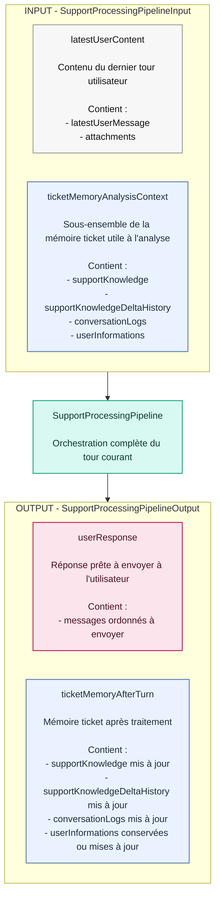

```mermaid
flowchart TD

    %% =========================
    %% INPUT
    %% =========================

    subgraph INPUT["INPUT - SupportProcessingPipelineInput"]
        LATEST_CONTENT["latestUserContent<br/><br/>Contenu du dernier tour utilisateur<br/><br/>Contient :<br/>- latestUserMessage<br/>- attachments"]:::input

        TICKET_MEMORY_CONTEXT["ticketMemoryAnalysisContext<br/><br/>Sous-ensemble de la mémoire ticket utile à l'analyse<br/><br/>Contient :<br/>- supportKnowledge<br/>- supportKnowledgeDeltaHistory<br/>- conversationLogs<br/>- userInformations"]:::memory
    end

    %% =========================
    %% PIPELINE
    %% =========================

    INPUT --> PIPELINE["SupportProcessingPipeline<br/><br/>Orchestration complète du tour courant"]:::pipeline

    %% =========================
    %% OUTPUT
    %% =========================

    PIPELINE --> OUTPUT

    subgraph OUTPUT["OUTPUT - SupportProcessingPipelineOutput"]
        USER_RESPONSE["userResponse<br/><br/>Réponse prête à envoyer à l'utilisateur<br/><br/>Contient :<br/>- messages ordonnés à envoyer"]:::output

        TICKET_MEMORY_AFTER["ticketMemoryAfterTurn<br/><br/>Mémoire ticket après traitement<br/><br/>Contient :<br/>- supportKnowledge mis à jour<br/>- supportKnowledgeDeltaHistory mis à jour<br/>- conversationLogs mis à jour<br/>- userInformations conservées ou mises à jour"]:::memory
    end

    %% =========================
    %% STYLES
    %% =========================

    classDef input fill:#F7F7F7,stroke:#777,stroke-width:1px,color:#111;
    classDef memory fill:#EAF2FF,stroke:#5B7DB1,stroke-width:1.5px,color:#1F2D3D;
    classDef pipeline fill:#D7F9F1,stroke:#1BA784,stroke-width:1.5px,color:#073B32;
    classDef output fill:#FCE4EC,stroke:#C2185B,stroke-width:1.5px,color:#4A1025;

```