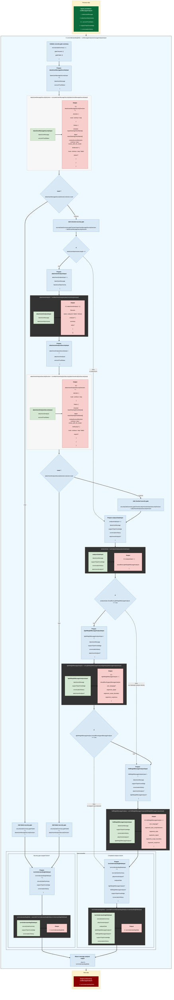

```mermaid
%%{init: {"flowchart": {"nodeSpacing": 14, "rankSpacing": 22, "subGraphTitleMargin": {"top": 10, "bottom": 25}}, "themeVariables": {"fontSize": "13px", "lineColor": "#000000"}}}%%
flowchart TB
  subgraph PREVIOUS_STEP["Previous step"]
    direction TB
    PREVIOUS_INPUTS["<b>Inputs provided to runMessageAnalysis</b><br/>
    1. latestUserMessage<br/>
    2. latestUserAttachments<br/>
    3.1. accountTrustStatus<br/>
    4. supportTopicKnowledge<br/>
    5. conversationHistory"]
  end

  subgraph PIPELINE["6. turnUnderstandingDelta = runMessageAnalysis(messageAnalysisInput)"]
    direction TB

    T_SECURITY_INIT["<b>Initialize security gate summary</b><br/>
    securityGateSummary = {<br/>
    gateChecked: {}<br/>
    gateFailed: {}<br/>
    }"]

    T_MESSAGE_SECURITY_INPUT["<b>Prepare latestUserMessageSecurityInput</b><br/>
    latestUserMessageSecurityInput = {<br/>
    latestUserMessage<br/>
    accountTrustStatus<br/>
    }"]

    subgraph MESSAGE_SECURITY_DATA["latestUserMessageSecurityDecision = runLatestUserMessageSecurity(latestUserMessageSecurityInput)"]
      direction LR
      MESSAGE_SECURITY_INPUTS["<b>latestUserMessageSecurityInput</b><br/>
      latestUserMessage<br/>
      accountTrustStatus"]
      MESSAGE_SECURITY_OUTPUTS["<b>Output</b><br/>
      6.1 latestUserMessageSecurityDecision = {<br/>
      decision: {<br/>
      route: continue / stop<br/>
      }<br/>
      history: {<br/>
      checked: InputCleaningCheckName[]<br/>
      failed: InputCleaningCheckName[]<br/>
      contextAccountDecision: continue / stop / review_with_llm_truster<br/>
      llmReview?: {<br/>
      route: continue / stop / failed<br/>
      reason?<br/>
      }<br/>
      }<br/>
      }"]
      MESSAGE_SECURITY_INPUTS --> MESSAGE_SECURITY_OUTPUTS
    end

    T_MESSAGE_SECURITY_ROUTE{"<b>route ?</b><br/>
    latestUserMessageSecurityDecision.decision.route"}

    T_ADD_MESSAGE_SECURITY["<b>Add checked security gate</b><br/>
    securityGateSummary.gateChecked.latestUserMessageSecurityDecision = latestUserMessageSecurityDecision"]

    T_FAIL_MESSAGE_SECURITY["<b>Add failed security gate</b><br/>
    securityGateSummary.gateFailed = { latestUserMessageSecurityDecision }"]

    T_ATTACHMENT_CHECK{"<b>if</b><br/>
    latestUserAttachments.length > 0"}

    T_ATTACHMENT_INPUT["<b>Prepare attachmentAnalysisInput</b><br/>
    attachmentAnalysisInput = {<br/>
    latestUserMessage<br/>
    latestUserAttachments<br/>
    }"]

    subgraph ATTACHMENT_DATA["attachmentAnalysis = runAttachmentAnalysis(attachmentAnalysisInput)"]
      direction LR
      ATTACHMENT_INPUTS["<b>attachmentAnalysisInput</b><br/>
      latestUserMessage<br/>
      latestUserAttachments"]
      ATTACHMENT_OUTPUTS["<b>Output</b><br/>
      6.2 attachmentAnalysis = [{<br/>
      filename<br/>
      status: analyzed / failed / refused<br/>
      analysis?: {<br/>
      summary<br/>
      other?<br/>
      }<br/>
      }]"]
      ATTACHMENT_INPUTS --> ATTACHMENT_OUTPUTS
    end

    T_ATTACHMENT_SECURITY_INPUT["<b>Prepare attachmentAnalysisSecurityInput</b><br/>
    attachmentAnalysisSecurityInput = {<br/>
    attachmentAnalysis<br/>
    accountTrustStatus<br/>
    }"]

    subgraph ATTACHMENT_SECURITY_DATA["attachmentAnalysisSecurityDecision = runAttachmentAnalysisSecurity(attachmentAnalysisSecurityInput)"]
      direction LR
      ATTACHMENT_SECURITY_INPUTS["<b>attachmentAnalysisSecurityInput</b><br/>
      attachmentAnalysis<br/>
      accountTrustStatus"]
      ATTACHMENT_SECURITY_OUTPUTS["<b>Output</b><br/>
      6.3 attachmentAnalysisSecurityDecision = {<br/>
      decision: {<br/>
      route: continue / stop<br/>
      }<br/>
      history: {<br/>
      checked: InputCleaningCheckName[]<br/>
      failed: InputCleaningCheckName[]<br/>
      contextAccountDecision: continue / stop / review_with_llm_truster<br/>
      llmReview?: {<br/>
      route: continue / stop / failed<br/>
      reason?<br/>
      }<br/>
      }<br/>
      }"]
      ATTACHMENT_SECURITY_INPUTS --> ATTACHMENT_SECURITY_OUTPUTS
    end

    T_ATTACHMENT_SECURITY_ROUTE{"<b>route ?</b><br/>
    attachmentAnalysisSecurityDecision.decision.route"}

    T_ADD_ATTACHMENT_SECURITY["<b>Add checked security gate</b><br/>
    securityGateSummary.gateChecked.attachmentAnalysisSecurityDecision = attachmentAnalysisSecurityDecision"]

    T_FAIL_ATTACHMENT_SECURITY["<b>Add failed security gate</b><br/>
    securityGateSummary.gateFailed = { attachmentAnalysisSecurityDecision }"]

    T_ANALYSIS_GATE_INPUT["<b>Prepare analysisGateInput</b><br/>
    analysisGateInput = {<br/>
    latestUserMessage<br/>
    supportTopicKnowledge<br/>
    conversationHistory<br/>
    attachmentAnalysis?<br/>
    }"]

    subgraph ANALYSIS_GATE_DATA["analysisGate = runAnalysisGate(analysisGateInput)"]
      direction LR
      ANALYSIS_GATE_INPUTS["<b>analysisGateInput</b><br/>
      latestUserMessage<br/>
      supportTopicKnowledge<br/>
      conversationHistory<br/>
      attachmentAnalysis?"]
      ANALYSIS_GATE_OUTPUTS["<b>Output</b><br/>
      6.4 analysisGate = {<br/>
      shouldRunLightWeightMessageAnalysis<br/>
      }"]
      ANALYSIS_GATE_INPUTS --> ANALYSIS_GATE_OUTPUTS
    end

    T_LIGHTWEIGHT_ROUTE{"<b>if</b><br/>
    analysisGate.shouldRunLightWeightMessageAnalysis === true"}

    T_LIGHTWEIGHT_INPUT["<b>Prepare lightWeightMessageAnalysisInput</b><br/>
    lightWeightMessageAnalysisInput = {<br/>
    latestUserMessage<br/>
    supportTopicKnowledge<br/>
    conversationHistory<br/>
    attachmentAnalysis?<br/>
    }"]

    subgraph LIGHTWEIGHT_DATA["lightWeightMessageAnalysis = runLightWeightMessageAnalysis(lightWeightMessageAnalysisInput)"]
      direction LR
      LIGHTWEIGHT_INPUTS["<b>lightWeightMessageAnalysisInput</b><br/>
      latestUserMessage<br/>
      supportTopicKnowledge<br/>
      conversationHistory<br/>
      attachmentAnalysis?"]
      LIGHTWEIGHT_OUTPUTS["<b>Output</b><br/>
      6.5 lightWeightMessageAnalysis = {<br/>
      shouldRunSupportMessageAnalysis<br/>
      user_language?<br/>
      segments_signal<br/>
      segments_scope_boundary<br/>
      segments_suspicious<br/>
      }"]
      LIGHTWEIGHT_INPUTS --> LIGHTWEIGHT_OUTPUTS
    end

    T_FULLWEIGHT_ROUTE{"<b>if</b><br/>
    lightWeightMessageAnalysis.shouldRunSupportMessageAnalysis === true"}

    T_FULLWEIGHT_INPUT["<b>Prepare fullWeightMessageAnalysisInput</b><br/>
    fullWeightMessageAnalysisInput = {<br/>
    latestUserMessage<br/>
    supportTopicKnowledge<br/>
    conversationHistory<br/>
    attachmentAnalysis?<br/>
    lightWeightMessageAnalysis?<br/>
    }"]

    subgraph FULLWEIGHT_DATA["fullWeightMessageAnalysis = runFullWeightMessageAnalysis(fullWeightMessageAnalysisInput)"]
      direction LR
      FULLWEIGHT_INPUTS["<b>fullWeightMessageAnalysisInput</b><br/>
      latestUserMessage<br/>
      supportTopicKnowledge<br/>
      conversationHistory<br/>
      attachmentAnalysis?<br/>
      lightWeightMessageAnalysis?"]
      FULLWEIGHT_OUTPUTS["<b>Output</b><br/>
      6.6 fullWeightMessageAnalysis = {<br/>
      user_language?<br/>
      segments_lack_comprehension<br/>
      segments_topic<br/>
      segments_signal<br/>
      segments_scope_boundary<br/>
      segments_suspicious<br/>
      }"]
      FULLWEIGHT_INPUTS --> FULLWEIGHT_OUTPUTS
    end

    subgraph FINAL_ASSEMBLY["Final assembly"]
      direction LR

      subgraph STOP_FINAL_BRANCH["Security gate stopped branch"]
        direction TB
        T_STOP_DELTA_INPUT["<b>Prepare turnUnderstandingDeltaInput</b><br/>
        turnUnderstandingDeltaInput = {<br/>
        securityGateSummary<br/>
        supportTopicKnowledge<br/>
        conversationHistory<br/>
        }"]

        subgraph STOP_DELTA_DATA["turnUnderstandingDelta = assembleTurnUnderstandingDelta(turnUnderstandingDeltaInput)"]
          direction LR
          STOP_DELTA_INPUTS["<b>turnUnderstandingDeltaInput</b><br/>
          securityGateSummary<br/>
          supportTopicKnowledge<br/>
          conversationHistory"]
          STOP_DELTA_OUTPUTS["<b>Output</b><br/>
          6. turnUnderstandingDelta"]
          STOP_DELTA_INPUTS --> STOP_DELTA_OUTPUTS
        end
      end

      subgraph COMPLETED_FINAL_BRANCH["Completed analysis branch"]
        direction TB
        T_COMPLETED_DELTA_INPUT["<b>Prepare turnUnderstandingDeltaInput</b><br/>
        turnUnderstandingDeltaInput = {<br/>
        securityGateSummary<br/>
        attachmentAnalysis?<br/>
        analysisGate<br/>
        lightWeightMessageAnalysis?<br/>
        fullWeightMessageAnalysis?<br/>
        supportTopicKnowledge<br/>
        conversationHistory<br/>
        }"]

        subgraph COMPLETED_DELTA_DATA["turnUnderstandingDelta = assembleTurnUnderstandingDelta(turnUnderstandingDeltaInput)"]
          direction LR
          COMPLETED_DELTA_INPUTS["<b>turnUnderstandingDeltaInput</b><br/>
          securityGateSummary<br/>
          attachmentAnalysis?<br/>
          analysisGate<br/>
          lightWeightMessageAnalysis?<br/>
          fullWeightMessageAnalysis?<br/>
          supportTopicKnowledge<br/>
          conversationHistory"]
          COMPLETED_DELTA_OUTPUTS["<b>Output</b><br/>
          6. turnUnderstandingDelta"]
          COMPLETED_DELTA_INPUTS --> COMPLETED_DELTA_OUTPUTS
        end
      end
    end

    T_RETURN["<b>Return message analysis output</b><br/>
    return 6. turnUnderstandingDelta"]

    T_SECURITY_INIT --> T_MESSAGE_SECURITY_INPUT
    T_MESSAGE_SECURITY_INPUT --> MESSAGE_SECURITY_DATA
    MESSAGE_SECURITY_DATA --> T_MESSAGE_SECURITY_ROUTE

    T_MESSAGE_SECURITY_ROUTE -->|continue| T_ADD_MESSAGE_SECURITY
    T_MESSAGE_SECURITY_ROUTE -->|stop| T_FAIL_MESSAGE_SECURITY

    T_FAIL_MESSAGE_SECURITY --> T_STOP_DELTA_INPUT

    T_ADD_MESSAGE_SECURITY --> T_ATTACHMENT_CHECK

    T_ATTACHMENT_CHECK -->|true| T_ATTACHMENT_INPUT
    T_ATTACHMENT_CHECK -.->|false<br/>no attachment| T_ANALYSIS_GATE_INPUT

    T_ATTACHMENT_INPUT --> ATTACHMENT_DATA
    ATTACHMENT_DATA --> T_ATTACHMENT_SECURITY_INPUT

    T_ATTACHMENT_SECURITY_INPUT --> ATTACHMENT_SECURITY_DATA
    ATTACHMENT_SECURITY_DATA --> T_ATTACHMENT_SECURITY_ROUTE

    T_ATTACHMENT_SECURITY_ROUTE -->|continue| T_ADD_ATTACHMENT_SECURITY
    T_ATTACHMENT_SECURITY_ROUTE -->|stop| T_FAIL_ATTACHMENT_SECURITY

    T_FAIL_ATTACHMENT_SECURITY --> T_STOP_DELTA_INPUT

    T_ADD_ATTACHMENT_SECURITY --> T_ANALYSIS_GATE_INPUT

    T_ANALYSIS_GATE_INPUT --> ANALYSIS_GATE_DATA
    ANALYSIS_GATE_DATA --> T_LIGHTWEIGHT_ROUTE

    T_LIGHTWEIGHT_ROUTE -->|true| T_LIGHTWEIGHT_INPUT
    T_LIGHTWEIGHT_ROUTE -.->|false<br/>run fullweight analysis directly| T_FULLWEIGHT_INPUT

    T_LIGHTWEIGHT_INPUT --> LIGHTWEIGHT_DATA
    LIGHTWEIGHT_DATA --> T_FULLWEIGHT_ROUTE

    T_FULLWEIGHT_ROUTE -->|true| T_FULLWEIGHT_INPUT
    T_FULLWEIGHT_ROUTE -.->|false<br/>no support topic detected| T_COMPLETED_DELTA_INPUT

    T_FULLWEIGHT_INPUT --> FULLWEIGHT_DATA
    FULLWEIGHT_DATA --> T_COMPLETED_DELTA_INPUT

    T_STOP_DELTA_INPUT --> STOP_DELTA_DATA
    STOP_DELTA_DATA --> T_RETURN

    T_COMPLETED_DELTA_INPUT --> COMPLETED_DELTA_DATA
    COMPLETED_DELTA_DATA --> T_RETURN
  end

  subgraph NEXT_STEP["Next step"]
    direction TB
    NEXT_OUTPUTS["<b>Output produced by runMessageAnalysis</b><br/>
    6. turnUnderstandingDelta"]
  end

  PREVIOUS_STEP --> PIPELINE
  PIPELINE --> NEXT_STEP

  classDef previousBlock fill:#0b6b3a,stroke:#064a28,color:#ffffff,stroke-width:1px;
  classDef inputBlock fill:#d5e8d4,stroke:#82b366,color:#000000,stroke-width:1px;
  classDef outputBlock fill:#f8cecc,stroke:#b85450,color:#000000,stroke-width:1px;
  classDef processingBlock fill:#d9e8f5,stroke:#4f93d2,color:#000000,stroke-width:1px;
  classDef nextOutputBlock fill:#8b0000,stroke:#5c0000,color:#ffffff,stroke-width:1px;

  class PREVIOUS_INPUTS previousBlock;

  class MESSAGE_SECURITY_INPUTS,ATTACHMENT_INPUTS,ATTACHMENT_SECURITY_INPUTS,ANALYSIS_GATE_INPUTS,LIGHTWEIGHT_INPUTS,FULLWEIGHT_INPUTS,STOP_DELTA_INPUTS,COMPLETED_DELTA_INPUTS inputBlock;
  class MESSAGE_SECURITY_OUTPUTS,ATTACHMENT_OUTPUTS,ATTACHMENT_SECURITY_OUTPUTS,ANALYSIS_GATE_OUTPUTS,LIGHTWEIGHT_OUTPUTS,FULLWEIGHT_OUTPUTS,STOP_DELTA_OUTPUTS,COMPLETED_DELTA_OUTPUTS outputBlock;

  class T_SECURITY_INIT,T_MESSAGE_SECURITY_INPUT,T_MESSAGE_SECURITY_ROUTE,T_ADD_MESSAGE_SECURITY,T_FAIL_MESSAGE_SECURITY,T_ATTACHMENT_CHECK,T_ATTACHMENT_INPUT,T_ATTACHMENT_SECURITY_INPUT,T_ATTACHMENT_SECURITY_ROUTE,T_ADD_ATTACHMENT_SECURITY,T_FAIL_ATTACHMENT_SECURITY,T_ANALYSIS_GATE_INPUT,T_LIGHTWEIGHT_ROUTE,T_LIGHTWEIGHT_INPUT,T_FULLWEIGHT_ROUTE,T_FULLWEIGHT_INPUT,T_STOP_DELTA_INPUT,T_COMPLETED_DELTA_INPUT,T_RETURN processingBlock;

  class NEXT_OUTPUTS nextOutputBlock;

  style PIPELINE fill:#eef8ff,stroke:#000000,stroke-width:1px,color:#000000;
  style PREVIOUS_STEP fill:#fff2cc,stroke:#d6b656,stroke-width:1px,color:#000000;
  style NEXT_STEP fill:#fff2cc,stroke:#d6b656,stroke-width:1px,color:#000000;

  %% Safety subgraphs: light grey
  style MESSAGE_SECURITY_DATA fill:#f7f7f7,stroke:#bdbdbd,stroke-width:1px,color:#000000;
  style ATTACHMENT_SECURITY_DATA fill:#f7f7f7,stroke:#bdbdbd,stroke-width:1px,color:#000000;

  %% Final assembly branches
  style FINAL_ASSEMBLY fill:#eef8ff,stroke:#000000,stroke-width:1px,color:#000000;
  style STOP_FINAL_BRANCH fill:#eef8ff,stroke:#000000,stroke-width:1px,color:#000000;
  style COMPLETED_FINAL_BRANCH fill:#eef8ff,stroke:#000000,stroke-width:1px,color:#000000;

  %% Non-safety functional subgraphs: dark grey
  style ATTACHMENT_DATA fill:#333333,stroke:#333333,stroke-width:1px,color:#ffffff;
  style ANALYSIS_GATE_DATA fill:#333333,stroke:#333333,stroke-width:1px,color:#ffffff;
  style LIGHTWEIGHT_DATA fill:#333333,stroke:#333333,stroke-width:1px,color:#ffffff;
  style FULLWEIGHT_DATA fill:#333333,stroke:#333333,stroke-width:1px,color:#ffffff;
  style STOP_DELTA_DATA fill:#333333,stroke:#333333,stroke-width:1px,color:#ffffff;
  style COMPLETED_DELTA_DATA fill:#333333,stroke:#333333,stroke-width:1px,color:#ffffff;

  linkStyle default stroke:#000000,stroke-width:2px;
```