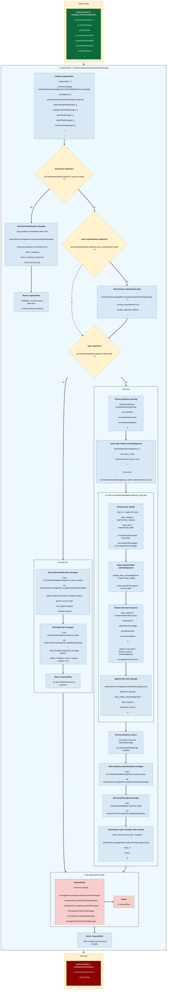

```mermaid
%%{init: {"flowchart": {"nodeSpacing": 14, "rankSpacing": 22, "subGraphTitleMargin": {"top": 10, "bottom": 25}}, "themeVariables": {"fontSize": "13px", "lineColor": "#000000"}}}%%
flowchart TB
  subgraph PREVIOUS_STEP["Previous step"]
    direction TB
    PREVIOUS_INPUTS["<b>Input prepared by runSupportProcessingPipeline</b><br/>
    responseDecisionInput = {<br/>
    accountTrustStatus<br/>
    accountProfile<br/>
    accountInteractionTraits<br/>
    supportTopicKnowledge<br/>
    turnUnderstandingDelta<br/>
    possibleSolutions<br/>
    }"]
  end

  subgraph PIPELINE["9. responsePlan = runResponseDecision(responseDecisionInput)"]
    direction TB

    T_INIT["<b>Initialize responsePlan</b><br/>
    responsePlan = {<br/>
    responseLanguage: resolveResponseLanguage(turnUnderstandingDelta.user_language)<br/>
    messagesPlan: {<br/>
    warningComprehensionPlanMessage: undefined<br/>
    inputCleaningPlanMessages: []<br/>
    scopeBoundaryPlanMessages: []<br/>
    topicPlanMessages: []<br/>
    signalPlanMessages: []<br/>
    handoverPlanMessages: []<br/>
    }<br/>
    }"]

    T_SUSPICIOUS_ROUTE{"<b>Suspicious segments?</b><br/>
    turnUnderstandingDelta.segments_suspicious.length > 0"}

    T_ADD_SUSPICIOUS["<b>Add input-cleaning plan messages</b><br/>
    Copy suspicious checkName values into:<br/>
    responsePlan.messagesPlan.inputCleaningPlanMessages<br/><br/>
    Response production can render this as:<br/>
    inform_suspicious<br/>
    inform_suspicious_attachment<br/>
    inform_security_stop"]

    T_RETURN_SUSPICIOUS["<b>Return responsePlan</b><br/>
    Suspicious / security branch stops here<br/>
    No topic answer is produced"]

    T_LACK_COMPREHENSION_ROUTE{"<b>Lack comprehension segments?</b><br/>
    turnUnderstandingDelta.segments_lack_comprehension.length > 0"}

    T_ADD_WARNING["<b>Add warning comprehension plan</b><br/>
    responsePlan.messagesPlan.warningComprehensionPlanMessage = {<br/>
    warning_comprehension: yes<br/>
    unclear_segments_verbatim<br/>
    }"]

    T_TOPIC_ROUTE{"<b>Topic segments?</b><br/>
    turnUnderstandingDelta.segments_topic.length > 0"}

    subgraph NO_TOPIC_FLOW["No topic flow"]
      direction TB

      T_COPY_SCOPE["<b>Add scope-boundary plan messages</b><br/>
      Copy turnUnderstandingDelta.segments_scope_boundary<br/>
      into responsePlan.messagesPlan.scopeBoundaryPlanMessages<br/><br/>
      Keep the labels produced by message analysis:<br/>
      generic_out_of_scope<br/>
      non_support_linagora<br/>
      unrelated_request"]

      T_COPY_SIGNAL["<b>Add signal plan messages</b><br/>
      Copy turnUnderstandingDelta.segments_signal<br/>
      into responsePlan.messagesPlan.signalPlanMessages<br/><br/>
      Keep the labels produced by message analysis:<br/>
      thanks / feedback / closure / waiting / complaint / etc."]

      T_RETURN_NO_TOPIC["<b>Return responsePlan</b><br/>
      No topic-oriented response is produced"]

      T_COPY_SCOPE --> T_COPY_SIGNAL
      T_COPY_SIGNAL --> T_RETURN_NO_TOPIC
    end

    subgraph TOPIC_FLOW["Topic flow"]
      direction TB

      T_POLITENESS["<b>Choose politeness opening</b><br/>
      politenessOpening = choosePolitenessOpening({<br/>
      accountProfile<br/>
      accountInteractionTraits<br/>
      turnUnderstandingDelta<br/>
      })"]

      T_RELATION_ACK["<b>Count topic relation acknowledgement</b><br/>
      topicRelationAcknowledgement = {<br/>
      new_topics_count<br/>
      matched_historical_topic_count<br/>
      }<br/><br/>
      Count from:<br/>
      turnUnderstandingDelta.segments_topic[*].matched_historical_topic"]

      subgraph TOPIC_LOOP["For each turnUnderstandingDelta.segments_topic item"]
        direction TB

        T_TOPIC_IDENTITY["<b>Resolve topic identity</b><br/>
        topic_id = segment.id_topic<br/>
        topic_category = segment.topic_category<br/>
        topic_label = segment.topic_label<br/><br/>
        If matched historical topic lacks fields,<br/>
        read missing title/category from supportTopicKnowledge"]

        T_TOPIC_FIELDS["<b>Collect updated fields acknowledgement</b><br/>
        updated_fields_acknowledgement = segment.topic_details<br/><br/>
        Keep only fields brought by this turn delta"]

        T_MAIN_RESPONSE["<b>Choose main topic response</b><br/>
        topic_response = chooseTopicMainResponse({<br/>
        topicSegment<br/>
        supportTopicKnowledge<br/>
        possibleSolutions<br/>
        accountTrustStatus<br/>
        })<br/><br/>
        Details of ask_fields / propose_solution / acknowledgement<br/>
        are decided in this function"]

        T_APPEND_TOPIC["<b>Append topic plan message</b><br/>
        responsePlan.messagesPlan.topicPlanMessages.push({<br/>
        politeness_opening?<br/>
        topic_relation_acknowledgement?<br/>
        topic_response<br/>
        politeness_closure?<br/>
        })"]

        T_TOPIC_IDENTITY --> T_TOPIC_FIELDS
        T_TOPIC_FIELDS --> T_MAIN_RESPONSE
        T_MAIN_RESPONSE --> T_APPEND_TOPIC
      end

      T_CLOSURE["<b>Choose politeness closure</b><br/>
      Add closure to the last topicPlanMessage<br/>
      or to each topicPlanMessage if needed"]

      T_COPY_EXTRA_SCOPE["<b>Add remaining scope-boundary messages</b><br/>
      Copy turnUnderstandingDelta.segments_scope_boundary<br/>
      into responsePlan.messagesPlan.scopeBoundaryPlanMessages"]

      T_COPY_EXTRA_SIGNAL["<b>Add remaining signal messages</b><br/>
      Copy turnUnderstandingDelta.segments_signal<br/>
      into responsePlan.messagesPlan.signalPlanMessages"]

      T_HANDOVER["<b>Add handover plan messages when needed</b><br/>
      If topic_response.next_step = handover:<br/>
      responsePlan.messagesPlan.handoverPlanMessages.push({<br/>
      topic_id<br/>
      reason<br/>
      })"]

      T_POLITENESS --> T_RELATION_ACK
      T_RELATION_ACK --> TOPIC_LOOP
      TOPIC_LOOP --> T_CLOSURE
      T_CLOSURE --> T_COPY_EXTRA_SCOPE
      T_COPY_EXTRA_SCOPE --> T_COPY_EXTRA_SIGNAL
      T_COPY_EXTRA_SIGNAL --> T_HANDOVER
    end

    subgraph FINAL_RESPONSE_PLAN["Final responsePlan shape"]
      direction LR
      FINAL_INPUTS["<b>responsePlan</b><br/>
      responseLanguage<br/>
      messagesPlan.warningComprehensionPlanMessage?<br/>
      messagesPlan.inputCleaningPlanMessages<br/>
      messagesPlan.scopeBoundaryPlanMessages<br/>
      messagesPlan.topicPlanMessages<br/>
      messagesPlan.signalPlanMessages<br/>
      messagesPlan.handoverPlanMessages"]
      FINAL_OUTPUTS["<b>Output</b><br/>
      9. responsePlan"]
      FINAL_INPUTS --> FINAL_OUTPUTS
    end

    T_RETURN_TOPIC["<b>Return responsePlan</b><br/>
    Topic-oriented response plan is complete"]

    T_INIT --> T_SUSPICIOUS_ROUTE

    T_SUSPICIOUS_ROUTE -->|yes| T_ADD_SUSPICIOUS
    T_ADD_SUSPICIOUS --> T_RETURN_SUSPICIOUS

    T_SUSPICIOUS_ROUTE -->|no| T_LACK_COMPREHENSION_ROUTE

    T_LACK_COMPREHENSION_ROUTE -->|yes| T_ADD_WARNING
    T_LACK_COMPREHENSION_ROUTE -.->|no| T_TOPIC_ROUTE
    T_ADD_WARNING --> T_TOPIC_ROUTE

    T_TOPIC_ROUTE -->|no| NO_TOPIC_FLOW
    T_TOPIC_ROUTE -->|yes| TOPIC_FLOW

    NO_TOPIC_FLOW --> FINAL_RESPONSE_PLAN
    TOPIC_FLOW --> FINAL_RESPONSE_PLAN
    FINAL_RESPONSE_PLAN --> T_RETURN_TOPIC
  end

  subgraph NEXT_STEP["Next step"]
    direction TB
    NEXT_OUTPUTS["<b>Input provided to runResponseProduction</b><br/>
    responseProductionInput = {<br/>
    responsePlan<br/>
    }"]
  end

  PREVIOUS_STEP --> PIPELINE
  PIPELINE --> NEXT_STEP

  classDef previousBlock fill:#0b6b3a,stroke:#064a28,color:#ffffff,stroke-width:1px;
  classDef routeBlock fill:#fff2cc,stroke:#d6b656,color:#000000,stroke-width:1px;
  classDef processingBlock fill:#d9e8f5,stroke:#4f93d2,color:#000000,stroke-width:1px;
  classDef outputBlock fill:#f8cecc,stroke:#b85450,color:#000000,stroke-width:1px;
  classDef nextOutputBlock fill:#8b0000,stroke:#5c0000,color:#ffffff,stroke-width:1px;

  class PREVIOUS_INPUTS previousBlock;

  class T_SUSPICIOUS_ROUTE,T_LACK_COMPREHENSION_ROUTE,T_TOPIC_ROUTE routeBlock;

  class T_INIT,T_ADD_SUSPICIOUS,T_RETURN_SUSPICIOUS,T_ADD_WARNING,T_COPY_SCOPE,T_COPY_SIGNAL,T_RETURN_NO_TOPIC,T_POLITENESS,T_RELATION_ACK,T_TOPIC_IDENTITY,T_TOPIC_FIELDS,T_MAIN_RESPONSE,T_APPEND_TOPIC,T_CLOSURE,T_COPY_EXTRA_SCOPE,T_COPY_EXTRA_SIGNAL,T_HANDOVER,T_RETURN_TOPIC processingBlock;

  class FINAL_INPUTS,FINAL_OUTPUTS outputBlock;
  class NEXT_OUTPUTS nextOutputBlock;

  style PIPELINE fill:#eef8ff,stroke:#000000,stroke-width:1px,color:#000000;
  style PREVIOUS_STEP fill:#fff2cc,stroke:#d6b656,stroke-width:1px,color:#000000;
  style NEXT_STEP fill:#fff2cc,stroke:#d6b656,stroke-width:1px,color:#000000;

  style NO_TOPIC_FLOW fill:#eef8ff,stroke:#000000,stroke-width:1px,color:#000000;
  style TOPIC_FLOW fill:#eef8ff,stroke:#000000,stroke-width:1px,color:#000000;
  style TOPIC_LOOP fill:#eef8ff,stroke:#000000,stroke-width:1px,color:#000000;
  style FINAL_RESPONSE_PLAN fill:#eef8ff,stroke:#000000,stroke-width:1px,color:#000000;

  linkStyle default stroke:#000000,stroke-width:2px;
```
