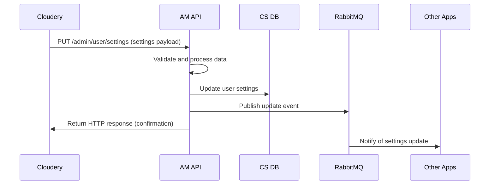
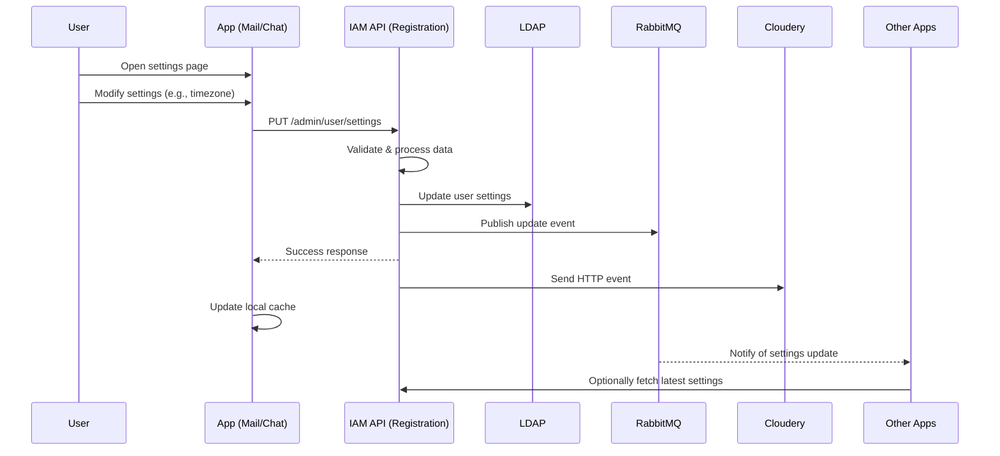
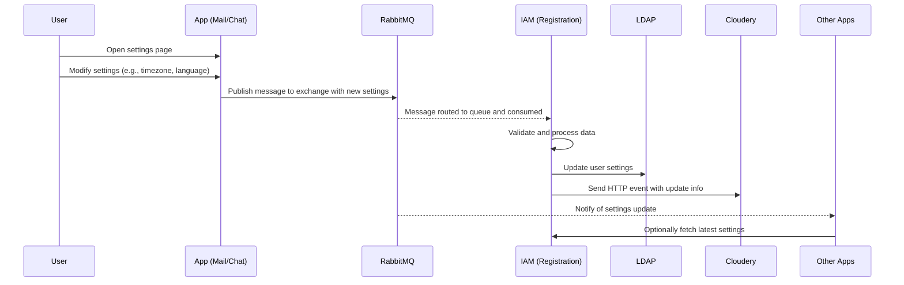
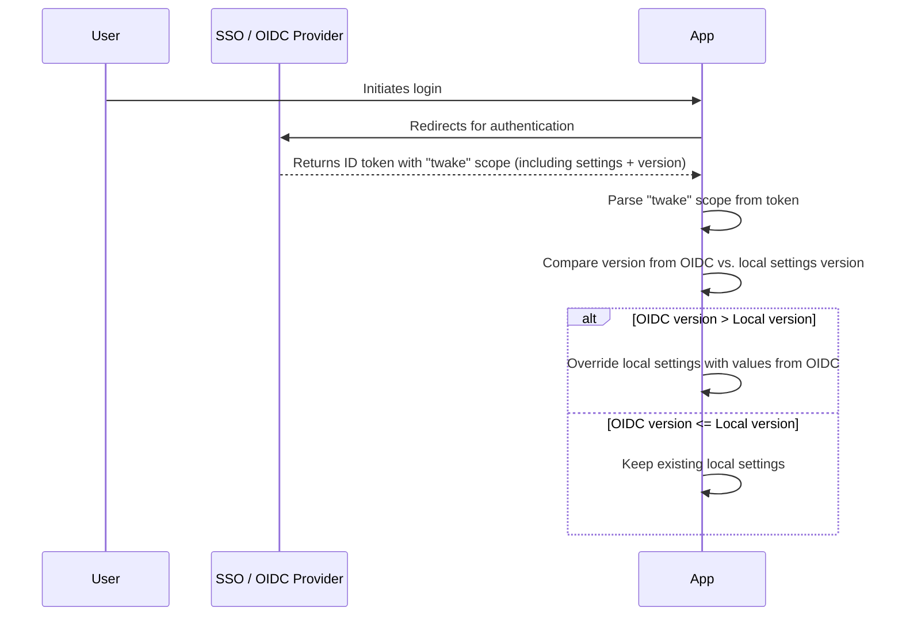
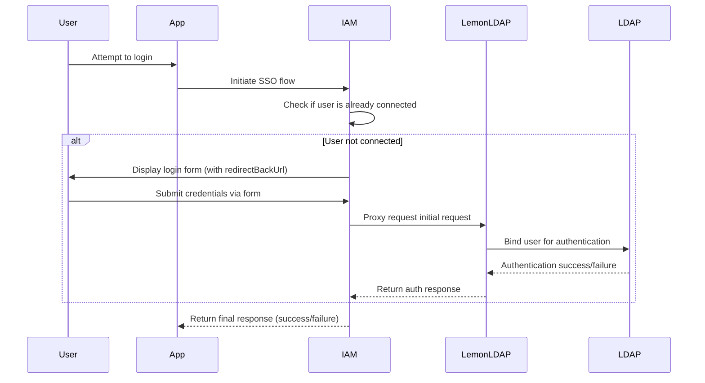
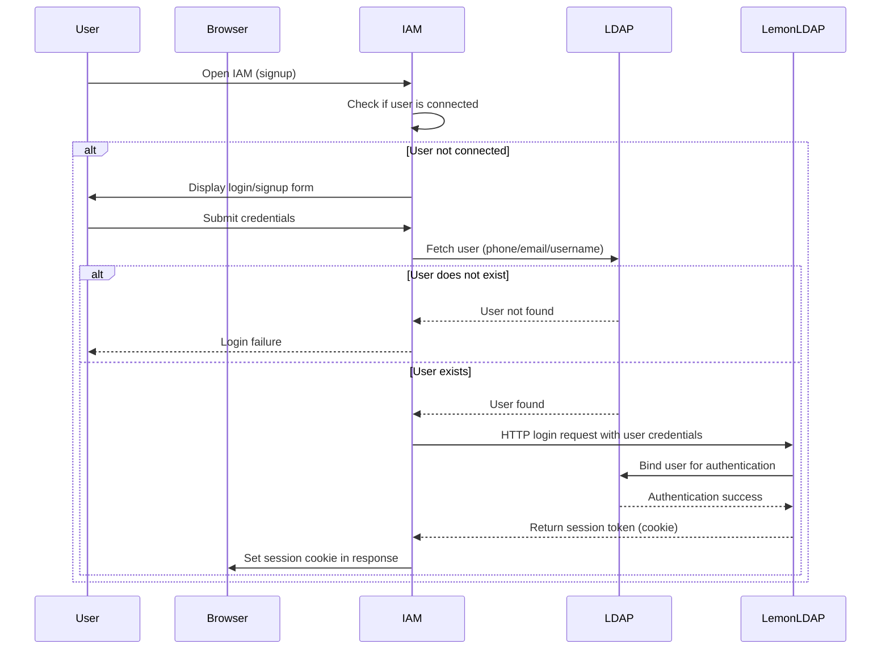
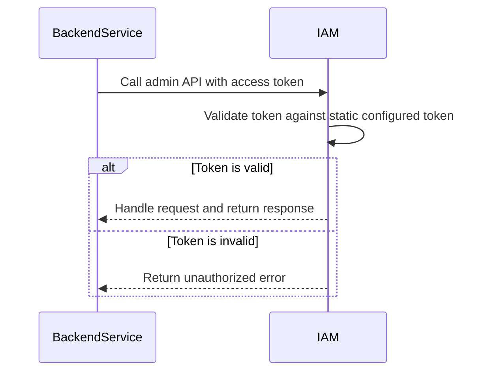
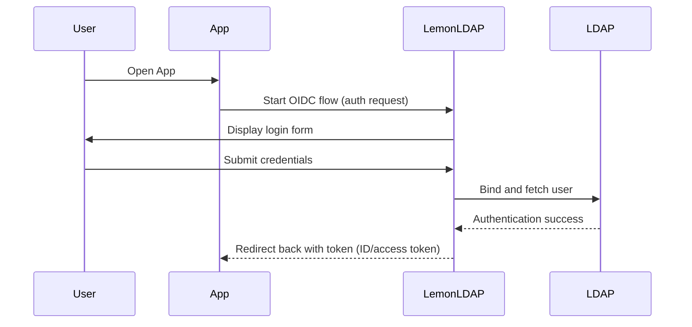
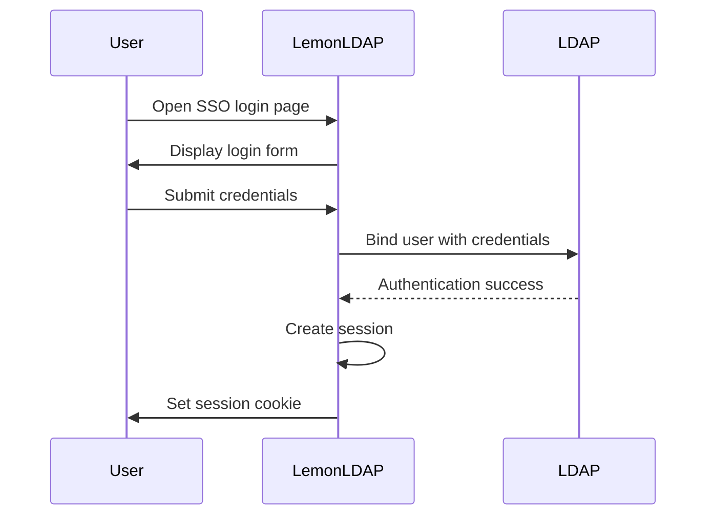

## Status

- Date: 25/05/2025
- Status: Approved

## Context

Twake Workplace is composed of a galaxy of applications, each managing their own settings. Ideally each application is meant to potentially be deployed standalone and needs to work independently. But as there is some overlap in settings (timezone, theme settings, etc.) we need:

- A way to synchronize settings across applications
- A common place to visualize "common settings"

The "Golden Source" of the user settings in Twake Workplace should be our IAM system (currently the registration application). All the application user databases should be considered as caches, synced with IAM LDAP.

## Flows

Common settings follow these flows:

### The "Settings" application updates user settings

- **Cozy Stack** prepares the settings update payload.
- **Cozy Stack** makes an HTTP call to **IAM API** via its exposed public endpoint `PUT /admin/user/settings`.
- IAM API:
  - Validates and updates the data.
  - Writes the update to the Common Settings DB (PostgreSQL).
  - Sends a message to **RabbitMQ** for downstream app caches to update.
- **Cloudery** updates the locally cached settings and version when the API responds with success.



## Summary of APIs Needed in IAM

- `POST /admin/user/settings` -- Creates the user settings for the first time.
- `GET /admin/user/settings/:userId` -- Get current settings from DB.
- `PUT /admin/user/settings/:userId` -- Update settings and write to DB.
- `POST /admin/user/settings/sync` -- Optional: force sync to all applications.
- `POST /admin/external/settings-update` -- For Cloudery, to send settings via IAM proxy (for support purposes).

### Failure in RabbitMQ or Event Handling

**Scenario:**

- The Settings application updates a setting.
- IAM writes to LDAP and publishes an event to RabbitMQ.
- Mail does not receive the event due to a network partition or consumer crash.

**Risk:** Mail continues using stale cached settings.

**Mitigation:**

- Implement retryable sync jobs or fallback periodic reconciliation via IAM API.
- RabbitMQ monitoring and alerts to detect dropped, delayed, or unconsumed messages:
  - **Required**: `rabbitmq_exporter`
  - `rabbitmq_queue_messages_ready`
  - `rabbitmq_queue_messages_unacknowledged` (app crashed or stuck)
  - `rabbitmq_queue_consumers` (app instance went down or unsubscribed)
  - Dead letter queues

## Decision

- Establish a common registry for settings (JSON structure: name as a string associated with a JSON object).
- Use a common event bus based on RabbitMQ to propagate setting changes.
- This is a **backend synchronization** process described within [ADR 001](./adr-001).
- Applications need to obey the event contract.
- Since there is only one point of making changes to user settings (the Settings application), we do not need to implement optimistic locking with version on the very first step.
- All settings will be stored as plain strings inside LDAP.
- No need to implement an HTTP callback "on settings changed" to Cloudery because it is the only place where we can change settings (except initial user creation).

## Consequences

Each application can still manage its own settings, but must subscribe to and respect changes propagated through RabbitMQ.

## Annexes

### Message format

```json
{
  "source": "IAM",
  "nickname": "johndoe",
  "request_id": "req_1234567890",
  "timestamp": 1718897400000,
  "version": 1,
  "payload": {
    "language": "en",
    "timezone": "Europe/Paris",
    "avatar": "https://example.com/avatar.png",
    "last_name": "Doe",
    "first_name": "John",
    "email": "john.doe@example.com",
    "phone": "+33612345678",
    "matrix_id": "@johndoe:matrix.org",
    "display_name": "John Doe"
  }
}
```

### Alternative flows (not implemented)

#### Client application updates settings through HTTP API

- User opens a settings page in a client app (e.g., Mail).
- User modifies a setting (e.g., timezone, language).
- App sends a `PUT /admin/user/settings` HTTP request to the IAM API.
- IAM API validates, updates LDAP, publishes to RabbitMQ, and sends an HTTP event to Cloudery.
- App updates its local cache. Other apps listen to RabbitMQ or refresh via IAM API.



#### Client application updates settings through RabbitMQ

- User modifies a setting in a client app.
- App publishes a message to a RabbitMQ exchange.
- IAM consumes the message, validates, updates LDAP, and sends an HTTP event to Cloudery.
- Other apps listen to RabbitMQ or refresh via IAM API.



#### During OIDC authentication

The SSO provides a "twake" scope which contains all common settings. When an app receives it, it must override all previous values with these ones if the version of the settings on OIDC scope is greater than it is inside the application.



### Potential conflict scenarios

#### Race condition between OIDC scope and local update

**Scenario:**

- User logs in and app receives `twake` scope with version `v2`.
- The user modifies a setting in the app and sends an update to IAM.
- The local app may override the just-updated settings with stale OIDC values (`v2`) before the IAM response returns (which would be version `v3`).

**Risk:** New user data is lost due to accepting a stale version from the login token.

**Mitigation:** Always confirm latest version with IAM after login if recent changes are expected.

## Side notes

### Common settings for on-premise customers

We need common settings for B2B customers. Questions to resolve:

- Where do we store common settings if we don't have an LDAP for on-premise?
- We need to restrict the list of settings that can be edited inside the settings application.

### Authentication flows

#### Authentication in public Platform / SaaS

**User initiates login from a TWP app using OIDC:**



**User initiates login from the signup IAM:**



**Backend services using IAM admin APIs:**



#### Authentication in the Linagora platform (without registration IAM)

**User initiates login from a TWP app:**



**User initiates login from LemonLDAP:**


