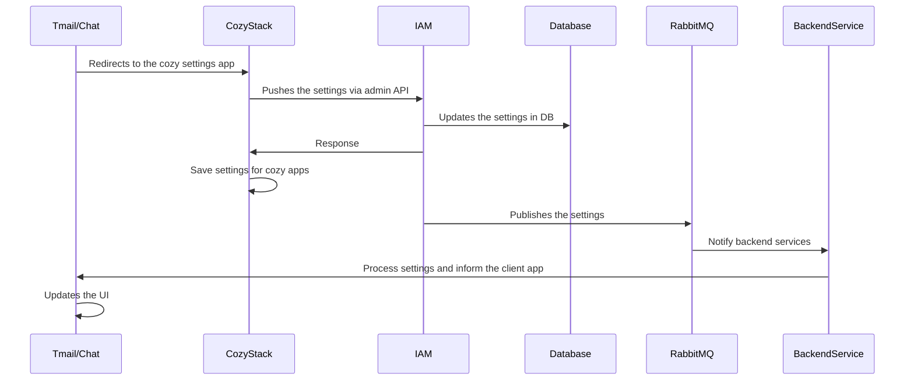
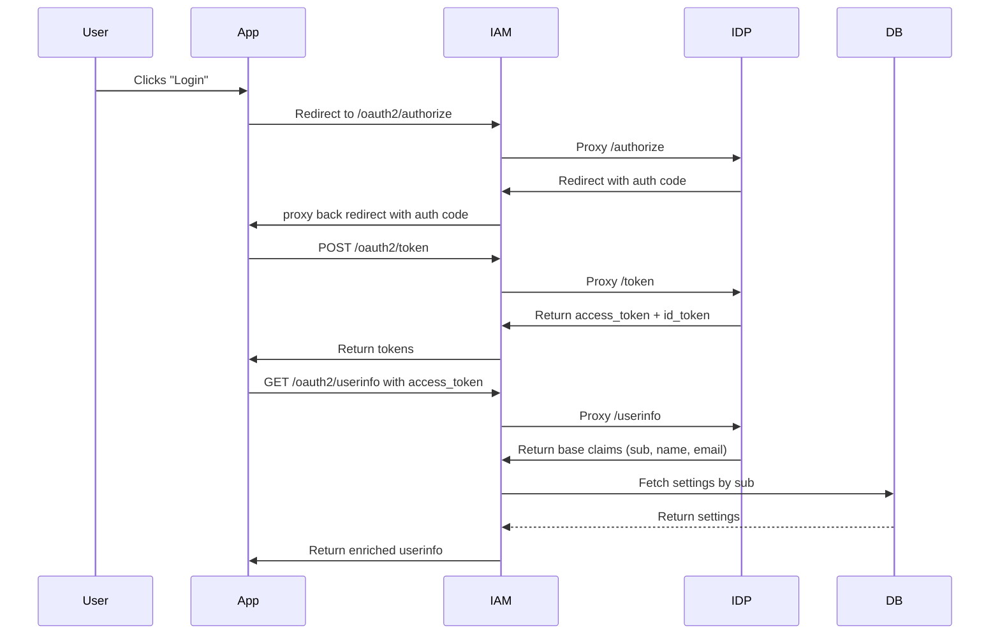
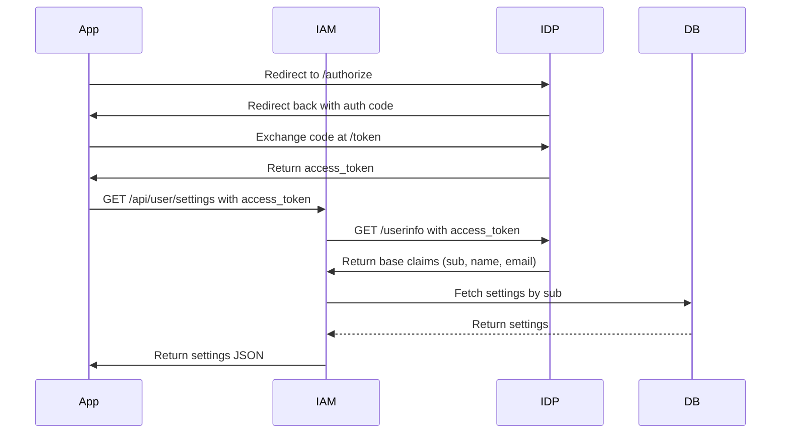

## Status

- Date: 18/06/2025
- Status: Proposed

## Context

See [ADR 015](./adr-015) for the common settings architecture.

The solution detailed in the common settings ADR works in the context of a SaaS / public platform (B2C) where we control the infrastructure:

- We can extend the LDAP schema and store the settings alongside user attributes.
- LemonLDAP reads the user entry from LDAP, maps the settings attributes, and injects those settings into the OIDC claims.

But in the context of an on-premise installation (B2B), some concerns arise:

- We should not and cannot modify the client's LDAP schemas.
- The client may not even use LDAP to store their users.
- The client may not use LemonLDAP and have another identity provider, like Keycloak.
- We are bound to using LDAP and storing all user entities in it, so this forces us to migrate and sync the LDAP with the user data storage and handle data synchronization.

## Common architecture

This section remains the same for both options, and it is based on [ADR 015](./adr-015).

Regardless of the chosen option, the following technical elements are shared:

- **Cozy Stack** pushes updated settings to IAM when a user makes changes via the settings UI.
- **IAM Admin APIs** are used to store the user's common settings.
- **RabbitMQ** is used to propagate setting changes:
  - **IAM** sends a notification after the settings update.
  - **TWP** apps subscribe to RabbitMQ to receive updates and refresh their caches.

### Flow (applies to both options)

1. User updates settings in the **Cozy Settings app**.
2. **Cozy Stack** pushes the new settings to **IAM** via its Admin API.
3. **IAM** saves the settings and responds to Cozy Stack (updates settings in Cozy).
4. **IAM** emits a RabbitMQ message to notify applications of the update.
5. **Client's backend services** receive the message, update their cache, and notify their clients.
6. **Clients update their UI** and can fetch the latest settings from IAM.

### Sequence



### When the application fetches settings after user login

After logging in, applications request the user settings from IAM using the access token to populate their local cache.

### RabbitMQ data persistence, high availability, and replay

RabbitMQ messages must be persisted and replayed in the event of consumer downtime. See the dedicated documentation on RabbitMQ messages persistence, high availability, and replay for common settings.

## OPTION 1: IAM as an OIDC Proxy Injecting User Settings in `/oauth2/userinfo`

The idea is to introduce the pattern where the **IAM component acts as an OIDC provider proxy for downstream apps**, but delegates actual authentication to the upstream SSO provider (LemonLDAP). Meanwhile, IAM holds user settings in its own PostgreSQL database and injects them into the `/oauth2/userinfo` response it provides to apps. This decouples settings storage from the LDAP schema.

### The pattern

#### OIDC clients configuration

- Apps are configured to trust **IAM** as their OIDC provider. (This is already the setup in the SaaS platform.)
- Apps must use the standard OIDC `/userinfo` endpoint. No custom implementations.

#### Proxying all OIDC requests (already implemented)

- **IAM** is configured to proxy all OAuth2 and OIDC-related requests (e.g., `/authorize`, `/.well-known`, `/token`) to LemonLDAP, standing in as the entry point for all authentication interactions from client applications.

#### Intercepting the `oauth2/userinfo` request and augmenting the response

- When the user completes authentication via LemonLDAP, the client application sends a `/token` request to exchange the authorization code and obtain an access token.
- Then it requests the `/userinfo` endpoint (to IAM) using that access token to obtain the user information.
- IAM proxies the `/oauth2/userinfo` request to the identity provider (e.g., LemonLDAP).
- IAM intercepts this request before proxying the response back to the client:
  - Parses the response.
  - Uses the `sub` (user ID) to fetch user settings from its DB.
  - Merges the settings into the original response body.
- IAM sends the **augmented `/userinfo` response** back to the client.

#### Returning the modified response

The response will be in the following form:

```json
{
  "name": "Khaled FERJANI",
  "sid": "fake+dkYLXhm2Wenn9VOLSUBhvbBZjmJQ",
  "family_name": "FERJANI",
  "sub": "kferjani",
  "email": "kferjani@linagora.com",
  "given_name": "Khaled",
  "settings": {
    "language": "fr",
    "timezone": "Paris"
  }
}
```

The client application receives the modified userinfo response containing the additional settings. Apps use the settings (put in cache, etc.).

#### Settings management

The logic remains the same as [ADR 015](./adr-015):

- Expose APIs in IAM to update/fetch settings.
- Store and read settings from the PostgreSQL database.
- Publish and receive events from RabbitMQ.

### Flow

1. User clicks "Login" in the frontend app.
2. App redirects to IAM `/oauth2/authorize`.
3. IAM proxies to LemonLDAP for authentication.
4. LemonLDAP authenticates the user and redirects back with an auth code.
5. App exchanges code at `/oauth2/token` via IAM.
6. IAM proxies `/token` to LemonLDAP, gets tokens (access + ID).
7. App sends `access token` to `/oauth2/userinfo` via IAM.
8. IAM forwards `/userinfo` to LemonLDAP.
9. LemonLDAP returns basic user info (e.g., name, email, sub).
10. IAM intercepts the response, fetches user settings from the DB using `sub`.
11. IAM merges settings into the response.
12. IAM returns enriched user info to the app.

### Sequence



### Benefits

- Simple to implement: OIDC proxy is already in place in IAM, only need to intercept `/userinfo`.
- No need to modify client LDAP schema for on-premise installations: settings live in IAM's PostgreSQL.
- **Consistent behavior in SaaS and on-prem**: same IAM broker logic, same settings storage.
- **Client apps unchanged**: they trust IAM and RabbitMQ events.
- **Centralized settings management**: IAM's Settings API writes into PostgreSQL; can version settings, validate them, and publish events.

### Alternatives considered

1. **Intercepting `/oauth2/token`, decoding the ID Token, embedding settings into the claims, and creating/signing a new ID Token issued from IAM**
   - Requires sharing the private keys between IAM and the identity provider.
   - Involves crypto signature verification, signing new tokens, etc.
   - Complex to implement.

2. **Deploying an LDAP proxy between the settings LDAP and the Identity provider LDAP (on-premise case)**
   - Needs careful data syncing.
   - Two data sources make it complicated for the Identity provider to know which one to use.

### Considerations

- Some apps may **never call `/userinfo`** if they rely only on the `id_token`.
  - For this, we can also intercept the `/token` request, sign a new ID token with the embedded settings.
- This approach slightly increases request latency.

## OPTION 2: Dedicated Settings API Using OIDC Access Token Authentication

The idea is instead of intercepting and modifying the OIDC `oauth2/userinfo` response, clients can fetch user settings through a dedicated API in IAM (`/api/user/settings`). The API is secured via OIDC access tokens, which are validated against the identity provider and will be used to determine the connected user requesting the settings. This approach works independently of the identity provider's behavior and does not require modifying or proxying OIDC flows.

### The pattern

#### Clients configuration

- The clients will use the same SSO (identity provider) as IAM.
- The clients will be configured to use the IAM endpoint to get the settings.

#### Clients obtaining an access token

- The clients initiate a normal OIDC flow to obtain an access token from the identity provider.

#### Clients requesting user settings

After login (and/or page refresh), clients call the IAM settings API to fetch the latest user settings:

```bash
GET /api/user/settings
Authorization: Bearer access_token
Accept: application/json
```

#### IAM providing user settings

- IAM uses the access token to query the identity provider's `/oauth2/userinfo`.
  - This guarantees the user is authenticated.
  - We can tell which user is requesting the settings.
- IAM extracts the `sub` claim from the response (sub = the username).
- IAM fetches the user settings from its own settings storage using the `sub`.
- IAM sends back the settings to the user if found (or 404).

```json
{
  "nickname": "kferjani",
  "version": 1,
  "email": "kferjani@linagora.com",
  "phone": "+33743326680",
  "avatar": "https://example.com/avatars/khaled.png",
  "language": "en",
  "timezone": "Europe/Paris",
  "last_name": "Ferjani",
  "matrix_id": "@kferjani:linagora.com",
  "first_name": "khaled",
  "display_name": "Khaled FERJANI"
}
```

### Flow

1. The user clicks login in the client application.
2. The app initiates the OIDC flow and obtains an access token.
3. Apps request the IAM settings API `/api/user/settings` using the access token.
4. IAM checks the access token against the identity provider and determines the requesting user.
5. IAM fetches the user settings from its own storage.
6. IAM sends a response back to the client app.
7. Apps update their cache, display, and use settings.

### Sequence



### Benefits

- No need to proxy or tamper with the OIDC `userinfo` response.
- Reuses access token issued by existing IDP (LemonLDAP, Keycloak, etc.).
- We do not have to worry about client concerns about an SSO proxy.
- Works with any identity provider as long as it has a working `/oauth2/userinfo` endpoint.

### Drawbacks

- Client apps must call an additional API (`/api/user/settings`) after authentication, adding latency.

## Comparing the two options

| Criteria                        | Option 1: OIDC Proxy + inject settings in `/userinfo` response                | Option 2: Separate Settings API                |
| ------------------------------- | ----------------------------------------------------------------------------- | ---------------------------------------------- |
| Implementation complexity       | Low (reuse existing proxy, intercept `/userinfo`)                             | Low (standard REST endpoint, token validation) |
| Client changes                  | Minimal (clients must call `/userinfo`, extract and use settings)             | Requires client to call new endpoint           |
| Latency impact                  | Slight increase on every `/userinfo` call                                     | Latency on settings fetch, can be cached       |
| IDP compatibility               | Requires proxying all OIDC flows (already implemented)                        | Works with any OIDC-compliant IDP              |
| Settings availability in tokens | Available via `/userinfo`; must be extracted and used in apps after OIDC flow | Not in ID token; must fetch separately         |
| Usage in client apps            | Transparent if they use `/userinfo`; otherwise extra step for ID-only flows   | Must integrate settings fetch after login      |

### Known security weaknesses

- Stack to IAM service authentication mechanism uses a static (but dedicated) token. Should be more robust, but before doing dev work, infrastructure-level solutions should be evaluated first.

## Technical debt

- The IAM is currently in a private repository (closed source), which will raise client questions about open source and transparency.
- A new `common-settings` independent service should be deployed on its own:
  - Allows separation of concerns.
  - We do not have to ship registration to on-premise installations.
  - Will not have to modify registration to have disabled signup mode.
