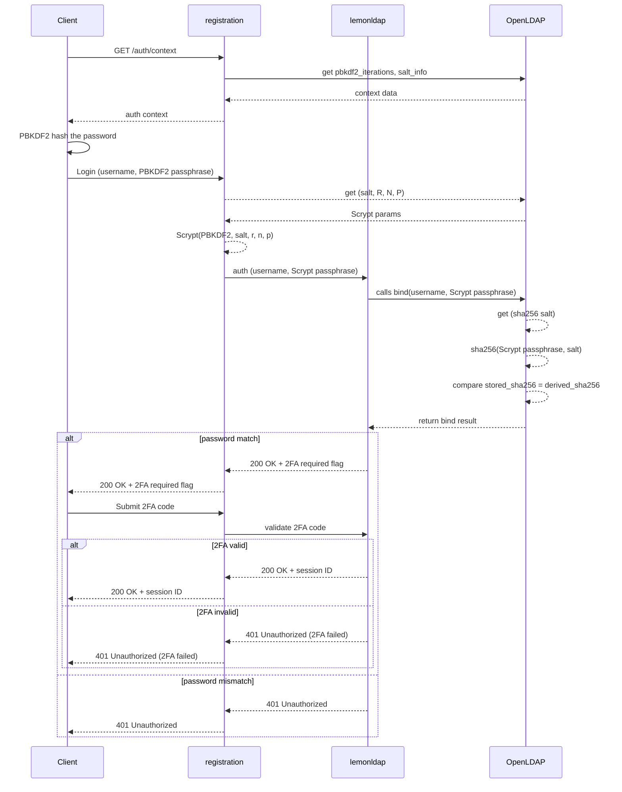

## Status

- Date: 17/07/2025
- Status: Validated
- Updated: 01/09/2025

## Context

To migrate Cozy users to the Twake Workplace platform, we need to implement the same password hashing mechanism and authentication approach used in the Cozy Stack. This achieves the following:

- Migrated Cozy users will continue to use their old passwords to log in.
- Existing and new Twake Workplace users will have triple-hashed passwords instead of the current clear text.
- Improves Twake Workplace security substantially.
- Migrated Cozy users who had 2FA before will continue to use it.
- Twake Workplace users can have 2FA in their auth flow.

### Resources

- How password hashing works in Cozy: [https://docs.cozy.io/en/cozy-stack/bitwarden/#setup](https://docs.cozy.io/en/cozy-stack/bitwarden/#setup)
- LDAP and password encryption: [https://www.redpill-linpro.com/techblog/2016/08/16/ldap-password-hash.html](https://www.redpill-linpro.com/techblog/2016/08/16/ldap-password-hash.html)

### System requirements

- The backend services can never know the clear-text password of the user; it is not transmitted over the network.
- Migrated Cozy users still log in with no issues.
- Twake Workplace users must have stored hashed passwords.
- LemonLDAP must perform the final password comparison.
- Users can have 2FA enabled (and migrated).

## Decision

Implement a two-phase password hashing mechanism modeled after Cozy Stack's approach, integrating both client-side and backend-side operations to ensure password security and compatibility:

- Client-side hashing in the registration login flow using PBKDF2.
- Use LemonLDAP 2FA module and develop the UI interface for registration, and communicate between both services using API calls.
- Use OpenLDAP to hash SHA256 the Scrypt passwords and manage comparison.
- Cannot create sessions if the SHA256 hash is leaked.

## Flow

### 1 - The registration client-side hashing

- The login form fetches the user's (if found, otherwise uses default) authentication context (domain + PBKDF2 iterations) before submission.
- The raw password is hashed using **PBKDF2** in the browser (using a salt derived from the domain and the iterations).
  - _The domain salt and iterations are stored in OpenLDAP after signup / migration._
- The derived PBKDF2 hash is base64 encoded and submitted via the login form to the registration backend form action.

### 2 - The registration backend processing

- The **PBKDF2** hash is **Scrypt** hashed using crypto parameters stored in LDAP (salt, N, R, P).
  - _The salt, N, R, P are stored in OpenLDAP after signup / migration._
- Forwards the login and passphrase to **LemonLDAP's authentication API**.

### 3 - LemonLDAP authentication

- Receives the base64 string of the Scrypt hashed passphrase (not the raw password and not the PBKDF2).
- LemonLDAP performs an LDAP bind to check the login.
- OpenLDAP **SHA256** hashes the password using the stored salt and performs the password check: **`SHA256(base64(Scrypt(PBKDF2)))`**
- If the password match fails, it responds 401 Unauthorized.
- If the password matches but 2FA is enabled for the user, respond 200 OK with a flag indicating 2FA required.
- Otherwise, it returns a valid user session.

### 4 - The registration 2FA handling

- If 2FA is required, the registration shows a 2FA modal to collect the 2FA code.
- The client submits the 2FA code to the registration backend.
- Registration forwards the 2FA code to LemonLDAP.
- LemonLDAP verifies the 2FA code.
- If valid, LemonLDAP returns the session token.
- If invalid, returns 401 Unauthorized.

## Hashing steps

### Client-side

- masterkey = **`PBKDF2(cleartext_password, salt, iterations)`**
- pbkdf2_hash = `PBKDF2(cleartext_password, masterkey, 1)`

### Registration backend

- Scrypt_hash = `Scrypt(pbkdf2_hash, salt, R, N, P)`
  - salt, R, N, P are stored in LDAP separate from the hash
- login_password = `base64(Scrypt_hash)`

### OpenLDAP

- final_password = `SHA256(login_password, salt)`
  - the salt is stored by OpenLDAP alongside the hash: [ref](https://www.redpill-linpro.com/techblog/2016/08/16/ldap-password-hash.html)
  - format: `$<id>[$<param>=<value>(,<param>=<value>)*][$<salt>[$<hash>]]`

## Sequence

## Consequences

- Authentication via the LemonLDAP portal will not be possible; only registration is the main login gateway.
- If Scrypt parameters are improperly stored or fetched, login will fail -- monitoring is needed.
- 2FA validation monitoring is needed.
- Since IMAP requires login + password, we will need to create "app accounts". To do that, we need to have 2 branches in the LDAP: one for the main account (with this mechanism), and another for app accounts with only SHA256 from OpenLDAP.

## Implementation details

- Implement the client-side PBKDF2 passphrase hashing in the registration application.
- Extend the registration backend to detect and relay the 2FA required status.
- Build a 2FA detection and submission flow in registration.
- Build a 2FA activation / configuration flow in registration + LemonLDAP.
- Integrate LemonLDAP 2FA validation endpoint in registration backend.
- Enable SHA256 password hashing.

For new users:

- Integrate the Scrypt hashing in the user creation flow in registration.

For old Twake Workplace users:

- Create a script to perform the hashing of the password and migrate the users.

## Alternatives considered

### Scrypt the PBKDF2 hashed password in the registration backend and transmit to LemonLDAP for comparison

In this approach, the registration backend would apply the Scrypt hashing directly to the PBKDF2-derived passphrase and transmit the final Scrypt hash to LemonLDAP, which would perform a simple string comparison against the stored hash.

**Pros:**

- LemonLDAP does not need to implement Scrypt hashing logic.
- Simplifies LemonLDAP responsibilities.

**Cons:**

- The Scrypt hash effectively becomes a reusable credential if used this way: anyone with the correct `scrypt$...` string can authenticate without knowing the real password or passphrase.
- Defeats the whole purpose of secure password hashing.
- Makes the hash equivalent to a cleartext password; if intercepted, the attacker could authenticate directly via the LemonLDAP API.
- Introduces a major attack vector: an attacker could replay a leaked hash via the LemonLDAP auth API.

**Rejected due to security risks (mainly if hashes got leaked or a database breach), but considered as a V1 until we have a proper constant-time comparison Scrypt plugin in LemonLDAP. This is only considered if LemonLDAP is hidden from the outside world.**

## Security Considerations

- LemonLDAP auth API must not be accessible from outside the cluster.
- Parameter validation: enforce sane N, r, p ranges.
