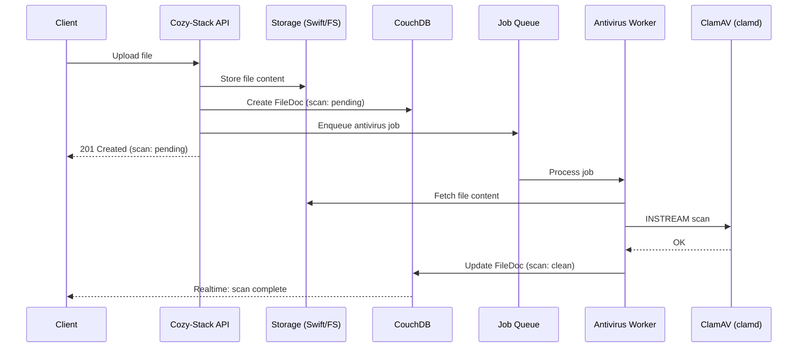

## Status

Proposed

## Context

Twake Workplace (Cozy-Stack) allows users to upload files that are stored in their personal cloud. These files can be shared with other users and accessed from various applications.

Twake Mail uses ClamAV for virus scanning, making it a natural choice for consistency across the platform.

## Proposal



### In FileDoc

```go
type AntivirusScan struct {
    Status    string    `json:"status"`     // "pending", "clean", "infected", "error", "skipped"
    ScannedAt time.Time `json:"scanned_at,omitempty"`
    Threat    string    `json:"threat,omitempty"`    // threat name if infected
    Engine    string    `json:"engine,omitempty"`    // "clamav"
    Version   string    `json:"version,omitempty"`   // signature database version
}
```

### Job Worker

Create a new worker `worker/antivirus/` that:

- Connects to clamd via TCP socket (configurable host:port)
- Uses INSTREAM command to scan file content
- Updates file document with scan results
- Emits realtime events for UI updates

```yaml
default:
  antivirus:
    enabled: true
    address: "localhost:3310" # clamd TCP address
    max_file_size: 104857600 # 100MB - files larger are skipped
    timeout: 300s # scan timeout
    on_infected: "quarantine" # "quarantine" | "block" | "notify"
    notifications:
      email_on_infected: true # send email when infected file detected
    actions:
      pending: ["download", "share", "preview", "delete"]
      clean: ["download", "share", "preview", "delete"]
      infected: ["delete"]
      error: ["download", "share", "preview", "delete"]
      skipped: ["download", "share", "preview", "delete"]
cnb:
  antivirus:
    enabled: true
    address: "localhost:3310" # clamd TCP address
    max_file_size: 104857600 # 100MB - files larger are skipped
    timeout: 300s # scan timeout
    on_infected: "quarantine" # "quarantine" | "block" | "notify"
    notifications:
      email_on_infected: true # send email when infected file detected
    actions:
      pending: ["preview", "delete"]
      clean: ["download", "share", "preview", "delete"]
      infected: ["delete"]
      error: ["delete"]
      skipped: ["delete"]
```

### Get Antivirus Configuration

`GET /settings/context/`

```json
{
  "data": {
    "type": "io.cozy.settings",
    "id": "io.cozy.settings.context",
    "attributes": {
      "antivirus": {
        "enabled": true,
        "actions": {
          "pending": [
            "download",
            "share",
            "preview",
            "delete",
            "priority_scan"
          ],
          "clean": ["download", "share", "preview", "delete"],
          "infected": ["delete"],
          "error": ["download", "share", "preview", "delete", "priority_scan"],
          "skipped": ["download", "share", "preview", "delete"]
        }
      }
    }
  }
}
```

## Alternatives

- Alternative 1: Synchronous Scanning (Blocking Upload)
- Alternative 2: Proxy Architecture (Clammit) [https://github.com/ifad/clammit](https://github.com/ifad/clammit)

## Decision

## Consequences
