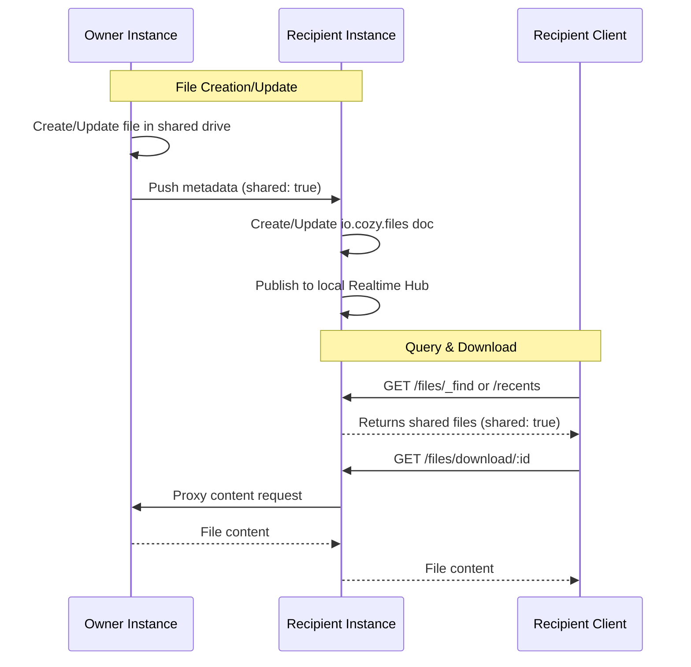
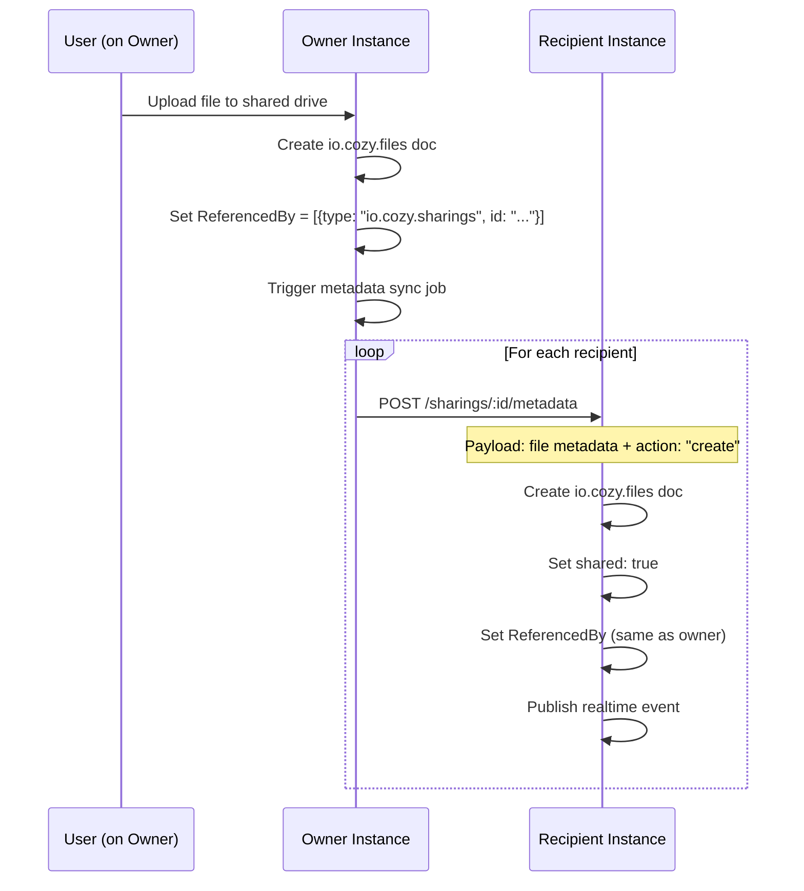
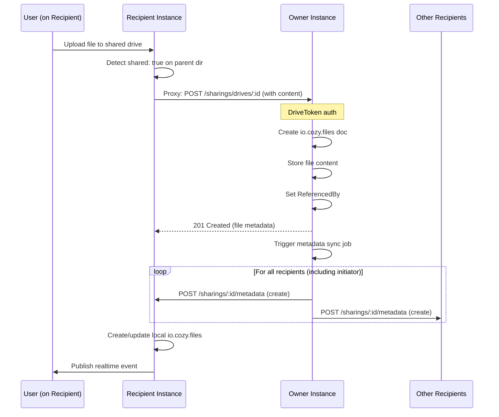

## Status

Proposed

## Context

The current Cozy-Stack architecture has separate APIs for personal files (`/files/`) and shared drives (`/sharings/drives/`).

### Problems

1. **Shared files not in `io.cozy.files`**: On recipient instances, shared drive files don't exist as `io.cozy.files` documents. Recipients only have `io.cozy.sharings` records pointing to the owner's files.
2. **`/recents` and `/search` don't include shared files**: These endpoints query local `io.cozy.files`, so shared drive files are excluded from recent files and search results.
3. **Different endpoints**: Clients must use `/files/:id` for personal files and `/sharings/drives/:sharing-id/:file-id` for shared drive files.
4. **Separate WebSocket connections**: Real-time updates require opening a WebSocket per shared drive (`/sharings/drives/:id/realtime`) instead of a single subscription to `io.cozy.files`.

### Main Goal

**Have a single `io.cozy.files` doctype** that includes both personal and shared files, enabling:

- `/recents` endpoint to include shared drive files
- `/search` endpoint to find shared drive files
- Mango queries with `shared: true/false` filter
- Single WebSocket subscription for all file events

## Proposal

Implement **metadata replication** from owner to recipients: sync file metadata (not content) so shared drive files appear as first-class `io.cozy.files` documents on recipient instances.



### Client queries

```json
{ "selector": { "trashed": false }, "sort": [{ "updated_at": "desc" }] }

// Get only shared files
{ "selector": { "shared": true }, "use_index": "by-shared-updated" }

// Get only personal files
{ "selector": { "shared": { "$ne": true } } }

// No changes needed - recipients subscribe to local `io.cozy.files`:
{ "method": "SUBSCRIBE", "payload": { "type": "io.cozy.files" } }
```

## Implementation

```go
type FileDoc struct {
    // ... existing fields ...

    // Existing - keeps detailed sharing relationship
    ReferencedBy []couchdb.DocReference `json:"referenced_by,omitempty"`
    // Example: [{"type": "io.cozy.sharings", "id": "sharing-123"}]

    // NEW - computed boolean for efficient queries
    Shared bool `json:"shared,omitempty"`  // true if from shared drive
}

// New CouchDB Index
{
    name:    "by-shared-updated",
    doctype: consts.Files,
    fields:  []string{"shared", "updated_at"},
}
```

### Workflows

**Create file (Owner)**



**Create file (Recipient)**



### Metadata sync worker

```go
job.AddWorker(&job.WorkerConfig{
    WorkerType:   "share-metadata-sync",
    Concurrency:  runtime.NumCPU(),
    MaxExecCount: 1,
    Reserved:     true,
    Timeout:      5 * time.Minute,
    WorkerFunc:   WorkerMetadataSync,
})

// model/sharing/metadata_sync.go - New file, reuses patterns from replicator.go
type MetadataSyncMsg struct {
    SharingID string `json:"sharing_id"`
    Action    string `json:"action"`    // "create", "update", "delete", "bulk"
    FileID    string `json:"file_id"`   // Single file, or empty for bulk
    Errors    int    `json:"errors"`
}
```

### Recipient metadata replication endpoint

```go
// web/sharings/replicator.go

group.POST("/:sharing-id/iocozyfiles/metadata_sync", DriveMetadataSync, checkSharingWritePermissions)
```

### Real-time Event Bridge

The missing piece is: when file changes on owner, push metadata to recipients, recipients update local `io.cozy.files`, recipients publish to their LOCAL realtime hub.

### Content Proxy for Shared Files

When downloading a file with `shared: true`, proxy content from owner.

### Drawbacks

- Data inconsistency when replication failed due to any reason on the recipient's side. We will need "WAL" on the recipient's side to track updated and redeliver them in case of errors, and merging these updates to keep this consistency can be challenging.
- Replication can be slow even without the file content. Make test with the current sharing API for contacts (doc type without content).

## Alternatives

### Single Database for recents and search endpoint

TODO

### One database for the cozy-stack

TODO -- see [cozy-nextdb](https://github.com/cozy-labs/cozy-nextdb/blob/main/core/document.go)

## Consequences
