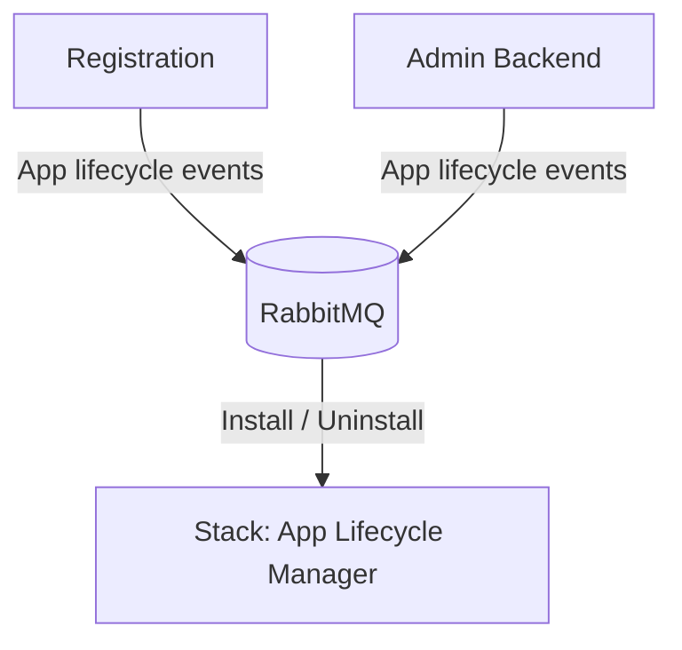
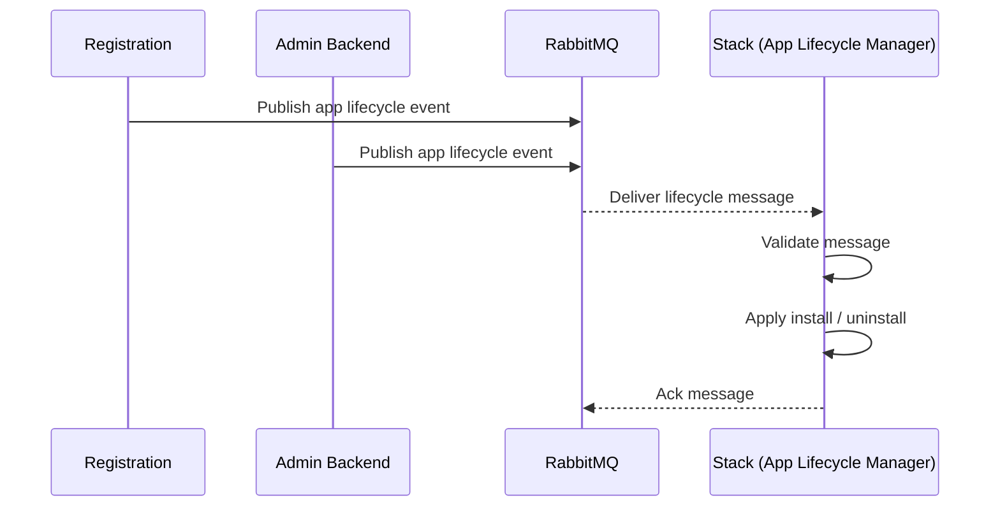

Date: 18/12/2025
Status: `proposed`

## Context

In Twake workplace B2B, we need to dynamically install and uninstall applications for users depending on events related to user permissions or organization domain status.

Use cases:

- Install the `admin` application for the organization owners/admins
- Install the `chat` and `mail` applications once the organization's domain DNS records are validated
- Uninstall the `admin` application if we change the organization user permission from admin to a regular user, etc.

To achieve this, we need to communicate with the `stack` that is currently handling the application installation for cozy instances.

## Decision

Use RabbitMQ to send installation/uninstallation messages to the `stack` to achieve our goal.

## Flow



## Sequence



## RabbitMQ message format

Only one message type to handle the operations:

```json
{
  "source": "registration",
  "action": "install",
  "slug": "admin",
  "instanceFqdn": "khaled.twake.app",
  "reason": "role change",
  "timestamp": 1757002525828
}
```

| Field          | Description                                               |
| -------------- | --------------------------------------------------------- |
| `source`       | The application requesting the operation (for logging)    |
| `action`       | `"install"` or `"uninstall"`                              |
| `slug`         | The application slug: `"admin"`, `"chat"`, `"mail"`, etc. |
| `instanceFqdn` | The Cozy instance in question                             |
| `reason`       | Why this operation is performed                           |
| `timestamp`    | When the event was created                                |

## Alternatives considered

### 1 - Use the stack API to install apps

**Pros:**

- Immediate feedback on the installation status

**Cons:**

- Heavily couples applications to the stack APIs
- Requires setting up OAuth clients for each app and exchanging tokens to be able to call the stack

**Decision:** Dropped in favor of using RabbitMQ messages.
