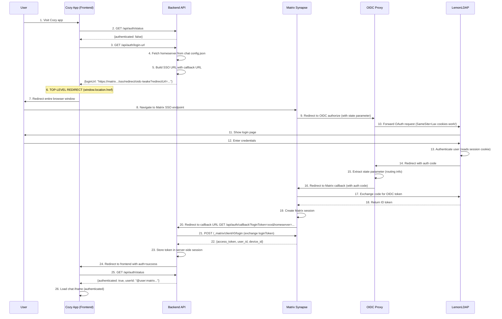

Date: 26/01/2026
Status: `proposed`

## Context

We need to enable auto login for Twake Chat embedded in an iframe within the Twake Chat Cozy app. The challenges are:

- LemonLDAP session cookies are set with `SameSite=Lax` for security considerations (to prevent XSS and similar attacks).
- Modern browsers block `SameSite=Lax` cookies in cross-domain iframe contexts.
- The SSO flow breaks, resulting in the user having to login within the iframe/chat application.

### Why SameSite=Lax Doesn't Work in Iframes

- `SameSite=Lax` cookies are only sent in **top-level navigations** (when the user directly navigates to a page).
- In **cross-domain iframes**, the browser treats requests as "cross-site" and blocks `SameSite=Lax` cookies.
- This is a security feature to prevent CSRF attacks, but it breaks legitimate SSO flows in embedded contexts.
- Alternative solutions like `SameSite=None` require HTTPS everywhere and are less secure.

## Possible Solutions

- Eliminate iframe embedding and host Twake Chat at the top-level domain.
- Configure LemonLDAP session cookies with `SameSite=None` to support cross-site contexts.
- Implement a top-level SSO redirect mechanism as a workaround for blocked third-party cookies. (selected)

## Decision

Implement a **Top-Level Redirect** solution that performs SSO authentication at the browser window level (not within the iframe), then stores the authentication token server-side in a session cookie.

## Solution Architecture

### Authentication Flow

### Detailed Flow Steps

The steps marked below are handled by the newly introduced top-level redirect authentication flow:

1. **User visits Cozy app** -- React component loads
2. **Check authentication** -- Frontend calls `GET /api/auth/status`
3. **Get login URL** -- Backend fetches homeserver from chat config, builds Matrix SSO URL
4. **Top-level redirect** -- `window.location.href = loginUrl` (entire browser window, not iframe!)
5. **Matrix initiates SSO** -- Redirects to OIDC Proxy
6. **OIDC Proxy forwards** -- To LemonLDAP with single allowed redirect URI
7. **LemonLDAP authenticates** -- Cookies work because it's top-level navigation
8. **LemonLDAP redirects** -- Back to OIDC Proxy with authorization code
9. **OIDC Proxy routes** -- Uses state parameter to redirect to correct Matrix callback
10. **Matrix processes** -- Exchanges code for OIDC token, creates Matrix session
11. **Matrix redirects** -- To backend callback URL with `loginToken`
12. **Backend exchanges** -- `loginToken` for Matrix access token via Matrix API
13. **Backend stores** -- Access token in server-side session cookie
14. **Backend redirects** -- To frontend with `auth=success` parameter
15. **Frontend loads iframe** -- Chat application authenticates using session cookie

## Why This Works

### Key Technical Insight

**Top-level navigations allow `SameSite=Lax` cookies, but cross-domain iframes don't.**

By redirecting the entire browser window (not just the iframe), we ensure:

- All navigation happens at the top-level
- `SameSite=Lax` cookies are sent by the browser
- SSO flow completes successfully
- Token is stored server-side in a session cookie
- Iframe can then load with authentication via session
