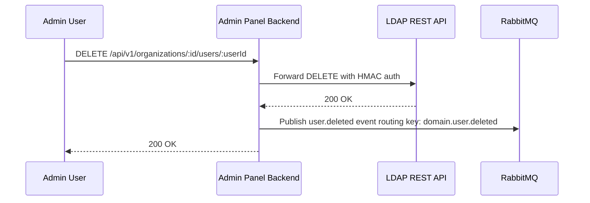
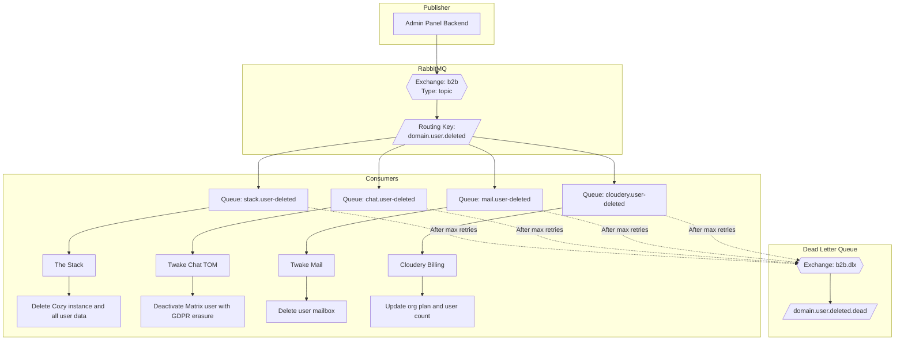

Date: 03/02/2026
Status: `proposed`

## Context

In the Twake Workplace B2B platform, organizations manage their users through the Admin Panel. When an organization administrator deletes a user, this action must be propagated to multiple downstream services that maintain user-related data and resources:

- **The Stack (Cozy)**: Manages user instances
- **Chat (Matrix/Synapse)**: Maintains user accounts, chat history, and media
- **Mail**: Manages user mailboxes and email data
- **Cloudery**: Manages organization billing plans based on active user count

## Decision

We will implement an event-driven architecture where the Admin Panel Backend publishes a **user deletion event** to RabbitMQ whenever a user is deleted (marked as soft deleted). All downstream services subscribe to this event and handle cleanup according to their specific requirements.

### Architecture Overview

The Admin Panel Backend acts as the **single source of truth** for user lifecycle events. When a user deletion is detected (via the LDAP REST proxy), the backend:

1. Intercepts the successful DELETE response from LDAP REST
2. Enriches the event with user details (internal email, domain, workplace FQDN)
3. Publishes a `user.domain.deleted` event to RabbitMQ
4. Each downstream service processes the event independently

### Sequence



### Flow



### RabbitMQ Message Structure

The user deletion message follows the established lifecycle message pattern:

```typescript
interface UserDeletionEvent {
  /** Message emitter - always 'admin-panel' */
  emitter: "admin-panel";

  /** Organization workplace FQDN (e.g., 'acme.twake.app') */
  workplaceFqdn: string;

  /** User's internal email address (e.g., 'john.doe@acme.com') */
  internalEmail: string;

  /** Human-readable reason for deletion */
  reason: string;

  /** Organization UUID */
  organizationId: string;

  /** User ID (username/uid) */
  userId: string;

  /** Organization's custom domain (e.g., 'acme.com') */
  domain: string;
}
```

Example:

```json
{
  "emitter": "admin-panel",
  "workplaceFqdn": "acme.twake.app",
  "internalEmail": "john.doe@acme.twake.app",
  "reason": "user deleted",
  "organizationId": "550e8400-e29b-41d4-a716-446655440000",
  "userId": "john.doe",
  "domain": "acme.com"
}
```

### RabbitMQ configuration

| Configuration            | Value                 |
| ------------------------ | --------------------- |
| **Exchange**             | `b2b`                 |
| **Exchange Type**        | `topic`               |
| **Routing Key**          | `domain.user.deleted` |
| **Dead Letter Exchange** | `b2b.dlx`             |

## Consumer Responsibilities

### The Stack

**Queue:** `stack.user.deleted.queue`
**Binding:** `domain.user.deleted`
**Actions:**

- Delete the user's Cozy instance
- Remove all personal data, files, and applications
- Clean up any associated cloud storage
- Revoke all active sessions and tokens

**Idempotency:** Check if the instance exists before attempting deletion. Return success if already deleted.

### Chat (TOM SERVER)

**Queue:** `chat.user-deleted.queue`
**Binding:** `domain.user.deleted`
**Actions:**

1. Call the Matrix Admin API to deactivate the user account:

   ```bash
   POST /_synapse/admin/v1/deactivate/@{userId}:{domain}

   {
     "erase": true
   }
   ```

2. The Matrix deactivation with GDPR erasure performs:
   - Unbind 3PIDs from identity server
   - Remove all 3PIDs from homeserver
   - Delete all devices and E2EE keys
   - Delete all access tokens
   - Delete all pushers
   - Delete password hash
   - Remove user from all rooms
   - Remove display name and avatar URL
   - Mark the user as GDPR-erased

### Mail

**Queue:** `mail.user-deleted.queue`
**Binding:** `domain.user.deleted`
**Actions:**

- Delete the user's mailbox from the mail server
- Remove all stored emails and attachments
- Clean up any mail aliases and forwarding rules

### Cloudery

**Queue:** `cloudery.user.deleted.queue`
**Binding:** `domain.user.deleted`
**Actions:**

- Recalculate the organization's billing plan if necessary
- Generate a billing adjustment if in the middle of a billing cycle

**Idempotency:** Use the combination of `organizationId` + `userId` as a deduplication key. Track processed deletions to prevent double-counting.

## Failure Handling

### Retry Strategy

Each consumer implements retry logic with exponential backoff:

| Attempt | Delay             |
| ------- | ----------------- |
| 1       | Immediate         |
| 2       | 2 seconds         |
| 3       | 4 seconds         |
| 4+      | Dead Letter Queue |

### Dead Letter Queue (DLQ)

Failed messages after max retries are routed to:

- **DLX Exchange:** `b2b.dlx`
- **DLQ Routing Key:** `domain.user.deleted.dead`

Operations teams can:

1. Monitor DLQ for failed deletions
2. Investigate the root cause
3. Manually replay messages after fixing issues
4. Alert on DLQ growth for systemic issues

### Partial Failure Scenarios

| Scenario                       | Impact                     | Resolution                       |
| ------------------------------ | -------------------------- | -------------------------------- |
| Stack fails, others succeed    | Orphaned Cozy instance     | Manual cleanup or DLQ replay     |
| Chat fails, others succeed     | User retains Matrix access | DLQ replay after Matrix recovery |
| Cloudery fails, others succeed | Billing discrepancy        | DLQ replay; reconciliation job   |

**Good to have:** Implement a reconciliation job that periodically compares LDAP user lists with each downstream service to detect orphaned resources.

## Benefits

1. **Loose Coupling**: Each service handles deletion independently without direct dependencies
2. **Scalability**: Services can process deletions at their own pace without blocking others
3. **Reliability**: Failed deletions are retried automatically with DLQ for manual intervention
4. **Auditability**: All deletion events are logged with correlation IDs for traceability
5. **Extensibility**: New consumers can subscribe to deletion events without modifying the publisher
6. **GDPR Compliance**: Consistent deletion across all services ensures data erasure requirements are met

## Considerations

### Eventual Consistency

User deletion is **eventually consistent** across services. There may be a brief window where:

- User is deleted from LDAP, but still has active sessions in chat
- Mailbox is deleted, but billing hasn't been updated yet

**Solution:**

- Each service should validate user existence before allowing new operations
- Set reasonable SLAs for event processing (e.g., < 5 minutes under normal conditions)

### Data Retention Requirements

Some data may need to be retained for legal/audit purposes:

- **Matrix:** Message history is preserved (only user metadata is erased)
- **Mail:** Consider archival requirements before permanent deletion
- **Billing:** Maintain deletion audit logs for financial reconciliation

### Security

- Events contain only necessary identifiers, not sensitive user data
- RabbitMQ connections use TLS in production
- Consumer services validate message signatures/origin if required
- Deletion actions are logged with the admin user who initiated the deletion

## Alternatives Considered

### 1. Synchronous API Calls

**Approach:** Admin Panel calls each service's deletion API synchronously.

**Rejected because:**

- Increased latency for the admin user
- Single point of failure -- one service down blocks all deletions
- Tight coupling between services
- No automatic retry mechanism

### 2. Database-Based Event Table

**Approach:** Write deletion events to a shared database table, and services poll for changes.

**Rejected because:**

- Polling introduces latency
- The database becomes a bottleneck and a single point of failure
- More complex to implement correctly (handling race conditions, ordering)

### 3. Webhook-Based Notifications

**Approach:** Admin Panel sends HTTP webhooks to each service.

**Rejected because:**

- No built-in retry mechanism
- Services must expose public endpoints
- Harder to manage at scale
- No message persistence if the service is temporarily down
