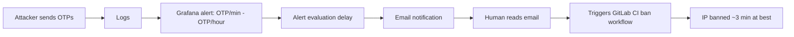
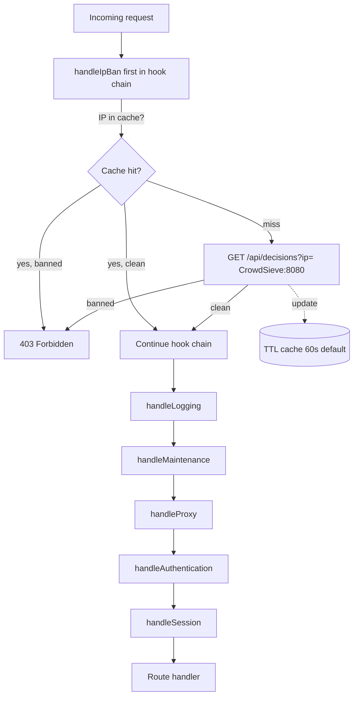
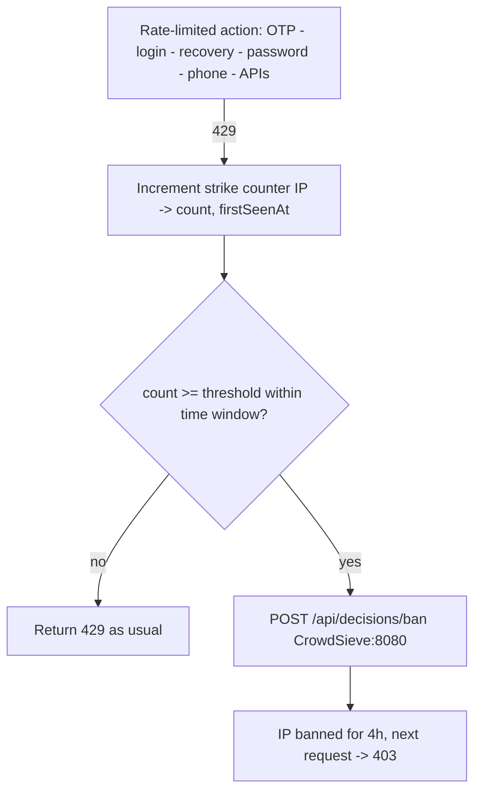

Date: 02/03/2026
Status: `proposed`

## Context

The registration app is a public-facing service that handles SMS/OTP verification, login, and account recovery. Each OTP sent costs real money (Twilio/Octopush), and the service is a natural target for abuse.

### The financial problem

Rate limiting caps OTP requests to 1/min and 25/day per IP. That sounds protective, but it still means a single attacker can burn through 25 (configurable) paid SMS per day, and attackers rotate IPs. Even within the existing limits, a determined spammer drains our Octopush credits over time. Rate limiting slows them down; it doesn't stop them.

### The response time problem

Today's incident response chain looks like this:



By the time a ban is in place, the attacker has already consumed credits. The entire chain -- log ingestion, alert evaluation, human reaction, CI pipeline execution -- introduces minutes of delay. That's an eternity when each second can mean another paid SMS.

### The permanent ban problem

When we do ban an IP, the ban is permanent. That's dangerous because many IPs are shared:

- **Mobile networks**: Carriers use CGNAT -- thousands of users share the same public IP. A permanent ban on a mobile IP blocks legitimate users indefinitely.
- **Home/office WiFi**: One abuser on a shared network gets everyone on that IP banned forever.

There's no expiration, no automatic unban. Once an IP is blocked, it stays blocked until someone manually removes it -- which nobody does, because there's no visibility into which bans exist or whether they're still relevant.

### What CrowdSec/CrowdSieve gives us

CrowdSieve is going to be deployed in our infrastructure as a CrowdSec filtering proxy with a CrowdSec local server. It provides exactly what we're missing:

- **Time-limited bans**: Ban an IP for 4 hours instead of forever. The spammer is stopped, and shared-IP collateral damage resolves itself.
- **REST API**: Programmatic ban creation and lookup -- no CI pipeline, no human in the loop.
- **Dashboard**: Visibility into active bans, history, and manual unban capability.
- **Decision replication**: Bans propagate across all services using CrowdSec.

### What we need

1. **Automated detection**: Identify IPs that repeatedly hit rate limits across all rate-limited endpoints -- OTP, login, recovery, password change, phone change, and API endpoints.
2. **Instant enforcement**: Ban those IPs via CrowdSieve within seconds, not minutes.
3. **Time-limited bans**: Bans expire automatically, so shared IPs aren't collateral damage forever.
4. **Configurability**: Thresholds and ban durations are tunable per environment without code changes.

## Decision

Integrate the registration app with CrowdSieve's REST API to both **report** abusive IPs and **enforce** active bans. The integration has two sides: an outbound path that escalates repeated rate-limit violations into ban decisions, and an inbound path that checks every incoming request against CrowdSieve before processing it.

### Inbound: ban check on every request



### Outbound: escalation from rate limiting



### Inbound: Ban enforcement in the hook chain

A new `handleIpBan` hook runs **first** in the `sequence()` -- before logging, auth, or session handling. It extracts the client IP (`x-forwarded-for` or `getClientAddress()`), queries CrowdSieve, and returns a 403 immediately if the IP has an active ban decision. Health checks are excluded, so monitoring still works.

To avoid calling CrowdSieve on every single request, we use an **in-memory TTL cache** keyed by IP. A ban lookup result is cached for a configurable duration (default: 60 seconds). This means a newly banned IP might still get through for up to 60 seconds, which is an acceptable tradeoff for not adding latency to every request.

### Outbound: Escalation from rate limiting

When a rate-limited request is rejected (429), we don't just log it -- we also increment a **strike counter** for that IP. This is a simple in-memory map: `IP -> { count, firstSeenAt }`. When the count exceeds a configurable threshold within a time window (e.g., 10 violations in 10 minutes), we call CrowdSieve's `POST /api/decisions/ban` to ban the IP for a configurable duration.

The strike counter is lightweight and intentionally ephemeral -- if the app restarts, counters reset. This is fine because CrowdSieve is the durable source of truth for bans, and a restart means the spammer just gets a fresh set of chances before being banned again.

What gets reported -- every rate-limited action in the app, not just OTP:

- **OTP sent** (the most expensive -- each one costs an SMS)
- **Login attempts**
- **Account recovery**
- **Password change**
- **Phone change**
- **API endpoints** (check-phone, check-email, suggest-nicknames)

## CrowdSec vocabulary

There are two roles to interact with a local CrowdSec Server (LAPI):

- **"Bouncer"**: an IP filter that queries CrowdSec using a `X-Api-Key` to get active decisions (can be a Nginx module, a set of firewall rules, a custom plugin like LemonLDAP-NG's CrowdSec-plugin, Twake-Mail filter, etc.)
- **"Agent" or "Watcher"**: a software that analyzes logs (async) or current traffic (sync) and reports its alerts or decisions (a decision is an alert with "remediation"). It needs an account provided by the CrowdSec server (machine_id + password).

A local CrowdSec server (LAPI) provides decisions to bouncers:

- Community decisions: free, shared by the api.crowdsec.net (CAPI)
- Decisions issued from lists with subscription
- Local decisions

A local CrowdSec server (LAPI) forwards its decisions to:

- The central CrowdSec servers (CAPI) by default
- A local [CrowdSieve](https://github.com/linagora/crowdsieve) (Linagora project) server which filters alerts/decisions, forwards non-filtered alerts/decisions to CAPI, and provides a UX to see alerts and add manual decisions

The **crowdsec** Debian package provides some parsers, especially Nginx's logs parser which detects some known malwares.

## API Contracts

### Checking an IP (inbound) - Bouncer

```
GET /api/decisions?ip=<ip>
X-Api-Key: <crowdsieve-api-key>

Response 200:
[{
  "ip": "1.2.3.4",
  "results": [
    {
      "server": "lapi-1",
      "decisions": [
        {
          "type": "ban",
          "scope": "ip",
          "value": "1.2.3.4",
          "duration": "4h",
          "scenario": "registration/otp-abuse",
          "until": "2026-03-03T12:00:00Z"
        }
      ]
    }
  ],
  "shared": []
}]
```

The IP is considered banned if a decision exists in `results[].decisions` or `shared`.

### Banning an IP using a custom software (outbound)

**Configuration:** Ask the CrowdSec LAPI administrator for a machine_id with password.

**Connection:**

```
POST /api/v1/watchers/login
Content-Type: application/json

{"machine_id": "name", "password": "password"}

HTTP 200
Content-Type: application/json

{"expire": "2026-...", "token": "tokenValue"}
```

**Ban request:**

```
POST /api/decisions/ban
Authorization: Bearer <tokenValue>
Content-Type: application/json

[
  {
    "machine_id": "my-crowdsec-lapi",
    "scenario": "crowdsecurity/http-bad-user-agent",
    "scenario_hash": "a1b2c3d4e5f6",
    "scenario_version": "1.0",
    "message": "Ip 1.2.3.4 performed 'crowdsecurity/http-bad-user-agent' (5 events over 2m30s)",
    "events_count": 5,
    "start_at": "2024-03-15T10:00:00Z",
    "stop_at": "2024-03-15T10:02:30Z",
    "capacity": 5,
    "leakspeed": "30s",
    "simulated": false,
    "source": {
      "scope": "ip",
      "value": "1.2.3.4",
      "ip": "1.2.3.4",
      "cn": "CN",
      "as_number": "4134",
      "as_name": "CHINANET"
    },
    "decisions": [
      {
        "origin": "crowdsec",
        "type": "ban",
        "scope": "ip",
        "value": "1.2.3.4",
        "duration": "4h",
        "scenario": "crowdsecurity/http-bad-user-agent",
        "simulated": false
      }
    ],
    "events": [
      {
        "timestamp": "2024-03-15T10:00:15Z",
        "meta": [
          { "key": "http_user_agent", "value": "curl/7.68.0" },
          { "key": "http_path", "value": "/wp-admin" },
          { "key": "source_ip", "value": "1.2.3.4" }
        ]
      }
    ]
  }
]

Response 200:
{ "success": true, "message": "...", "server": "..." }
```

### Banning an IP using a CrowdSec parser (TMail for example)

**Configuration:** Configure local CrowdSec system to use the remote CrowdSec instance:

- Ask for IP whitelisting
- Enroll: `sudo cscli lapi register -u https://the.crowdsec.server.twake.app:8843 --machine mySuperName`
- Ask CrowdSec LAPI admin to accept your new machine (using `cscli machines validate mySuperName`)
- Disable local CrowdSec System inside `/etc/crowdsec/config.yaml` (and restart the service):

```yaml
api:
  server:
    enable: false
```

Then follow parser doc.

## Configuration

All configurable via environment variables, consistent with the existing rate-limit pattern:

| Variable                        | Default | Description                                                                          |
| ------------------------------- | ------- | ------------------------------------------------------------------------------------ |
| `CROWDSIEVE_API_URL`            | --      | CrowdSieve base URL (e.g., `http://crowdsieve:8080`). Integration disabled if unset. |
| `CROWDSIEVE_API_KEY`            | --      | API key for `X-Api-Key` header                                                       |
| `CROWDSIEVE_LAPI_SERVER`        | --      | Target LAPI server name for ban decisions                                            |
| `CROWDSIEVE_BAN_THRESHOLD`      | `10`    | Rate-limit violations before banning                                                 |
| `CROWDSIEVE_BAN_WINDOW_MINUTES` | `10`    | Time window for counting violations                                                  |
| `CROWDSIEVE_BAN_DURATION`       | `4h`    | How long the ban lasts (short enough to not permanently harm shared IPs)             |
| `CROWDSIEVE_CACHE_TTL_SECONDS`  | `60`    | How long to cache decision lookups                                                   |
| `CROWDSIEVE_TIMEOUT_MS`         | `3000`  | HTTP timeout for CrowdSieve API calls                                                |

When `CROWDSIEVE_API_URL` is not set, the integration is completely inert -- no hooks, no reporting. This keeps local development and testing simple.

## Alternatives Considered

### CrowdSec bouncer on the load balancer

Install a CrowdSec bouncer at the load balancer level to block IPs before they reach any service.

- **Pro**: Blocks traffic at the edge -- lowest possible latency, protects all services at once.
- **Con**: We don't control the load balancer. It's managed infrastructure and we can't install custom bouncers or plugins on it.
- **Rejected because**: Not technically feasible in our current setup.

### CrowdSec bouncer on the nginx ingress

Install a CrowdSec bouncer on the Kubernetes nginx ingress controller.

- **Pro**: Still blocks traffic before it hits Node.js. Standard CrowdSec integration pattern for Kubernetes.
- **Con**: We don't have the access or permissions to modify the nginx ingress controller configuration. Even if we did, the ingress doesn't have application-level context -- it can't distinguish OTP requests from page loads.
- **Rejected because**: Not feasible given our infrastructure constraints, and wouldn't have the application-level awareness needed for abuse detection anyway.

## Consequences

### Positive

- **Stops the financial bleeding**: Banned IPs are rejected at the hook level -- they never reach the OTP action, so no SMS is sent, no credit is consumed.
- **Seconds, not minutes**: Ban happens the moment the threshold is crossed. No log pipeline, no Grafana delay, no human, no CI job. The current 3+ minute response time drops to under a second.
- **No more permanent bans**: Time-limited bans (default 4h) mean shared/mobile/NAT IPs aren't collateral damage forever. This is safer than what we have today.
- **Visibility**: CrowdSieve dashboard shows all active bans with history, reason, and manual unban. No more guessing which IPs are blocked or why.
- **Bans propagate**: Decision replication across CrowdSec LAPI servers means a ban from registration protects other services too.

### Negative

- New runtime dependency on CrowdSieve (mitigated by fail-open design).
- Small added latency on cache misses (~one HTTP round-trip to CrowdSieve, bounded by timeout).

### Risks

- **CrowdSieve becomes a bottleneck**: Mitigated by caching. Under normal traffic, most requests are cache hits. Under attack, we're banning aggressively so the number of unique IPs to check is bounded.
- **False positives from shared IPs**: Still possible, but the impact is fundamentally different from today -- a 4-hour ban vs. a permanent one. Start with generous thresholds and tighten based on real data. Dashboard provides instant manual unban as a safety valve.
