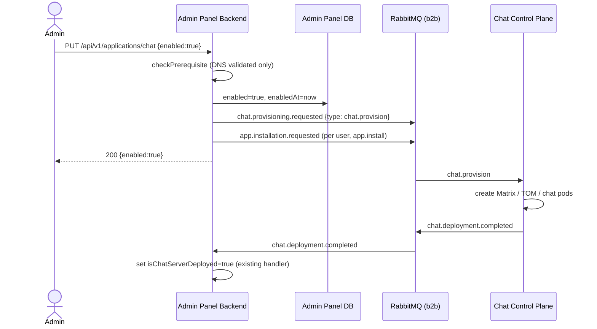
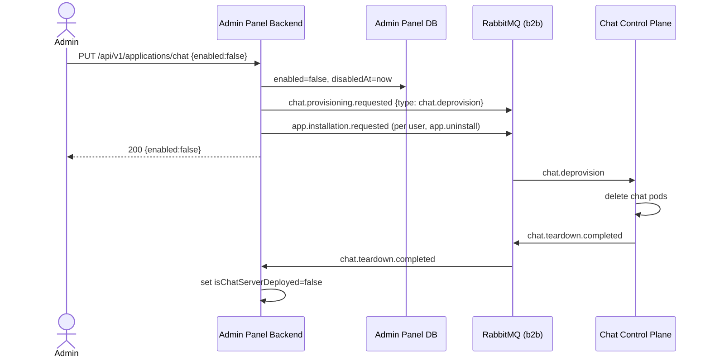

- Date: 21/05/2026
- Status: Proposed

## Context

The admin panel lets an organization admin toggle applications on and off via `PUT /api/v1/applications/:slug`. For chat, "enabled" today only reflects visibility: `toggleApplication()` flips `organizationApplications.enabled` and publishes **per-user** `app.install` / `app.uninstall` commands consumed by The Stack (Cozy) to show or hide the chat tile in each user's launcher.

The actual chat infrastructure (Matrix homeserver, TOM, chat server pods) is owned by a separate service, the **chat control plane**. It is provisioned out of band, and the only message it sends back to the admin panel is `chat.deployment.completed` (exchange `b2b`), which the admin panel consumes to set `isChatServerDeployed=true` and trigger the per-user installs.

There is no message in the other direction. The admin panel cannot ask the control plane to create or delete pods. As a result, disabling chat leaves the pods running (wasted compute), and the toggle cannot manage the underlying deployment at all.

We want the toggle to drive pod lifecycle:

- Toggle **on**: ask the control plane to create the chat pods.
- Toggle **off**: ask the control plane to delete the chat pods.

### Constraints

- RabbitMQ is the existing transport. The admin panel already publishes lifecycle commands and events on the `b2b` exchange and consumes `chat.deployment.completed` from it. The client uses confirm channels, persistent delivery, publish retry with exponential backoff, and a per-queue dead letter setup (quorum queues, `exchange.dlx`, `queue.dlq`, `routingKey.dead`).
- The current enable path requires chat to be **already deployed**: `checkPrerequisite('chat')` asserts `isOrganizationChatDnsValidated() && isOrganizationChatServerDeployed()`. If disabling deletes the pods and clears `isChatServerDeployed`, that prerequisite would make re-enabling impossible. The enable semantics have to change.
- Pods are **per organization** (one chat deployment per org), unlike the per-user app tile commands.

## Decision

Introduce an org-level command, published by the admin panel and consumed by the chat control plane, that requests creation or deletion of an organization's chat pods. Enabling the chat toggle now **triggers** deployment rather than requiring it.

### Architecture

Reuse the `b2b` exchange. Add one routing key, `chat.provisioning.requested`, carrying both create and delete, distinguished by a `type` field. This mirrors the existing `app.installation.requested` convention, where install and uninstall share one routing key and differ by `type`, and it pairs with the existing `chat.deployment.completed` event.

Enable flow:



Disable flow:



### Key Design Choices

**Enable triggers deployment; prerequisite drops to DNS-only.**
What: `checkPrerequisite('chat')` requires only `isOrganizationChatDnsValidated()`. Deployment becomes the result of enabling, confirmed asynchronously by `chat.deployment.completed`.
Why: keeping `isChatServerDeployed` as a hard gate makes re-enabling impossible once a disable has torn the pods down. The toggle records intent immediately; `isChatServerDeployed` tracks reality and is set when the control plane confirms.
Alternative considered: keep deployment as a prerequisite and add a separate "deploy" action. Rejected because it splits one user intent (turn chat on) across two operations with no product benefit.

**One shared routing key, type-discriminated.**
What: `chat.provisioning.requested` with `type` of `chat.provision` or `chat.deprovision`.
Why: consistent with the existing `app.installation.requested` install/uninstall pattern, and lets the control plane process create and delete for an org through a single ordered queue.
Alternative considered: two routing keys (`chat.provision.requested`, `chat.deprovision.requested`) for independent queues and concurrency. Rejected as the default because separate queues lose per-org ordering between a create and a closely following delete, which is the exact race we care about. Revisit if the control plane needs independent backpressure.

**Org-level message, not a per-user batch.**
What: one message per toggle, like `organization.deleted`, not one per user like `app.install`.
Why: a chat deployment is per organization. The per-user `app.install` / `app.uninstall` commands remain unchanged and additive; they manage the launcher tile, a different concern handled by a different consumer.

**Provisioning gates the per-user install on enable, but not the uninstall on disable.**
What: on enable, if the `chat.provision` command cannot be published (publish failure, or the organization domain cannot be resolved), the per-user `app.install` batch is skipped. On disable, the per-user `app.uninstall` batch is published regardless of whether `chat.deprovision` succeeded.
Why: if the control plane is never asked to create the pods, installing the chat tile for every user only produces tiles pointing at a chat service that does not exist. On disable the opposite holds: the admin wants chat gone from users' launchers even if pod teardown is delayed, so the uninstall must not depend on the deprovision succeeding.

## Message Contracts

Published by the admin panel (`emitter: "admin-panel"`), following the existing lifecycle base shape.

Provision (toggle on):

```json
{
  "emitter": "admin-panel",
  "type": "chat.provision",
  "organizationId": "org-123",
  "domain": "acme.example.com",
  "reason": "application chat enabled for organization",
  "timestamp": "2026-05-21T10:00:00.000Z"
}
```

Deprovision (toggle off):

```json
{
  "emitter": "admin-panel",
  "type": "chat.deprovision",
  "organizationId": "org-123",
  "domain": "acme.example.com",
  "reason": "application chat disabled for organization",
  "timestamp": "2026-05-21T10:00:00.000Z"
}
```

Fields:

| Field | Type | Required | Notes |
|-------|------|----------|-------|
| `emitter` | string | yes | Always `"admin-panel"`. |
| `type` | enum | yes | `chat.provision` or `chat.deprovision`. |
| `organizationId` | string | yes | LDAP organization id. Routing/dedup key for the control plane. |
| `domain` | string | yes | Organization domain, needed to provision the homeserver subdomain. |
| `reason` | string | yes | Human-readable audit reason. |
| `timestamp` | string | yes | ISO 8601 publish time. Lets the control plane discard stale intents (last writer wins per org). |

Completion event (published by the control plane, new, mirrors `chat.deployment.completed`):

```json
{
  "emitter": "chat-control-plane",
  "type": "chat.teardown.completed",
  "organizationId": "org-123",
  "domain": "acme.example.com",
  "teardown": { "completedAt": "2026-05-21T10:02:00.000Z" }
}
```

Versioning: messages are additive. New optional fields only; a breaking change introduces a new `type` value rather than mutating an existing one, the same way install and uninstall coexist under one routing key.

## Consumers / Producers

| Component | Role | Exchange | Routing key | Queue | Durable |
|-----------|------|----------|-------------|-------|---------|
| Admin panel | Producer | `b2b` | `chat.provisioning.requested` | n/a | persistent msgs |
| Chat control plane | Consumer | `b2b` | `chat.provisioning.requested` | `chat-control-plane.chat-provisioning` | yes (quorum) |
| Chat control plane | Producer | `b2b` | `chat.deployment.completed` | n/a | existing |
| Admin panel | Consumer | `b2b` | `chat.deployment.completed` | `admin-panel.chat-deployment-completed` | existing |
| Chat control plane | Producer | `b2b` | `chat.teardown.completed` | n/a | new |
| Admin panel | Consumer | `b2b` | `chat.teardown.completed` | `admin-panel.chat-teardown-completed` | new |

Control plane consumer expectations:

- Manual ack after the pod operation reaches a terminal state.
- Per-org serialization. Process one provisioning message per `organizationId` at a time so a `provision` and a closely following `deprovision` are not reordered. Drop a message whose `timestamp` is older than the last applied intent for that org.
- Idempotent operations. `chat.provision` is a no-op if pods already exist; `chat.deprovision` is a no-op if they are already gone.
- Dead letter to `b2b.dlx` / `chat-control-plane.chat-provisioning.dlq` after the retry budget, matching the existing per-queue dead letter convention.

## Error Handling & Failure Modes

1. **Consumer fails.** The control plane retries within its budget, then dead-letters. The toggle state in the admin panel stays at the admin's intent; reality is reconciled when the control plane recovers and re-applies the desired state.
2. **Partial failure: DB updated, publish failed.** Today `toggleApplication` publishes the per-user batch fire-and-forget (errors logged, not thrown), so the chat provisioning publish would drift the same way: the toggle reads enabled but no pods were requested. This is the main gap. Mitigation options, to settle during implementation: make the chat provisioning publish a blocking, retried step that fails the request on exhaustion (so the admin sees the error and can retry), or add a periodic reconciler that re-publishes desired state for orgs whose `enabled` and `isChatServerDeployed` disagree. The reconciler is the more robust option and also covers messages lost downstream.
3. **Ordering: rapid on/off/on.** A single shared queue with per-org serialization plus the `timestamp` last-writer-wins rule keeps the control plane converging on the final intent even if delivery is retried.
4. **Duplicate delivery.** Idempotent provision/deprovision plus the `timestamp` guard make redelivery safe. The admin panel toggle is already idempotent (early return when the row is already in the requested state).
5. **Control plane down for hours.** Messages persist in the durable queue and are delivered on recovery. The toggle remains usable; only the actual pod change lags. The completion events (`chat.deployment.completed`, `chat.teardown.completed`) keep `isChatServerDeployed` eventually consistent with reality.

## Observability

- Metrics: publish count and failure count for `chat.provisioning.requested` (by `type`), control plane consume/ack/nack rates, `chat-control-plane.chat-provisioning` queue depth and DLQ depth, time from `chat.provision` to `chat.deployment.completed` and from `chat.deprovision` to `chat.teardown.completed`.
- Logs: the admin panel already logs publish at info with `organizationId` and `reason`; carry `type` and `timestamp` so a single toggle can be traced end to end across both services by `organizationId`.
- Alerts: DLQ depth greater than zero on the provisioning queue, and provision-to-completed latency exceeding the expected deployment time, both indicate stuck pod operations.
- Debugging an org: filter both services' logs by `organizationId`, compare `enabled` in `organizationApplications` against `isChatServerDeployed`, and check the provisioning queue and its DLQ.

## Migration & Rollout

- Additive and incremental. The new routing key and queue do not affect existing flows. Ship the admin panel producer behind a flag (for example `CHAT_PROVISIONING_ENABLED`) so it can be enabled only once the control plane is consuming.
- Order of deployment: control plane binds `chat-control-plane.chat-provisioning` and starts emitting `chat.teardown.completed`, then the admin panel enables publishing and adds the `chat.teardown.completed` consumer, then the chat prerequisite is relaxed to DNS-only.
- In-flight data: none. Existing orgs keep their current `enabled` and `isChatServerDeployed` values; the first toggle after rollout drives the pods.
- Rollback: disable the flag. Publishing stops; the existing per-user commands and `chat.deployment.completed` flow are untouched. The relaxed prerequisite is the only behavioral change to revert if needed.

## Alternatives Considered

### Alternative 1: HTTP call from admin panel to the control plane
- Description: synchronous REST call to create or delete pods on toggle.
- Pros: immediate, simple to reason about, direct success or failure to the admin.
- Cons: tight coupling and a new failure surface on the request path; pod operations are slow and would block or time out the toggle; no buffering when the control plane is down. The platform already standardizes cross-service B2B actions on RabbitMQ.
- Why rejected: breaks the existing async, decoupled integration model and puts a slow operation on the user request path.

### Alternative 2: Reuse the per-user `app.installation.requested` command
- Description: let the control plane infer pod lifecycle from the existing per-user install/uninstall stream.
- Pros: no new message type.
- Cons: per-user commands are owned by The Stack and are per user, not per org; overloading them to also mean "create or delete the org's pods" couples two unrelated consumers and makes "delete pods" depend on iterating users. Deleting an org's pods should not require a user list.
- Why rejected: wrong granularity and wrong consumer; conflates two distinct concerns.

### Alternative 3: Two separate routing keys
- Description: `chat.provision.requested` and `chat.deprovision.requested` on independent queues.
- Pros: independent backpressure and concurrency per operation.
- Cons: loses per-org ordering between a create and a closely following delete, the exact race this ADR cares about.
- Why rejected as default: ordering matters more than independent concurrency here. Revisit if volume demands separate backpressure.

## Consequences

### Positive
- Disabling chat reclaims compute by tearing down pods; enabling recreates them, with no manual control plane step.
- Stays within the existing RabbitMQ B2B model: durable queues, dead lettering, async decoupling.
- The toggle becomes the single source of intent for chat lifecycle.

### Negative
- The chat enable semantics change (deployment is now a result, not a precondition), which existing prerequisite logic and its tests must be updated for.
- A new completion event and consumer are needed to keep `isChatServerDeployed` accurate after teardown.
- More moving parts to monitor (a new queue, a new event).

### Risks
- Fire-and-forget publishing can drift toggle state from pod reality. Mitigation: blocking, retried publish for the provisioning command, or a reconciler (preferred).
- Reordered create/delete under retries. Mitigation: per-org serialization plus `timestamp` last-writer-wins on the consumer.
- The control plane must implement the consumer, idempotency, and the teardown completion event before this is enabled in production.

## References
- ADR 024: LDAP-REST API Specification (B2B communication model)
- `admin-panel-backend/docs/rabbitmq.md`, `admin-panel-backend/docs/lifecycle.md`, `admin-panel-backend/docs/app-installation.md`
- `admin-panel-backend/src/services/applications.ts`, `src/services/lifecycle.ts`, `src/services/deployment.ts`, `src/services/application-prerequisites.ts`, `src/utils/config.ts`
