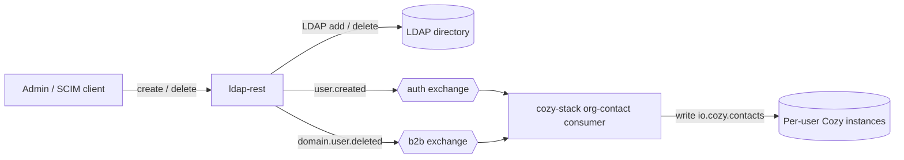
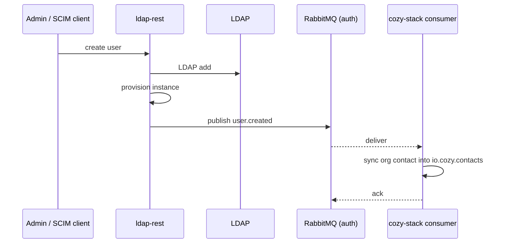

Date: 03/05/2026
Status: `accepted`
Author: Khaled Ferjani
Reviewers: Xavier Guimard (@yadd), Quentin Valmori (@crash--), Erwan (@taratatach), Anton Shepilov (@shepilov)

## Context

The `b2b-ldap-contacts-sync` service keeps each user's address book populated with their coworkers. It runs as a Kubernetes CronJob (hourly). On every run it:

1. Reads the **entire** LDAP directory.
2. For each active user, derive the target Cozy instance FQDN.
3. Mints a scoped token per instance via the **Cloudery Manager API**.
4. Loads every managed `io.cozy.contacts` document on that instance.
5. Diffs and upserts/deletes contacts so each instance mirrors the directory.

This works but has structural problems:

- **Full scan every run.** Cost is O(users x instances) regardless of how little changed. A single new hire triggers a complete re-reconciliation.
- **Up to an hour of staleness.** A new user is invisible to coworkers until the next cron tick.
- **Private-component coupling.** Token minting depends on the Cloudery Manager API, a registration/private component. We want an **on-prem** deployment with no registration or private components to have the contact sync.

We already have most of the event plumbing since the on-prem `ldap-rest` service sits in front of the directory and is the choke point for every user mutation (SCIM create/update/delete). Its `cozyProvision` plugin already publishes `user.created` on the `auth` topic exchange and `domain.user.deleted` on the `b2b` exchange, and cozy-stack already runs an org-contact-sync consumer that reacts to `user.created`

One precondition shapes the whole design: **the user's Cozy instance must exist before the lifecycle message is published.** A bare LDAP insert is not enough, the consumer writes `io.cozy.contacts` into a per-user instance that has to be there already.

`cozyProvision` already enforces this ordering: it creates the instance and only publishes `user.created` if ok.

The instance creation itself has two viable backends, and they do not coexist well in one code path:

1. **Cloudery (nuagerie)**: the registration/private manager provisions the instance. Not truly on-prem, relevant for Linagora-hosted or other Cloudery-using clients.
2. **Stack admin API**: `ldap-rest` calls the cozy-stack admin `POST /instances` directly. Fully on-prem, viable when `ldap-rest` and the stack shares a network or VPN.

## Decision

Retire the `b2b-ldap-contacts-sync` cron and make `ldap-rest` the single source of directory contact events, reusing the existing message contract and closing the lifecycle gaps.

**Producer:**

An `ldap-rest` provisioning plugin that, on each user lifecycle change, ensures the instance exists and then publishes the full lifecycle:

- `user.created`, already published, enriched with the contact's display fields (see contracts below).
- User deletion already published as `domain.user.deleted`.

Provisioning is split into two interchangeable plugins that share one publish path and one message contract:

- `cozyProvision` is the existing plugin and creates the instance via the cozy-stack admin API: the on-prem model, requiring network or VPN reach to the stack admin endpoint.
- `clouderyProvision` is new and delegates instance creation to Cloudery: not on-prem, for Linagora-hosted and other Cloudery clients. In both, the publish is gated on successful provisioning, so a message is never emitted for an instance that does not yet exist.

**Consumer:**

The existing cozy-stack org-contact consumer. It already ingests `user.created` and performs the contact write with cozy-stack admin credentials, so the sync side needs no Cloudery tokens and no per-instance token minting.

**Scope and its limit:**

Events cover two transitions: a new user appears, and a user is deleted. They do not cover attribute changes (rename, phone, email).

## Architecture





### Key design choices

**Reuse the existing contract; do not invent a new exchange:**

- `user.created` and `domain.user.deleted` already have a live producer and consumer, so reusing them keeps one event vocabulary across the platform.

**Provision before publishing, with two interchangeable plugins:**

- The consumer writes into a per-user instance that must already exist, so provisioning is a hard precondition for the publish.
- The backend differs by deployment, but the contract is identical, so the split lives only at the provisioning step, and both plugins reuse the same publish path.

## Message contracts

All payloads are JSON, published with persistent delivery on topic exchanges.

### `user.created`

Exchange `auth`, routing key `user.created`. The consumer reads the user's display name from the instance settings set at provisioning, so the message carries identifiers and contact channels rather than name fields:

```json
{
  "twakeId": "alice",
  "domain": "org.example.com",
  "organizationDomain": "org.example.com",
  "workplaceFqdn": "alice.org.example.com",
  "internalEmail": "alice@org.example.com",
  "mobile": "+33600000000"
}
```

`internalEmail` and `mobile` are optional. The consumer keys on `twakeId` and `organizationDomain`; naming a field differently from this contract causes the consumer to reject the message.

### `domain.user.deleted`

Exchange `b2b`, routing key `domain.user.deleted`. The delete payload carries only the instance identity:

```json
{
  "workplaceFqdn": "alice.org.example.com",
  "domain": "org.example.com"
}
```

## Producers and consumers summary

| Component | Role | Exchange | Routing key |
| --- | --- | --- | --- |
| ldap-rest provisioning plugin (cozyProvision or clouderyProvision) | Producer | auth | user.created |
| ldap-rest provisioning plugin (cozyProvision or clouderyProvision) | Producer | b2b | domain.user.deleted |
| cozy-stack org-contact consumer | Consumer | auth | user.created |
| cozy-stack org-contact consumer | Consumer | b2b | domain.user.deleted |

### Producer shape

Today, all the LDAP-REST AMQP machinery lives inside `cozyProvision`, which is the only AMQP user in `ldap-rest`: the client wrapper, the lazy optional-dependency import, the broker-URL config, the URL redaction for logs, the process-shutdown handling, and the "no broker configured, skip" logic.

The moment `clouderyProvision` exists, all of that is copied, and every later producer copies it again, each opening its own connection.

So the transport is extracted into a dedicated `rabbitmq` plugin. It owns a single broker connection for the process, does the optional-dependency import once, centralizes the "broker absent or unconfigured" case as a logged no-op, handles redaction and shutdown, and exposes a single `publish(exchange, routingKey, message)`. Producers declare it as a dependency and reach it through the loaded-plugin registry.

The provisioning plugins then keep only what is theirs. `cozyProvision` provisions via the cozy-stack admin API and `clouderyProvision` provisions via Cloudery; each builds its message and hands it to the `rabbitmq` plugin to publish.

## Consequences

New users reach coworkers' address books in near real time rather than on an hourly tick, with no full directory scan and no per-instance token minting on the creation path. The on-prem build carries no Cloudery dependency, while the Cloudery plugin keeps the hosted model working from the same contract, and one event vocabulary is reused across consumers.
