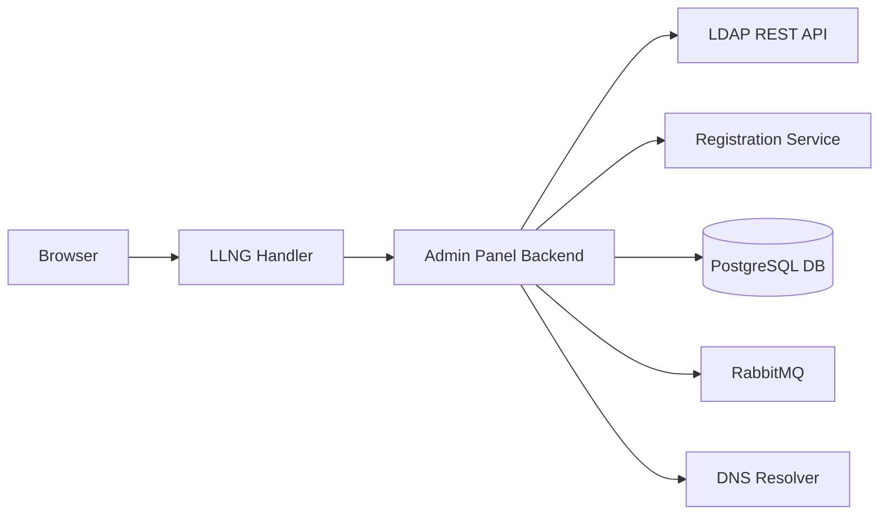

This section covers the deployment and configuration of services for B2B (multi-tenant) mode.

:::tip
For the conceptual story — how B2B actually works, who calls whom, what events flow where — read the [B2B](../b2b/) section first. This section assumes you already understand the model and just need to deploy it.
:::

## Services overview

Deploying B2B requires configuring and coordinating the following services. Keys and secrets must be synced between services, especially HMAC credentials shared between LDAP REST, Registration, Admin Panel Backend, and the Chat Control Plane.

| Service                                                             | Role                                               |
| ------------------------------------------------------------------- | -------------------------------------------------- |
| [LDAP REST](../ldap-rest/)                                          | REST gateway over OpenLDAP for user/org management |
| [Registration](../registration/)                                    | User signup, B2B invitations, OTP verification     |
| [Admin Panel Backend](../admin-panel-backend/)                      | Authenticated gateway for org administration       |
| [Dashboard](../dashboard/)                                          | Platform admin dashboard                           |
| [Chat B2B Control Plane](../b2b-deployment/chat-control-plane)      | Manages Synapse/TOM tenant provisioning            |
| [Chat B2B SSO Proxy](../b2b-deployment/chat-sso-proxy)              | OIDC proxy between LemonLDAP and chat tenants      |
| [OpenLDAP](../b2b-deployment/openldap-schema) + custom Twake schema | Directory server with B2B schema extensions        |
| [LemonLDAP::NG](../b2b-deployment/lemonldap)                        | SSO portal, OIDC provider, session management      |

## Network architecture

## Deployment guides

Each service has its own deployment documentation covering Docker images, environment variables, and health checks. The pages in this section cover cross-cutting B2B concerns:

- [Domain Configuration](../b2b-deployment/domain-configuration) -- DNS setup guide for custom domains (email, chat, Matrix)
- [LemonLDAP Configuration](../b2b-deployment/lemonldap) -- SSO macros, exported claims, virtual hosts, OIDC relying parties
- [OpenLDAP Schema](../b2b-deployment/openldap-schema) -- Full LDIF schema definition for B2B attributes
- [Tmail DNS](../b2b-deployment/tmail-dns) -- Infrastructure-side DNS records for mail delivery
- [Chat B2B Control Plane](../b2b-deployment/chat-control-plane) -- Synapse/TOM tenant orchestration service
- [Chat B2B SSO Proxy](../b2b-deployment/chat-sso-proxy) -- OIDC proxy for chat tenant authentication
