B2B uses the same authentication machinery as B2C: LemonLDAP::NG holds sessions, Registration wraps LemonLDAP as an OIDC provider, and HMAC-SHA256 governs service-to-service calls. The primer is [Authentication](../overview/authentication.md) and the deep dive on the OIDC proxy is [SSO & OIDC Proxy](../overview/sso.md). Both apply here — this page covers only what's B2B-specific.

## Where B2B differs

### The admin panel uses LLNG sessions directly

Org admins log in at `admin-panel.<ownerFqdn>`. There's no OIDC dance — LLNG's handler validates the session cookie, injects `Auth-User`, and Admin Panel Backend reads it. This is the same pattern as any other LLNG-handler-protected app.

Why not OIDC? Admin Panel Backend is a pure backend proxy; it has no UI that needs to render "logged in as…" independent of session refresh semantics. The LLNG-handler pattern is simpler and avoids the OIDC round-trip on every request.

### Chat tenants have their own OIDC proxy

End users who log into a B2B chat tenant go through the **Chat B2B SSO Proxy**, not through Registration. The tenant's Synapse is configured with the proxy's endpoints as its OIDC provider.

The proxy forwards to LemonLDAP but presents itself with a distinct OIDC client identity. This exists because:

- A chat tenant is a per-organization deployment. Each tenant can be federation-scoped or policy-scoped differently from the main SaaS chat.
- Synapse's OIDC client configuration is baked into the Helm chart at deploy time. Pointing every tenant at the *same* OIDC client defeats per-tenant policy; pointing each at Registration would require Registration to know about every chat deployment.
- The proxy is small and single-purpose: OIDC endpoints in, OIDC endpoints out, with the client identity swapped.

See [Chat B2B SSO Proxy](../b2b-deployment/chat-sso-proxy.md) for deployment details.

### End users still log in through Registration

Same login pipeline as B2C — the admin panel doesn't have its own login form. When an org admin opens the panel, LLNG's handler sees no session and bounces to Registration; Registration handles the credentials (per [SSO & OIDC Proxy](../overview/sso.md)) and the admin lands back in the panel with a session.

End users (non-admin members) don't log into the admin panel at all. They log into the apps their org has provisioned — mail at `mail.<domain>`, chat at `chat.<domain>`, Cozy at `<user>.<domain>`. Each of those sits behind either Registration (for mail + Cozy) or the Chat SSO Proxy (for chat).

## The three auth paths, side by side

```mermaid
graph TB
    classDef frontend fill:#3498db,stroke:#2980b9,color:#fff
    classDef auth fill:#9b59b6,stroke:#8e44ad,color:#fff
    classDef platform fill:#1abc9c,stroke:#16a085,color:#fff

    subgraph "End user to app (e.g. Mail)"
        UEND(("User")) --> TMAIL["Tmail"]:::frontend
        TMAIL -->|OIDC| REG1["Registration"]:::platform
        REG1 --> LLNG1["LemonLDAP::NG"]:::auth
    end

    subgraph "End user to chat tenant"
        UCHAT(("User")) --> SYN["Per-tenant Synapse"]:::frontend
        SYN -->|OIDC| PROXY["Chat B2B SSO Proxy"]:::auth
        PROXY -->|OIDC| LLNG2["LemonLDAP::NG"]:::auth
    end

    subgraph "Org admin to admin panel"
        UADMIN(("Admin")) --> APB["Admin Panel Backend"]:::platform
        APB -->|LLNG session| LLNG3["LemonLDAP::NG"]:::auth
        LLNG3 -.->|redirect on missing session| REG2["Registration"]:::platform
    end
```

All three paths converge at LemonLDAP::NG — it remains the single session authority. The differences are in the client-identity layer that sits in front.

## Service-to-service: no B2B specifics

HMAC-SHA256 between services works the same in B2B as in B2C. Registration, Admin Panel Backend, and Chat Control Plane all call LDAP REST with HMAC. The request may carry or omit `Auth-User` depending on whether it originates from a session:

- Present → "authenticated user is acting", LDAP REST applies authorization rules (e.g. a member cannot promote themselves to admin).
- Absent → "SaaS tool is acting", LDAP REST allows elevated operations (ownership transfer, org deletion).

See [LDAP REST authorization context](https://github.com/linagora/twake-workplace-private/blob/main/twake-ldap-rest/docs/architecture/data-model.md#authorization-context).

## When a user is deleted or disabled

Admin Panel Backend calls LLNG to invalidate active sessions, best-effort, on every user delete / disable / role change. See [User lifecycle](./user-lifecycle.md) for which operations trigger session termination. OIDC refresh tokens issued by LemonLDAP are not explicitly revoked — they die when the session is gone. A long-lived refresh token used after the session is killed will get a 401 and push the app back through the login flow.
