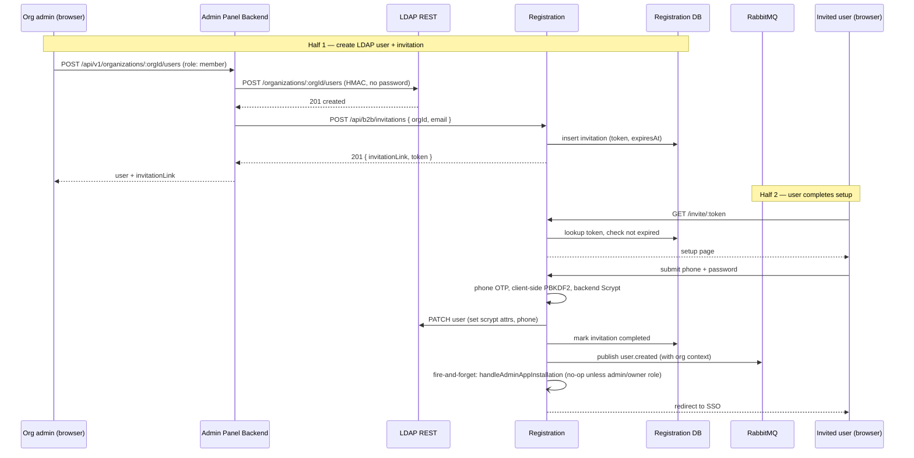

A B2B user joins an organization in two halves: the admin creates the LDAP entry via Admin Panel Backend, then an invitation flow in Registration lets the user set a password and verify their phone. Password handling lives only in Registration (client-side PBKDF2 + backend Scrypt), which Admin Panel Backend does not implement — that's why the flow is split.

## The two halves

## Where the state lives

| State                               | Owner           | Store                                                     |
| ----------------------------------- | --------------- | --------------------------------------------------------- |
| User's LDAP entry (before + after)  | LDAP REST       | OpenLDAP under `ou=users` of the org                      |
| Invitation token, expiry, status    | Registration    | PostgreSQL `b2b_invitations` (Drizzle)                    |
| Scrypt parameters + salt            | LDAP REST       | Attributes `scryptN/R/P/Salt/DKLength` on the user        |
| Client-encrypted private key        | LDAP REST       | Attributes on the user, written at completion             |

Admin Panel Backend holds **no invitation state**. It only proxies the create-invitation call to Registration.

## Invitation lifecycle

An invitation has three terminal states:

- **pending** — created, not yet used, not yet expired
- **expired** — past `expiresAt` without being used
- **completed** — user finished setup

By design, only **one pending invitation per user per organization**. If the admin regenerates, the previous pending invitation is marked expired first.

The admin panel surfaces three operations per email. Two API paths exist for the same operations:

| Operation  | Browser-facing (Admin Panel)              | Underlying (Registration)                              |
| ---------- | ----------------------------------------- | ------------------------------------------------------ |
| Create     | `POST /api/v1/invitations`                | `POST /api/b2b/invitations`                            |
| History    | `GET  /api/v1/invitations/:email`         | `GET  /api/b2b/invitations/:orgId/:email`              |
| Regenerate | `PUT  /api/v1/invitations/:email`         | `POST /api/b2b/invitations` (idempotent on duplicate)  |

Browsers hit the Admin Panel routes; Admin Panel resolves the org from the LLNG session and proxies to Registration's `/api/b2b/invitations` endpoints with HMAC. The Registration paths are not exposed to browsers.

API detail with the code: [Admin Panel Backend invitations](https://github.com/linagora/twake-workplace-private/blob/main/admin-panel-backend/docs/api/invitations.md) and [Registration B2B invitations](https://github.com/linagora/twake-workplace-private/blob/main/registration/docs/api/b2b-invitations.md).

## Why user.created fires at completion, not at create

Looking at [Admin Panel Backend's lifecycle detector](https://github.com/linagora/twake-workplace-private/blob/main/admin-panel-backend/docs/lifecycle.md), the `user-created` operation only emits a RabbitMQ message when the new user has `organizationRole: admin`. Regular members produce no side effect at LDAP create time.

The `user.created` event that notifies Cloudery and friends is emitted later by **Registration**, inside the invitation-completion flow (`registration/src/lib/utils/onboarding.ts`, `handleOnboarding`). This is why:

- The LDAP entry without a password is effectively "inert" — downstream apps don't see the user until completion.
- If the user never claims their invitation, nothing is provisioned downstream. Cleaning up is as simple as deleting the LDAP entry.
- The event carries the user's crypto material (public key, encrypted private key), which only exists after the user sets their password — which is precisely why the event can't fire earlier.

## Security notes

- The invitation token is a UUIDv7 with hyphens stripped (32 hex chars). Being v7 it embeds a 48-bit timestamp, so it carries ~74 bits of random entropy (not the full 122 of a v4). It's a bearer capability: whoever has the link can claim the account. Don't log the full link.
- `expiresAt` defaults to 7 days. The expiry is enforced at claim time; expired tokens return 404, not 400.
- The email in the invitation must match an existing user in the org's LDAP branch. Admin Panel Backend creates the LDAP entry first, then generates the invitation.
- The invitation link is returned only once, in the response body of `POST /api/v1/invitations`.

## Reference

- Full account creation flow (LDAP UPDATE contents, Cloudery, events on completion): [`registration/docs/account-creation.md`](https://github.com/linagora/twake-workplace-private/blob/main/registration/docs/account-creation.md)
- Code: `registration/src/lib/utils/onboarding.ts`, `registration/src/lib/services/b2b-invitation/`
- Schema: `registration/src/db/b2b-invitations.schema.ts`
- Admin panel proxy: `admin-panel-backend/src/routes/invitations.ts`
