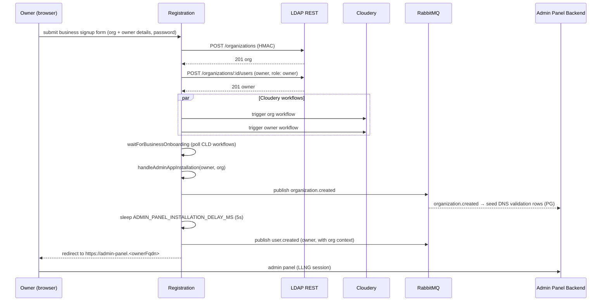

Creating a B2B organization is driven by **Registration**, not by an ops script and not by Admin Panel Backend. Registration runs a multi-step onboarding flow against LDAP REST, Cloudery, and RabbitMQ, then hands the owner off to the admin panel. The whole flow is orchestrated in `registration/src/lib/utils/business-onboarding.ts`.

## Why Registration owns it

Org creation in B2B needs what Registration already does for B2C signup: client-side PBKDF2 → backend Scrypt password handling, Cloudery workflow waiting, and session management. Admin Panel Backend has none of that — it only proxies LLNG-authenticated operations to LDAP REST. So the signup form for "create your company on Twake" lives in Registration, even though subsequent org administration moves to the admin panel.

## The actors

- **Registration** — the signup flow. Runs the business onboarding workflow, calls LDAP REST to create the org and owner, waits for Cloudery provisioning, publishes events, redirects the owner to the admin panel.
- **LDAP REST** — writes the `organizationalUnit` (with `twakeOrganization` objectClass) and the owner user (with `twakeOrganizationRole=owner`).
- **Cloudery** — provisions the org-level instance and the owner's per-user instance. Registration waits on Cloudery's workflow IDs before progressing.
- **RabbitMQ** — carries `organization.created` (consumed by Admin Panel Backend to seed the DNS validation rows) and `user.created` (to downstream provisioners).
- **Admin Panel Backend** — consumes `organization.created` to create the DNS validation rows in PostgreSQL so the owner can verify the domain. The admin UI is reachable from the moment the owner's redirect completes.
- **Chat B2B Control Plane** — is *not* involved at this stage. The Synapse + TOM GitLab pipeline only runs after the owner validates DNS for the chat records; see [Chat tenant provisioning](#chat-tenant-provisioning-comes-later).

## Sequence

Both Cloudery workflows run in parallel; Registration polls until both complete before publishing events.

## What ends up in LDAP

A single `organizationalUnit` under `ou=b2b` carrying the org-level `twakeOrganization` attributes, plus the owner under `ou=users` of the org with `twakeOrganizationRole=owner`. The full directory layout, attribute reference, and the rationale for `twakeOrganizationOwner` pointing to the **B2B user DN** (not a B2C user) is on [LDAP Structure](../overview/ldap-structure.md).

## Instance creation is not a single event

"Instance creation" is plural. There are three independent instance-creation paths, each keyed off its own trigger, and only one of them actually runs during org creation:

| Instance kind                 | Trigger                                         | Owner of the work                                  |
| ----------------------------- | ----------------------------------------------- | -------------------------------------------------- |
| Cozy per-user instance        | Cloudery workflow (per user, at signup)         | Cloudery provisions via its own HTTPS API          |
| Mail mailbox (Apache James)   | `user.created` → Cloudery                       | Downstream of Cloudery's provisioning              |
| Chat tenant (Synapse + TOM)   | `dns.validated` with chat group verified (later)| Chat B2B Control Plane runs a GitLab pipeline      |

Registration does not provision chat or mail itself; it publishes the events and lets the downstream services do the work.

## Chat tenant provisioning comes later

The GitLab pipeline that spins up Synapse + TOM for the org is gated on DNS. `organization.created` does not trigger it. The sequence is:

1. Org created (this page) → Admin Panel Backend seeds DNS validation rows in PG.
2. Owner sets the customer's DNS records (TXT for proof of ownership, CNAMEs for `matrix`/`tom`/`chat`) per [Domain Configuration](../b2b-deployment/domain-configuration.md).
3. Owner clicks "Check configuration" for the chat group → Admin Panel Backend's validator runs live DNS lookups → on success, publishes `dns.validated` on the `admin-panel` exchange.
4. Chat B2B Control Plane consumes `dns.validated`, triggers the GitLab pipeline, tracks job status in PG, creates technical users (e.g. `matrixadmin`) via LDAP REST.
5. When the pipeline finishes, Chat Control Plane publishes `chat.deployment.completed` on the `b2b` exchange → Admin Panel Backend fans out `app.install` (chat slug) per active user in the org.

See [Domain validation](./domain-validation.md) for the `dns.validated` event and [Chat B2B Control Plane](../b2b-deployment/chat-control-plane.md) for the pipeline details.

## Subsequent members

After the owner lands in the admin panel, adding more users follows a different code path: Admin Panel Backend → LDAP REST (create user without a password) → Registration invitation endpoint. See [Invitations](./invitations.md).

## When things go half-done

The choreography is best-effort. If Cloudery is slow, Registration times out on its workflow poll and returns an error to the UI. The chat tenant pipeline does not run at this stage, so nothing chat-related can fail yet; that risk shifts to the DNS-validation step later.

One-way invariant to preserve: **LDAP is authoritative**. Downstream state (Cozy, chat, mail) can be reconciled from LDAP + Cloudery's records; the reverse is not true. So LDAP is written first, events second.

## Reference

- Full end-to-end flow (B2C + B2B + invitations) with LDAP attributes, Cloudery payloads, and event shapes: [`registration/docs/account-creation.md`](https://github.com/linagora/twake-workplace-private/blob/main/registration/docs/account-creation.md)
- Code: `registration/src/lib/utils/business-onboarding.ts`
- Event publishers: `registration/src/lib/services/notification/b2b-notification-service.ts` (`organization.created`) and `auth-notification-service.ts` (`user.created` via `sendUserCreatedNotificationFromSession`)
- Chat Control Plane: [Chat B2B Control Plane](../b2b-deployment/chat-control-plane.md)
- The provisioning service itself (offers, workflows, instance lifecycle): [Cloudery](../cloudery/)
