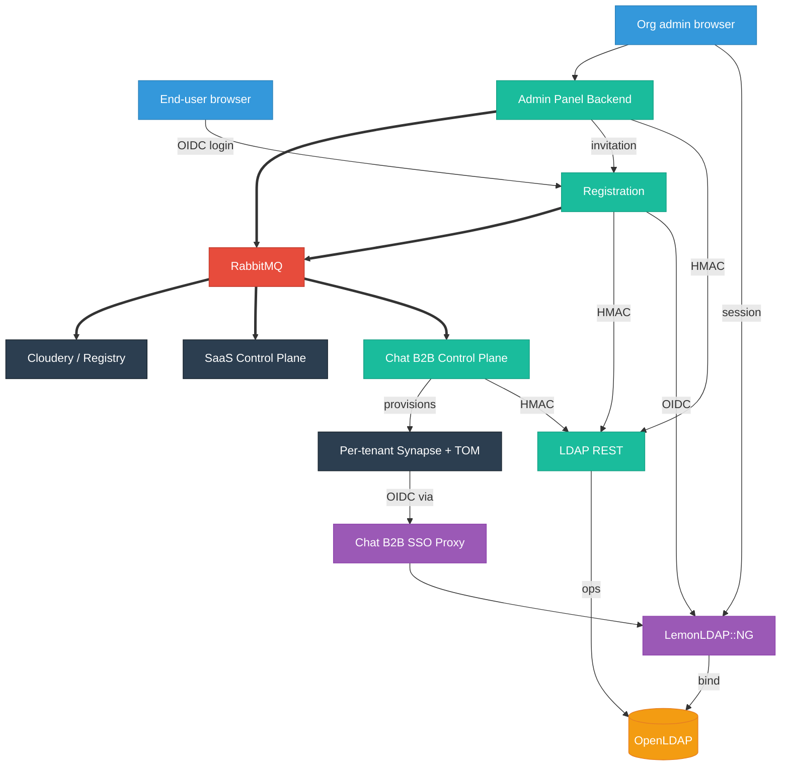

B2B reuses the same services as B2C, plus two B2B-specific ones for chat. The map below is "who calls whom in B2B flows" — not a generic architecture diagram.

## Who does what

| Service                 | Role in B2B                                                                                                      |
| ----------------------- | ---------------------------------------------------------------------------------------------------------------- |
| **LDAP REST**           | Only service that writes to OpenLDAP. Every org, user, group, role change, and deletion goes through it.         |
| **Admin Panel Backend** | Browser-facing gateway for org admins. Validates LLNG sessions, proxies to LDAP REST, emits lifecycle events.    |
| **Registration**        | Owns invitation DB, OTP, password setup. Also the OIDC entry point for end users inside the tenant.              |
| **LemonLDAP::NG**       | Session authority + OIDC provider. Admins authenticate here; end users never do so directly.                     |
| **OpenLDAP**            | Directory, including B2B schema (`twakeOrganization`, `twakeOrganizationRole`, `twakeOrgStatus`, `twakeDomain`). |
| **RabbitMQ**            | The seam between the control plane (admin panel) and the downstream consumers (stack, chat, cloudery, cozy).     |
| **Chat B2B Control Plane** | Consumes `dns.validated` (once the chat DNS group is verified) and provisions Synapse + TOM tenants via GitLab CI. |
| **Chat B2B SSO Proxy**  | OIDC proxy between LemonLDAP and per-tenant Synapse/TOM. Exists because chat tenants often need a distinct OIDC client identity. |
| **SaaS Control Plane**  | Consumer of lifecycle events. Downstream orchestration for SaaS-only concerns.                                   |
| **Cloudery / Registry** | External Cozy-side services reached over HTTPS and the RabbitMQ bridge. Provision Cozy instances, handle plans.  |
| **Dashboard**           | Read-only. Useful to verify an org or a user exists with the expected status.                                    |

## Two separate control planes

Two services legitimately drive B2B:

- **Admin Panel Backend** — for organization admins to manage their org (add users, change roles, set up DNS).
- **Chat B2B Control Plane** — for Linagora to provision chat tenants. Consumes the events that Admin Panel Backend (and org creation tooling) publishes.

Admin Panel Backend never talks to the Chat Control Plane directly. The bus is RabbitMQ.

## Directional map

Thick arrows are RabbitMQ events. Regular arrows are direct HTTP.

## Why two OIDC paths

End users authenticate through Registration's OIDC endpoints — Registration wraps LemonLDAP because Twake applies PBKDF2 + Scrypt before LDAP bind (see [SSO & OIDC Proxy](../overview/sso.md)).

Chat tenants don't go through Registration. Each Synapse tenant is configured with the **Chat B2B SSO Proxy** as its OIDC provider. The proxy forwards to LemonLDAP but under a distinct client identity, so different tenants can be federated or policy-scoped independently.
