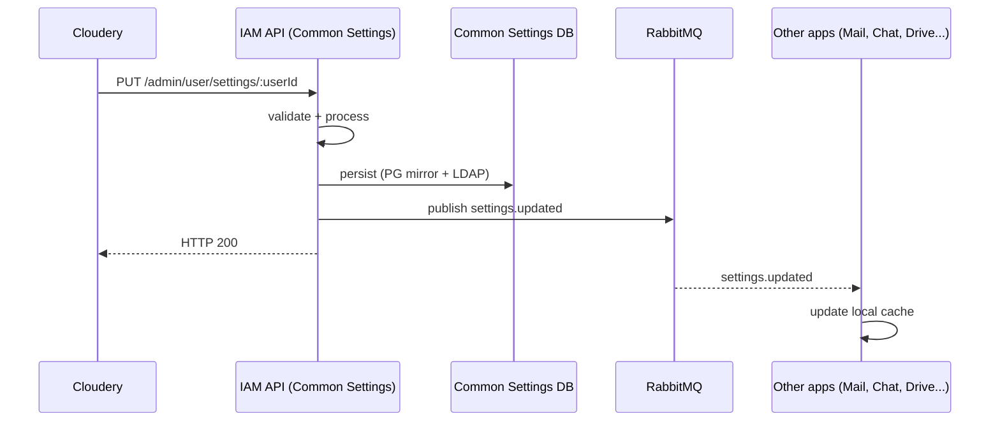

Twake Workplace apps each manage their own settings (mail filters, chat preferences, drive sharing defaults, …) but a small set of settings is **common** — timezone, locale, theme, etc. Common settings have a single source of truth (Cloudery) and a single propagation mechanism (Common Settings, IAM, RabbitMQ). See [ADR 015](../adrs/adr-015.md) for the original decision.

This is not specific to B2B — B2C uses the same pipeline. It's covered in this section because B2B onboarding is the place where most engineers first realise common settings exist as a separate subsystem.

## Where settings live

- **Source of truth**: the **IAM system** (currently the Common Settings service / registration). LDAP is the durable store; the Common Settings PostgreSQL is a fast-query mirror used by the IAM API.
- **App-side**: each app keeps a local cache. The cache is reconciled by consuming RabbitMQ events.
- **UI for changes**: the Cozy Stack's settings application. There is exactly one UI that writes settings; this is what lets the system avoid optimistic locking.

The local app caches are never authoritative. If they disagree with IAM, IAM wins on the next sync. Per ADR 015: "All the application user databases should be considered as caches, synced with IAM LDAP."

## The flow

Cloudery's call returns as soon as IAM has persisted to PG and queued the event. App caches catch up asynchronously.

## Why one writer

ADR 015 picks "the Settings app is the only writer" deliberately. Two consequences:

- **No optimistic locking required at write time.** With multiple writers, concurrent updates would need versioning to prevent lost updates. With one writer, that complexity goes away.
- **No HTTP callback to Cloudery** when settings change — Cloudery is itself the trigger of every change (or the initial-user-creation case), so there's nothing to inform.

If a second writer is introduced later, both invariants need to be revisited.

## What apps must do

The contract for an app that consumes common settings:

1. Subscribe to the settings exchange and routing key (per env vars; see Common Settings docs).
2. On each event, update the local cache. Idempotency is the consumer's responsibility — the same event can arrive twice.
3. Treat the cache as authoritative for fast reads, but be ready to refresh from IAM API on a cache miss or on startup.
4. Never write settings locally. Local writes drift from IAM and will be overwritten next sync.

## Failure modes

The classic failure: an app misses an event (network blip, consumer crash, queue full). Its cache is now stale.

Mitigations from ADR 015:

- **Periodic reconciliation** — a background job pulls from IAM API on a schedule, regardless of events.
- **RabbitMQ monitoring** — `rabbitmq_exporter` metrics + DLQ alerts catch the dropped events.
- **Read-through fallback** — if a setting is missing from cache, fetch from IAM rather than returning a default.

The pipeline is designed to be eventually consistent. Apps that need strong consistency on a setting should hit the IAM API directly instead of trusting the cache.

## What's stored

All settings are stored as plain strings inside LDAP (per ADR 015), which defines the directory as the authoritative store and treats every app-side database (including the Common Settings PostgreSQL) as a cache. The schema is intentionally a flat key/value of JSON-encoded strings — there's no attempt to model individual settings as LDAP attributes. New settings can be added without LDAP schema changes.

## Reference

- ADR: [ADR 015](../adrs/adr-015.md)
- IAM API: see Common Settings repo (separate from this monorepo; ask in #twake-platform for access)
- Event bus topology: [RabbitMQ](../overview/rabbitmq.md)
