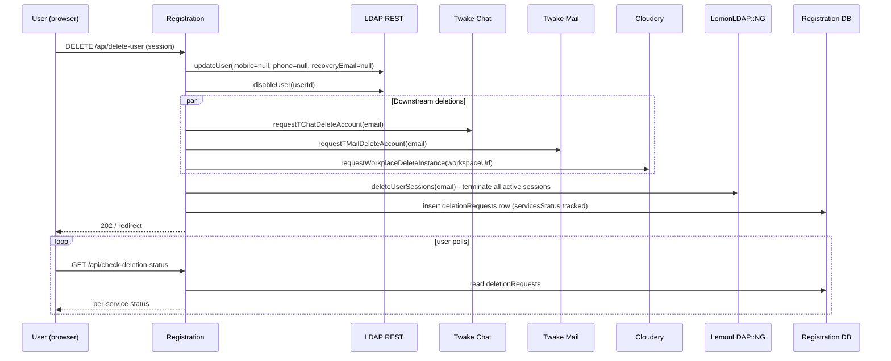

A B2C user can delete their account themselves via `DELETE /api/delete-user`. The deletion is **soft in LDAP** (status flag plus PII clearing), then fans out to the downstream services that hold the user's data — Twake Chat, Twake Mail, and Cloudery (Cozy instance). Status is tracked in PostgreSQL so the user can poll for completion.

For B2B user deletion (admin-initiated), see [B2B → User lifecycle](../b2b/user-lifecycle.md).

## Flow



## What happens in LDAP

The user is **disabled, not removed** (`userService.deleteAccount(username)`). Two LDAP REST calls run in order: first `updateUser` clears sensitive PII (`mobile: null`, `phone: null`, `recoveryEmail: null`), then `disableUser` flips the status flag. PII goes first so even if the disable call fails the personal data is already gone.

The DN itself stays in the directory. Other identifying attributes (uid, mail, scrypt parameters) are preserved so the username and email are still reserved (cannot be re-registered immediately) and any audit trail in LDAP remains intact.

The branch is detected automatically: if the user has an `organizationId`, the calls go to the org branch under `ou=b2b` (`updateOrganizationUser` + `disableOrganizationUser`); otherwise the global B2C branch under `ou=users`.

## Downstream service deletion

`adminService.deleteUser(username, { mobile })` then issues three requests in parallel:

| Service    | Call                                           | What happens                                            |
| ---------- | ---------------------------------------------- | ------------------------------------------------------- |
| Twake Chat | `requestTChatDeleteAccount(email)`             | Deactivates the Matrix account, frees the handle        |
| Twake Mail | `requestTMailDeleteAccount(email)`             | Deactivates the mailbox; archive policy is service-side |
| Cloudery   | `requestWorkplaceDeleteInstance(workspaceUrl)` | Schedules the Cozy instance teardown                    |

These are HTTPS calls, not RabbitMQ. The Cozy instance teardown is async on Cloudery's side — Cloudery returns a task ID immediately and the actual instance deletion happens later.

## Status tracking

Registration writes a row to the `deletionRequests` PG table (see `registration/src/db/schema.ts`) with one entry per downstream service:

```
{
  id,                       // uuid primary key
  username, email, mobile,
  servicesStatus: [         // jsonb, TServiceStatus[]
    { name: "tchat",     status: "deleting" | "failed" | "done", taskId?: string },
    { name: "tmail",     status: ..., taskId?: string },
    { name: "workplace", status: ..., taskId?: string }
  ],
  reason,
  skipPhoneNotification,
  smsNotified,
  createdAt, updatedAt
}
```

Each service marks its own row as `done` or `failed` once it completes (or fails). The user polls `GET /api/check-deletion-status` to see in-flight deletions. The endpoint is **public** (no auth) — the user has been logged out by the time they need to check, and the response only returns status keyed by recently-deleted email/phone, not personal data.

## Session termination

After kicking off the downstream deletes, `adminService.deleteUserSessions(email)` queries LemonLDAP's admin endpoint (`/manager.psgi/sessions/global?_whatToTrace={email}`) and calls `auth.logout(sessionId)` for each active session. This forces logout across every service the user was signed into.

Per ADR 035 (back-channel logout), OIDC-aware downstream apps should also receive a back-channel logout from LemonLDAP — this is LemonLDAP's responsibility, not Registration's.

## What does NOT happen

- **No outbound RabbitMQ event for `user.deleted` from B2C self-deletion.** The downstream services are notified by direct HTTPS calls instead. Compare with B2B, where Admin Panel Backend publishes `user.deleted` on the `b2b` exchange — that path is for admin-initiated deletions of org members. Note that Registration itself _consumes_ a `user.deletion.requested` event on the `auth` exchange (used by admin tooling to trigger the same HTTPS fan-out); this page covers only the user-initiated `DELETE /api/delete-user` path.
- **No automatic 2FA re-enrolment guidance.** TOTP enrolment lives in LemonLDAP (see [Two-factor authentication](./two-factor-auth.md)); when sessions are killed and the LDAP entry is disabled, LemonLDAP's 2FA challenge can no longer fire because there is nothing to log into.
- **No grace period or undo.** Once `DELETE /api/delete-user` succeeds, the user is logged out and the data is being torn down. There is no recovery window.
- **No anonymisation of the LDAP entry beyond the listed attributes.** Username, email, scrypt params remain. The disable + nulled PII pattern is GDPR-defensible because the remaining data isn't useful for re-identification but is necessary for audit and to prevent re-use of the username.

## Audit logging

`[AUDIT] user.deletion.requested` is logged when the API is invoked; `[AUDIT] user.deletion.completed` when `adminService.deleteUser` returns. Both lines are captured by the standard logging pipeline and end up in the platform's log store.
