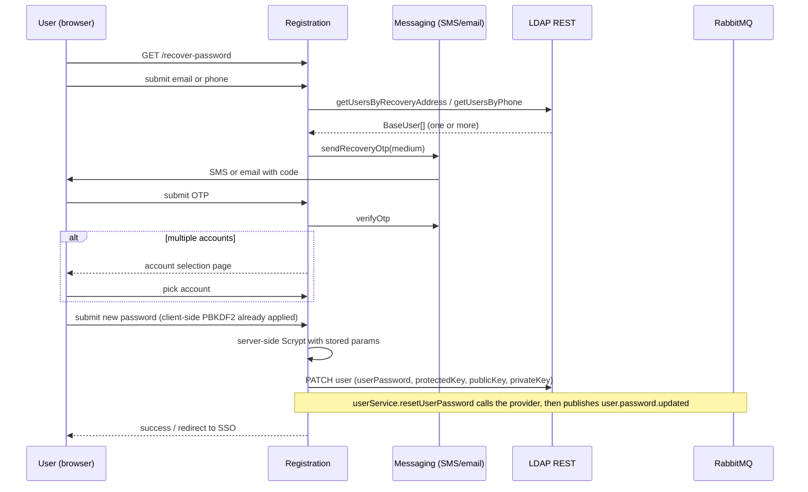

A user who forgot their password resets it through the public `/recover-password` flow. The flow is multi-step (identify → OTP → optionally pick account → set new password) and ends with a new password hash being written to LDAP. A `user.password.updated` event fires on completion.

## Flow

## Where the user is identified

`/recover-password` accepts either an email or a phone number. The lookup splits accordingly:

- Email → `userService.getUsersByRecoveryAddress(email)` — matches against the `recoveryEmail` LDAP attribute.
- Phone → `userService.getUsersByPhone(phone)` — searches by the `phone` field (via `ldapRestService.searchUsers('phone', phone)`; the `phone` field is a multi-valued whitepages attribute, distinct from the primary `mobile`).

Either path can return multiple users. The flow always handles N≥1 uniformly; the single-account case just skips the picker.

## OTP delivery

`messagingService.sendRecoveryOtp(medium, { client: clientAddress })` picks the provider based on the medium type. The result includes `provider`, `requestToken`, and provider-specific metadata, which Registration stores in the session under `recovery_otp_provider_context`. Verification later re-uses that context.

The two channels differ in who owns the OTP:

- **Phone (SMS):** delegated to an external provider (Twilio Verify or Octopush). Registration is stateless about the code itself; the provider generates it, delivers it, and owns its TTL and retry behaviour.
- **Email:** handled **in-house** by Registration's own DB-backed challenge store, with TMail used only as the transport. Twake owns the code, its storage (HMAC digests, never plaintext), TTL, and attempt cap. See [Email OTP](../registration/email-otp.md).

## What gets written to LDAP

On successful verification + new-password submission, `userService.resetUserPassword(user, { hash, encryptionKey, privateKey, publicKey })` updates these attributes via LDAP REST:

| Attribute      | New value                                           |
| -------------- | --------------------------------------------------- |
| `userPassword` | Base64 Scrypt hash of the client-side PBKDF2 output |
| `protectedKey` | New `encryptionKey`                                 |
| `publicKey`    | New public key                                      |
| `privateKey`   | New encrypted private key                           |

The Scrypt parameters (`scryptN`, `scryptR`, `scryptP`, `scryptSalt`, `scryptDKLength`) are **not** changed — they were generated at signup and stay stable. Only the resulting hash is overwritten.

## RabbitMQ event

`userService.resetUserPassword` (in `src/lib/services/user/index.ts`) calls the provider's LDAP write, then fires `authNotificationService.sendUserPasswordChangedNotification` before returning. The publish is encapsulated in the service method, not in the action layer.

- Exchange: `auth` (env: `RABBITMQ_AUTH_EXCHANGE`)
- Routing key: `user.password.updated` (env: `RABBITMQ_AUTH_ROUTING_KEY_USER_PASSWORD_CHANGED`)
- Payload includes the username and the new crypto material (consumers re-encrypt downstream stores).

## Multi-account login

The same OTP-then-pick pattern applies at **login** when a phone number or recovery email maps to more than one account. The login-side flow is documented in [SSO & OIDC Proxy → Multi-Account Login](../overview/sso.md#multi-account-login-phone-or-recovery-email). The mechanics are identical regardless of medium (LDAP search returns N≥1 users, the client gets `requiresAccountSelection: true` from `POST /api/auth-context`, the user picks before submitting the password). Recovery emails are unique only within an LDAP branch, so a single address may resolve to multiple accounts across B2C and B2B branches; the OTP gates account selection.

If no accounts are found for the contact, recovery returns `user_not_found: true` and the login UI redirects to signup.

## Edge cases

- **Phone is in B2B branch.** The recovery flow searches across all branches via the LDAP REST cross-branch endpoints. A B2C user and a B2B user with the same phone are both returned.
- **Recovery email not set.** The recovery flow can still operate via phone. If the user has neither a recovery email nor a phone, recovery is impossible and they need admin (Linagora support) intervention.
- **OTP timeout.** The provider returns `'timeout'`; Registration surfaces a UI error and the user can request a new OTP (subject to [rate limits](https://github.com/linagora/twake-workplace-private/blob/main/registration/docs/anti-abuse.md#rate-limiting)).
