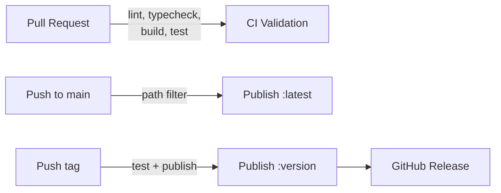

## Pipeline Overview



Each service has **six workflow files** that implement this pipeline:

| File                            | Trigger                        | Purpose                                      |
| ------------------------------- | ------------------------------ | -------------------------------------------- |
| `{service}-pr.yml`              | PR to `main` (path-filtered)   | Lint, typecheck, build, test                 |
| `{service}-push.yml`            | Push to `main` (path-filtered) | Orchestrate latest publish                   |
| `{service}-publish-latest.yml`  | Called by push workflow        | Build and push `:latest` to Harbor           |
| `{service}-release.yml`         | Tag `{service}-v*` pushed      | Orchestrate version publish + GitHub release |
| `{service}-publish-version.yml` | Called by release workflow     | Build and push `:{version}` to Harbor        |
| `{service}-build.yml`           | Called by release workflow     | Run tests before publishing a version        |

## Image Naming

Images follow the pattern:

```
{HARBOR_REGISTRY}/{HARBOR_PROJECT}/{image-name}:{tag}
```

For example: `docker-registry.linagora.com/twake-workplace/twake-matrix-registration:v1.2.3`

The image name is **not** uniformly `twake-{service}`; each workflow sets it explicitly. Current names:

| Service                | Image name                  |
| ---------------------- | --------------------------- |
| registration           | `twake-matrix-registration` |
| admin-panel-backend    | `twake-admin-panel-backend` |
| twake-ldap-rest        | `twake-ldap-rest`           |
| dashboard              | `twake-metrics-dashboard`   |
| documentation          | `twake-documentation`       |
| b2b-ldap-contacts-sync | `b2b-ldap-contacts-sync`    |

The tag is either `latest` (from main pushes) or the version extracted from the git tag (from releases).

## GitHub Secrets

These repository-level secrets must be configured for publishing to work:

| Secret            | Purpose                                               |
| ----------------- | ----------------------------------------------------- |
| `HARBOR_REGISTRY` | Harbor hostname (e.g. `docker-registry.linagora.com`) |
| `HARBOR_PROJECT`  | Harbor project path (e.g. `twake-workplace`)          |
| `HARBOR_USER`     | Harbor robot account or username                      |
| `HARBOR_PASSWORD` | Harbor password or token                              |

If a service also publishes to Docker Hub (currently only the dashboard does for its `latest` tag):

| Secret               | Purpose                 |
| -------------------- | ----------------------- |
| `DOCKERHUB_USER`     | Docker Hub username     |
| `DOCKERHUB_PASSWORD` | Docker Hub access token |

## How to Set Up CI/CD for a New Service

Follow these steps when adding a new service to the monorepo.

### 1. Write a Dockerfile

All services use multi-stage builds to keep images small. The general pattern:

```dockerfile
# Stage 1: Build
FROM node:20-slim AS builder
WORKDIR /app
COPY package*.json ./
RUN npm ci
COPY . .
RUN npm run build

# Stage 2: Runtime
FROM node:20-slim
WORKDIR /app
COPY --from=builder /app/build ./build
COPY --from=builder /app/node_modules ./node_modules
COPY --from=builder /app/package.json ./
EXPOSE 3000
CMD ["node", "build"]
```

For static sites served by nginx (like the dashboard or documentation):

```dockerfile
# Stage 1: Build
FROM node:20-slim AS builder
WORKDIR /app
COPY package*.json ./
RUN npm ci
COPY . .
RUN npm run build

# Stage 2: Serve
FROM nginx:alpine
COPY --from=builder /app/build /usr/share/nginx/html
COPY nginx.conf /etc/nginx/conf.d/default.conf
EXPOSE 80
CMD ["nginx", "-g", "daemon off;"]
```

### 2. Create the PR validation workflow

Create `.github/workflows/{service}-pr.yml`:

```yaml
name: My Service PR

on:
  pull_request:
    branches:
      - main
    paths:
      - "my-service/**"

  merge_group:
  workflow_dispatch:

concurrency:
  group: ${{ github.workflow }}-${{ github.ref }}
  cancel-in-progress: true

jobs:
  lint-build-test:
    runs-on: ubuntu-latest
    steps:
      - uses: actions/checkout@v4
      - name: Setup Node.js
        uses: actions/setup-node@v4
        with:
          node-version: 20.x
          cache: "npm"
          cache-dependency-path: my-service/package-lock.json
      - name: Install dependencies
        run: |
          cd my-service
          npm ci
        env:
          CI: true
      - name: Lint
        run: |
          cd my-service
          npm run lint
          npm run check
      - name: Build and test
        run: |
          cd my-service
          npm run build --if-present
          npm run test
```

### 3. Create the build workflow (used by releases)

Create `.github/workflows/{service}-build.yml`:

```yaml
name: My Service Build

on:
  workflow_call:

jobs:
  build:
    runs-on: ubuntu-latest
    strategy:
      matrix:
        node-version: [20.x]
    steps:
      - uses: actions/checkout@v4
      - name: Setup Node.js
        uses: actions/setup-node@v4
        with:
          node-version: ${{ matrix.node-version }}
          cache: "npm"
          cache-dependency-path: my-service/package-lock.json
      - name: npm install and build
        run: |
          cd my-service
          npm ci
          npm run build --if-present
          npm run test
        env:
          CI: true
```

### 4. Create the publish-latest workflow

Create `.github/workflows/{service}-publish-latest.yml`:

```yaml
name: My Service Build latest version

on:
  workflow_call:

jobs:
  publish:
    runs-on: ubuntu-latest
    steps:
      - uses: actions/checkout@v4
      - name: Log in to Harbor
        uses: docker/login-action@v3
        with:
          registry: ${{ secrets.HARBOR_REGISTRY }}
          username: ${{ secrets.HARBOR_USER }}
          password: ${{ secrets.HARBOR_PASSWORD }}
      - name: Set up Docker Buildx
        uses: docker/setup-buildx-action@v3
      - name: Build and push to Harbor
        uses: docker/build-push-action@v5
        with:
          context: ./my-service
          file: ./my-service/Dockerfile
          push: true
          tags: |
            ${{ secrets.HARBOR_REGISTRY }}/${{ secrets.HARBOR_PROJECT }}/twake-my-service:latest
          cache-from: type=gha
          cache-to: type=gha,mode=max
```

### 5. Create the publish-version workflow

Create `.github/workflows/{service}-publish-version.yml`:

```yaml
name: My Service Build version

on:
  workflow_call:

jobs:
  publish:
    runs-on: ubuntu-latest
    steps:
      - uses: actions/checkout@v4
      - name: Extract version
        id: pre-step
        shell: bash
        run: |
          VERSION=${GITHUB_REF#refs/tags/my-service-}
          echo "release-version=$VERSION" >> $GITHUB_OUTPUT
          echo "Extracted version: $VERSION"
      - name: Log in to Harbor
        uses: docker/login-action@v3
        with:
          registry: ${{ secrets.HARBOR_REGISTRY }}
          username: ${{ secrets.HARBOR_USER }}
          password: ${{ secrets.HARBOR_PASSWORD }}
      - name: Set up Docker Buildx
        uses: docker/setup-buildx-action@v3
      - name: Build and push to Harbor
        uses: docker/build-push-action@v5
        with:
          context: ./my-service
          file: ./my-service/Dockerfile
          push: true
          tags: |
            ${{ secrets.HARBOR_REGISTRY }}/${{ secrets.HARBOR_PROJECT }}/twake-my-service:${{ steps.pre-step.outputs.release-version }}
          cache-from: type=gha
          cache-to: type=gha,mode=max
```

### 6. Create the push-to-main workflow

Create `.github/workflows/{service}-push.yml`:

```yaml
name: My Service Push

on:
  push:
    branches:
      - main
    paths:
      - "my-service/**"

concurrency:
  group: ${{ github.workflow }}-${{ github.ref }}
  cancel-in-progress: true

jobs:
  publish:
    name: Publish My Service
    uses: ./.github/workflows/my-service-publish-latest.yml
    secrets: inherit
```

### 7. Create the release workflow

Create `.github/workflows/{service}-release.yml`:

```yaml
name: My Service Release Tag

on:
  push:
    tags:
      - "my-service-v[0-9]+.[0-9]+.[0-9]+*"

jobs:
  test:
    name: Build And Test
    uses: ./.github/workflows/my-service-build.yml
    secrets: inherit

  publish:
    needs: [test]
    name: Publish My Service
    uses: ./.github/workflows/my-service-publish-version.yml
    secrets: inherit

  release:
    needs: [test]
    runs-on: ubuntu-latest
    steps:
      - name: Checkout code
        uses: actions/checkout@v4
        with:
          fetch-depth: 0
      - name: Extract version from tag
        id: version
        run: echo "VERSION=${GITHUB_REF_NAME#my-service-}" >> $GITHUB_OUTPUT
      - name: Create release
        uses: softprops/action-gh-release@v1
        env:
          GITHUB_TOKEN: ${{ secrets.GITHUB_TOKEN }}
        with:
          tag_name: ${{ github.ref_name }}
          name: My Service Release ${{ steps.version.outputs.VERSION }}
          draft: false
          prerelease: false
          generate_release_notes: true
```

## Releasing a Version

To publish a versioned image and create a GitHub release:

1. **Bump the version** in the service's `package.json`
2. **Commit and push** to `main`
3. **Create and push a tag** following the naming convention:

```bash
git tag my-service-v1.2.3
git push origin my-service-v1.2.3
```

This triggers the release workflow, which:

- Runs the full test suite
- Builds and pushes `my-service:v1.2.3` to Harbor
- Creates a GitHub release with auto-generated release notes

The tag format is always `{service}-v{major}.{minor}.{patch}`. Existing services use:

| Service             | Tag prefix              |
| ------------------- | ----------------------- |
| registration           | `registration-v`           |
| admin-panel-backend    | `admin-panel-backend-v`    |
| twake-ldap-rest        | `twake-ldap-rest-v`        |
| dashboard              | `dashboard-v`              |
| documentation          | `documentation-v`          |
| b2b-ldap-contacts-sync | `b2b-ldap-contacts-sync-v` |

The Node version in the workflow examples above (`20.x`) is illustrative; it is pinned per service. Most services build on Node 20, but `twake-ldap-rest` uses Node 22. Match the version to the service's own `package.json` / `.nvmrc` when adding a workflow.

## Build Caching

All publish workflows use GitHub Actions cache for Docker layer caching:

```yaml
cache-from: type=gha
cache-to: type=gha,mode=max
```

This reuses layers between CI runs and significantly speeds up builds. The `mode=max` setting caches all layers, not just the final image layers.

## Concurrency

Push and PR workflows use concurrency groups to cancel redundant runs:

```yaml
concurrency:
  group: ${{ github.workflow }}-${{ github.ref }}
  cancel-in-progress: true
```

If you push twice in quick succession, only the latest run completes. This avoids wasting CI minutes on outdated commits.
