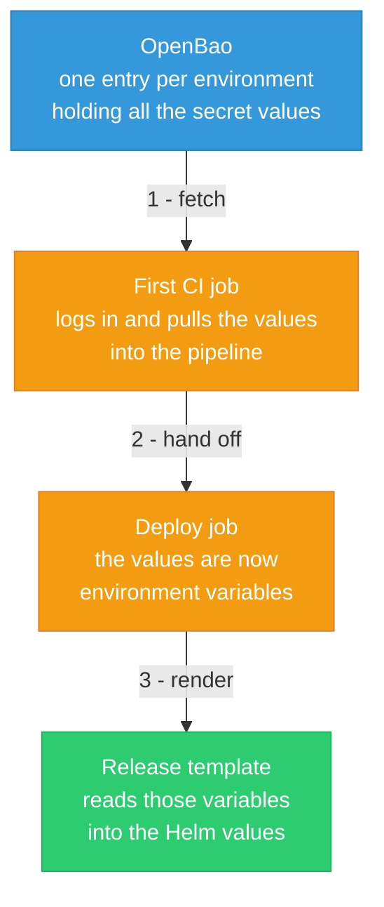

A release can get its secret values in one of two ways. Both end up as ordinary Helm values, so the chart never knows the difference. What changes is **where the secret lives** and **how it gets in**.

- **SOPS** is the default. The secret sits encrypted inside the repo, and Helmfile decrypts it at deploy time.
- **OpenBao** keeps the secret out of the repo entirely. The repo only names it; the real value is pulled from OpenBao by CI on every run.

This page is about the OpenBao path: how it works, and how to put a new release on it. `twake-migrator` is already on OpenBao, so it is the example we follow throughout.

:::info When to reach for OpenBao
Use OpenBao when you want secrets out of git and rotatable from one place. Rotating then means updating the value in OpenBao and re-running the pipeline, with no commit and no encrypted blob living in history. SOPS is still fine for everything else.
:::

## How it works



In plain terms:

1. **Fetch.** Before anything deploys, one job logs into OpenBao and reads every value for the current environment.
2. **Hand off.** Those values become environment variables for the deploy jobs that run after it.
3. **Render.** The release's template pulls each value it needs from the environment as the chart is rendered.

If a value the template asks for is not there, the render stops with a clear error. So a missing secret fails loudly in CI, it never deploys half-configured.

## Staging and production are separate

The branch picks the environment, just like everywhere else in this repo: `main` is staging, `prd` is production. Each one has its own slot in OpenBao and its own login credentials, so a staging leak cannot reach production secrets.

| Branch | Environment | OpenBao entry |
|--------|-------------|---------------|
| `main` | Staging | `secret/stg/cicd` |
| `prd` | Production | `secret/prd/cicd` |

The practical consequence: **a secret needed in both places has to be set in both.** Add it only to staging and the production deploy will fail the moment it tries to render.

## What a release on OpenBao looks like

A SOPS release carries an encrypted secrets file. An OpenBao release carries a small template instead, which just lists the values it expects by name. Here is the one from `twake-migrator`:

```yaml
credentials:
    rabbitmqUrl: {{ requiredEnv "MIGRATORS_TWAKEMIGRATOR_CREDENTIALS_RABBITMQURL" }}
worker:
    config:
        imap:
            adminUser: {{ requiredEnv "MIGRATORS_TWAKEMIGRATOR_WORKER_CONFIG_IMAP_ADMINUSER" }}
            adminPassword: {{ requiredEnv "MIGRATORS_TWAKEMIGRATOR_WORKER_CONFIG_IMAP_ADMINPASSWORD" }}
        db:
            url: {{ requiredEnv "MIGRATORS_TWAKEMIGRATOR_WORKER_CONFIG_DB_URL" }}
```

Each name in there matches one value stored in OpenBao. So OpenBao holds an entry called `MIGRATORS_TWAKEMIGRATOR_CREDENTIALS_RABBITMQURL`, and its value is the RabbitMQ URL.

The names are not random. They spell out where the value lands, uppercased: the namespace, then the release (with dashes dropped), then the path inside the values. That keeps two releases from ever clashing on the same name. The only hard rule is that the name in the template and the name in OpenBao have to be identical.

## Putting a new release on OpenBao

Say you are adding a service that needs an API token.

1. **Write the template.** Add a small values template to the release folder that lists the secret values by name, the same way the example above does. Keep non-secret config in the normal values file.

2. **Store the values in OpenBao.** Add each name to the staging entry, and to the production entry if you will ship there. You need write access; ask the DevOps owners if you do not. New names are picked up automatically on the next pipeline, no CI change needed.

3. **Make sure the release is in the deploy list.** If it is brand new, add it to the pipeline's release list so the diff and apply jobs run for it.

4. **Open the merge request.** The diff job renders the chart against the freshly fetched values and you see the result. Merge, apply to staging, then promote to production by merging into `prd`.

:::warning Pick one source per value
A value should come from SOPS or from OpenBao, never both. If both set the same thing, the result is whichever loads last, which is confusing and easy to get wrong.
:::

## SOPS or OpenBao?

| | SOPS | OpenBao |
|--|------|---------|
| Secret in git | Yes, encrypted | No |
| Rotating it | Edit, commit, apply | Update in OpenBao, re-run pipeline |
| Works offline | Yes, decrypts locally | No, needs the values from the pipeline |
| If the key leaks | Everything committed is exposed | Nothing in git to decrypt |

Most releases are still on SOPS. OpenBao is the direction for new secrets you want out of git and centrally managed. If you are not sure which the team wants for your service, ask the DevOps owners.

## Rendering locally

A SOPS release renders locally as long as your age key is in place. An OpenBao release has nothing to decrypt locally, so its template will complain about missing values unless you put them in your shell first (export them, or pull them from OpenBao if you have read access). In practice, rendering OpenBao releases is left to CI, where the values are already there.

## When something breaks

- **The render complains a value is "not set".** The name is missing from OpenBao for that environment, or it is spelled differently in the template than in OpenBao, or you are rendering locally without the value in your shell. Check that the two names match exactly.
- **A value you just added is ignored.** Confirm you wrote it to the right environment's entry, and that the pipeline actually re-ran the fetch.
- **Login to OpenBao fails in CI.** The credentials for that environment are wrong or expired. They live in the pipeline settings and have to be updated there when rotated.

## Where to look

| For | Look at |
|-----|---------|
| How the fetch is wired up | the pipeline config in the deployment repo |
| How the fetch actually runs | the reusable `secrets-open-bao` CI component |
| What a release expects | that release's values template |
| The real secret values | OpenBao, per environment |
| The OpenBao login credentials | the pipeline settings |
