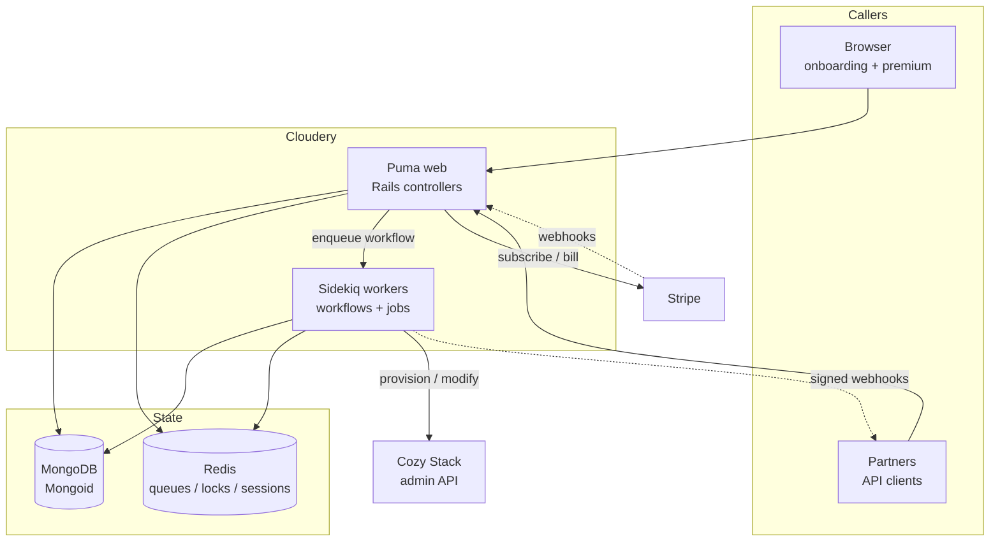
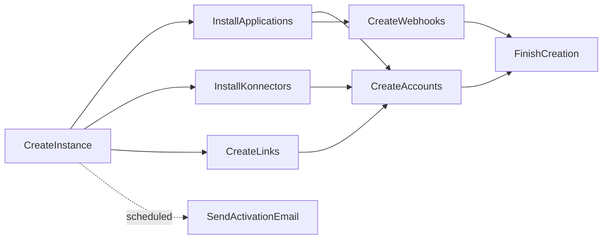
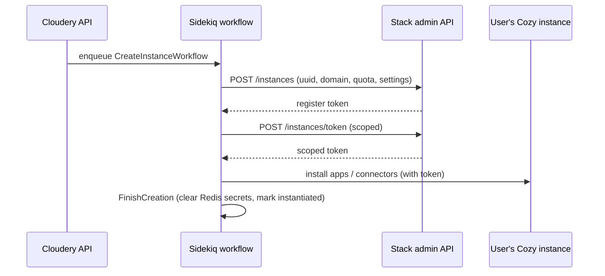

# Architecture

The Cloudery is a fairly conventional Rails application with one twist: almost every meaningful action is a **long-running workflow** against an external system (the Cozy Stack), so the interesting architecture is in the background tier, not the request tier.

## Runtime tiers

- **Puma** serves the web UI (onboarding, premium checkout) and the JSON API. Controllers do validation and persistence, then hand slow work to Sidekiq.
- **Sidekiq** runs the workflows that actually provision instances on the Stack. In production it is a separate systemd service; in development you start it by hand.
- **MongoDB** is the only durable store. There is no relational database. (`config/database.yml` and the Postgres block are vestigial; ActiveRecord is not even loaded.)
- **Redis** wears three hats, described below.

## How Redis is used

There are two Redis URLs and three distinct roles:

| Role | URL | Purpose |
| --- | --- | --- |
| Sidekiq + workflows | `REDIS_URL` | Job queues and `sidekiq-workflow` DAG state. |
| Distributed locks | `REDIS_URL` | Redlock (`app/lib/lock.rb`) guards the Gandi HA round-robin and the pre-creation pool. |
| Sessions + temp store | `TMP_REDIS_URL` | Rails sessions (`redis_session_store`, 120-min TTL) and `TmpStorage`. |

:::note Why a temp store
During instance creation the Cloudery holds secrets it must **not** persist to Mongo (the user's passphrase, the OAuth client secret, connector credentials). These live in `TmpStorage` under an `instance.redis` prefix with a TTL, and are deleted by the `FinishCreation` job once provisioning is done.
:::

## Background orchestration: workflows and jobs

The Cloudery uses `sidekiq-workflow` (a Cozy fork) to express **directed acyclic graphs of jobs with dependencies**. A workflow declares its jobs and their ordering; the engine runs each job when its predecessors have finished.

Instance creation is the canonical example:

Every API call that provisions or destroys an instance returns a **workflow id**. Callers poll `GET /api/v1/workflows/:id` to watch it progress, and a failed workflow can be restarted with `POST /api/v1/workflows/:id/continue`.

### The main workflows

| Workflow | What it does |
| --- | --- |
| `CreateInstanceWorkflow` | Create the Stack instance, install apps/connectors/links, create accounts + webhooks, finalize, send activation email. |
| `ActivateInstanceWorkflow` | Activate a previously created (or pre-created) instance. |
| `RecreateInstanceWorkflow` | Recreate an instance (subclass of create). |
| `DeleteInstanceWorkflow` | Flag as deleting, cancel the subscription, delete on the Stack, then soft- or hard-delete. |

Partners with special needs subclass these. `gandi/` adds `WaitForDNS` → `IssueCertificate` before creating and cleans up the certificate on delete; `ac_rennes/` adds the Toutatice connector and a creation notification; `maif/` variants customize activation.

:::tip Jobs share a base class
All instance jobs inherit `InstanceJob`, which resolves the target instance from the job args (handling STI subclasses like `InstanceGandi`), sets the Sentry user, and exposes `stack`, `offer`, and `partner` helpers. A `WorkflowLog` links each workflow to its target instance so operators can find "the workflows for this instance".
:::

### Queues

The real queue configuration (`config/sidekiq.yml`) is `critical`, `default`, and `low`, with concurrency 5 in dev, 10 in staging, 20 in production. Activation runs on `critical`; deletion flagging and webhook delivery run on `low`.

:::warning Stale README
`README.md` still documents older queue names (`backend`, `mailers`, `stack`, `manager`). Those no longer exist. Trust `config/sidekiq.yml`.
:::

## Talking to the Cozy Stack

The Cloudery never touches CouchDB or Swift directly. It drives the **Cozy Stack admin API**, which is the only component allowed to create instances and mint tokens.

- `Stack` (`app/models/stack.rb`) is a Mongoid record holding the Stack's `http` (public host) and `admin` (admin API base) URLs. `Stack.from_instance(instance)` resolves which cluster an instance belongs to (via domain → offer → partner), falling back to the `default` stack.
- `Stack::Client` (built on `RestEndpoint`) authenticates to the admin API with `COZY_ADMIN_PASSWORD` and performs the provisioning calls: `create_instance`, `install_application(s)`, `install_konnector(s)`, `create_oauth`, `create_webhook(s)`, `change_quota`, `change_plans`, `change_features`, `modify`, `delete`, `block`.
- To act *inside* a user's instance (install an app, write files), the client first mints a scoped token with `POST instances/token` and then calls the instance's own API through a `CozyEndpoint`. This same broker is what backend services use to obtain Stack tokens; see [Service Tokens](../cozy-stack/service-tokens.md).

Instance changes propagate automatically. Saving an `Instance` whose quota or features changed triggers a `before_update` hook (`propagate_to_stack!`) that pushes the delta to the Stack, so operators rarely call the Stack client by hand.

## Observability

- **Sentry** is wired into controllers and jobs; workflow jobs set the Sentry user to the instance under work.
- **Prometheus** metrics are exported for both Puma and Sidekiq (disable locally with `PROMETHEUS_DISABLE=true` to quiet the logs).
- **Flipper** feature flags (`:stripe`, `:stripe_creation`, `:cozy_login`) are Mongo-backed and manageable through a `Flipper::UI` mounted at `/admin/flipper` in development.
