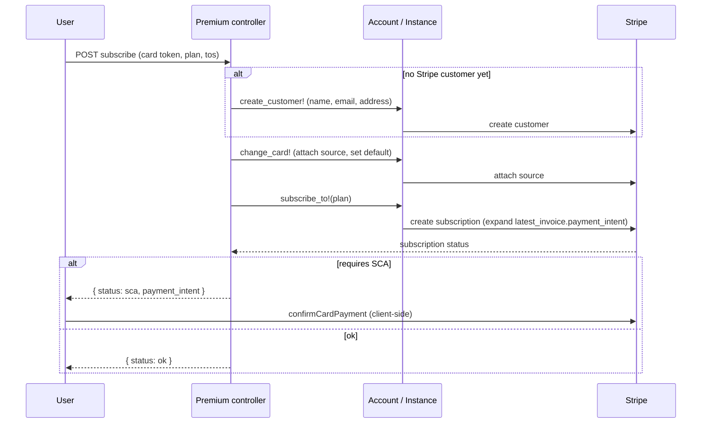

# Billing & Stripe

The Cloudery bills premium subscriptions through Stripe. Free instances need none of this; the machinery here is for the paid tiers.

The current checkout is **card-only**: it uses Stripe.js's Card Element to tokenize a card, attaches it to the customer as a legacy **Source**, and confirms SCA client-side. Everything below describes that shipped implementation.

## How Stripe is enabled per partner

Billing config is embedded per partner in `Partner::Stripe`:

| Field | Purpose |
| --- | --- |
| `enabled` | Whether this partner bills at all. |
| `creation` | Whether new instances start premium-capable. |
| `public_key` / `private_key` | The partner's Stripe API keys. |
| `webhook_secret` | The shared secret used to verify inbound Stripe webhooks for this partner. |
| `default_tax` | The default tax rate (nil for B2B, which is reverse-charge). |

A global Flipper flag `:stripe` gates the whole feature; `Partner#stripe?` is the single guard checked everywhere. All Stripe calls go through one entry point, `Partner#do_in_stripe`, which wraps `StripeWrapper` with the partner's private key so every call uses the right account.

:::note Stripe ids: who stores what
The Stripe **customer** id lives on the `Account` (one customer per billing person). The Stripe **subscription** id lives on the `Instance`. The Stripe **price** id lives in each `Plan`'s `currencies` hash. Inbound webhooks find the instance by a `metadata[:instance]` UUID stamped on the subscription, not by subscription id (which may not be persisted yet when the first event arrives).
:::

## The subscribe flow

The premium controller's `subscribe` action orchestrates it:

The response contract is `{ status: ok | sca | error }`. On `sca` the browser finishes the challenge with the returned PaymentIntent client secret.

## Plan changes, upgrades, downgrades

The subscription logic lives in `SubscriptionConcern` on the instance:

- **Free → premium**: create a Stripe subscription for the chosen plan.
- **Upgrade** (e.g. standard → premium): modify the subscription immediately, charging a proration against the pinned payment method.
- **Downgrade**: schedule the change for the end of the current period via a Stripe `SubscriptionSchedule`.
- **Cancel**: schedule cancellation at period end, then drop back to the free plan.

Card change goes through `change_source`: attach a new Source, set it as the customer default, delete the old ones.

## Reconciliation via webhooks

Stripe notifies the Cloudery at `POST /api/v1/stripe/:partner`. The signature is verified against the partner's `webhook_secret`, and every event is stored as a `StripeLog`.

Only the subscription lifecycle events are handled (`customer.subscription.created` / `updated` / `deleted`), all funneling into `update_subscription!`, which reads the current subscription state and reacts:

| Subscription state | Cloudery reaction |
| --- | --- |
| active / trialing / past-due | Mark paid; apply the plans and sync quota to the Stack. |
| unpaid | Downgrade to the free standard plan. |
| canceled / incomplete-expired | Re-provision the free plan. |

:::caution Invoice webhooks are not handled
The `invoice.payment_succeeded` / `payment_failed` / `payment_action_required` handlers are commented out. Dunning and downgrade are inferred purely from subscription **state transitions**, and a renewal that requires SCA produces no user notification. This is a known gap.
:::

## Gotcha: every call runs on one global API version

Stripe calls go through `StripeWrapper`. Although `Partner::Stripe` carries a per-partner `version` field, the wrapper passes it to the gem under the wrong option key (`version:` rather than `stripe_version:`), so the gem ignores it and turns it into a bogus header. In practice **every** Stripe call therefore uses the globally pinned `STRIPE_API_VERSION` (`2018-02-28`); the per-partner override is currently dormant. Keep that in mind before assuming a partner can be moved to a newer API version by setting the field alone.

:::note Card-only checkout
The checkout supports cards only. Alternative and local payment methods (for example Bancontact) and card-less B2B flows are not supported by the current Card Element integration.
:::
