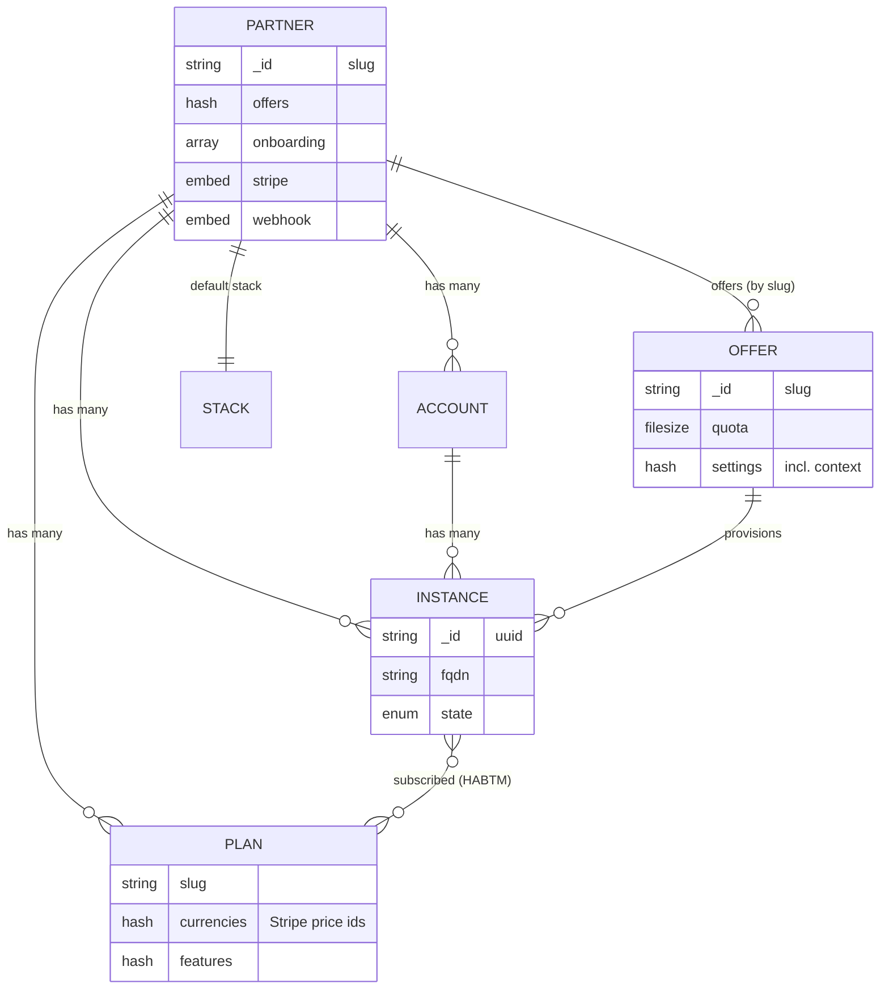

# Data model

Everything the Cloudery knows lives in MongoDB, mapped through Mongoid. This page is the map of that data: the collections, what each one is for, and how they connect.

## The core entities



:::note Keyed by slug
`Partner`, `Offer`, `Stack`, `Feature`, and `Voucher` use a human-readable string as their Mongo `_id` (the slug or code). You look them up directly: `Partner[:cozy]`, `Offer["cozy_beta"]`, `Voucher["WELCOME"]`. `Instance` and `Account` use UUIDs.
:::

### Partner

`app/models/partner.rb`, the top-level tenant. A partner owns its offers (a hash of slug → config), plans, accounts, and instances, plus its theming, onboarding steps, and constraints. It embeds three sub-documents:

- **`Partner::Stripe`**, per-partner billing config: `enabled`, `public_key`, `private_key`, `webhook_secret`, `default_tax`. See [Billing](./billing.md).
- **`Partner::Webhook`**, outgoing webhook config: `url`, an Ed25519 signing key, and an `events` allowlist.
- **`Partner::Application`**, mobile app / in-app-purchase configuration.

The partner named `cozy` is special: `admin?` returns true for it, which unlocks cross-partner API access and the global creation toggle.

### Offer

`app/models/offer.rb`, the *what to provision* template. Fields describe the instance to build: `apps`, `konnectors`, `quota`, `webhooks`, `links`, `locale`, `tos`, `constraints`, `redirect`, and `settings` (which carries the Stack **context** name). One offer targets exactly one context. Offers are referenced by slug and are also embedded in `partner.offers`.

### Plan

`app/models/plan.rb`, a priced tier belonging to a partner (`belongs_to :partner`). Holds `slug`, `name`, `quota`, `features`, and `currencies`. The `currencies` hash is where Stripe pricing lives: each currency entry carries the Stripe **price id**, the price in cents, the tax rate, and the billing interval. `premium?` is true for any plan whose slug is not `standard`. See [Partners, offers & plans](./partners-offers-plans.md) for the pricing details and a naming caveat about the free tier.

### Account

`app/models/account.rb`, the billing person under a partner (`belongs_to :partner`, `has_many :instances`). One account maps to one Stripe **customer**; the Stripe customer id is stored here (via `CustomerConcern`). This is the entity that owns cards and gets charged.

### Instance

`app/models/instance.rb` (with base fields in `instance_base.rb`), the heart of the system: one provisioned Cozy. It `belongs_to` a partner, an offer, and an account, and has a many-to-many link to the plans it is subscribed to.

Notable fields: `fqdn` (unique, `slug.domain`), `email`, `public_name`, `locale`, `settings`, `vouchers`, `secret`, `oidc`, `activation`, and a set of timestamp fields that together derive the instance **state**. It is soft-deletable (`Mongoid::Paranoia`).

`InstanceGandi` is a single-table-inheritance subclass for the Gandi partner, adding an HA cluster slot and an auto-generated alias domain.

:::tip State is computed, never set
An instance's `state` (`enqueued`, `creating`, `created`, `activated`, `deleting`, `deleted`, `blocked`, `error`) is recomputed from its timestamp fields on every validation. You don't assign a state; you set a timestamp (`instantiated_at`, `activated_at`, `deleting_at`…) and the state follows. See [Onboarding & lifecycle](./onboarding.md#instance-lifecycle).
:::

### Stack

`app/models/stack.rb`, a Cozy Stack cluster, holding its public (`http`) and admin (`admin`) URLs. This is the gateway object described in [Architecture](./architecture.md#talking-to-the-cozy-stack).

## Supporting collections

| Collection | File | Purpose |
| --- | --- | --- |
| **InstanceStock** | `instance_stock.rb` | Pre-created blank instances kept in a pool for fast activation. A stock is cloned into a real `Instance` on demand. |
| **Feature** | `feature.rb` | The *definition* of a capability: its type and how multiple values merge. Not a value itself. See [Features](./partners-offers-plans.md#features). |
| **Voucher** | `voucher.rb` | A redeemable code (the "code promo") carrying settings, in practice a storage quota bonus. |
| **Tos** | `tos.rb` | A Terms-of-Service version, scoped to a partner and/or offer, with a PDF and an `applicable_at` date. |
| **Funnel** | `funnel.rb` | Tracks a user's progress through an automated email drip campaign (an AASM state machine), **not** the onboarding wizard. |
| **Token** | `token.rb` | An API bearer token; its `_id` is the secret. Encodes which partners and fields it may access. See [API auth](./api.md#authentication). |
| **Webhook** | `webhook.rb` | An outgoing webhook delivery record, with embedded per-attempt logs. |
| **Config** | `config.rb` | A generic global key/value store (creation toggles, blacklist, HA counter). |
| **Waiting** | `waiting.rb` | A beta wait-list entry that accrues a bonus quota over time. |
| **Invoice** | `invoice.rb` | Not persisted: a stateless helper that fetches invoice PDFs and formats amounts. Invoices live in Stripe / the invoicer service. |
| **Log / StripeLog / Stats / WorkflowLog** | `*.rb` | Audit and telemetry records: generic change logs, inbound Stripe events, timing benchmarks, and workflow-to-object links. |

:::warning Two things people expect but that don't exist
There is **no `Campaign` model** (the word only appears as a Mailjet tag) and **no `Context` model** (context is a cozy-stack setting referenced by name from an offer's `settings`). The glossary's cardinality matrix in `doc/glossary.md` lists them as concepts, but in this codebase they are not Mongo collections.
:::

## Concerns: where the behavior lives

Mongoid concerns (`app/models/concerns/`) carry most of the interesting logic, mixed into the models above:

- **`SubscriptionConcern`** (on `Instance`), the billing brain: the plan relationship, Stripe subscribe/upgrade/downgrade/cancel, and syncing the resulting quota to the Stack.
- **`CustomerConcern`** (on `Account`), the Stripe customer id, card changes, and customer creation.
- **`QuotaConcern`** (on `Instance`), computes the effective quota from layered sources (plan, voucher, offer).
- **`OauthConcern`** (on `Instance`), registers the instance's OAuth client against the Stack.
- **`TosConcern`**, ToS acceptance tracking (on both `Account` and `Instance`).
- **`PrecreationConcern`** (on `Partner`), manages the pre-creation pool and promotes a stock into a live instance.
- **`WebhookConcern`** (on `Instance`), fires `instance.created` / `activated` / `deleted` events to the partner.

## Relationship cheat sheet

```
Partner 1─* Plan
Partner 1─* Account 1─* Instance
Partner 1─* Instance *─* Plan        (many-to-many: active subscription)
Partner 1─* InstanceStock            (pre-creation pool)
Partner  ─  default_offer ──▶ Offer
Partner  ─  stack ──────────▶ Stack
Partner embeds Application, Stripe, Webhook
Instance ─ belongs_to ▶ Partner, Offer, Account
InstanceGandi ◁ Instance             (STI)
Tos, Webhook(delivery) ─ belongs_to ▶ Partner (+ optional Offer)
Voucher, Feature, Config, Funnel     standalone, keyed by _id
```
