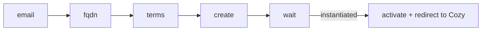
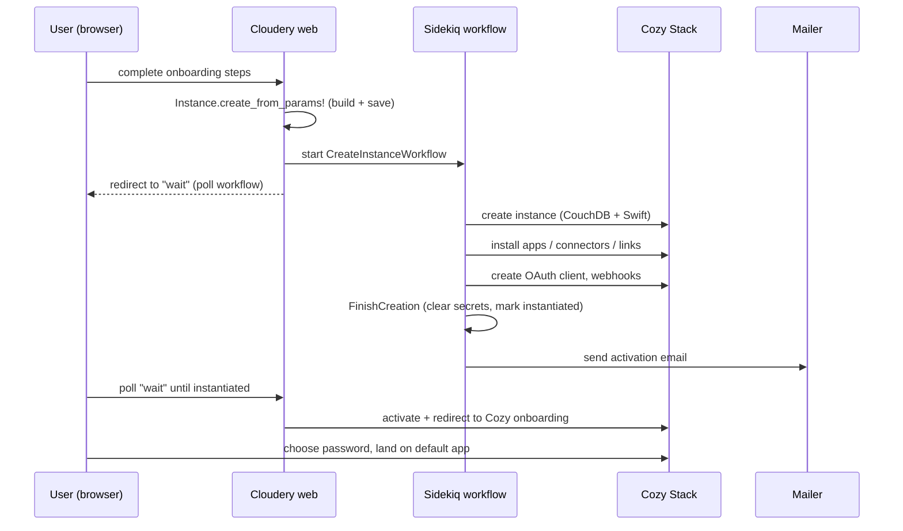
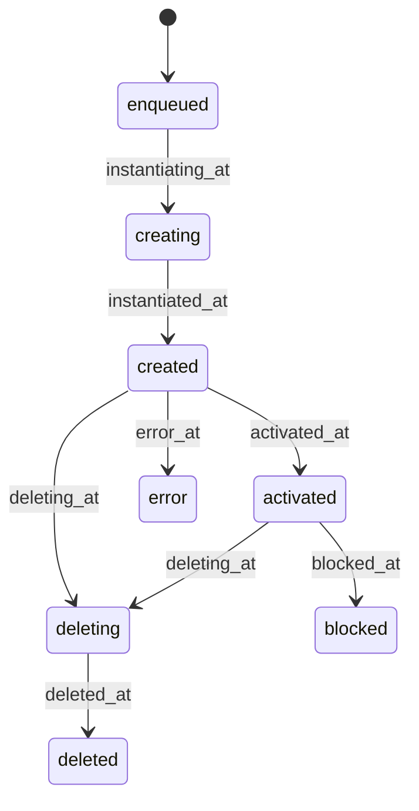

# Onboarding & instance lifecycle

Onboarding is how a user goes from "I want a cloud" to a live, activated Cozy instance. This page covers the signup wizard, the provisioning flow it triggers, the states an instance moves through, and the partner-specific variations.

## The v2 onboarding wizard

Onboarding is a **session-driven stepper**. The steps themselves are data: each partner defines an ordered `onboarding` array, and the stepper walks it. A typical consumer flow is:

| Step | What happens |
| --- | --- |
| `email` | Collect and validate the email (AJAX `check_email` rejects invalid or already-used addresses). A voucher code, if any, is stashed in the session. |
| `fqdn` | Derive the instance slug from the email local-part and pick the domain. |
| `terms` | Load the current ToS for the partner/offer, record acceptance (version, IP, date), and capture the newsletter opt-in. |
| `create` | Assemble the final params from the session and call `Instance.create_from_params!`, which kicks off the creation workflow. Store the workflow id in the session. |
| `wait` | Poll the instance state. On error, show the error page. Once `instantiated`, activate it and redirect the user to their Cozy's onboarding (choose password) URL. |

:::note Payment is not part of onboarding
The standard free onboarding has no plan-choice or payment step. Premium subscription is a **separate, post-creation flow** on the instance's `premium` page. See [Billing](./billing.md). Vouchers entered during onboarding only grant extra storage, not a discount.
:::

:::info v1 is gone
The old single-page v1 onboarding (`cozy/create`) now hard-redirects to v2 (`/v2/cozy/onboard`). Legacy callers that passed parameters through a JS blob still work: the `onboard` entry point parses that `onboarding` JSON param into the session so the OAuth client details survive into v2 creation.
:::

## What "funnel" means here

The word **funnel** in the Cloudery is a false friend. `Funnel` is **not** the onboarding wizard. It is a record tracking a user's progress through an **automated email drip campaign** after their instance exists, modeled as an AASM state machine.

The concrete campaign (`AASM::Funnel::Onboarding`) sends five feature-education emails at days 1, 3, 5, 7, and 28 (collect, banks, drive, passwords, notes), each guarded on timing and on the instance being activated. Users can unsubscribe, which moves the funnel to its terminal state.

## Instance creation end to end

Two model methods anchor the flow:

- **`Instance.create_from_offer!`** builds and saves the instance: records ToS acceptance, applies any voucher quota, sets the locale, seeds `premium_enabled` from the partner's Stripe-creation flag, and stashes the transient secrets (OAuth client, connectors, passphrase) in Redis with a TTL.
- **`Instance.create_from_params!`** resolves the offer and account, handles the newsletter opt-in (Cozy only), and dispatches to the **right workflow for the partner** (`ac-rennes`, `maif_majordome`, `gandi`, or the default), returning the instance and its workflow.

The default `CreateInstanceWorkflow` then runs the provisioning DAG described in [Architecture](./architecture.md#background-orchestration-workflows-and-jobs): create the Stack instance, install apps/connectors/links in parallel, create accounts and webhooks, finalize, and email the activation link.

:::tip Activation can be skipped
The `SendActivationEmail` job is skipped for partners that use SSO instead of email activation, currently `maif_epa` and Grand Lyon's SSO offer. Those users activate through their identity provider, not a mailed link.
:::

## Instance lifecycle

An instance's state is **derived from its timestamps**, never set directly. Setting a timestamp moves the state.

| State | Meaning |
| --- | --- |
| `enqueued` | Created in Mongo, workflow not yet started provisioning. |
| `creating` | Provisioning in progress on the Stack (`instantiating_at` set). |
| `created` | Provisioned and finalized (`instantiated_at` set); activation email sent. |
| `activated` | User completed activation (`activated_at` set); welcome mail sent, `instance.activated` webhook fired. |
| `deleting` / `deleted` | Deletion workflow running / complete (soft- or hard-delete). |
| `blocked` | Administratively blocked; propagated to the Stack. |
| `error` | Provisioning failed. |

Changes to a live instance's quota or features are pushed to the Stack automatically by a `before_update` hook, so state and capabilities stay in sync without manual Stack calls.

:::note Pre-created stock
For fast activation, a partner can maintain a pool of pre-created blank instances (`InstanceStock`). When a real user arrives, a stock is promoted into a full `Instance` rather than provisioning from scratch. This is distinct from the beta wait-list (`Waiting`), which is just an email list that accrues bonus quota over time.
:::

## Partner-specific onboarding

Generic partners are served by the shared `V2::PartnerController`, entirely data-driven from their `onboarding` array. Four partners have custom controllers because their entry flow differs:

### Grand Lyon (`grdlyon`)

Onboarding is OIDC / FranceConnect based rather than email based. The controller runs the authorization-code dance, matches the returned identity to an instance, and renders one of three per-offer onboarding views (`default`, `ecolyo`, `mespapiers`). It carries a custom SCSS theme and favicons and can restrict signups by postcode.

### Mes Papiers

**Mes Papiers is not a separate partner.** It is a Grand Lyon product, surfaced as the `grdlyon_mespapiers` offer (the French administrative-documents app) with its own onboarding view and a dedicated login page. The login page supports a `login_redirect` so an existing Cozy user can deep-link straight into the Mes Papiers app.

### Académie de Rennes (`ac-rennes`)

Education partner, OIDC via Toutatice. The offer, slug, domain, and email all come from the OIDC claims (`myCloudOffre`, `unik`, `myCloudUrl`, `mail`); the controller validates that the returned domain matches the partner default. Creation runs a workflow variant that adds the Toutatice connector and a creation notification.

### How theming works

- **CSS**: `Partner#theme` names a stylesheet; the onboarding layout injects it and adds a `theme-inverted` body class. Grand Lyon's theme lives at `app/assets/stylesheets/grdlyon/theme.scss`, with images and React components under matching partner directories.
- **Views**: partners get their own view directories and per-offer templates (`onboarding_<offer>`).
- **i18n**: partner-scoped locale files layer over the base strings via the load path (for example `config/locales/partners/grdlyon/`).
- **Steps**: the `onboarding` array and `creation_enabled?` gate let each partner shape the flow without new code.

## Newsletter double opt-in

When a user opts into the newsletter at the `terms` step (Cozy only), the Cloudery subscribes them to Mailchimp with status `pending` rather than `subscribed`. Mailchimp then sends a confirmation email the user must click before they are actually subscribed, satisfying double-opt-in consent requirements.
