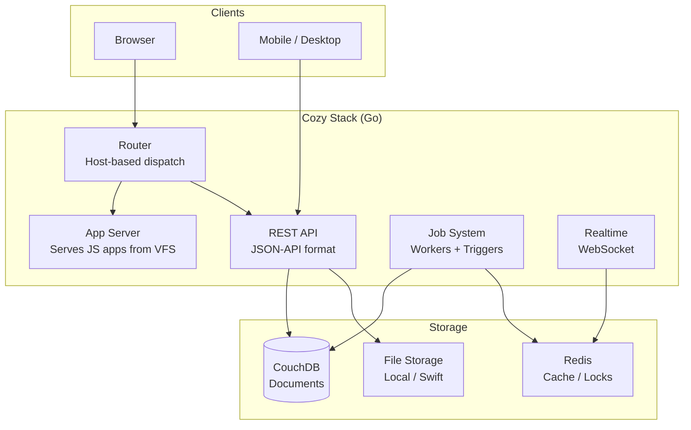
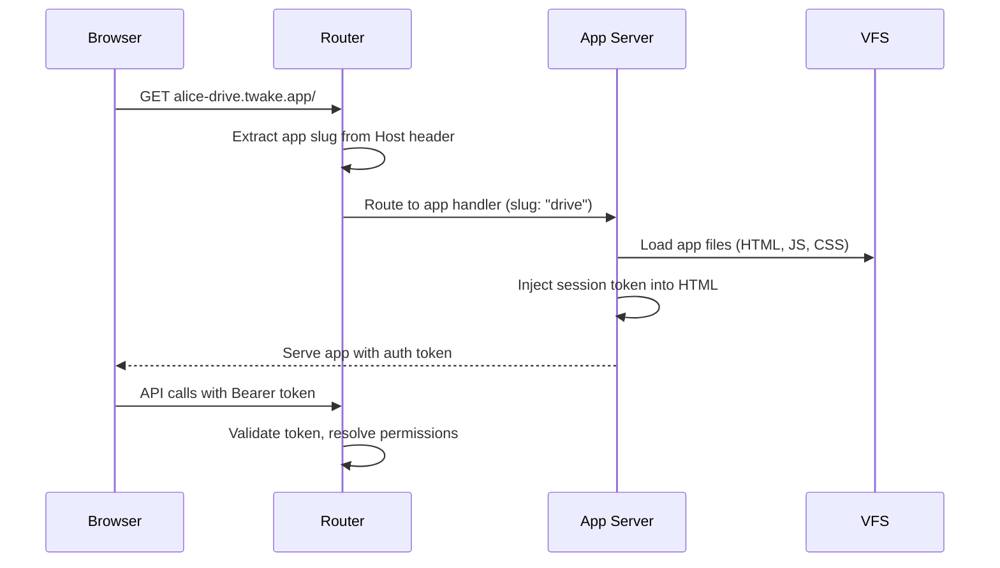

## Overview

Cozy Stack follows a **multi-tenant, stateless** architecture. A single Go process serves multiple user instances, each with isolated data. The stack itself holds no state beyond configuration, making it horizontally scalable behind a load balancer.



## Multi-tenancy

Each user gets a **Cozy instance** identified by a domain (e.g., `alice.twake.app` or `user1.twake.app`). Instances are fully isolated:

- **Separate CouchDB databases** per instance, prefixed by a hash of the domain
- **Separate file storage** directory or Swift container per instance
- **Separate sessions and tokens** with instance-specific secrets
- **Disk quotas** enforced per instance

The stack resolves the target instance from the `Host` header on every request. No data leaks between instances.

## How applications are served

Cozy Stack serves JavaScript web applications through **subdomain routing**. Each installed app gets its own subdomain:

### Subdomain models

| Model      | URL pattern                 | Example                 |
| ---------- | --------------------------- | ----------------------- |
| **Flat**   | `<instance>-<app>.<domain>` | `alice-drive.twake.app` |
| **Nested** | `<app>.<instance>.<domain>` | `drive.alice.twake.app` |

The **flat** model is used in production. The **nested** model is typically used for local development.

### Request flow



Applications are static JavaScript bundles stored in the VFS. The stack injects an authentication token into the served HTML so the app can make authenticated API calls. Each app's `manifest.webapp` defines its permissions, routes, and which routes are public vs. private.

## Data model

### CouchDB document storage

All structured data is stored in CouchDB as JSON documents. Each document belongs to a **doctype** (e.g., `io.cozy.files`, `io.cozy.contacts`, `io.cozy.events`). Documents within an instance are stored in per-doctype databases:

```
<instance-prefix>/io-cozy-files
<instance-prefix>/io-cozy-contacts
<instance-prefix>/io-cozy-events
```

The Data System API exposes CouchDB-style operations (CRUD, Mango queries, bulk operations) through a REST interface that enforces permissions.

### Virtual File System

Files are managed through a VFS abstraction that separates metadata from content:

- **Metadata** (name, path, size, checksums, versions) lives in CouchDB (`io.cozy.files`)
- **Binary content** lives on the filesystem or in OpenStack Swift
- **Versioning** keeps old versions of files, with configurable retention
- **Trash** provides soft-delete with restore capability

## Job system

The stack includes an asynchronous job execution system for background tasks:

| Trigger type  | Description                      |
| ------------- | -------------------------------- |
| `@cron`       | Periodic execution (cron syntax) |
| `@every`      | Fixed interval                   |
| `@at` / `@in` | One-time scheduled execution     |
| `@event`      | Triggered by document changes    |
| `@webhook`    | Triggered by external HTTP call  |

Jobs power konnectors (data import from external services), thumbnail generation, email sending, notifications, and more. Workers can run in-process or be distributed via Redis.

## Sharing

Cozy Stack supports peer-to-peer sharing between instances using CouchDB replication. When users share a folder or set of documents, the stack:

1. Creates a sharing document describing what is shared and with whom
2. Sets up replication between the two instances' CouchDB databases
3. Synchronizes changes bidirectionally

This design means shared data exists on both instances with no central server, preserving the self-hosted philosophy.

## Deployment patterns

| Scale           | Architecture                                                                 |
| --------------- | ---------------------------------------------------------------------------- |
| **Self-hosted** | Single cozy-stack + CouchDB + local filesystem                               |
| **Medium**      | Reverse proxy + cozy-stack + CouchDB cluster + Redis                         |
| **Large**       | Load balancer + multiple cozy-stack nodes + CouchDB clusters + Redis + Swift |

The stack is stateless, so scaling horizontally requires only a shared CouchDB cluster and Redis for distributed locks and job queues.
