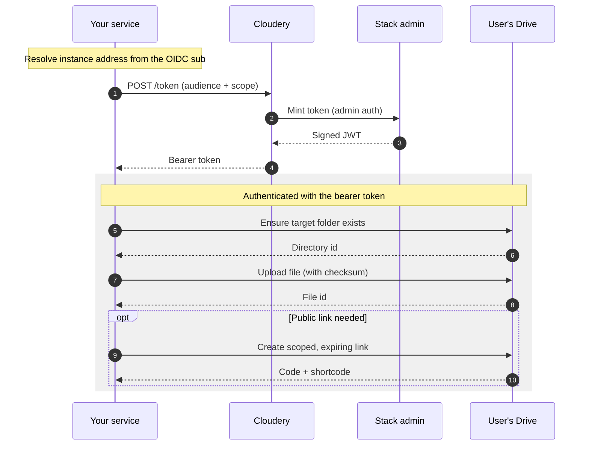

A task oriented guide for a backend service that needs to put a file into a
user's Drive and, optionally, expose it through a public link. The motivating
case is Calendar attachments: detaching attachments from events and storing them
in Drive instead of inline, both for migrations and for inbound third party
events.

The token mechanics are covered in [Service Tokens (Cloudery)](./service-tokens.md).
This page assumes you already have a Stack bearer token and focuses on the Drive
calls and the risks.

## Prerequisites

1. The user's instance address (the Drive URL). Today, derive it from the OIDC
   `sub` until the workplace address is available in the user info response.
2. A Stack bearer token for that instance with the scopes you need:
   `io.cozy.files` to create folders and upload, plus `io.cozy.permissions` if
   you will create a public link. Obtain it from the Cloudery as described in the
   service tokens guide. For a long job, prefer a 24 hour app token; for a short
   one shot, a 30 minute cli token is enough.

## Step 1: pick a target folder

Every file lives under a parent directory. You can upload into the Drive root,
but a dedicated folder is usually better so attachments land in a predictable,
app owned location. A folder referenced by an app document gives a stable
directory id you can resolve on each run instead of hardcoding one.

Create a folder:

```
POST /files/{parent-dir-id}?Type=directory&Name=Calendar%20attachments
Authorization: Bearer <token>
```

The response carries the new directory's id, which you upload into.

A note on visibility: a folder you create here shows up in Twake Drive Web and
the Desktop app. If the attachments folder should be hidden or specially labeled,
agree the folder placement and attributes with the product owner before shipping.

## Step 2: upload the file

```
POST /files/{dir-id}?Type=file&Name=invite.ics
Authorization: Bearer <token>
Content-Type: text/calendar
Content-MD5: <base64 of the binary MD5>

<binary body>
```

- `Type=file` and `Name` are required.
- `Content-Type` sets the stored mime type.
- `Content-MD5` (the Base64 encoded binary MD5) is optional but recommended. If
  it does not match what the server computes, the upload is rejected with a
  precondition error, which catches corrupted transfers.

The response carries the new file's id, which you keep if you need to reference
it later (for example to rewrite the event to point at the Drive file).

## Step 3 (optional): create a public link

To expose the uploaded file through a link protected by a code, create a by link
permission that references the file:

```
POST /permissions?codes=public&ttl=30D
Authorization: Bearer <token>
Content-Type: application/vnd.api+json
```

with a body granting read (`GET`) on that single file id.

- `codes` is a comma separated list of labels so you can revoke individual codes
  later. Each label produces a code and a shorter shortcode for the link.
- `ttl` bounds the link lifetime. Use one unless the link is meant to be
  permanent.
- Scope the link to read only, on the single file id. Do not grant write or a
  broader set than the link needs.

## Risks and what to keep in mind

**The token is powerful and coarse.** A token carrying the files scope grants
access to the user's entire Drive, not just the folder you created. There is no
attachment only, folder scoped grant today. Your service is holding a credential
that can read, write, and delete any file the user owns. Request it as late as
possible, keep it in memory rather than at rest, and never log it.

**It is admin minted, not user consented.** The user did not click "allow" for
your service. The authority comes from the Cloudery's admin credential. That is
acceptable for trusted first party backend jobs, but it means the usual consent
and revocation experience does not apply. Make sure the operation is one the user
actually expects.

**Token lifetime mismatches.** A short lived token will start failing partway
through a long job. Use a longer lived token for bulk work and handle
re-acquisition when it expires.

**Public links are public.** A by link permission is reachable by anyone who has
the link. Always set an expiry, scope it to a single file with read only access,
and revoke the code when the link is no longer needed. Do not create a link at
all if the file does not need to be shared.

**Quota and failure modes.** Uploads count against the user's disk quota. Check
available space before a large migration and fail gracefully. A precondition
error means the checksum did not match; running out of space is reported as a
payload too large error.

**Folder visibility.** Anything you create shows up in the user's Drive. Surprising
folders are a support burden. Name them clearly and confirm placement with the
product owner.

**Do not store large blobs inline.** The reason attachments move to Drive in the
first place is to keep events metadata only. Do not regress that by writing
attachment bytes back into the event.

## Summary flow


