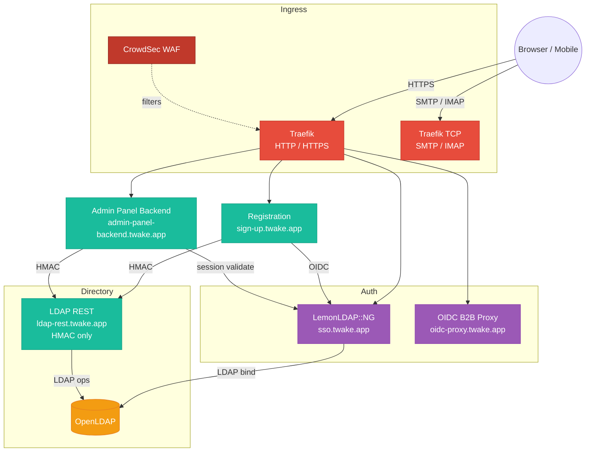
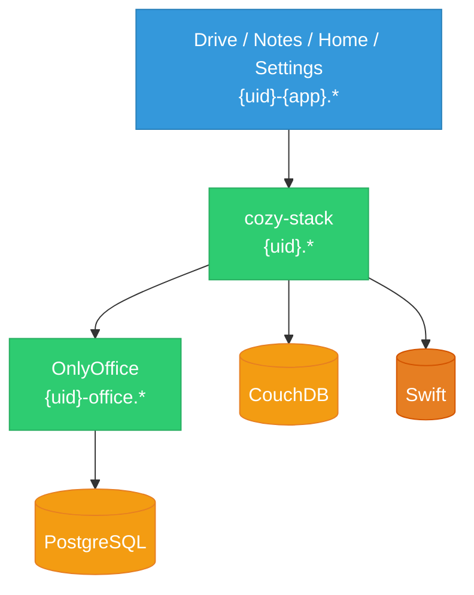
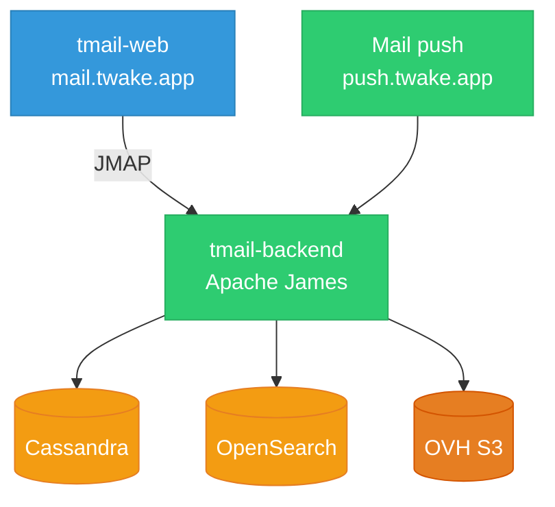
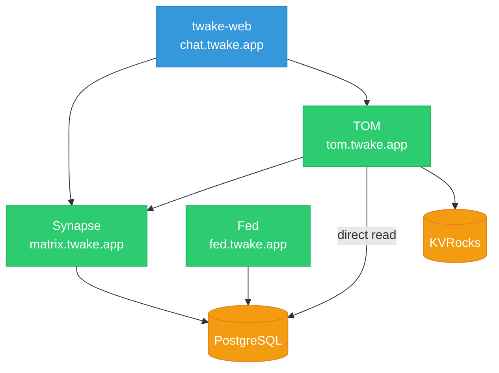
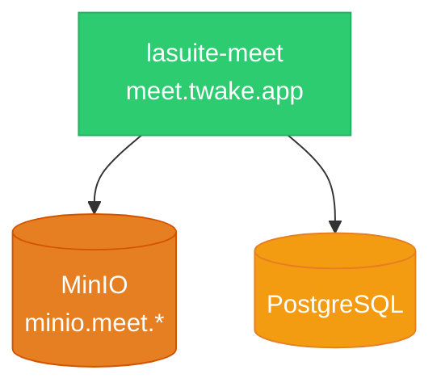
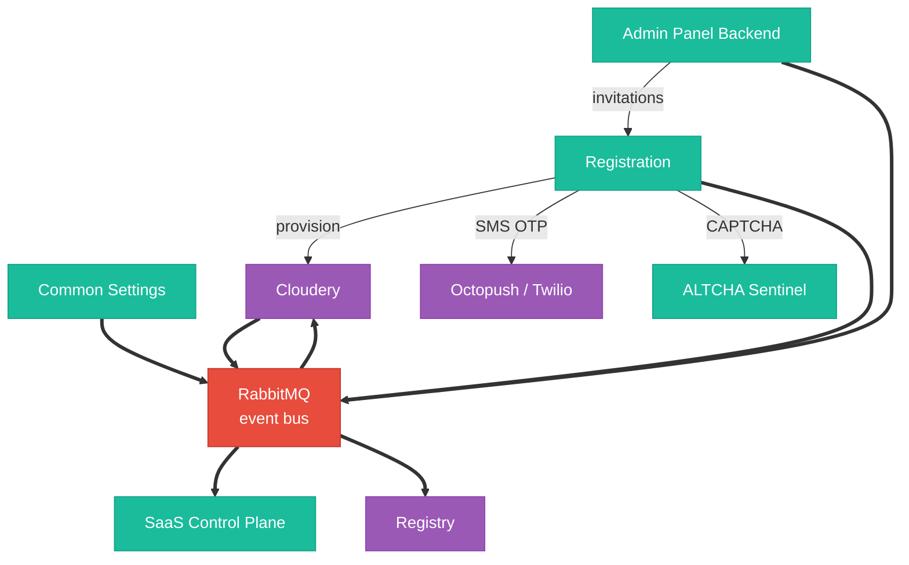
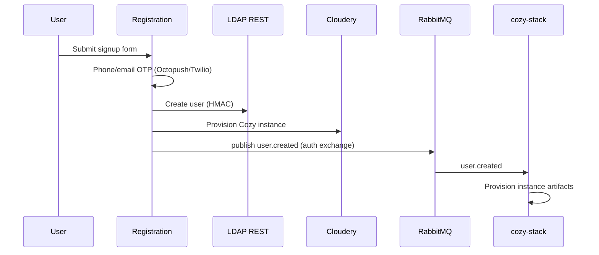
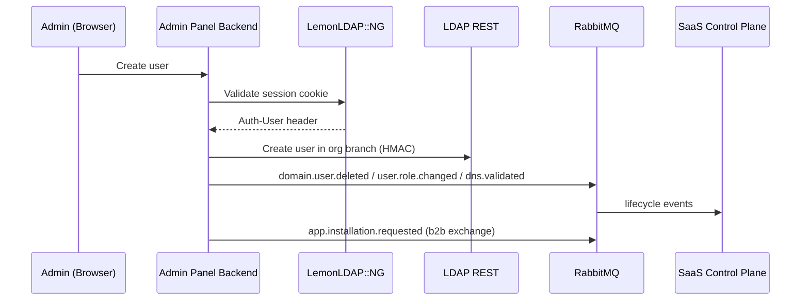

Twake Workplace runs as a set of independent services inside a Kubernetes cluster on OVH, fronted by Traefik and authenticated through LemonLDAP::NG.

:::note
Two production environments are in active use: **Twake SaaS** (`*.twake.app`) and **LINAGORA** (`*.linagora.com`). They share the same service fabric. Cozy infrastructure (cozy-stack, CouchDB, Swift, Cloudery, Registry) lives on a separate network and is reached over HTTPS and an IP-whitelisted RabbitMQ bridge. See [Environments](./environments) for per-environment hostnames.
:::

## Production Topology

The topology is broken out per subsystem so each diagram stays readable at normal page widths. The [RabbitMQ](./rabbitmq) page documents the event bus separately.

### Ingress and authentication

Browser and mobile traffic always lands on Traefik; CrowdSec acts as an IP-level WAF. LemonLDAP owns user authentication; the OIDC B2B proxy exists because some chat B2B deployments need a distinct OIDC client identity from the main SaaS tenant.

### Cozy Stack

cozy-stack serves per-user instances for Drive, Notes, Home, and Settings. It stores documents in CouchDB and keeps file blobs on Swift. OnlyOffice handles document editing and uses PostgreSQL.

### TMail

Apache James is the backend, accessed over JMAP from the Flutter web client. Cassandra holds mail data, OpenSearch provides full-text search, and attachments go to OVH S3.

### TChat

Synapse handles Matrix protocol. TOM bridges Synapse with Twake-specific APIs (reading Synapse's PostgreSQL directly for lookups) and keeps its own state in KVRocks. Fed covers federated identity.

### Meet

Video meetings served by `lasuite-meet`, with recordings and artefacts stored in a dedicated MinIO.

### Platform control plane and external integrations

Registration and Admin Panel drive the lifecycle of users, organisations, and per-user instances. Lifecycle events flow over RabbitMQ; [Cloudery](../cloudery/) and Registry are reached over HTTPS on a separate network.

Thick arrows denote RabbitMQ event flow. See [Authentication](./authentication) for the service-to-service auth mechanisms and [RabbitMQ](./rabbitmq) for the event bus topology.

## Platform Services

Hostnames live in [Environments](./environments) and are not repeated here. This table captures what each service is and how it is built.

| Service                  | Tech               | Role                                                                          |
| ------------------------ | ------------------ | ----------------------------------------------------------------------------- |
| Landing pages            | `tilda-to-nginx`   | Public marketing pages                                                        |
| Registration             | SvelteKit + PG     | B2C/B2B signup, login, OTP, recovery, provisioning. Also SSO entry point.    |
| LemonLDAP portal         | `yadd/llng`        | SSO / OIDC provider                                                           |
| LemonLDAP Manager        | `yadd/llng`        | Admin UI for LLNG configuration                                               |
| Admin Panel Backend      | Express.js + PG    | Session validation, HMAC proxy to LDAP REST, DNS validation, lifecycle events |
| LDAP REST                | Node.js            | REST API over OpenLDAP, HMAC-SHA256 only (no browser access)                  |
| Common Settings          | Node.js + PG       | Shared settings across apps, broadcasts updates via RabbitMQ                  |
| SaaS Control Plane       | -                  | Platform orchestration, consumes lifecycle events                             |
| OIDC B2B proxy           | -                  | B2B chat OIDC proxy                                                           |
| ALTCHA Sentinel          | Altcha             | Anti-bot challenge service used by Registration                               |
| Cozy Stack               | Go                 | Per-user instances serving Drive, Notes, Home, Settings                       |
| OnlyOffice               | -                  | Document editing                                                              |
| TMail backend            | Apache James       | JMAP, SMTP, IMAP (internal)                                                   |
| TMail web                | Flutter            | Email frontend                                                                |
| Mail push                | -                  | Mobile push notifications                                                     |
| TChat web                | React              | Chat frontend                                                                 |
| Synapse                  | Matrix             | Chat backend                                                                  |
| Synapse Sliding Sync v3  | Matrix             | Matrix sync v3 proxy                                                          |
| TOM server               | Node.js            | Twake identity / gateway, reads Synapse PG directly                           |
| Federated identity       | Node.js            | Federated identity service                                                    |
| Meet                     | lasuite-all-in-one | Video meeting service with dedicated MinIO object store                       |

TCalendar (SabreDAV + side-service) is not yet in SaaS production; see the [Twake Calendar](../tcalendar) section.

## Databases

| Database   | Location                     | Used by                                                                                   | Notes                                     |
| ---------- | ---------------------------- | ----------------------------------------------------------------------------------------- | ----------------------------------------- |
| OpenLDAP   | K8s `dbs`                    | All apps via LemonLDAP + LDAP REST                                                        | B2C + B2B directory                       |
| PostgreSQL | OVH managed                  | synapse, tom, fed, LLNG, signup-db, admin-panel-db, common-settings, OnlyOffice           | External to the cluster, multiple DBs     |
| MongoDB    | K8s `dbs` (STG only)         | TCalendar work-in-progress                                                                | Not enabled in current PRD                |
| Redis      | K8s `dbs`                    | Shared cache                                                                              | Both standalone and HA deployments exist  |
| RabbitMQ   | K8s `dbs`                    | All apps (event bus)                                                                      | TLS certs, IP whitelisting for partners   |
| KVRocks    | K8s `kvrocks`                | TChat (TOM)                                                                               | Persistent Redis-compatible               |
| OpenSearch | K8s `tmail`                  | TMail                                                                                     | Full-text search                          |
| Cassandra  | OVH (outside K8s)            | TMail                                                                                     | Email storage                             |

## Object Storage

| Technology | Used by            | Content                                    |
| ---------- | ------------------ | ------------------------------------------ |
| Swift      | Cozy Stack         | User files                                 |
| OVH S3     | TMail              | Email blobs                                |
| MinIO      | Meet               | Meet recordings and artefacts              |

## Data Flow Examples

### B2C registration

### B2B user creation

### SSO login

End users never authenticate against the LemonLDAP portal directly - the Registration service acts as an OIDC proxy that applies the client-side PBKDF2 and server-side Scrypt hashing before LLNG performs the LDAP bind. See [SSO and OIDC Proxy](./sso) for the full sequence.

## Related Pages

- [Authentication](./authentication) - HMAC, OIDC, LLNG session handling
- [SSO and OIDC Proxy](./sso) - Registration as SSO entry point
- [LDAP Structure](./ldap-structure) - directory layout and schema
- [RabbitMQ](./rabbitmq) - exchanges, vhosts, producers, consumers
- [Environments](./environments) - PRD, STG, DEV, QA, Linagora URLs
- [Security](./security) - attack surface, trust boundaries, encryption
