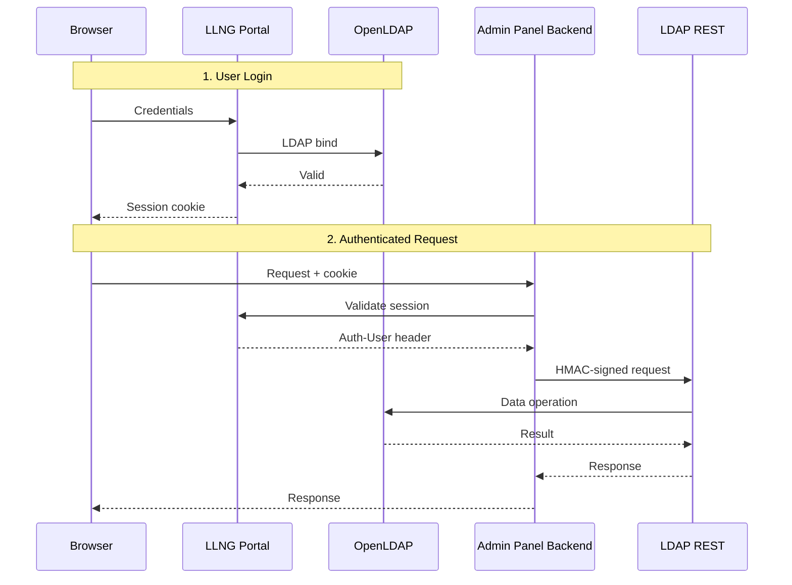

Twake Workplace uses three authentication patterns depending on the communication channel.

## HMAC-SHA256 (Service-to-Service)

All internal REST API calls between services use HMAC-SHA256 request signing. Each service has a unique service ID and shared secret registered in the LDAP REST server's `DM_AUTH_HMAC` configuration.

**Services using HMAC:**

- Registration -> LDAP REST
- Admin Panel Backend -> LDAP REST
- Dashboard -> LDAP REST
- Seed (test data) -> LDAP REST

**Configuration:**

```env
# In DM_AUTH_HMAC (comma-separated entries of service-id:secret:label)
DM_AUTH_HMAC=registration-service:saas-secret-key-for-hmac-auth-32chars!:Registration Service,\
admin-panel-backend:admin-hmac-secret-key-for-auth-32ch!:Admin Panel Backend
```

Secrets must be at least 32 characters. The client library `@linagora/ldap-rest-client` handles request signing automatically.

## LemonLDAP::NG (Browser Sessions)

Browser-facing services authenticate users through LemonLDAP::NG (LLNG), an SSO portal that validates credentials against OpenLDAP.

**How it works:**

1. User visits a protected service (e.g., Admin Panel)
2. LLNG handler checks the session cookie
3. If valid, LLNG injects headers (`Auth-User`, user attributes) into the request
4. The backend reads these headers to identify the user

**Admin Panel Backend** uses this pattern:

- LLNG handler validates the session cookie
- Injects `Auth-User` header with the authenticated user's identifier
- Backend reads the header and proxies requests to LDAP REST with HMAC auth

## OIDC / OAuth2 (SSO)

The **registration service** is the SSO entry point for all Twake Workplace applications. It acts as an OIDC proxy in front of LemonLDAP::NG, handling login, multi-layer password hashing, and session establishment before delegating token issuance to LemonLDAP.

The LemonLDAP portal cannot be used directly by end users because Twake applies client-side PBKDF2 and backend Scrypt hashing before LDAP bind. See [Registration SSO & OIDC Proxy](/overview/sso) for the full architecture.

**Services using OIDC (via registration):**

- Tmail (email)
- Cozy Stack (drive, calendar, notes)
- Twake Chat
- Dashboard (optional, for admin access control)
- Cozy Admin

**Configuration for OIDC clients:**

```env
OIDC_ISSUER=https://sign-up.twake.app
OIDC_CLIENT_ID=my-app
OIDC_CLIENT_SECRET=your-client-secret
OIDC_REDIRECT_URI=https://my-app.example.com/auth/callback
```

## LDAP Bind (User Login)

End users do not authenticate against the LemonLDAP portal directly. Instead, they log in through the registration service, which applies a multi-stage password hashing pipeline (PBKDF2 + Scrypt) before forwarding credentials to LemonLDAP for LDAP bind. See [Registration SSO & OIDC Proxy](/overview/sso) for details.

## Auth Flow Summary


