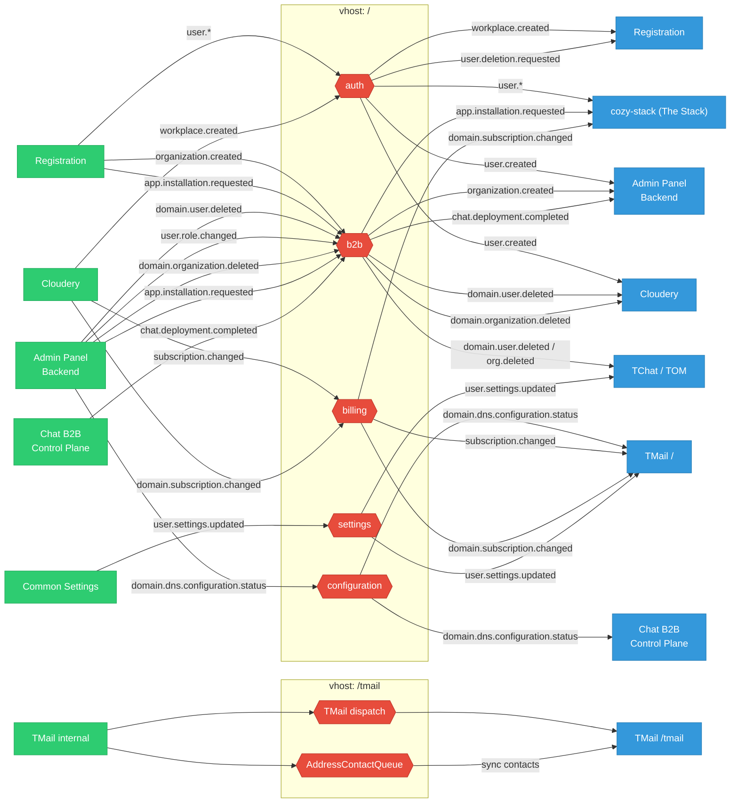

Twake Workplace uses RabbitMQ as the asynchronous event bus between services. Producers publish state-change events to topic exchanges; consumers react without blocking the request that caused the change.

## Exchange Topology

## Vhosts

| Vhost    | Exchanges                                                                     |
| -------- | ----------------------------------------------------------------------------- |
| `/`      | `auth`, `b2b`, `configuration`, `settings`, `billing` (plus `b2b.dlx` for DLQ routing) |
| `/tmail` | TMail-internal dispatch and address-book contact sync with third-party providers |

## Publishers and Consumers

Routing keys are shown as the defaults; env vars can override them. Authoritative reference for Admin Panel Backend events: [`admin-panel-backend/docs/rabbitmq.md`](https://github.com/linagora/twake-workplace-private/blob/main/admin-panel-backend/docs/rabbitmq.md). For Registration: [`registration/docs/architecture.md`](https://github.com/linagora/twake-workplace-private/blob/main/registration/docs/architecture.md).

### `auth` exchange

| Routing key                   | Publisher    | Consumer(s)                                |
| ----------------------------- | ------------ | ------------------------------------------ |
| `user.created`                | Registration | Admin Panel Backend, Cloudery, cozy-stack* |
| `user.password.updated`       | Registration | cozy-stack*                                |
| `user.phone.updated`          | Registration | cozy-stack*                                |
| `user.2fa.updated`            | Registration | cozy-stack*                                |
| `user.recovery-email.updated` | Registration | cozy-stack*                                |
| `workplace.created`           | Cloudery     | Registration                               |
| `user.deletion.requested`     | (none)†      | Registration                               |

\* cozy-stack subscribes with the `user.*` wildcard, so it receives every `user.X` key.
† Registration listens for this as an optional alternative to its delete-account API; no service currently publishes it.

### `b2b` exchange

| Routing key                   | Publisher                         | Consumer(s)                                       |
| ----------------------------- | --------------------------------- | ------------------------------------------------- |
| `organization.created`        | Registration                      | Admin Panel Backend                               |
| `app.installation.requested`  | Registration, Admin Panel Backend | cozy-stack                                        |
| `domain.user.deleted`         | Admin Panel Backend               | Cloudery, TChat, cozy-stack, SaaS Control Plane   |
| `user.role.changed`           | Admin Panel Backend               | -                                                 |
| `domain.organization.deleted` | Admin Panel Backend               | Cloudery, TChat, cozy-stack, SaaS Control Plane   |
| `chat.deployment.completed`   | Chat B2B Control Plane            | Admin Panel Backend                               |

### `configuration` exchange

Published after a user validates DNS for chat, top-level domain, or mail.

| Routing key                       | Publisher           | Consumer(s)                   |
| --------------------------------- | ------------------- | ----------------------------- |
| `domain.dns.configuration.status` | Admin Panel Backend | TMail, Chat B2B Control Plane |

### `settings` exchange

| Routing key             | Publisher       | Consumer(s)  |
| ----------------------- | --------------- | ------------ |
| `user.settings.updated` | Common Settings | TMail, TChat |

### `billing` exchange

| Routing key                   | Publisher | Consumer(s)       |
| ----------------------------- | --------- | ----------------- |
| `subscription.changed`        | Cloudery  | TMail             |
| `domain.subscription.changed` | Cloudery  | TMail, cozy-stack |

### `/tmail` vhost

TMail-internal flows: `TMail dispatch` and `AddressContactQueue` exchanges route between TMail's internal services and TMail `/tmail` consumers (e.g. address-book contact sync with third-party providers). Routing keys are TMail-internal; see the TMail backend repo.

## Security and Deployment Notes

- RabbitMQ runs in the `dbs` namespace with TLS certs (`rabbitmq-cert`).
- Cozy Infrastructure connects over AMQPS with IP whitelisting; no mTLS is enforced inside the cluster.
- The RabbitMQ management UI is exposed publicly at `rabbitmq.twake.app` - treat credentials as sensitive.
- Per-environment hostnames are listed on the [Environments](./environments) page.

## Configuration Reference

RabbitMQ connection and routing are configured via environment variables. See:

- [Admin Panel Backend RabbitMQ](https://github.com/linagora/twake-workplace-private/blob/main/admin-panel-backend/docs/rabbitmq.md) for message formats, payloads, and routing keys
- [Registration Architecture](https://github.com/linagora/twake-workplace-private/blob/main/registration/docs/architecture.md) for registration-specific messaging
- [Local Dev with Docker](./docker-compose) for the full list of RabbitMQ environment variables
