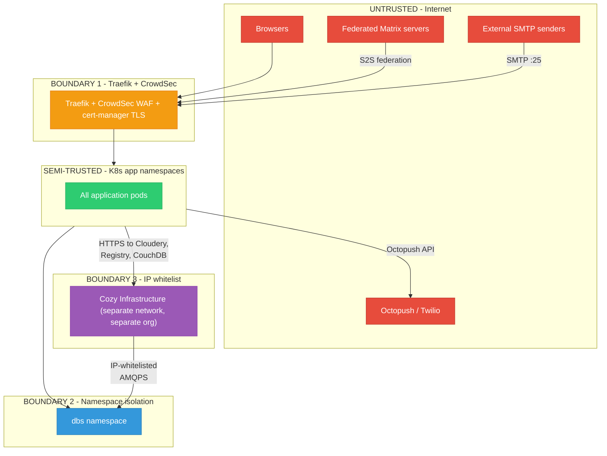

This page summarises the production attack surface, trust boundaries, authentication mechanisms, and the current state of encryption between components. It is the starting point for grey-box security reviews.

## Attack Surface

The cluster exposes the following ports through Traefik. Hostnames per environment are listed on the [Environments](./environments) page and are the canonical reference; the services below are the audit targets.

| Protocol | Port | Service                                                 |
| -------- | ---- | ------------------------------------------------------- |
| HTTPS    | 443  | Registration / SSO entry                                |
| HTTPS    | 443  | LemonLDAP portal + Manager                              |
| HTTPS    | 443  | Cozy Stack per-user instances + apps                    |
| HTTPS    | 443  | TMail web                                               |
| HTTPS    | 443  | TChat web + Synapse + TOM + Fed                         |
| HTTPS    | 443  | Meet                                                    |
| HTTPS    | 443  | Admin Panel Backend, LDAP REST (HMAC only), Common Settings, SaaS Control Plane, OIDC B2B proxy, ALTCHA Sentinel |
| HTTPS    | 443  | RabbitMQ management UI                                  |
| SMTP     | 25   | MX reception                                            |
| SMTPS    | 465  | Authenticated submission (TLS)                          |
| SMTP     | 587  | STARTTLS submission                                     |
| IMAPS    | 993  | IMAP over TLS                                           |

## Trust Boundaries

## Authentication Mechanisms

See [Authentication](./authentication) for HMAC-SHA256, OIDC browser redirect, LLNG session cookie, and LDAP bind. The table below captures the remaining mechanisms that are security-relevant but not part of the primary service-to-service or user-login flows.

| Mechanism                | Used by                                          | Security notes                                                           |
| ------------------------ | ------------------------------------------------ | ------------------------------------------------------------------------ |
| OIDC token introspection | TMail backend to LemonLDAP                       | Backend-to-backend, plain HTTP inside the cluster                        |
| Matrix access tokens     | twake-web to Synapse                             | Created after OIDC login, managed by Synapse                             |
| JWT                      | Mobile apps                                      | Per-app tokens with dedicated scope and audience                         |
| CAPTCHA (ALTCHA)         | Registration forms                               | Anti-bot on signup, mitigates SMS pumping                                |
| SMS OTP                  | Registration (Octopush/Twilio), TOM (Octopush)   | Phone verification, invitation SMS                                       |
| Direct PG access         | TOM to Synapse PG                                | TOM reads Synapse PG directly (not through API) - SQLi surface to review |

## Internal Encryption Status

| Flow                               | Protocol     | Encrypted?                    | Notes                                        |
| ---------------------------------- | ------------ | ----------------------------- | -------------------------------------------- |
| Ingress to apps                    | HTTP         | In-cluster only               | TLS terminated at ingress                    |
| TMail to LemonLDAP introspect      | HTTP :80     | **No**                        | Plain HTTP, internal DNS                     |
| Apps to PostgreSQL                 | TCP :5432    | Depends on config (`sslmode`) |                                              |
| Apps to RabbitMQ                   | AMQP :5672   | TLS certs exist               | Verify clients enforce TLS                   |
| Apps to Redis                      | Redis :6379  | **Likely no**                 | Password auth only                           |
| Apps to OpenLDAP                   | LDAP :389    | **No** (not LDAPS :636)       | Plain LDAP inside cluster                    |
| Apps to MongoDB                    | TCP :27017   | Depends on config             |                                              |
| Apps to CouchDB                    | HTTP :5984   | **No** (inside Cozy infra)    | Plain HTTP, relies on network isolation      |
| Apps to Cassandra                  | TCP :9042    | Depends on config             |                                              |
| K8s to Cozy infra (RabbitMQ)       | AMQPS        | Yes                           | IP whitelist + TLS                           |
| K8s to Cozy infra (CouchDB)        | HTTPS        | Likely                        | Cross-network                                |

## Authorization Model

- Browsers reach `Admin Panel Backend` with an LLNG session cookie; LLNG validates and injects `Auth-User`.
- Services reach `LDAP REST` with HMAC-SHA256 only - **no browser can talk to LDAP REST directly**.
- `LDAP REST` performs the LDAP bind to OpenLDAP on behalf of callers.
- There is no service mesh or mTLS between pods; authorization is enforced at the application layer, not the infrastructure.

## Grey-Box Assessment Areas

| Area                  | What to look at                                                             | Relevant public code                                         |
| --------------------- | --------------------------------------------------------------------------- | ------------------------------------------------------------ |
| Registration flows    | OTP bypass, rate limiting, account enumeration, CAPTCHA strength            | `linagora/twake-workplace-private/registration`              |
| HMAC auth             | Replay, timing attacks, key rotation                                        | `linagora/twake-workplace-private/twake-ldap-rest`           |
| OIDC implementation   | Token validation, redirect URI allowlist, PKCE, scope enforcement           | LemonLDAP config + each app's OIDC client config             |
| LDAP injection        | Input sanitization, filter construction in LDAP REST                        | `linagora/twake-workplace-private/twake-ldap-rest`           |
| JMAP API              | AuthZ between mailboxes, delegation, sharing                                | `linagora/tmail-backend`                                     |
| Matrix federation     | S2S auth, room ACLs, media proxy                                            | `element-hq/synapse` + `linagora/ToM-server`                 |
| Admin Panel           | Privilege escalation, IDOR on B2B orgs, session fixation                    | `linagora/twake-workplace-private/admin-panel-backend`       |
| DNS validation        | Subdomain takeover, TXT spoofing for org validation                         | `linagora/twake-workplace-private/admin-panel-backend`       |
| RabbitMQ              | Message injection, unauthorized publishing, vhost isolation                 | Deployment repo                                              |
| cozy-stack            | Per-instance isolation, OAuth app permissions, file access                  | `cozy/cozy-stack`                                            |
| Direct DB access      | TOM reads Synapse PG - SQLi surface, privilege scope                        | `linagora/ToM-server`                                        |
| Email security        | SPF / DKIM / DMARC enforcement, Rspamd bypass, open relay                   | `linagora/tmail-backend` configs                             |
| Sieve / CrowdSieve    | Sieve script injection, filter bypass                                       | CrowdSieve implementation                                    |

## Public Source Code Repositories

| Component                                                    | Repository                                                              | Language        |
| ------------------------------------------------------------ | ----------------------------------------------------------------------- | --------------- |
| Registration, Admin Panel Backend, LDAP REST, Dashboard      | `github.com/linagora/twake-workplace-private`                           | SvelteKit, Node |
| cozy-stack                                                   | `github.com/cozy/cozy-stack`                                            | Go              |
| Cozy Drive / Notes / Home / Settings                         | `github.com/cozy/cozy-drive`, `cozy-notes`, `cozy-home`, `cozy-settings` | React           |
| TMail backend (James)                                        | `github.com/linagora/tmail-backend`                                     | Java            |
| TMail web                                                    | `github.com/linagora/tmail-flutter`                                     | Dart / Flutter  |
| Synapse (Matrix)                                             | `github.com/element-hq/synapse`                                         | Python          |
| TOM Server                                                   | `github.com/linagora/ToM-server`                                        | TypeScript      |
| twake-web (chat frontend)                                    | `github.com/nicbh/twake-chat-web`                                       | React           |
| SabreDAV                                                     | `github.com/linagora/esn-sabre`                                         | PHP             |
| tcalendar-side-service                                       | `github.com/linagora/twake-calendar-backend`                            | Java            |
| LemonLDAP::NG                                                | `gitlab.ow2.org/lemonldap-ng/lemonldap-ng`                              | Perl            |
| OnlyOffice Document Server                                   | `github.com/ONLYOFFICE/DocumentServer`                                  | C++ / Node      |
