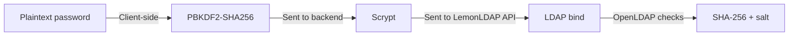
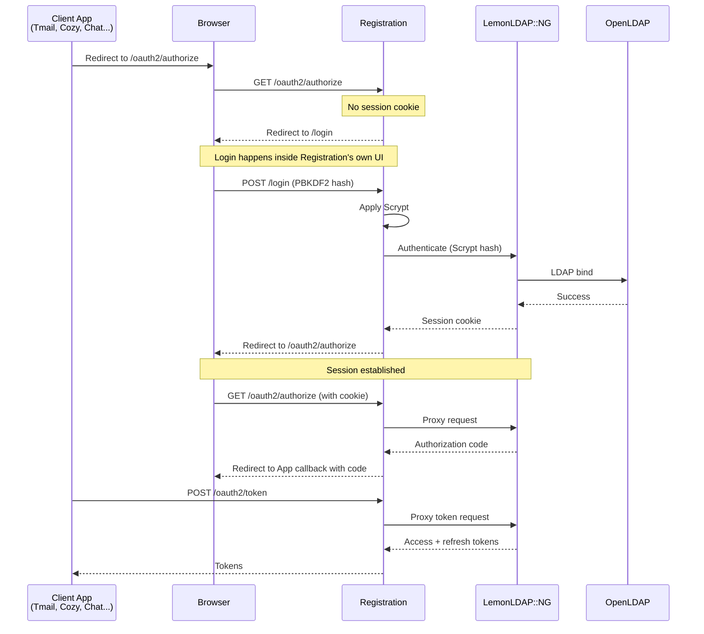

The registration service is the SSO entry point for all Twake Workplace applications. It acts as an OIDC proxy in front of LemonLDAP::NG, handling login, password hashing, and session establishment before delegating token issuance to LemonLDAP.

External applications (Tmail, Cozy, Twake Chat, etc.) configure the registration service as their OIDC provider. The LemonLDAP portal itself cannot be used directly by end users because Twake's multi-layer password hashing is incompatible with LemonLDAP's plaintext LDAP bind.

## Why Registration, Not the LemonLDAP Portal

LemonLDAP::NG expects users to submit plaintext passwords. It authenticates by performing an LDAP bind, where OpenLDAP compares the submitted password against the stored hash (SHA-256 + salt).

Twake passwords never reach the server as plaintext. They go through a multi-stage hashing pipeline before hitting LDAP:



1. **Client-side PBKDF2**: The browser hashes the password using PBKDF2-SHA256 (650,000 iterations) with a deterministic salt derived from the username and domain. The plaintext password never leaves the browser.
2. **Backend Scrypt**: The registration backend takes the PBKDF2 hash and applies Scrypt (n=32768, r=8, p=1) with a per-user random salt stored in LDAP.
3. **LemonLDAP API**: The Scrypt output is sent to LemonLDAP's authentication API as the "password".
4. **LDAP bind**: OpenLDAP performs its own SHA-256 + salt comparison against the stored value.

Because LemonLDAP's portal form would send the user's plaintext input directly to LDAP bind (skipping steps 1 and 2), authentication would always fail. The stored password in LDAP is the result of PBKDF2 + Scrypt, not a hash of the plaintext.

## OIDC Proxy Architecture

The registration service proxies all OAuth2 and OpenID Connect requests to LemonLDAP:



The proxy intercepts two URL patterns:

- `/oauth2/*` -- authorization, token, userinfo, logout, JWKS, introspection endpoints
- `/.well-known/*` -- OpenID Connect discovery

On `/oauth2/authorize`, if the user has no valid session cookie, the registration service redirects to its own login page with the original OIDC request saved as a `post_login_redirect_url` parameter. After successful login, the user is redirected back to the authorize endpoint with a session now established.

All other OAuth2 endpoints are proxied transparently to LemonLDAP.

## OIDC Discovery

The OpenID Connect discovery document is served at `/.well-known/openid-configuration`. In production, all endpoints resolve to the registration service's hostname:

```
Authorization: https://sign-up.twake.app/oauth2/authorize
Token:         https://sign-up.twake.app/oauth2/token
UserInfo:      https://sign-up.twake.app/oauth2/userinfo
JWKS:          https://sign-up.twake.app/oauth2/jwks
Logout:        https://sign-up.twake.app/oauth2/logout
Introspection: https://sign-up.twake.app/oauth2/introspect
```

This means client applications only need to know the registration service URL. They never interact with LemonLDAP directly.

## Configuring an Application as an OIDC Client

To add a new application that authenticates via Twake SSO:

### 1. Register the client in LemonLDAP

Create an OIDC Relying Party in LemonLDAP::NG Manager with:

- **Client ID**: a unique identifier for the app (e.g. `my-app`)
- **Client Secret**: a shared secret for the token exchange
- **Redirect URIs**: the callback URL(s) where the app expects the authorization code
- **Allowed scopes**: typically `openid email profile offline_access`

### 2. Configure the application

Point the application's OIDC settings to the registration service:

```env
OIDC_ISSUER=https://sign-up.twake.app
OIDC_CLIENT_ID=my-app
OIDC_CLIENT_SECRET=the-shared-secret
OIDC_REDIRECT_URI=https://my-app.example.com/auth/callback
```

The application should use the standard authorization code flow (with PKCE recommended). The registration service's discovery document provides all the endpoint URLs automatically.

### 3. Handle the callback

After the user authenticates through the registration login page, the app receives an authorization code at its redirect URI. Exchange it for tokens at the `/oauth2/token` endpoint, then use `/oauth2/userinfo` to retrieve the authenticated user's profile.

## Login Flow Details

### Standard Login

1. User submits email/phone and password on the registration login form
2. The password goes through the [hashing pipeline](#why-registration-not-the-lemonldap-portal) (client-side PBKDF2, then backend Scrypt)
3. Backend sends the Scrypt result to LemonLDAP's authentication endpoint
4. LemonLDAP performs LDAP bind, which succeeds because the stored password matches
5. LemonLDAP returns a session cookie
6. Registration sets the cookie and redirects the user to the original destination (OIDC authorize endpoint or app URL)

### Two-Factor Authentication

If 2FA is enabled for the user, LemonLDAP returns a 2FA challenge token instead of a session cookie at step 5. The registration service:

1. Stores the 2FA token in the server-side session
2. Redirects to the 2FA verification page
3. User enters the TOTP code
4. Backend verifies via LemonLDAP's 2FA endpoint
5. On success, receives the session cookie and proceeds with redirect

### Multi-Account Login (Phone or Recovery Email)

When a phone number or recovery email is associated with multiple accounts:

1. User enters their phone number or recovery email
2. Registration sends an OTP to that destination (SMS for phone, email for recovery address)
3. After OTP verification, the user sees a list of accounts linked to that contact
4. User selects an account and enters their password
5. Standard login flow continues from step 2

The same `requiresAccountSelection: true` signal from `POST /api/auth-context` drives both flows. Primary email (`mail`, globally unique) takes precedence: when the typed email matches a primary mail, the user lands directly on the password step with no OTP gate.

## Password Hashing Parameters

The PBKDF2 parameters are served to the client via the `/api/auth-context` endpoint before login. This allows the client to derive the correct hash without hardcoding parameters:

| Parameter    | Value       | Purpose                    |
| ------------ | ----------- | -------------------------- |
| `iterations` | 650,000     | PBKDF2 iteration count     |
| `domain`     | `twake.app` | Used to construct the salt |

The Scrypt parameters are stored per-user in LDAP attributes:

| LDAP Attribute   | Default         | Purpose            |
| ---------------- | --------------- | ------------------ |
| `scryptN`        | 32768           | CPU/memory cost    |
| `scryptR`        | 8               | Block size         |
| `scryptP`        | 1               | Parallelization    |
| `scryptSalt`     | random 16 bytes | Per-user salt      |
| `scryptDKLength` | 32              | Derived key length |
