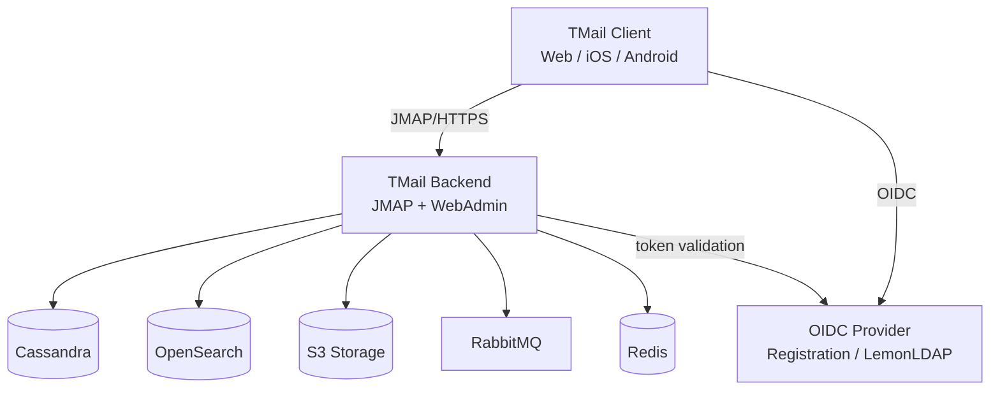

Twake Mail is split into a server-side backend and multi-platform Flutter clients, connected over JMAP.

## Backend

The TMail backend extends [Apache James](https://james.apache.org/) (included as a Git submodule) with enterprise features like team mailboxes, encrypted storage, rate limiting, and custom JMAP extensions.

### Storage layer

Each storage component handles a distinct concern:

| Component             | Role                                          |
| --------------------- | --------------------------------------------- |
| Cassandra 4.x         | Mailbox metadata, user data, ACLs             |
| OpenSearch 2.x        | Full-text email and contact search            |
| S3-compatible storage | Email blobs and attachments                   |
| RabbitMQ 3.12+        | Event bus for distributed coordination        |
| Redis                 | Caching, OIDC token store, rate-limiter state |
| Tika 2.8+             | Attachment content extraction (optional)      |

### Server variants

The backend ships in three flavors:

| Variant         | Use case                | Storage                                |
| --------------- | ----------------------- | -------------------------------------- |
| **Distributed** | Production              | Cassandra + OpenSearch + RabbitMQ + S3 |
| **Postgres**    | Simpler deployments     | PostgreSQL                             |
| **Memory**      | Testing and development | In-memory (non-persistent)             |

### Module structure

```
tmail-backend/
  apps/              # Server entry points (distributed, postgres, memory)
  jmap/              # JMAP extensions and per-backend implementations
  mailbox/           # Team mailboxes, GPG encryption, search
  webadmin/          # Admin REST API routes
  data/              # Data layer for Cassandra/Postgres
  rate-limiter/      # Configurable per-user rate limiting
  mailets/           # Email processing pipeline extensions
  smtp-extensions/   # SMTP customizations
  imap-extensions/   # IMAP customizations
```

## Client

The TMail Flutter client uses a modular architecture with GetX for state management and dependency injection. It communicates with any JMAP-compliant server.

### Platform support

| Platform | Distribution                                  |
| -------- | --------------------------------------------- |
| Android  | Google Play Store                             |
| iOS      | Apple App Store                               |
| Web      | Docker image (`linagora/tmail-web`) via Nginx |

### Client modules

The client is organized into independent library modules:

- **core** -- networking, authentication, JMAP session management
- **model** -- shared domain models
- **contact** -- address book and auto-complete
- **fcm** -- Firebase push notifications
- **email_recovery** -- deleted message restoration
- **labels** -- custom label management
- **rule_filter** -- server-side email filtering rules
- **forward** -- email forwarding configuration
- **server_settings** -- per-user settings sync
- **scribe** -- AI-powered email composition

### Authentication

Both web and mobile clients authenticate via OIDC (OpenID Connect). In the SaaS environment the [Registration](../registration) service acts as the identity provider; on-premise deployments typically use LemonLDAP::NG. Token refresh and 401 recovery are handled by the client's HTTP interceptor layer.

## Deployment topology

A production deployment connects these components:



## Component and Data Flow Diagrams

The following diagrams come from the TMail Architecture Document (TAD) and describe the broader application context, detailed component layout, and runtime data flows for the mail + calendar + contacts scope.

### Application context (C1)


### Components (C2)


### Data flow (C2)


