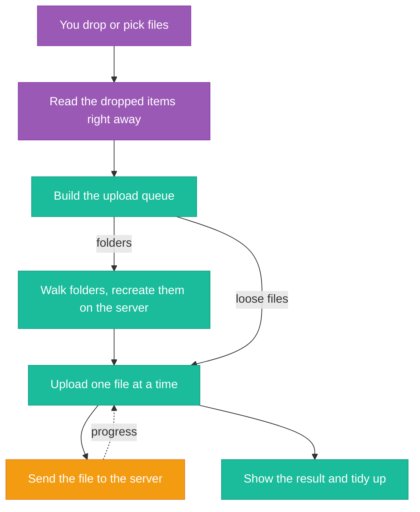
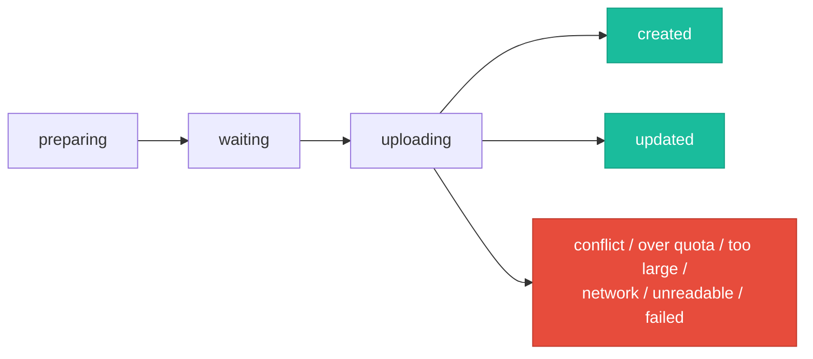
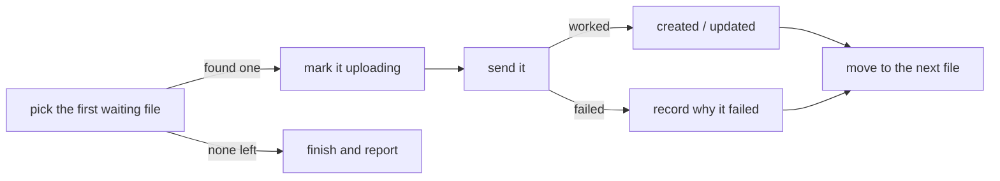

> Source: [github.com/linagora/twake-drive](https://github.com/linagora/twake-drive)

From the outside, uploading to Twake Drive looks trivial: drop some files, watch a progress tray, done. Inside, it is a careful pipeline that copes with dropped folders, browser quirks, server conflicts, storage limits, and public links. This page explains how it behaves, so the feature stops feeling like a black box.

## The big picture

Everything in the upload tray is a live view of one shared **upload queue**. The rest of this page follows a file through that queue, from drop to landing.

## Where uploads start

Every entry point feeds the same queue:

- **Drag and drop** onto the file list.
- The **upload button** in the sidebar.
- The **Add menu** in the toolbar.

Drag and drop has two implementations side by side (the app is mid-way through swapping the library behind it). They behave the same for you; they just hand items over in slightly different shapes.

## Reading the drop immediately

The browser only lets you read a dropped batch **for a split second**, then it discards the details. So Drive snapshots the drop before doing anything slow.

This snapshot is also where folders are recognised:

- The browser hands over a folder *handle*, not a flat list of files.
- Drive asks, item by item, "is this a file or a folder?"
- The result is a tidy list, each item tagged as a file or a folder.

:::note
Recognising folders relies on a long-standing browser capability that was never formally standardised but is supported everywhere. There is no official replacement, which is why folder uploads get special handling.
:::

## Building the queue

The queue is built **the instant you drop**, so the tray appears before any file is read or sent:

- **Loose files** go in as *waiting to upload*.
- Each **dropped folder** goes in as a single *preparing* placeholder; its contents get their own rows only once the folder has been explored.
- If you dropped onto the trash, the destination is quietly switched to the top level of your Drive.

Every row gets a unique tag built from a one-off marker for that specific drop. Without it, dropping `report.pdf` twice would create two identical-looking rows, and progress or errors for one would clobber the other.

### What state a queue item can be in

Each row moves through a small set of states:

The tray reads each row's state to decide which icon and progress bar to show.

:::note
There is also a **cancelled** state. It is reserved: the tray knows how to draw it, but no current upload path actually puts a row into it, so you won't see it in practice today. The nearest equivalent is clearing the whole queue, which empties it rather than marking individual rows cancelled.
:::

## Exploring dropped folders

For dropped folders, Drive rebuilds the structure on the server before uploading the contents:

- Every folder and sub-folder is recreated in Drive; if one already exists, it is reused rather than failing.
- Files inside a folder are read together (in parallel); sub-folders are stepped into one level at a time.
- The whole folder is read **upfront**, before uploading starts, rather than file-by-file as it goes. This avoids a Windows quirk: during a long upload the browser can let its references to a folder's files go stale, so reading a file later fails even though it was fine moments earlier.
- A file that still can't be read (a very long Windows path, a permissions problem, or a file that vanished) is marked **unreadable** and skipped. The rest of the drop continues, and no empty placeholder folders are left behind.
- Once a folder is fully explored, its *preparing* placeholder is replaced by the real list of files, now *waiting to upload*.

## One file at a time

The part that most surprises people: **Drive uploads files one at a time, never in parallel.**

This is a deliberate trade-off:

- **Upside:** predictable memory use, few open connections, and a progress bar that's easy to reason about.
- **Downside:** slower throughput on big batches of tiny files. If a thousand small files don't fly up instantly, this is why.

## Sending a single file

- The file's bytes go up in **one request**; its name and destination folder ride along as labels.
- There is **no chunking** and no special packaging; the whole file is the request body.
- To drive the progress bar, Drive uses an older request mechanism that can emit progress events (the simplest modern one cannot). Those events feed the moving bar, per file and overall.

## Finishing up

When the queue empties, Drive sorts the results:

- **Successes** get a confirmation, and the new files are briefly highlighted in the list.
- **Over quota** brings up the storage-upgrade prompt.
- **Too large** gets its own message mentioning the size limit.
- **Network, unreadable, and other errors** each get an alert.

Then the tray tidies itself:

- If everything succeeded, it closes after a few seconds.
- If anything failed, it stays open until you close it, so failures aren't swept away.

## The limits, and when each is caught

Three separate limits, each caught at a different moment:

- **Too many files at once** (500 by default). Checked *before* anything uploads. Exceed it and the whole drop is rejected up front, with a dialog suggesting the desktop sync app for very large batches.
- **A single file too big** (4 GB today). The server enforces this ceiling and rejects anything larger. On Chrome there's also an early client-side check so you don't waste time uploading, though that early check is currently set a little higher (5 GB) than the server's real limit, so a file between the two sizes slips past the early check and is only refused at the end.
- **Not enough storage.** On Chrome, Drive checks your remaining space first and stops early. On other browsers the server makes that call. Either way you land on the same "out of space" prompt.

:::warning
The early storage check can be fooled by **parallel uploads**. Within a single tab, files go up one at a time, so the check is reliable. But two tabs (or two sessions) each run their own queue against the *same* account quota, and each reads the same "before" usage figure. If you have 3 GB free and start a 2 GB upload in each tab, both individually decide they fit, and together they blow past the limit. The early check is per-upload, not coordinated across sessions; only the server's own accounting is authoritative.
:::

When an upload fails, Drive translates the underlying reason into one of the plain states (conflict, over quota, network, unreadable, too large, or generic failure) so the message matches what went wrong.

### What's configurable

- **Files per drop** is the one limit you can tune without a code change, via the `drive.max-upload-file-count` feature flag. Unset, it falls back to the 500 default.
- **The per-file size limit** (4 GB) and **the tray's auto-close delay** are fixed in the code, not flags.

## What happens on a name clash

If a file's name already exists in the destination:

- **Current behaviour:** the existing file is quietly **replaced**. The row ends up *updated* rather than *created*. Re-uploading `report.pdf` overwrites the existing one without asking.

:::note
Work is in progress to replace this with a prompt ("Replace", "Keep both", or "Cancel") plus an automatic-rename option. The rename logic has a known rough edge: because it bumps a trailing number, a photo named `IMG_4521.jpg` would become `IMG_4522.jpg` (likely the *next* photo's name) instead of something safe like `IMG_4521 (1).jpg`. Worth knowing if you pick that work up.
:::

## Uploading through a public share link

Uploads through a public link work just like inside the app, with two small differences:

- The upload button is styled more discreetly.
- The "too many files" dialog drops the "install the desktop app" suggestion, since an anonymous visitor has no account to sync.
